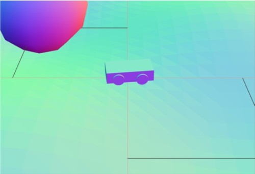
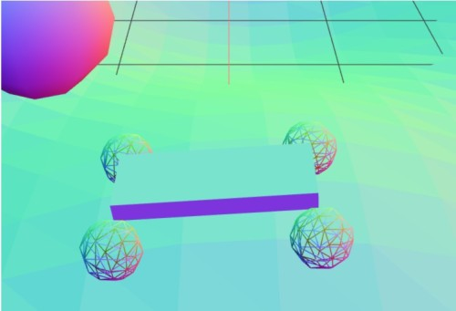
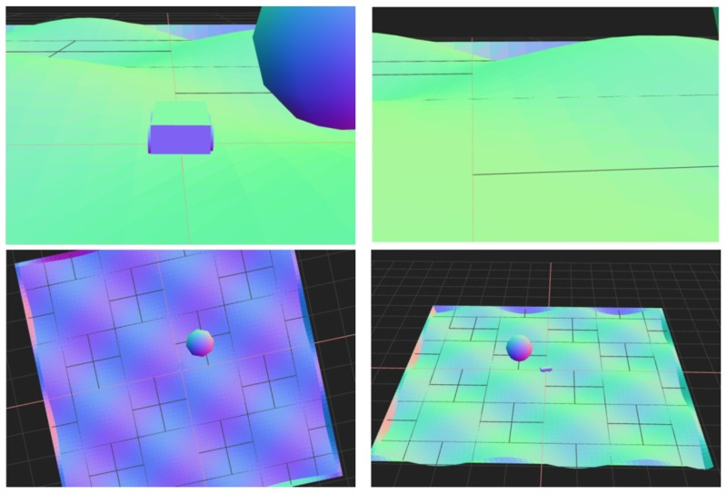
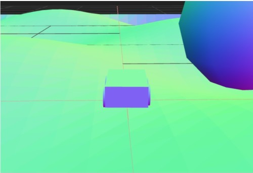
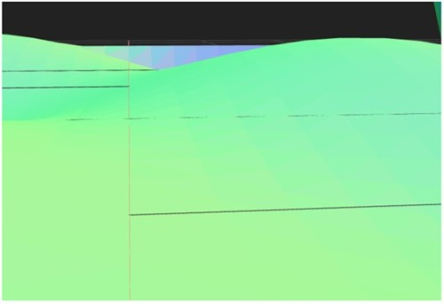
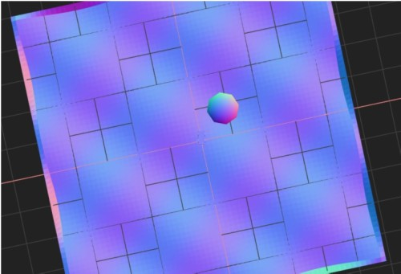
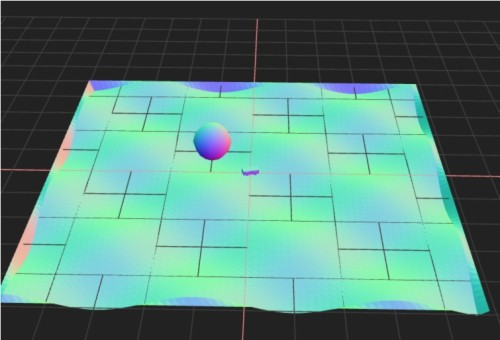
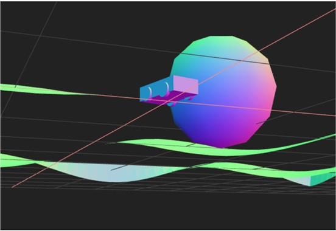

# Three.js Cannon.es 調査資料 - オフライン化（ライブラリのローカル配置）

## この記事のスナップショット

[RaycastVehicleデモリンク](002/002_RaycastVehicle.html)



[RigidVehicleデモリンク](002/002_RigidVehicle.html)



RaycastVehicle, RigidVehicleの操作法

- カーソル上 .. アクセル
- カーソル下 .. バック
- カーソル左、カーソル右 .. ハンドル
- 'b' .. ブレーキ
- 'c' .. カメラ視点の変更
- 'r' .. 姿勢を戻す



[ソース](src002.zip)

## 概要

- サンプルコードのオフライン化（ライブラリのローカル配置）
- 本質的な成分のみ残す（cannon, threee, OrbitControls 以外の demo.js等の排除）

## やったこと

cannonの物理エンジンには 2つの車モデル、「Raycast vehicle」と「Rigid vehicle」
があります。

[Raycast vehicle](https://pmndrs.github.io/cannon-es/examples/raycast_vehicle)

[Rigid vehicle](https://pmndrs.github.io/cannon-es/examples/rigid_vehicle)


大まかに次のような違いがあるようです。

項目  | Rigid vehicle   | Raycast vehicle
------|-----------------|------------------
概要  |シンプルなモデル | より詳細なモデル

具体的な違いを探るためにも、まずはコードを見るのですが、
実装方法が微妙に違っていて、モデル自体の違いがわかりにくくなってます。

そこで、見比べやすくなるよう、
実装方法をそろえて、これらモデルの違いを探ります。

手始めに、次の作業を行います。

- オフライン化／ローカル化
  - ライブラリが外部指定されており、毎回ネットワーク接続するのをやめたい
  - 効率化のためローカルでも作業できるようhttpサーバを立ち上げる

- 本質的な成分のみ残す（cannon, threee, OrbitControls以外のdemo.js等の排除）
  - demo.js で three.js に関する操作が隠蔽されており、便利な一方、汎用性に欠く
  - テクスチャを貼ったり、ワイヤーフレーム表示するにはdemo.jsでは煩雑
  - 基本動作を学習する意味も含め demo.js を使わず、three.js に関する処理をべた書きする
  
- 機能追加
  - 自車のカメラ視点追加
    - 車の挙動がよくわかるように、いくつかの視点を追加、切り替え可能とする

  - 自車の姿勢修正
    - 操作中の車がひっくり返るときの対応として、車の姿勢を戻すための処理。詳細は後述。

  - ボール（目印）追加
    - 位置や大きさを確認するために配置したただの目印、ランドマーク。

### 座標軸

座標軸は任意に定めることができるようですが、
ここでは下記のとおりとします。

```fig
     ↑(画面上):y  : 逆向き／下向きに重力
     │
     │
     │＿＿＿＿→ (画面右):x
    ／          
  ／
(画面手前):z
```

カメラ（視線）も x-z平面を地面として、y軸正を上としています。

今後も基本この座標系になります。

### 自車のカメラ視点追加

カメラ視点として下記を追加します。

- バードビュー（車の後方・上空から正面に向けて）
- フロントビュー（ドライバー視点／車の中心位置から正面に向けて）
- トップビュー（上空から／車の前面が上に）
- OrbitControls の手動操作＋自動回転
- OrbitControls の手動操作



バードビューは、カメラを車の後方・上空にもってきて、視点を車の位置にあわせます。
カメラ位置の計算は、
カメラの相対位置（車の後方・上空）のベクトルに
車の quaternion をかけ合わせることで、
現在の車の向きに合わせた位置を求めることができます。
カメラの相対位置は、車の初期の向きに関係し、作成時に x軸のマイナス方向を向いて作成しているので、
x軸プラス方向が後方の位置になります。

```code
        var vposi = moVehicle.chassisBody.position;
        var vquat = moVehicle.chassisBody.quaternion;
        // 後背からビュー / 車の後方位置から正面に向けて
        var vv = vquat.vmult(new CANNON.Vec3(23, 5, 0));  // 後方、高さ、左右
        camera.position.set(vposi.x + vv.x, vposi.y + vv.y, vposi.z + vv.z);
        camera.rotation.z = 0;
        camera.lookAt(new THREE.Vector3(vposi.x, vposi.y, vposi.z));
```



フロントビューは、カメラを車の中心位置にもってきて、視点を車の前方にあわせます。
視点の位置（車の前方）の計算は、
視点の相対位置（前方位置）のベクトルに
車の quaternion をかけ合わせることで求めることができます。

```code
        var vposi = moVehicle.chassisBody.position;
        var vquat = moVehicle.chassisBody.quaternion;
        // フロントビュー（ドライバー視点) / 車の中心位置から正面に向けて
        camera.position.copy(new THREE.Vector3(vposi.x, vposi.y+2, vposi.z));
        camera.rotation.z = 0;
        var vv = vquat.vmult(new CANNON.Vec3(-20, 0, 0));  // 前方、高さ、左右
        camera.lookAt(new THREE.Vector3(vposi.x + vv.x, vposi.y + vv.y, vposi.z + vv.z));
```



トップビューは、垂直に上空から車を眺めたものです。
さらに進行方向（車の向き）を上にします。
車の向き（方位角）は車の quaternion から toEuler()から求めることができます。

カメラ位置は車の上空とし、視点は車の位置、車の向きに合わせてカメラの rotation を設定します。

```code
        var vposi = moVehicle.chassisBody.position;
        var vquat = moVehicle.chassisBody.quaternion;
        // トップビュー 上空から / 車の前面が上に
        camera.position.set(vposi.x, vposi.y + 200, vposi.z);
        camera.lookAt(new THREE.Vector3(vposi.x, vposi.y, vposi.z));
        var veuler = new CANNON.Vec3(0, 0, 0);
        vquat.toEuler(veuler);
        var viecleRotY = veuler.y + Math.PI / 2;  // X軸負の方向を向いて作成したので、上を向くよう90度ずらす
        camera.rotation.z = viecleRotY;
```



OrbitControls の手動操作＋自動回転するには、
autoRotate フラグを true とし、
視点を OrbitControls.target に設定します。
そして OrbitControls の操作を反映するには update() を呼び出します。

自動的に視点の位置が変わりますが、
マウスのドラッグ操作やホイール操作で視点を変更することもできます。

```code
        var vposi = moVehicle.chassisBody.position;
        orbitControls.autoRotate = true;
        orbitControls.target = new THREE.Vector3(vposi.x, vposi.y, vposi.z);
        orbitControls.update();
```



OrbitControls の手動操作には、
autoRotate フラグを false とし、
OrbitControls の update() を呼び出すだけになります。
マウスのドラッグ操作やホイール操作で視点を変更できます。

```code
        orbitControls.autoRotate = false;
        orbitControls.update();
```

### 自車の姿勢を戻す方法

Raycast モデルの場合は
プロパティの chassisBody の姿勢（position, quaternion）と
速度（velocity, angularVelocity）を制御します。

```
        // 車をひっくり返す ..
        // 車を持ち上げ
        moVehicle.chassisBody.position.y += 5;
        // 進行方向（回転角Y）を使い、方向を初期化
        var vquat = moVehicle.chassisBody.quaternion;
        var veuler = new CANNON.Vec3(0, 0, 0);
        vquat.toEuler(veuler);
        var ry = veuler.y;
        const carInitQuat = new CANNON.Quaternion();
        carInitQuat.setFromAxisAngle(new CANNON.Vec3(0, 1, 0), ry);
        moVehicle.chassisBody.quaternion.copy(carInitQuat);
        // 速度、角速度を初期化しておく
        moVehicle.chassisBody.velocity = new CANNON.Vec3(0, 0, 0);
        moVehicle.chassisBody.angularVelocity = new CANNON.Vec3(0, 0, 0);
```

系が x-z 平面で、y軸方向に重力がかかっているので、
垂直方向（y軸方向）に車を持ち上げます。
車の向きを quaternion から取得して、
方向だけを quaternion に再度設定します。

車の向き（方位角）は quaternion の toEuler() の y 成分から取得できます。
改めてY軸周りに方位角で回転させた quaternion を chassisBody に設定します。

さらに、速度（velocity）、角速度（angularVelocity）を 0 にすることで動きを停止させます。

一方で Rigid モデルの場合は次のようにします。

```
        // 車をひっくり返したいけど、シャーシ・ホイルを同時に指定する必要あり。面倒なので保留に
        // 車を持ち上げ
        var upY = 5;
        vehicle.chassisBody.position.z += upY;
        for (var i = 0; i < 4; ++i) {
          vehicle.wheelBodies[i].position.z += upY;
        }

        // 片方だけに力を加えてみる
        var vquat = vehicle.chassisBody.quaternion;
        var veuler = new CANNON.Vec3(0, 0, 0);
        vquat.toEuler(veuler);
        var ry = -veuler.y;
        var fy = new CANNON.Vec3(0, 20, 0);  // 上向きの力のベクトル
        var pz, px;
        var cos_ry, sin_ry;
        cos_ry = Math.cos(ry);
        sin_ry = Math.sin(ry);
        // .. 車の左前方、上向きに力を加える
        pz =  5*cos_ry + 2*sin_ry;
        px = -5*sin_ry + 2*cos_ry;
        vehicle.chassisBody.applyImpulse(fy, new CANNON.Vec3(px, 0, pz));
        // .. 車の左後方、上向きに力を加える
        pz =  5*cos_ry  -2*sin_ry;
        px = -5*sin_ry  -2*cos_ry;
        vehicle.chassisBody.applyImpulse(fy, new CANNON.Vec3(px, 0, pz));
```

Rigid モデルではシャーシ（本体）とホイール（タイヤ）が一体になっていないようです。
シャーシだけを移動、回転させてもホイールが置き去りになるようです。
ホイールの相対位置を再計算して正しい位置に配置しないと、
次の瞬間にシャーシとホイールを接続する制約が働き、
離れた位置から無理やりくっつくような動きなり、
時におかしな位置にくっつく場合があります。

相対位置を再計算するのは面倒なので、垂直に平行移動（上方に移動）して、
車を回転させるような衝撃をシャーシに加えて、回転させます。

パッと見、シャーシの片方が跳ねあがって姿勢を戻す、アクロバットな動きをしますが、
下手に位置を再計算するよりも「安定した姿勢の戻し方」なようです。

------------------------------------------------------------

前の記事：[はじめに](001.md)

次の記事：[最新ライブラリ対応](003.md)

目次：[目次](000.md)

この記事には次の関連記事があります。

- [オフライン化（ライブラリのローカル配置）](002.md)
- [最新ライブラリ対応（cannon-es@0.20.0, three@0.165.0）](003.md)

--