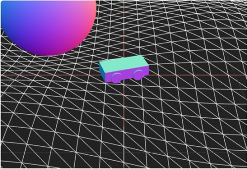
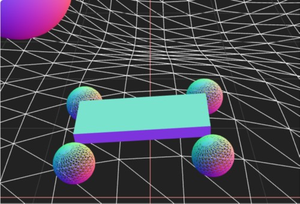
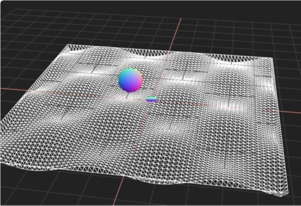

# Three.js Cannon.es 調査資料 - 最新ライブラリ対応（cannon-es@0.20.0, three@0.165.0）

## この記事のスナップショット

[RaycastVehicleデモリンク](003/003_RaycastVehicle.html)



[RigidVehicleデモリンク](003/003_RigidVehicle.html)



[ソース](003/)

動かし方

- ソース一式を WEB サーバ上に配置してください
- 車の操作法
  - カーソル上 .. アクセル
  - カーソル下 .. バック
  - カーソル左、カーソル右 .. ハンドル
  - 'b' .. ブレーキ
  - 'c' .. カメラ視点の変更
  - 'r' .. 姿勢を戻す

## 概要

- 最新ライブラリ対応（cannon-es@0.20.0, three@0.165.0）
  - お詫び：記事の執筆時期と公開時期が大きくずれて、ちょっと昔のバージョンになってます。
- 凹凸地面（heighfield）の修正

## やったこと

cannon.es のサンプルで利用している three.js は rv122 と古い版になってます。
大抵のデモはそのまま動くのですが、
CANNON.Heightfield を使う場合、
これに対応する three.js のクラスが THREE.Geometry から THREE.BufferGeometry
になっており、そのままでは動きません。

最新ライブラリ（2024/6/22時点）の
最新版（cannon-es@0.20.0, three@0.165.0）で動くように改修を行います。

### CANNON.HeightfieldのためのTHREE.BufferGeometry

具体的には THREE.Geometry の該当箇所を以下のように直すだけです。

```js
  const geometry = new THREE.BufferGeometry();
  {
      let points = [];
      const shape = heightfieldShape;
      const v0 = new CANNON.Vec3()
      const v1 = new CANNON.Vec3()
      const v2 = new CANNON.Vec3()
      for (let xi = 0; xi < shape.data.length - 1; xi++) {
        for (let yi = 0; yi < shape.data[xi].length - 1; yi++) {
          for (let k = 0; k < 2; k++) {
            shape.getConvexTrianglePillar(xi, yi, k === 0)
            v0.copy(shape.pillarConvex.vertices[0])
            v1.copy(shape.pillarConvex.vertices[1])
            v2.copy(shape.pillarConvex.vertices[2])
            v0.vadd(shape.pillarOffset, v0)
            v1.vadd(shape.pillarOffset, v1)
            v2.vadd(shape.pillarOffset, v2)
            points.push(new THREE.Vector3(v0.x, v0.y, v0.z),
                        new THREE.Vector3(v1.x, v1.y, v1.z),
                        new THREE.Vector3(v2.x, v2.y, v2.z))
          }
        }
      }
      geometry.setFromPoints(points)
      shape.id = geometry.id;
 }
```



最新版のライブラリに対応するだけなら上述だけです。
これにテクスチャを貼ろとしたらもう一工夫必要だったり、
国土地理院の3Dデータを読み込んで表示しようとしたらデータの並びを入れ替えたりといった処理が
必要になってくるのですが、これらは別の記事で紹介したいと思います。

------------------------------------------------------------

前の記事：[オフライン化(ライブラリのローカル配置)](002.md)

次の記事：[Z軸重力系に変えてみる](004.md)

目次：[目次](000.md)

この記事には次の関連記事があります。

- [オフライン化（ライブラリのローカル配置）](002.md)
- [最新ライブラリ対応（cannon-es@0.20.0, three@0.165.0）](003.md)

--