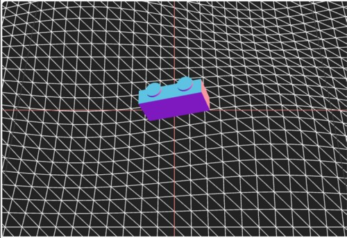
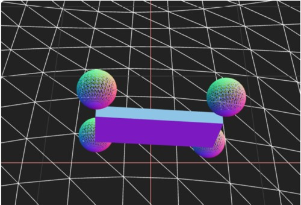

# Three.js Cannon.es 調査資料 - Z軸重力系に変えてみる

## この記事のスナップショット

[Z軸重力系でのRaycastVehicleデモリンク](004/004_RaycastVehicle.html)



[Z軸重力系でのRigidVehicleデモリンク](004/004_RigidVehicle.html)



[ソース](004/)

動かし方

- ソース一式を WEB サーバ上に配置してください
- 車の操作法
  - カーソル上 .. アクセル
  - カーソル下 .. バック
  - カーソル左、カーソル右 .. ハンドル
  - 'b' .. ブレーキ
  - 'c' .. カメラ視点の変更
  - 'r' .. 姿勢を戻す

## 概要

- Z軸重力系に変えてみる
  - Z軸重力系に変えてみる
  - カメラ修正（ガタつきあり）
  - 車の座標を書き直すが、挙動がおかしい
- 結果、上手くいかなかった／失敗だった

## やったこと

サンプルは x-z平面で y軸マイナス向きに重力をかけている系なのですが、
今 1つピンと来ないので、x-y平面で z 軸マイナス向きの重力の系（「Z軸重力系」と呼称）でも
動かせないかを試してみました。

要約すると重力を「画面の上から下」から「画面の手前から奥」の方向へ、変更したいということです。

便宜上、旧来の Y軸マイナス向きの重力の系を「Y軸重力系」と呼称します。

図解すると、
次の座標系（Y軸重力系）

```fig
       ↑(画面上):y  : 逆向きに重力
       │
       │
       │＿＿＿＿→ (画面右):x
      ／          
    ／
  (画面手前):z
```

上記を下記の座標系（Z軸重力系）に置き換えたいということです。

```fig
       ↑(画面上):y
       │
       │
       │＿＿＿＿→ (画面右):x
      ／          
    ／
  (画面手前):z  : 逆向きに重力
```

作業工程として次のステップを踏んでいきます。

- step1. cannon の world を「Z軸重力系」に変更
- step2. カメラの視点修正
- step3. 車の作成を「Z軸重力系」で配置しなおし

まぁ、結果ダメだったわけですが、順に見ていきます。

## step1. cannon の world を Z軸重力系に変更

重力を Z 軸マイナス方向に変更し、
重力が下にかかっているように見えるよう、
カメラを Z 軸正が上となるようにします。

```js
    const world = new CANNON.World()
    world.gravity.set(0, 0, -30)

    camera = new THREE.PerspectiveCamera(24, width / height, 5, 2000)
    camera.up.set(0, 0, 1);  // カメラの中心座標 Z軸を上にする
```

床がx-z平面だったものを x-y平面に、水平に配置します。

```js
  const heightfieldBody = new CANNON.Body({ mass: 0, material: groundMaterial })
  heightfieldBody.addShape(heightfieldShape)
  // Y軸重力系
  // heightfieldBody.position.set(
  //   (-(sizeX - 1) * heightfieldShape.elementSize) / 2,
  //   -15,
  //   ((sizeZ - 1) * heightfieldShape.elementSize) / 2
  // )
  // heightfieldBody.quaternion.setFromEuler(-Math.PI / 2, 0, 0);
  // Z軸重力系
  heightfieldBody.position.set(
    (-(sizeX - 1) * heightfieldShape.elementSize) / 2,
    (-(sizeZ - 1) * heightfieldShape.elementSize) / 2,
    0
  )
  heightfieldBody.position.z += -20;
```

この時点では、車は横向き、カメラが未修正のままになります。

## step2. カメラの視点修正

次にカメラの視点を修正します。

```js
      var vposi = vehicle.chassisBody.position;
      var vquat = vehicle.chassisBody.quaternion;
      if (cameraPosi == 0) {
        // 車がX軸負の方向を向いている前提で、
        // 後方の視点（23,5,0）にQuatをかけ合わせ、相対位置の「後方の視点」vvを求める
        var vv = vquat.vmult(new CANNON.Vec3(33, 5, 0));  // 後方、高さ、左右
        camera.position.set(vposi.x + vv.x, vposi.y + vv.y, vposi.z + vv.z);
        camera.rotation.z = 0;
        camera.lookAt(new THREE.Vector3(vposi.x, vposi.y, vposi.z));
      } else if (cameraPosi == 1) {
        // フロントビュー（ドライバー視点) / 車の中心位置から正面に向けて
        camera.position.copy(new THREE.Vector3(vposi.x, vposi.y, vposi.z+2));
        camera.rotation.z = 0;
        var vv = vquat.vmult(new CANNON.Vec3(-30, 0, 0));  // 前方、高さ、左右
        camera.lookAt(new THREE.Vector3(vposi.x + vv.x, vposi.y + vv.y, vposi.z));
      } else if (cameraPosi == 2) {
        // トップビュー 上空から / 車の前面が上に
        camera.position.set(vposi.x, vposi.y, vposi.z + 200);
        camera.lookAt(new THREE.Vector3(vposi.x, vposi.y, vposi.z));
        var veuler = new CANNON.Vec3(0, 0, 0);
        vquat.toEuler(veuler);
        var viecleRotZ = veuler.z;
        // x = [-90,90], y=[-180, 180], z=[-90, 90]  /
        // z軸重力系での応急処理(ガタつくが仕方なし)
        // .. toEuler を z値 [-180, 180] になるよう独自計算が必要 or euler 角を求めずに角度調整
        if (veuler.x < 0) {
          viecleRotZ = Math.PI - viecleRotZ;
        }
        viecleRotZ += Math.PI / 2;  // 初期視点のずれ補正
        camera.rotation.z = viecleRotZ;
      } else if (cameraPosi == 3) {
        // OrbitControls の自動回転
        orbitControls.autoRotate = true;
        orbitControls.target = new THREE.Vector3(vposi.x, vposi.y, vposi.z);
        orbitControls.update();
      } else {
        // OrbitControls のマウス操作に任せる
        orbitControls.autoRotate = false;
        orbitControls.update();
      }
```

ここで 1つ問題が発生します。
トップビューにおいて、toEuler()で取得する角度の範囲の影響で表示がガタつきます。
これは toEuler() で取得できる角度の範囲が

  ```eq
  x = [-90,90], y=[-180, 180], z=[-90, 90]
  ```

になっていることです。
Z軸重力系での、Z軸周りの回転角が 180度の範囲でしか取得できないため、
他の値（ここではx軸の回転角）から 360度までの範囲に拡張しているために、
スムーズに連続した値になっていません。
ここで発生する数値誤差が表示のガタつきに現れてます。

一方で、この時点では、車は横向きのままになっています。

## step3. 車の作成を Z軸重力系で配置しなおし

x-y平面にあわせ形状を変形させ、ホイールの回転軸をY軸に、
サスペンションの向きをZ軸に置き換えて作成してみると、
まっすぐに走らず何かに引っかかったような挙動を示します。
これは RaycastVehicle モデルも RigidVehicle モデルも同じでした。

原因がよくわからないのでcannon.es のソースを確認しました。
任意の座標系でも受け付けるようなインターフェイスではあるものの、実装が空になっており、
特定の座標系（Y軸重力系）でしか受け付けない様子です。

つまり、cannon.es の車モデルを使うには Y軸重力系でしかダメっぽく、
Z軸重力系で動かすには自前で組み上げるしかなさそうな雰囲気です。

ということで Z軸重力系の構想は断念しました。

## 結果、何がダメだったか

一番の理由は

- cannon.es の車のモデル、
  RaycastVehicle モデルも RigidVehicle モデルが
  Y軸重力系を想定した仕様っぽい（他の座標系ではダメ） 

次点で、

- toEuler() の制約により、これを使った機能、ここではトップビュー視点がぎこちなくなる

という理由で座標系を変えてみる試みは失敗です。

個人ブログで、昔の cannon ライブラリを使ったコードを拝見しているとZ軸重力系になっていて、
最新の cannon ライブラリに差し替えて動かしてみると「動かない!!」ということもありました。

バージョンによって仕様変更はよくある話ではありますが、
ちょっと「なんだかなぁ」な話でした。

------------------------------------------------------------

前の記事：[最新ライブラリ対応](003.md)

次の記事：[ソースの整形／統一、車モデルの比較まとめ](005.md)

目次：[目次](000.md)

この記事には関連記事がありません。

--