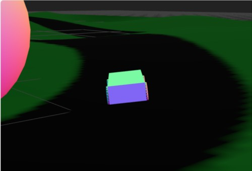
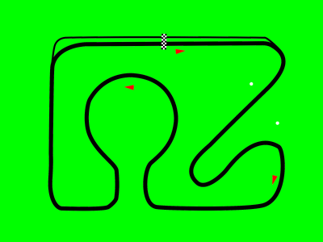
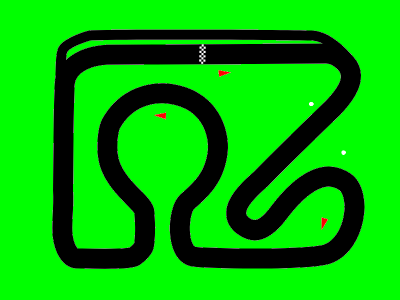

# Three.js Cannon.es 調査資料 - テクスチャ(画像)を貼る

## この記事のスナップショット

[テクスチャを貼った地形（平面）とRaycastVehicleデモリンク](006/006a.html)


[テクスチャを貼った地形（凹凸）とRaycastVehicleデモリンク](006/006b.html)



[ソース](006/)

動かし方

- ソース一式を WEB サーバ上に配置してください
- 車の操作法
  - カーソル上 .. アクセル
  - カーソル下 .. バック
  - カーソル左、カーソル右 .. ハンドル
  - 'b' .. ブレーキ
  - 'c' .. カメラ視点の変更
  - 'r' .. 姿勢を戻す

## 概要

- 地面（平面）にテクスチャ（画像）を貼る
- 凹凸地面にテクスチャを貼る

## やったこと

凹凸地面にサーキットの画像を貼って、レースゲームっぽくしたいと思います。

- サーキット画像の取得＆コースの加工
- 地面（平面）にテクスチャ（画像）を貼る
- 凹凸地面にテクスチャを貼る

## サーキット画像の取得

フリーサイト

[strategywiki](https://strategywiki.org/wiki/Gran_Turismo_5/Circuits)

より、コースのデータ（svg）を取得し、フリーのSVG編集ツール

[SVG編集(boxy-svg)](https://boxy-svg.com/)

で道幅（コース幅）を広く調整し、png 画像として保存します。
なお、コースは黒く、コース外は緑色に色付けしておきます。

オリジナルは下記の感じです。



これを極太にしてレースコースっぽくします。



ベクター画像（svg）だと、コース幅を太くするのが楽（線の幅を太くするだけ）なので
いいですね。
ラスター画像（jpg,png）を拾ってきて、コース幅が狭かったときの絶望感といったら。
（とてもじゃないけど手動で広げるなんて出来ない）

## 地面にテクスチャ（画像）を貼る

長方形を地面代わりにおいて、そこにテクスチャ（画像）を貼ります。

```js
  const grndw = 100; const grndh = 75;
  const moGround2Body = new CANNON.Body({
    mass: 0,
    shape: new CANNON.Box(new CANNON.Vec3(grndw, 0.5, grndh)),
    position: new CANNON.Vec3(0, -0.5, 0),
    material: moGroundMtr,
  });
  world.addBody(moGround2Body);
  const viGround2Geo = new THREE.BoxGeometry(grndw*2, 1, grndh*2);
  const texture = new THREE.TextureLoader().load('./pic/BoxySVG_test1_3_400x300.png'); 
  const viGround2Mtr = new THREE.MeshBasicMaterial({map: texture, transparent: true, opacity: 0.4});
  const viGround2Mesh = new THREE.Mesh(viGround2Geo, viGround2Mtr);
  scene.add(viGround2Mesh);
  viGround2Mesh.position.copy(moGround2Body.position);
  viGround2Mesh.quaternion.copy(moGround2Body.quaternion);
```

昔のThree.jsの場合、
THREE.ImageUtils.loadTexture()が使われている場合がありますが、
現時点ではTHREE.TextureLoaderの利用が推奨されています。
古いコードを参照しているときはご注意ください。

## 凹凸地面 にテクスチャを貼る

CANNON.Heightfieldを使い、凹凸地面にテクスチャを貼る場合、
THREE.BufferGeometryの構築方法が異なります。

```js
  // Add the ground
  const sizeX = 64
  const sizeZ = 64
  const matrix = []
  for (let i = 0; i < sizeX; i++) {
    matrix.push([])
    for (let j = 0; j < sizeZ; j++) {
      if (i === 0 || i === sizeX - 1 || j === 0 || j === sizeZ - 1) {
        const height = 3
        matrix[i].push(height)
        continue
      }
      const height = Math.cos((i / sizeX) * Math.PI * 5) * Math.cos((j / sizeZ) * Math.PI * 5) * 2 + 2
      matrix[i].push(height)
    }
  }
  const moGroundMtr = new CANNON.Material('ground')
  const length = 200; // heightfieldShape で定義しているサイズ
  const heightfieldShape = new CANNON.Heightfield(matrix, {
    elementSize: length / sizeX,
  })
  const moGroundBody = new CANNON.Body({ mass: 0, material: moGroundMtr })
  moGroundBody.addShape(heightfieldShape)
  moGroundBody.position.set(
    -(sizeX * heightfieldShape.elementSize) / 2,
    -1,
    (sizeZ * heightfieldShape.elementSize) / 2
  )
  moGroundBody.quaternion.setFromEuler(-Math.PI / 2, 0, 0)
  world.addBody(moGroundBody)
  const viGroundGeo = new THREE.BufferGeometry();
  const sizeX_ = sizeX-1;
  const sizeZ_ = sizeZ-1;
  {
    // ポリゴンの頂点座標の配列（Polygon's positon array)
    var pos = new Float32Array(sizeX*sizeZ*3);
    var n=0;
    for(var y=0; y<sizeX; y++){ 
      for(var x=0; x<sizeZ; x++){
        pos[n] = x * length/sizeZ; n++;
        pos[n] = y * length/sizeX; n++;
        pos[n] = matrix[y][x]; n++;
      }
    }
    // ポリゴンの三角形をインデックスで指定(Polugon's index array)
    n=0;
    var index = new Uint32Array(3*(sizeX_*sizeZ_*2));
    for(var y=0; y < sizeX_; y++){ 
      for(var x=0; x < sizeZ_; x++){
        index[n] = y*sizeZ + x; n++;
        index[n] = y*sizeZ + x + 1; n++;
        index[n] = (y+1)*sizeZ + x + 1; n++;
        index[n] = y*sizeZ + x; n++;
        index[n] = (y+1)*sizeZ + x + 1; n++;
        index[n] = (y+1)*sizeZ + x; n++;
      }
    }
    // ポリゴンのTexgure位置座標の配列 (Texture uv positions array)
    n=0;
    var uvs = new Float32Array(sizeX*sizeZ*2);
    for(var y=0; y<sizeX; y++){ 
      for(var x=0; x<sizeZ; x++){
        uvs[n] = x/sizeZ_; n++;
        uvs[n] = y/sizeX_; n++;
      }
    }
    // 2つの三角形をインデックスで指定(Polygon's index array)
    const geom = new THREE.BufferGeometry();
    viGroundGeo.setAttribute("position", new THREE.BufferAttribute(pos, 3));
    viGroundGeo.setIndex(new THREE.BufferAttribute(index,1)); 
    viGroundGeo.computeVertexNormals();
    viGroundGeo.setAttribute("uv", new THREE.BufferAttribute(uvs, 2));
  }
  const texture = new THREE.TextureLoader().load('./pic/GT5_Circuit_Toscana_Fwd_test2w22_2560x1920_2.png'); 
  const viGroundMtr = new THREE.MeshStandardMaterial({color:0xffffff, map: texture, side:THREE.DoubleSide, });
  const viGroundMesh = new THREE.Mesh(viGroundGeo, viGroundMtr);
  viGroundMesh.position.copy(moGroundBody.position);
  viGroundMesh.quaternion.copy(moGroundBody.quaternion);
  scene.add(viGroundMesh);
```

外部のデータ、国土地理院のデータを使った凹凸地面にテクスチャを張る場合は、
またちょっと修正が必要になります。
別の記事「凹凸地面にテクスチャを貼る（2）／国土地理院の3Dデータ対応」で紹介します。

尚、こちらのサイトを参考にさせていただきました。ありがとうございました。

[THREE.js (WebGL)で少し複雑なポリゴンにテクスチャを貼り付ける](https://hidemiu.sakura.ne.jp/wp/2023/04/three-js-webgl%E3%81%A7%E5%B0%91%E3%81%97%E8%A4%87%E9%9B%91%E3%81%AA%E3%83%9D%E3%83%AA%E3%82%B4%E3%83%B3%E3%81%AB%E3%83%86%E3%82%AF%E3%82%B9%E3%83%81%E3%83%A3%E3%82%92%E8%B2%BC%E3%82%8A%E4%BB%98/)

------------------------------------------------------------

前の記事：[ソースの整形／統一、車モデルの比較まとめ](005.md)

次の記事：[「沈む」テスト](008.md)

目次：[目次](000.md)

この記事には次の関連記事があります。

- [テクスチャ(画像)を貼る](006.md)
- [凹凸地面 にテクスチャを貼る(2)／国土地理院の3Dデータ対応](011.md)
- [地図データの加工](023.md)
- [ビーナスライン走ってみた](024.md)

--