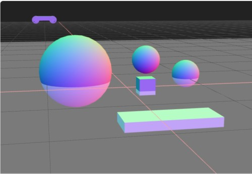
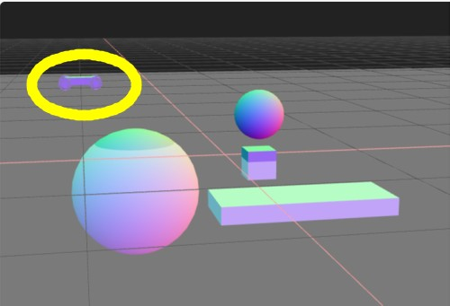

# Three.js Cannon.es 調査資料 - 「沈む」テスト

## この記事のスナップショット

[沈む地形とRaycastVehicleデモリンク](008/008.html)



[ソース](008/)

動かし方

- ソース一式を WEB サーバ上に配置してください
- 車の操作法
  - カーソル上 .. アクセル
  - カーソル下 .. バック
  - カーソル左、カーソル右 .. ハンドル
  - 'b' .. ブレーキ
  - 'c' .. カメラ視点の変更
  - 'r' .. 姿勢を戻す

## 概要

- 沈む地形のテスト

## やったこと

物理モデルに「2物体の接触に対する制約」を定義するクラスCANNON.ContactMaterialに

- restitution
- contactEquationStiffness

のパラメーターがあります。
これらを調整することで、接触した物体が沈み込むらしいので、何処まで沈むものなのか確認します。

### 地面代わりの長方形

地面の代わりとして長方形を配置します。
ある程度の厚みがないとすり抜けてしまうので厚み（=20）を持たせた形状としています。

```js
  const moGroundMtr = new CANNON.Material('ground')
  const grndw = 100; const grndh = 75;
  const moGround2Body = new CANNON.Body({
    mass: 0,
    shape: new CANNON.Box(new CANNON.Vec3(grndw, 20, grndh)),
    position: new CANNON.Vec3(0, -20, 0),
    material: moGroundMtr,
  });
  world.addBody(moGround2Body);
  const viGround2Geo = new THREE.PlaneGeometry(grndw*2, grndh*2);
  viGround2Geo.rotateX(-Math.PI/2);
  const viGround2Mtr = new THREE.MeshBasicMaterial({transparent: true, opacity: 0.4});
  const viGround2Mesh = new THREE.Mesh(viGround2Geo, viGround2Mtr);
  scene.add(viGround2Mesh);
```

### 沈み込む物体(球)

沈み込む物体として球を用意します。
反発係数（restitution）は 0とし、剛性（contactEquationStiffness）をデフォルト値（1e7）よりも小さい値（1e4）を指定します。
物体の重さ（mass）は重すぎると地面をすり抜けてしまいますし、軽すぎると浮かび上がるので、適度な重さ（7000）を指定しています。

```js
  // 球 (６割り程沈む)
  const radius = 5;
  const moSphereMtr = new CANNON.Material({name: 'name2', restitution: 0});
  const moSphereBody = new CANNON.Body({
    mass: 7000,
    shape: new CANNON.Sphere(radius),
    position: new CANNON.Vec3(-6, 3, -6),
    material: moSphereMtr
  });
  world.addBody(moSphereBody);
  const viSphereGeo = new THREE.SphereGeometry(radius);
  const viSphereMtr = new THREE.MeshNormalMaterial();
  const viSphereMesh = new THREE.Mesh(viSphereGeo, viSphereMtr);
  scene.add(viSphereMesh);
  const sphere_ground = new CANNON.ContactMaterial(moSphereMtr, moGroundMtr, {
    friction: 0.9,  // 摩擦係数(def=0.3)
    restitution: 0.0,  // 反発係数 (def=0.3)
    contactEquationStiffness: 1e4,  // 剛性(def=1e7) 値大:=物体が変形しにくく / 値小:=沈んでしまう  対象の重さと関係あり
  })
  world.addContactMaterial(sphere_ground)
```

比較のために、「沈まずに床で跳ねる球」と「床をすり抜ける球」も示します。

沈まずに床で跳ねるには反発係数（restitution）を 1 に近づけ、剛性（contactEquationStiffness）を高くします。

```js
  // 球 (沈まない／床で跳ねる)
  const radius1 = 2;
  const moSphere1Mtr = new CANNON.Material({restitution: 1});
  const moSphere1Body = new CANNON.Body({
    mass: 5,
    shape: new CANNON.Sphere(radius1),
    position: new CANNON.Vec3(4, 3, -6),
    material: moSphere1Mtr
  });
  world.addBody(moSphere1Body);
  const viSphere1Geo = new THREE.SphereGeometry(radius1);
  const viSphere1Mtr = new THREE.MeshNormalMaterial();
  const viSphere1Mesh = new THREE.Mesh(viSphere1Geo, viSphere1Mtr);
  scene.add(viSphere1Mesh);
  const sphere1_ground = new CANNON.ContactMaterial(moSphere1Mtr, moGroundMtr, {
    friction: 0.9,  // 摩擦係数(def=0.3)
    restitution: 0.9,  // 反発係数 (def=0.3)
    contactEquationStiffness: 1e7,  // 剛性(def=1e7)
  })
  world.addContactMaterial(sphere1_ground)
```

一方、床をすり抜ける場合は重量（mass）を大きくするか、剛性（contactEquationStiffness）を下げます。

```js
  const radius2 = 2;
  const moSphere2Mtr = new CANNON.Material({restitution: 1});
  const moSphere2Body = new CANNON.Body({
    mass: 20000,
    shape: new CANNON.Sphere(radius2),
    position: new CANNON.Vec3(10, 3, -6),
    material: moSphere2Mtr
  });
  world.addBody(moSphere2Body);
  const viSphere2Geo = new THREE.SphereGeometry(radius2);
  const viSphere2Mtr = new THREE.MeshNormalMaterial();
  const viSphere2Mesh = new THREE.Mesh(viSphere2Geo, viSphere2Mtr);
  scene.add(viSphere2Mesh);
  const sphere2_ground = new CANNON.ContactMaterial(moSphere2Mtr, moGroundMtr, {
    friction: 0.9,  // 摩擦係数(def=0.3)
    restitution: 0.0,  // 反発係数 (def=0.3)
    contactEquationStiffness: 1e4,  // 剛性(def=1e7)
  })
  world.addContactMaterial(sphere2_ground)
```

### 沈み込む物体(四角)

球では姿勢が変化したかどうか判断できないので、矩形も沈ませます。
体積が違うだけの矩形を用意しました。

```js
  // Box 作成
  const moBoxMtr = new CANNON.Material('box')
  const moBoxBody = new CANNON.Body({
    mass: 1000,
    shape: new CANNON.Box(new CANNON.Vec3(1, 1, 1)),
    position: new CANNON.Vec3(2, 3, 2),
    material: moBoxMtr,
  });
  world.addBody(moBoxBody);
  const viBoxGeo = new THREE.BoxGeometry(2, 2, 2);
  const viBoxMtr = new THREE.MeshNormalMaterial();
  const viBoxMesh = new THREE.Mesh(viBoxGeo, viBoxMtr);
  scene.add(viBoxMesh);
  viBoxMesh.position.copy(moBoxBody.position);
  viBoxMesh.quaternion.copy(moBoxBody.quaternion);
  const box_ground = new CANNON.ContactMaterial(moBoxMtr, moGroundMtr, {
    friction: 0.9,  // 摩擦係数(def=0.3)
    restitution: 0.0,  // 反発係数 (def=0.3)
    contactEquationStiffness: 2000,  // 剛性(def=1e7) 値大:=物体が変形しにくく / 値小:=沈んでしまう  対象の重さと関係あり
  })
  world.addContactMaterial(box_ground)
```

```js
  // Box2 作成
  const moBox2Mtr = new CANNON.Material('box2')
  const moBox2Body = new CANNON.Body({
    mass: 1000,
    shape: new CANNON.Box(new CANNON.Vec3(5, 0.5, 2)),
    position: new CANNON.Vec3(2, 1, 12),
    material: moBox2Mtr,
  });
  world.addBody(moBox2Body);
  const viBox2Geo = new THREE.BoxGeometry(10, 1, 4);
  const viBox2Mtr = new THREE.MeshNormalMaterial();
  const viBox2Mesh = new THREE.Mesh(viBox2Geo, viBoxMtr);
  scene.add(viBox2Mesh);
  viBox2Mesh.position.copy(moBox2Body.position);
  viBox2Mesh.quaternion.copy(moBox2Body.quaternion);
  const box2_ground = new CANNON.ContactMaterial(moBox2Mtr, moGroundMtr, {
    friction: 0.9,  // 摩擦係数(def=0.3)
    restitution: 0.0,  // 反発係数 (def=0.3)
    contactEquationStiffness: 2000,
  })
  world.addContactMaterial(box2_ground)
```

立方体は半分ほど浮き出てて、しかも傾きました。
一方、直方体は姿勢がそのままで、沈んだままで静止しました。
この違いはなんでしょうか？

立方体って姿勢が安定しないんですかね？
同じ質量（mass）なのに、実は密度（density）だったとか？
浮力がかかっているなら、体積の大きい直方体の方がより浮き上がるハズなのですが。

沈む現象の再現は、物理シミュレータとしてこの辺りが限界っぽいですね。

### 沈まない車

実はこっそりと？後ろに RaycastVehicle があるのですが、
こちら沈まないんですよね。



いやホイールが少し沈んでいるので、厳密にはわずかに沈み込んではいます。
てっきり、船や潜水艦みたいなことができるのかと目論んでいたのですが、
当てが外れました。

まぁ、船を模すつもりなら喫水線を境に上下二層にして、
下層を沈むように上層を沈まないようにしてしまえばよさげです。
そうなると航跡が欲しくなりますね。むむむ、、。

------------------------------------------------------------

前の記事：[テクスチャ(画像)を貼る](006.md)

次の記事：[二輪（バイク）のテスト(失敗談)](009.md)

目次：[目次](000.md)

この記事には関連記事がありません。

--