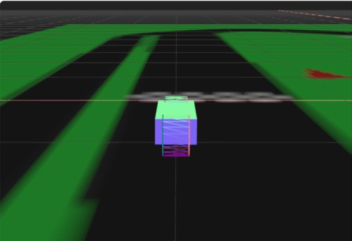

# Three.js Cannon.es 調査資料 - 二輪（バイク）のテスト（失敗談）

## この記事のスナップショット

[二輪（バイク）](009/009.html)



ソース

https://github.com/fnamuoo/webgl/blob/main/009

動かし方

- ソース一式を WEB サーバ上に配置してください
- 車の操作法
  - カーソル上 .. アクセル
  - カーソル下 .. バック
  - カーソル左、カーソル右 .. ハンドル
  - 'b' .. ブレーキ
  - 'c' .. カメラ視点の変更
  - 'a' .. 姿勢を左に傾ける
  - 'd' .. 姿勢を右に傾ける
  - 'r' .. 姿勢を戻す

## 概要

- 二輪（バイク）のテスト

## やったこと

RaycastVehicleクラスは4輪に限っていません。簡単に2輪にできます。

まずホイールの数を2つにして、位置を中心に持ってきます。

```js
  // 二輪（バイク
  wheelOptions.chassisConnectionPointLocal.set(-2, 0, 0)
  moVehicle.addWheel(wheelOptions)
  wheelOptions.chassisConnectionPointLocal.set(2, 0, 0)
  moVehicle.addWheel(wheelOptions)
```

またホイールの太さを明示的に太く（1に）します。

```js
    ...
    const moWheelShape = new CANNON.Cylinder(wheel.radius, wheel.radius, 1, 20)
    ...
    const viWheelGeo = new THREE.CylinderGeometry(wheel.radius, wheel.radius, 1, 20);
```

[二輪の画像]()

実際に動かしてみるとすぐに倒れます。  
パタン、と倒れます。  
ジャイロ効果なんて知らないとばかりに倒れます。

姿勢制御として、「進行方向に対し横方向に力を加える」アクションを入れてみます。

```js
  document.addEventListener('keydown', (event) => {
    switch (event.key) {
      ...
      case 'a':
        // 暫定の姿勢制御に.. 進行方向 に対し 90度回転した方向に力を加えてみる
        var vquat = moVehicle.chassisBody.quaternion;
        var veuler = new CANNON.Vec3(0, 0, 0);
        vquat.toEuler(veuler);
        var ry = -veuler.y + Math.PI/2;
        var ff = 200;
        var fx = ff*Math.cos(ry);
        var fz = ff*Math.sin(ry);
        var f = new CANNON.Vec3(fx, 0, fz);
        moVehicle.chassisBody.applyImpulse(f, new CANNON.Vec3(0, 1, 0));
        break

      case 'd':
        // 暫定の姿勢制御に.. 進行方向 に対し -90度回転した方向に力を加えてみる
        var vquat = moVehicle.chassisBody.quaternion;
        var veuler = new CANNON.Vec3(0, 0, 0);
        vquat.toEuler(veuler);
        var ry = -veuler.y - Math.PI/2;
        var ff = 200;
        var fx = ff*Math.cos(ry);
        var fz = ff*Math.sin(ry);
        var f = new CANNON.Vec3(fx, 0, fz);
        moVehicle.chassisBody.applyImpulse(f, new CANNON.Vec3(0, 1, 0));
        break
      ...
```

これで姿勢を戻すことができますが操作が難しい。
教習所の一本橋（平均台）よりも難しいのでは？
やはりジャイロ効果を明示的に組み込まないとバイクっぽくないですね。

あと、ブレーキングしながら曲がろうとすると逆回転します。なんだこの挙動？！
色々と煮詰まってしまったので、二輪はここまでとします。

次の記事で3輪にチャレンジします。

------------------------------------------------------------

前の記事：[「沈む」テスト](008.md)

次の記事：[３輪のテスト](010.md)

目次：[目次](000.md)

この記事には次の関連記事があります。

- [二輪（バイク）のテスト（失敗談）](009.md)
- [３輪のテスト](010.md)

--