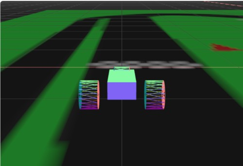
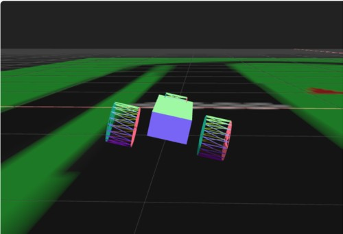

# Three.js Cannon.es 調査資料 - ３輪のテスト

## この記事のスナップショット

[３輪](010/010.html)



[ソース](010/)

動かし方

- ソース一式を WEB サーバ上に配置してください
- 車の操作法
  - カーソル上 .. アクセル
  - カーソル下 .. バック
  - カーソル左、カーソル右 .. ハンドル
  - 'b' .. ブレーキ
  - 'c' .. カメラ視点の変更
  - 'a' .. 姿勢を左に傾ける
  - 'd' .. 姿勢を右に傾ける
  - 'r' .. 姿勢を戻す

## 概要

- 3輪のテスト

## やったこと

RaycastVehicleクラスは4輪に限っていません。今回は3輪にチャレンジします。

ホイールは前輪1つ、後輪2つにします。

```js
  // ３輪（バイク
  wheelOptions.chassisConnectionPointLocal.set(-2, 0, 0)
  moVehicle.addWheel(wheelOptions)
  wheelOptions.chassisConnectionPointLocal.set(2, 0, 1.8)
  moVehicle.addWheel(wheelOptions)
  wheelOptions.chassisConnectionPointLocal.set(2, 0, -1.8)
  moVehicle.addWheel(wheelOptions)
```

他にも細かい修正はありますが、2輪のときとほぼ同様なので割愛します。

実際に動かしてみると二輪に比べ各段に安定してますが、何か物足りない。

車体を傾けるアクションとして、
後輪のサスペンションが一時的に弱くなるようにキーバインドを追加します。

```js
  document.addEventListener('keydown', (event) => {
    switch (event.key) {
      ...
      case 'a':
        // 左のホイールのサスを弱めて、左に車体を傾けさせる
        moVehicle.wheelInfos[1].maxSuspensionForce = 100;
        break

      case 'd':
        // 右のホイールのサスを弱めて、右に車体を傾けさせる
        moVehicle.wheelInfos[2].maxSuspensionForce = 100;
        break
      ...
  }
  document.addEventListener('keyup', (event) => {
    switch (event.key) {
      case 'a':
        // サスを戻す（車体を戻す）
        moVehicle.wheelInfos[1].maxSuspensionForce = 100000;
        break
      case 'd':
        // サスを戻す（車体を戻す）
        moVehicle.wheelInfos[2].maxSuspensionForce = 100000;
        break
      ...
```



ハンドル操作と組み合わせるといい感じのコーナリングになります。

ただ、惜しむらくはホイールの傾きがそのままなこと。
斜めに傾けたかったのですがちょっとハマってしまったのでそのままに。
ホイールを球にしてしまえば違和感が薄まる気もしますがそれはそれで負けた気もする。
でも満足したので3輪はここまでとします。

------------------------------------------------------------

前の記事：[二輪（バイク）のテスト(失敗談)](009.md)

次の記事：[凹凸地面 にテクスチャを貼る(2)／国土地理院の3Dデータ対応](011.md)

目次：[目次](000.md)

この記事には次の関連記事があります。

- [二輪（バイク）のテスト（失敗談）](009.md)
- [３輪のテスト](010.md)

--