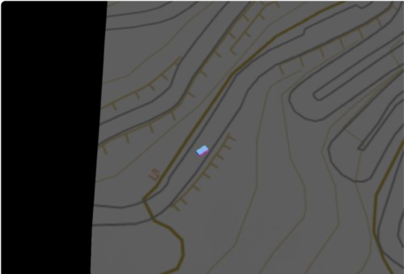

# Three.js Cannon.es 調査資料 - 凹凸地面 にテクスチャを貼る(2)／国土地理院の3Dデータ対応

## この記事のスナップショット

[国土地理院3DデータとRaycastVehicle](011/011.html)



[ソース](011/)

動かし方

- ソース一式を WEB サーバ上に配置してください
- 車の操作法
  - カーソル上 .. アクセル
  - カーソル下 .. バック
  - カーソル左、カーソル右 .. ハンドル
  - 'b' .. ブレーキ
  - 'c' .. カメラ視点の変更
  - 'r' .. 姿勢を戻す

## 概要

- 国土地理院の 3D データを使って Heightfield に適用します

## やったこと

国土地理院からある地点（地域）の3Dデータを取得、標高データとテクスチャ（地図）をダウンロードします。
これを読み込んで Heightfield に適用し、凹凸を再現してテクスチャを貼り付け、
その地点にいるかのような再現を行います。

凹凸にテクスチャを貼ることは別記事で実施済みですが、
今回は国土地理院のデータ形式とテクスチャに合わせて、
データの並びやデータのサーチ方向を修正します。

## 国土地理院でのデータ取得

国土地理院の
[全国Q地図](https://maps.qchizu.xyz/)
にアクセスすると、日本各地の地図、倍率19倍までの詳細な地図を表示できます。
画面上部のメニューの「ツール」（右上）から「3D」を選ぶと最大 2048x2048[pixel] の3D地図を表示できます。
ここでWebGL用ファイルをダウンロードすることで、
標高ファイル（dem.csv）とテクスチャ画像（texture.png）を取得できます。

2048x2048 サイズの場合、テクスチャ（png）のサイズは 2048x2048[pixel] であり、
標高ファイルは 257x257=66049 個の1行のデータです。
標高ファイルは 256x256 要素の直交メッシュの点の標高だけを取り出したデータになります。
データの並びは、画像と同じ並び順で改行を省いて1行で格納されてます。
標高データ1つが画像の 8x8[pixel] に相当します。

  ```eq
  画像の横方向のサイズ =  (標高データの横方向のサイズ-1)*8
  画像の縦方向のサイズ =  (標高データの縦方向のサイズ-1)*8
  ```

## 国土地理院での3Dデータの利用方法

国土地理院での3Dデータを使うには、
「読み込んだデータの並び」と「CANNON.Heightfieldのデータの並び」と
「THREE.BufferGeometryのデータの並び」に注意する必要があります。
ここを間違えると、「物理ライブラリ内の凹凸」と「見た目の凹凸」が逆になったり、
「読み込んだデータの並び／テクスチャの凹凸」と「見た目の凹凸」が逆になったりします。

### 標高データの読み込み部分

標高データ（dem.csv）が1行で記載されていても改行されていても同じように読み込みます。
また非同期ではなく同期処理で動かします。
three.jsとcannon側との調整のため、最後に行の並びを逆順にします。

```js
  var matrix = [];
  // var Dem = "./dem.csv";
  var vzmax = 0;
  {
    var vSceneMesh = null;
    var xhr = new XMLHttpRequest();
    xhr.addEventListener('load', function(evt) {
      vSceneMesh = (evt.target.response || evt.target.responseText).replace(/\n/g, ",").split(",");
      var vMeshSizeW = sizeX-1;
      var vMeshSizeH = sizeZ-1;
      for(let iz = 0; iz <= vMeshSizeH; iz++){
        matrix.push([])
        for(let ix = 0; ix <= vMeshSizeW; ix++){
          var idx = iz * (vMeshSizeW+1) + ix;
          const vz = vSceneMesh[idx] * ampHigh;
          matrix[iz].push(vz);
          if (vzmax < vz) {
            vzmax = vz;
          }
        }
      }
    }, false);
    xhr.open('GET', Dem, false);  // 三番目にfalseで, 同期読込
    xhr.send(null);
  }
  // matrix のZ軸を入れ替え
  {
    var matrix_ = []
    for (let iz = 0; iz < sizeZ; ++iz) {
      matrix_.push(matrix[sizeZ-iz-1])
    }
    matrix = matrix_
  }
```

### CANNON.Heightfieldへの登録

物理エンジンのCANNON.Heightfieldに登録するために、
行と列を入れ替えたデータmomatrixを作成してから登録します。

```js
  // CANNON.Heightfield 用に 軸を入れ替えたデータを用意する
  var momatrix = []
  for (let ix = 0; ix < sizeX; ++ix) {
    momatrix.push([])
    for (let iz = 0; iz < sizeZ; ++iz) {
      momatrix[ix].push(matrix[iz][ix])
    }
  }
  const heightfieldShape = new CANNON.Heightfield(momatrix, {elementSize: lengthX / sizeX,})
```

### THREE.BufferGeometryへの登録

ウェブ表示、THREE.BufferGeometryに登録するために、
forループ時のイテレータとサイズに気を付けつつ（前回は行と列が同じで入れ替わっても気づかなかった）
さらに表示を合わせるようポリゴン作成時に逆順にループします。

```js
  const viGroundGeo = new THREE.BufferGeometry();
  const sizeX_ = sizeX-1;
  const sizeZ_ = sizeZ-1;
  {
    // ポリゴンの頂点座標の配列（Polygon's positon array)
    var pos = new Float32Array(sizeX*sizeZ*3);
    var n=0;
    for(var iz = 0; iz < sizeZ; iz++){ 
      for(var ix = 0; ix < sizeX; ix++){
        pos[n] = ix * lengthX/sizeX; n++;
        pos[n] = iz * lengthZ/sizeZ; n++;
        pos[n] = matrix[iz][ix]; n++;
      }
    }
    // ポリゴンの三角形をインデックスで指定(Polugon's index array)
    n=0;
    var index = new Uint32Array(3*(sizeX_*sizeZ_*2));
    for(var iz=sizeZ_-1; iz >= 0; --iz){ // 入力データの並びと表示を合わせるよう逆順で
      for(var ix=0; ix < sizeX_; ix++){
        index[n] = iz*sizeX + ix; n++;
        index[n] = iz*sizeX + ix + 1; n++;
        index[n] = (iz+1)*sizeX + ix + 1; n++;
        index[n] = iz*sizeX + ix; n++;
        index[n] = (iz+1)*sizeX + ix + 1; n++;
        index[n] = (iz+1)*sizeX + ix; n++;
      }
    }
    // ポリゴンのTexgure位置座標の配列 (Texture uv positions array)
    n=0;
    var uvs = new Float32Array(sizeX*sizeZ*2);
    for(var iz=0; iz<sizeZ; iz++){ 
      for(var ix=0; ix<sizeX; ix++){
        uvs[n] = ix/sizeX_; n++;
        uvs[n] = iz/sizeZ_; n++;
      }
    }
    // 2つの三角形をインデックスで指定(Polygon's index array)
    const geom = new THREE.BufferGeometry();
    viGroundGeo.setAttribute("position", new THREE.BufferAttribute(pos, 3));
    viGroundGeo.setIndex(new THREE.BufferAttribute(index,1)); 
    viGroundGeo.computeVertexNormals();
    viGroundGeo.setAttribute("uv", new THREE.BufferAttribute(uvs, 2));
  }
```

## 走ってみた

地図上をRaycastVehicle走ってみました。  
おぉぉ、感動する！、、けど、いくつか問題点が見えてきました。

- 道なりでも水平になってない
  - 斜面にある道が斜めになっていたり、細かく凸凹していて車が跳ねたりぶつかったり。
- 橋がない
  - 地図上では川や谷の部分で橋がかかっていると思われるところに橋がなく谷間になっている。
- 地図が大きくなると大変
  - ビーナスラインってコースが長いんですよね。
    全体を納めるよう縮小すると味気ない。
    しかし拡大すると地図の連結が必要だし、大きくなりすぎるとメモリがオーバーフローしそう。

多少の凹凸は車のセッティングで吸収できたとしても、橋がないのはどうしようもないですね。
どっちにしても整地は必須な気がします。

次回、perlinノイズで地面を凸凹させます。

------------------------------------------------------------

前の記事：[３輪のテスト](010.md)

次の記事：[凹凸地面にパーリンノイズ(perlin noize)](012.md)

目次：[目次](000.md)

この記事には次の関連記事があります。

- [テクスチャ(画像)を貼る](006.md)
- [凹凸地面 にテクスチャを貼る(2)／国土地理院の3Dデータ対応](011.md)
- [地図データの加工](023.md)
- [ビーナスライン走ってみた](024.md)

--