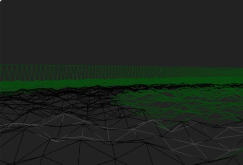
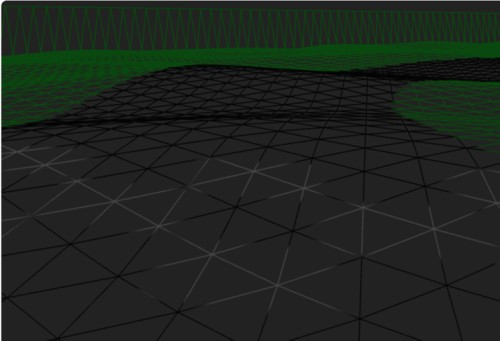

# Three.js Cannon.es 調査資料 - 凹凸地面にパーリンノイズ(perlin noize)

## この記事のスナップショット

[凹凸地面にパーリンノイズとRaycastVehicle](012/012.html)


[ソース](012/)

動かし方

- ソース一式を WEB サーバ上に配置してください
- 車の操作法
  - カーソル上 .. アクセル
  - カーソル下 .. バック
  - カーソル左、カーソル右 .. ハンドル
  - 'b' .. ブレーキ
  - 'c' .. カメラ視点の変更
  - 'r' .. 姿勢を戻す

## 概要

- 地面の凹凸表現（Heightfield）にパーリンノイズ（Perlin noise）を使って、凹凸の感じを確かめてみます。

## パーリンノイズとは

自然の造形物（ここでは地形や波）の表現に用いられ、CGやゲームクリエイター御用達の乱数発生器です。

引数に（x,y）をとり、近傍の点で似た値を返す特徴を持ちます。

白色ノイズを使うと、かなり凹凸の激しい地面ができます。



一方でパーリンノイズを使うと、なだらかに変化のある地面ができます。



## やったこと

サンプルコードではCANNON.Heightfieldの入力データが三角関数のみで凹凸を作られていましたが、
ここにパーリンノイズを加えることでダートコースっぽい仕上がりにします。

```js
  const matrix = []
  for (let i = 0; i < sizeX; i++) {
    matrix.push([])
    for (let j = 0; j < sizeZ; j++) {
      if (i === 0 || i === sizeX - 1 || j === 0 || j === sizeZ - 1) {
        const height = 5
        matrix[i].push(height)
        continue
      }
      // const height = Math.cos((i / sizeX) * Math.PI * 5) * Math.cos((j / sizeZ) * Math.PI * 5) * 2 + 2
      // const height = Math.random() * 0.2;  // 荒々しい凸凹感 はこちら
      // const height = noise.perlin2(i*0.1 ,j*0.1)*0.5;  // 滑らかな凸凹感
      // 丘陵＋凸凹感
      const height = Math.cos((i / sizeX/2+1) * Math.PI * 5) * Math.cos((j / sizeZ+2) * Math.PI * 5) * 3 + 2 + noise.perlin2(i*0.1 ,j*0.1)*0.5;
      matrix[i].push(height)
    }
  }
  const heightfieldShape = new CANNON.Heightfield(matrix, {elementSize: length / sizeX,})
```

試走してみると、車のセッティングがサンプルコードのままなので扱いずらくて、
ラリーカーのようにはいきませんが。

次はこの凹凸を時間変化させて波のようにします。

------------------------------------------------------------

前の記事：[二輪（バイク）のテスト(失敗談)](009.md)

次の記事：[凹凸地面を時間変化、波のように](013.md)

目次：[目次](000.md)

この記事には次の関連記事があります。

- [凹凸地面にパーリンノイズ(perlin noize)](012.md)
- [凹凸地面を時間変化、波のように](013.md)

--