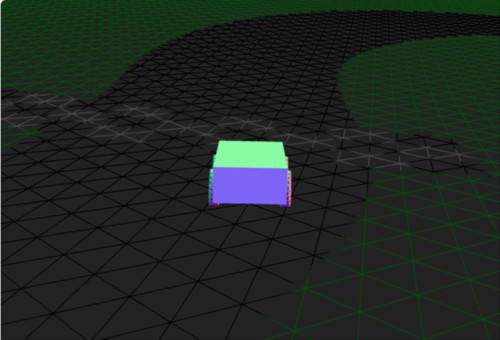
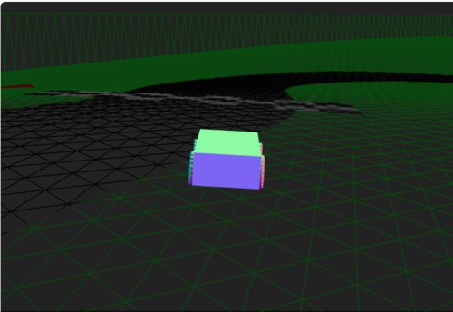
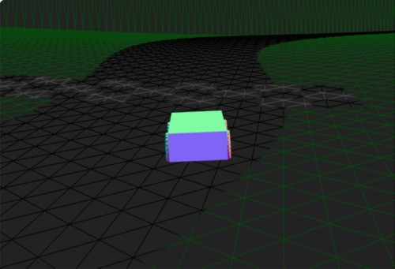

# Three.js Cannon.es 調査資料 - 凹凸地面を時間変化、波のように

## この記事のスナップショット

凹凸地面を時間変化とRaycastVehicle


ソース

https://github.com/fnamuoo/webgl/blob/main/013

動かし方

- ソース一式を WEB サーバ上に配置してください
- 車の操作法
  - カーソル上 .. アクセル
  - カーソル下 .. バック
  - カーソル左、カーソル右 .. ハンドル
  - 'b' .. ブレーキ
  - 'c' .. カメラ視点の変更
  - 'r' .. 姿勢を戻す

## 概要

- 地面の凹凸表現（Heightfield）を時間変化させて波のような表現を試みます

## やったこと

地面の凹凸の構築に三角関数を用いていることを利用して、三角関数の位相を時間とともにずらしつつ地面を再構築します。前回パーリンノイズを組み合わせてましたがここでは三角関数のみとしています。

地面データを作成する関数を用意し、位相をずらす項（phShiftX, phShiftZ）を組み込みます。

```js
  function createGroundData(sizeX, sizeZ, phShiftX, phShiftZ) {
    var matrix = [];
    for (let i = 0; i < sizeX; i++) {
      matrix.push([])
      for (let j = 0; j < sizeZ; j++) {
        if (i === 0 || i === sizeX - 1 || j === 0 || j === sizeZ - 1) {
          const height = 10
          matrix[i].push(height)
          continue
        }
        const height = Math.cos((i / sizeX/2+phShiftX) * Math.PI * 5) * Math.cos((j / sizeZ+phShiftZ) * Math.PI * 5) * 3 + 2;
        matrix[i].push(height)
      }
    }
    return matrix;
  }
```

また、地面を更新する関数を用意します。これは内部で地面生成の関数createGroundData()を呼び出し、CANNON.Heightfieldが持つ内部データの更新と表示（three.js）の幾何データの更新を行います。

```js
  // 地面を更新
  //   丘陵の位相をずらして平面を書き直す
  //   perlin ノイズまで作り直すと、凸凹が消えたり現れたりする..xx 使うなら 別レイヤー（別データ：変更しない）にして重ねる
  //   急に凹凸すると車が跳ねたり、空中に放り出されたりするので、緩やかに変化させる
  function updateGroundData() {
    // 物理データ側更新
    phShiftX += 0.001;
    phShiftZ += 0.002;
    matrix = createGroundData(sizeX, sizeZ, phShiftX, phShiftZ);
    heightfieldShape.data = matrix;
    heightfieldShape.update();
    // ビュー側更新
    var n=2;
    for(var y=0; y<sizeX; y++){ 
      for(var x=0; x<sizeZ; x++){
        pos[n] = matrix[x][y]; n+=3;
      }
    }
    viGroundGeo.setAttribute("position", new THREE.BufferAttribute(pos, 3));
  }
```

あとはこの関数updateGroundDataを一定時間ごとに呼び出すことで、地面が波打ったようになります。

```js
  // 動的に、一定時間(0.1秒)ごとに 「地面を更新する」関数を呼び出し
  setInterval(updateGroundData, 100);
```

コース画像


コース画像数秒後


走ってみると、ウネウネうごく生き物の上を走っている気分。。。  時間変化が激しいと、地面が突然隆起したり陥没して、地面が車をお手玉する感じになるので注意が必要です。three.js のデモにも同じようなものがあります。こちらは物理エンジンが関係するためか、正直、滑らかでスムーズとは言い難いです。（別のライブラリなら期待できる？）

次回からは大きく趣向を変えて、動きの制約に関する基礎の調査・確認を行っていきます。

------------------------------------------------------------

前の記事：[凹凸地面にパーリンノイズ(perlin noize)](012.md)

次の記事：[バネの挙動確認](014.md)

目次：[目次](000.md)

この記事には次の関連記事があります。

- [凹凸地面にパーリンノイズ(perlin noize)](012.md)
- [凹凸地面を時間変化、波のように](013.md)

--