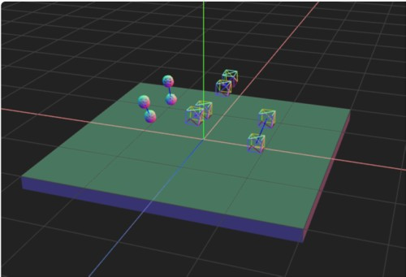
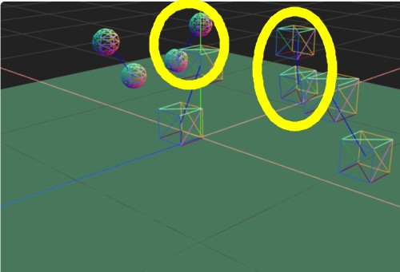

# Three.js Cannon.es 調査資料 - Constraint確認／DistanceConstraint

## この記事のスナップショット

[DistanceConstraintの挙動](015/015.html)



[ソース](015/)

動かし方

- ソース一式を WEB サーバ上に配置してください
- マウス操作 .. カメラ位置の変更

## 概要

- DistanceConstraintの挙動を確認します。

## CANNON の制約(constraint)

物理エンジン Cannon.es において古典力学のふるまい、
とりわけ2つの物体の動きを制限するものとして下記があります。

クラス名               | 説明・例
-----------------------|-----------------------------
Spring                 | バネ
DistanceConstraint     | 中心同士を一定の長さで固定。
PointToPointConstraint | 点結合。振り子。
LockConstraint         | 固定。
HingeConstraint        | 軸結合。扉のちょうつがい。回転モーター。
ConeTwistConstraint    | 軸結合＋ひねり。ragdoll の関節。

残念ながら平行移動（slider）はサポートされてないようです。

今回は DistanceConstraint について取り上げます。

## やったこと(1)

まず3つの状態を用意しました。

- 振り子を模して球を結合した場合 .. 左に配置
- 振り子を模して立方体を結合した場合 .. 中央に配置
- 振り子を模して立方体を結合して力を加えた場合 .. 右に配置

DistanceConstraint の使い方は、繋ぎたい 2つのオブジェクトと距離を指定し、world に追加するだけです。

下記では1番目（球の振り子）の例を示します。

```js
  const radius = 1;
  const moObj1AShape = new CANNON.Sphere(radius);
  const moObj1ABody = new CANNON.Body({mass: 0, shape: moObj1AShape, position: new CANNON.Vec3(-10, 5, 0)});
  world.addBody(moObj1ABody)
  const viObj1AGeo = new THREE.SphereGeometry(radius, 6, 6);
  const viObj1AMtr = new THREE.MeshNormalMaterial({wireframe: true});
  const viObj1AMesh = new THREE.Mesh(viObj1AGeo, viObj1AMtr);
  viObj1AMesh.position.copy(moObj1ABody.position);
  viObj1AMesh.quaternion.copy(moObj1ABody.quaternion);
  scene.add(viObj1AMesh);
  //
  const moObj1BShape = new CANNON.Sphere(radius);
  const moObj1BBody = new CANNON.Body({mass: 1, shape: moObj1BShape, position: new CANNON.Vec3(-10, 5, 3)});
  world.addBody(moObj1BBody)
  const viObj1BGeo = new THREE.SphereGeometry(radius, 6, 6);
  const viObj1BMtr = new THREE.MeshNormalMaterial({wireframe: true});
  const viObj1BMesh = new THREE.Mesh(viObj1BGeo, viObj1BMtr);
  viObj1BMesh.position.copy(moObj1BBody.position);
  viObj1BMesh.quaternion.copy(moObj1BBody.quaternion);
  scene.add(viObj1BMesh);
  // 一定距離(=4)でつなぐ
  const moObj1Const = new CANNON.DistanceConstraint(moObj1ABody, moObj1BBody, 4);
  world.addConstraint(moObj1Const);
  // DistanceConstraintの可視化　二つのオブジェクトの中心をつないで線を引く
  const viObj1Mtr = new THREE.LineBasicMaterial( { color: 0x0000ff } );
  const viObj1Points = [];
  viObj1Points.push( moObj1ABody.position );
  viObj1Points.push( moObj1BBody.position );
  const viObj1Geo = new THREE.BufferGeometry().setFromPoints(viObj1Points);
  const viObj1Line = new THREE.Line(viObj1Geo, viObj1Mtr);
  scene.add(viObj1Line);
```

DistanceConstraint は物体の中心を端点にしてつなぎます。
その動きを注視して見ると少々違和感を感じます。
矩形の振り子がわかりやすいですが、姿勢（向きを）変えずに振り子の動きをしています。

ちなみに真ん中の振り子が床をこすっているのはご愛敬。

## やったこと(2)

振り子の動きが気になってしまい、なんとか解消できないものかと考えた結果、
振り子の球とアンカー（もう 1つの固定された球）を PointToPointConstraint でつなげば良さげです。

DistanceConstraint は距離だけでつなぐので、繋がれたオブジェクトの姿勢を制限しません。
一方、PointToPointConstraint ではオブジェクトからの任意の位置で繋ぐので、繋がれた方向に向いて姿勢が固定されます。

球の場合と立方体の場合を追加、左奥と中央奥に配置しました。
振り子っぽくなってますね。すっきりしました。



次は PointToPointConstraint を扱います。

------------------------------------------------------------

前の記事：[バネの挙動確認](014.md)

次の記事：[Constraint確認／PointToPointConstraint](016.md)

目次：[目次](000.md)

この記事には次の関連記事があります。

- [バネの挙動確認](014.md)
- [Constraint確認／DistanceConstraint](015.md)
- [Constraint確認／PointToPointConstraint](016.md)
- [Constraint確認／LockConstraint](017.md)
- [Constraint確認／HingeConstraint](018.md)
- [Constraint確認／ConeTwistConstraint](019.md)

--