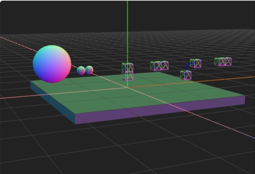

# Three.js Cannon.es 調査資料 - Constraint確認／LockConstraint

## この記事のスナップショット

[LockConstraintの挙動](017/017.html)



[ソース](017/)

動かし方

- ソース一式を WEB サーバ上に配置してください
- マウス操作 .. カメラ位置の変更

## 概要

- LockConstraintの挙動を確認します。

## CANNON の制約(constraint)

物理エンジン Cannon.es において古典力学のふるまい、
とりわけ2つの物体の動きを制限するものとして下記があります。

クラス名               | 説明・例
-----------------------|-----------------------------
Spring                 | バネ
DistanceConstraint     | 中心同士を一定の長さで固定。
PointToPointConstraint | 点結合。振り子。
LockConstraint         | 点で固定。
HingeConstraint        | 軸結合。扉のちょうつがい。回転モーター。
ConeTwistConstraint    | 軸結合＋ひねり。ragdoll の関節。

残念ながら平行移動（slider）はサポートされてないようです。

今回は LockConstraint について取り上げます。

## やったこと

まず5つの状態を用意しました。

- 球同士を横につなぐように、側面に結合位置をおく .. 左から1つ目（左端）
- 立方体を上下につなぐように、片方の底面と片方の上面に結合位置をおく .. 左から2つ目
- 立方体を左右につなぐように、側面に結合位置をおく .. 左から3つ目（中央）
- 立方体を左右につなぎつつも、側面から離れた位置でに結合する .. 左から4つ目
- 立方体を左右につなぐように、側面に結合位置をおく。ただし初期位置を適当＋外力を与えておく .. 左から5つ目（右端）

LockConstraint の使い方は、繋ぎたい2つのオブジェクトを指定します。
さらに結合する点の位置を指定したときは pivotA, pivotB に
それぞれのオブジェクトの相対位置で指定します。

下記では1番目（球を横につなげる）の例を示します。
ここではアンカー（固定）となるmoObj1ABodyの表面 [-radius, 0, 0] の位置と
もう1つのオブジェクトmoObj1BBodyの表面 [radius, 0, 0] の位置で結合（固定）させます。

```js
  const radius = 1;
  const moObj1AShape = new CANNON.Sphere(radius);
  const moObj1ABody = new CANNON.Body({mass: 0, shape: moObj1AShape, position: new CANNON.Vec3(-10, 5, 0)});
  world.addBody(moObj1ABody)
  const viObj1AGeo = new THREE.SphereGeometry(radius, 6, 6);
  const viObj1AMtr = new THREE.MeshNormalMaterial({wireframe: true});
  const viObj1AMesh = new THREE.Mesh(viObj1AGeo, viObj1AMtr);
  viObj1AMesh.position.copy(moObj1ABody.position);
  viObj1AMesh.quaternion.copy(moObj1ABody.quaternion);
  scene.add(viObj1AMesh);
  //
  const moObj1BShape = new CANNON.Sphere(radius);
  const moObj1BBody = new CANNON.Body({mass: 1, shape: moObj1BShape, position: new CANNON.Vec3(-11, 4, 0)});
  world.addBody(moObj1BBody)
  const viObj1BGeo = new THREE.SphereGeometry(radius, 6, 6);
  const viObj1BMtr = new THREE.MeshNormalMaterial({wireframe: true});
  const viObj1BMesh = new THREE.Mesh(viObj1BGeo, viObj1BMtr);
  viObj1BMesh.position.copy(moObj1BBody.position);
  viObj1BMesh.quaternion.copy(moObj1BBody.quaternion);
  scene.add(viObj1BMesh);
  //
  const moObj1Const = new CANNON.LockConstraint(moObj1ABody, moObj1BBody);
  moObj1Const.pivotA = new CANNON.Vec3(-radius, 0, 0);
  moObj1Const.pivotB = new CANNON.Vec3( radius, 0, 0);
  world.addConstraint(moObj1Const);
```

1つ目の
球の表面でつなげた場合、つなげた球が重力に引かれることなく、しっかりと横に固定されています。

2つ目の立方体を上下につなげた場合、ぴったりとつながってます。
前回のPointToPointConstraintのときとはことなり、時間が経過しても回転する（ひねる）ことはありません。

3つ目の立方体を左右につなげた場合です。
結合後に外力（下記applyImpulse）を加えてますが、しっかりと固定されています。

```js
  moBox3BBody.applyImpulse(new CANNON.Vec3(0, 1, 0), new CANNON.Vec3(0, 0, 1));
```

4つ目は距離をおいて立方体をつなげた場合です。
接続方向がわかるよう補助線（青）を表示させてますが、固定されており動く気配はありません。

5つ目は立方体を横につなげた場合ですが、
LockConstraint の maxForce(def=1e6)を超えた大きな外力（3e6）をかけている場合です。
開始直後は離れていますが、つながろうとする強制力がすぐに働いて、くっついた状態になります。
つながった後は微動だにしません。

次は HingeConstraint を扱います。

------------------------------------------------------------

前の記事：[Constraint確認／PointToPointConstraint](016.md)

次の記事：[Constraint確認／HingeConstraint](018.md)

目次：[目次](000.md)

この記事には次の関連記事があります。

- [バネの挙動確認](014.md)
- [Constraint確認／DistanceConstraint](015.md)
- [Constraint確認／PointToPointConstraint](016.md)
- [Constraint確認／LockConstraint](017.md)
- [Constraint確認／HingeConstraint](018.md)
- [Constraint確認／ConeTwistConstraint](019.md)

--