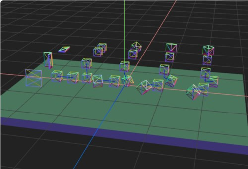

# Three.js Cannon.es 調査資料 - Constraint確認／HingeConstraint

## この記事のスナップショット

[HingeConstraintの挙動](018/018.html)



[ソース](018/)

動かし方

- ソース一式を WEB サーバ上に配置してください
- 各種操作
  - 'q' .. アンカーをx軸正に回転
  - 'a' .. アンカーをx軸負に回転
  - 'w' .. アンカーをy軸正に回転
  - 's' .. アンカーをy軸負に回転
  - 'e' .. アンカーをz軸正に回転
  - 'd' .. アンカーをz軸負に回転
  - 'r' .. 左から2列目を順回転
  - 'f' .. 左から2列目を逆回転
  - マウス操作 .. カメラ位置の変更

## 概要

- LockConstraintの挙動を確認します。

## CANNON の制約(constraint)

物理エンジン Cannon.es において古典力学のふるまい、
とりわけ2つの物体の動きを制限するものとして下記があります。

クラス名               | 説明・例
-----------------------|-----------------------------
Spring                 | バネ
DistanceConstraint     | 中心同士を一定の長さで固定。
PointToPointConstraint | 点結合。振り子。
LockConstraint         | 点で固定。
HingeConstraint        | 軸結合。扉のちょうつがい。回転モーター。
ConeTwistConstraint    | 軸結合＋ひねり。ragdoll の関節。

残念ながら平行移動（slider）はサポートされてないようです。

今回は HingeConstraint について取り上げます。

## やったこと

まず5つの状態として

- 結合する軸の向きを同じにして、軸を挟むように物体を配置。扉のちょうつがいを再現 .. 左から1つ目（左端）
- 結合する軸の向きを同じにして、軸で串刺しするよう直列に物体を配置。回転モーターを再現 .. 左から2つ目
- アンカーの軸だけを約30度傾け、軸で串刺しするよう直列に物体を配置。 .. 左から3つ目（中央）
- アンカーの軸だけを約60度傾け、軸で串刺しするよう直列に物体を配置。 .. .. 左から4つ目
- アンカーの軸だけを90度傾け、軸で串刺しするよう直列に物体を配置。 .. .. 左から5つ目（右端）

これを x軸、y軸、z軸ごとに行い、手前、中、最奥に配置しました。

HingeConstraint の使い方は、繋ぎたい2つのオブジェクト、回転軸のベクトル、
接続位置の相対位置ベクトルを指定します。

下記では1番目（x軸でちょうつがい）の例を示します。
軸（axisA, avisB）を同じにして、その軸を挟むように上下に配置し、接している中心点を pivotA, pibotb に指定します。
また enableMotor() を指定すると自由に動かないので指定しません。

```js
  const moBox111AShape = new CANNON.Box(new CANNON.Vec3(2, 1, 0.1))
  const moBox111ABody = new CANNON.Body({ mass: 0, shape: moBox111AShape, position: new CANNON.Vec3(-20, 5, 10) })
  world.addBody(moBox111ABody)
  const viBox111AGeo = new THREE.BoxGeometry(4, 2, 0.2);
  const viBox111AMtr = new THREE.MeshNormalMaterial({wireframe: true});
  const viBox111AMesh = new THREE.Mesh(viBox111AGeo, viBox111AMtr);
  viBox111AMesh.position.copy(moBox111ABody.position);
  viBox111AMesh.quaternion.copy(moBox111ABody.quaternion);
  scene.add(viBox111AMesh);
  //
  const moBox111BShape = new CANNON.Box(new CANNON.Vec3(2, 1, 0.1))
  const moBox111BBody = new CANNON.Body({ mass: 1, shape: moBox111BShape, position: new CANNON.Vec3(-20, 3, 10) })
  world.addBody(moBox111BBody)
  const viBox111BGeo = new THREE.BoxGeometry(4, 2, 0.2);
  const viBox111BMtr = new THREE.MeshNormalMaterial({wireframe: true});
  const viBox111BMesh = new THREE.Mesh(viBox111BGeo, viBox111BMtr);
  viBox111BMesh.position.copy(moBox111BBody.position);
  viBox111BMesh.quaternion.copy(moBox111BBody.quaternion);
  scene.add(viBox111BMesh);
  // 
  const moBox111Const = new CANNON.HingeConstraint(moBox111ABody, moBox111BBody, {
      axisA: new CANNON.Vec3(1, 0, 0),
      axisB: new CANNON.Vec3(1, 0, 0),
      pivotA: new CANNON.Vec3(0, -1, 0),
      pivotB: new CANNON.Vec3(0, 1, 0),
      collideConnected: false,
    });
  world.addConstraint(moBox111Const);
```

2番目（回転モーター）の例を示では enableMotor() を指定します。
明示的に動かすため、キーバインドでrキー、fキー押下時に回転させる操作をいれてます。

```js
  const moBox1Const = new CANNON.HingeConstraint(moBox1ABody, moBox1BBody, {
      axisA: new CANNON.Vec3(1, 0, 0),  // bodyAから見た 回転軸
      axisB: new CANNON.Vec3(1, 0, 0),  // bodyB の回転軸（ローカル)
      pivotA: new CANNON.Vec3(-2, 0, 0),
      pivotB: new CANNON.Vec3( 2, 0, 0),
      collideConnected: false,
    });
  world.addConstraint(moBox1Const);
  moBox1Const.enableMotor();

  ...
  document.addEventListener('keydown', (event) => {
    switch (event.key) {
      ...
      case 'r':
        // keydown時に動かす
        moBox1Const.setMotorSpeed(1);
        break;
    }
  })

  document.addEventListener('keyup', (event) => {
    switch (event.key) {
      ...
      case 'r':
        // keyup時に動きを止める
        moBox1Const.setMotorSpeed(0);
        break;
    }
  })

```

ちなみに
3番目～5番目はenableMotor(), setMotorSpeed(1) を指定しており、動きつづけます。

ほかにも、アンカーを回転させて動きを確認きるようにしています。
 qキー、aキーでx軸回転、
 wキー、sキーでy軸回転、
 eキー、dキーでz軸回転させることができます。

次は ConeTwistConstraint を扱います。

------------------------------------------------------------

前の記事：[Constraint確認／LockConstraint](017.md)

次の記事：[Constraint確認／ConeTwistConstraint](019.md)

目次：[目次](000.md)

この記事には次の関連記事があります。

- [バネの挙動確認](014.md)
- [Constraint確認／DistanceConstraint](015.md)
- [Constraint確認／PointToPointConstraint](016.md)
- [Constraint確認／LockConstraint](017.md)
- [Constraint確認／HingeConstraint](018.md)
- [Constraint確認／ConeTwistConstraint](019.md)

--