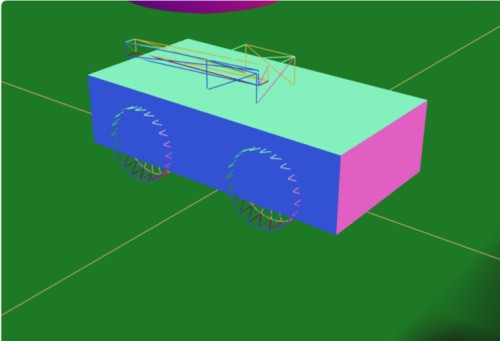

# Three.js Cannon.es 調査資料 - 車に砲台と砲身を付ける

## この記事のスナップショット

[戦車](021/021.html)



[ソース](021/)

動かし方

- ソース一式を WEB サーバ上に配置してください
- 車の操作法
  - カーソル上 .. アクセル
  - カーソル下 .. バック
  - カーソル左、カーソル右 .. ハンドル
  - 'b' .. ブレーキ
  - 'c' .. カメラ視点の変更
  - 'r' .. 姿勢を戻す
  - 'w' .. 砲身の回転（砲身を上げる）
  - 's' .. 砲身の回転（砲身を下げる）
  - 'd' .. 台座の回転（右回転）
  - 'a' .. 台座の回転（左回転）
  - ' ' .. 砲弾の発射
  - マウス操作 .. カメラ位置の変更

## 概要

- 車を戦車にしますします。RaycastVehicle に砲台（回転台）と砲身を付けて、砲身の先頭から砲弾（玉）を発射できるようにします。
- キャタピラは諦めます。
- 砲身が重力に引かれて時間とともに下に下がってきますが、向きを固定することは諦めます。

## やったこと

砲台は　台座と砲身の2パーツ構成とし、
回転を制御する2つのヒンジ
「車と台座のY軸回転（方位角）」と
「台座と砲身のZ軸回転（仰角）」を用意します。

```js
  const moCannonMtr = new CANNON.Material('cannon')
  // 砲身
  const moBarrelShape = new CANNON.Box(new CANNON.Vec3(1.2, 0.1, 0.1))
  const moBarrelBody = new CANNON.Body({
      mass: 0.1,
      shape: moBarrelShape,
      position: new CANNON.Vec3(-1.2, 7, 0),
      // type: CANNON.Body.KINEMATIC,
      // collisionFilterGroup: 0,  // 砲身が車体に埋まらないよう comment out
      material: moCannonMtr,
  })
  world.addBody(moBarrelBody)
  const viBarrelGeo = new THREE.BoxGeometry(2.4, 0.2, 0.2);
  const viBarrelMtr = new THREE.MeshNormalMaterial({wireframe: true});
  const viBarrelMesh = new THREE.Mesh(viBarrelGeo, viBarrelMtr);
  viBarrelMesh.position.copy(moBarrelBody.position);
  viBarrelMesh.quaternion.copy(moBarrelBody.quaternion);
  scene.add(viBarrelMesh);

  // 砲台
  const moBatteryShape = new CANNON.Box(new CANNON.Vec3(0.4, 0.2, 0.4))
  const moBatteryBody = new CANNON.Body({
      mass: 0.2,
      shape: moBatteryShape,
      position: new CANNON.Vec3(0, 5, 0),
      // type: CANNON.Body.KINEMATIC,
      collisionFilterGroup: 0,  // 砲身と砲台が埋まる／重なるように
      material: moCannonMtr,
  })
  world.addBody(moBatteryBody)
  const viBatteryGeo = new THREE.BoxGeometry(0.8, 0.4, 0.8);
  const viBatteryMtr = new THREE.MeshNormalMaterial({wireframe: true});
  const viBatteryMesh = new THREE.Mesh(viBatteryGeo, viBatteryMtr);
  viBatteryMesh.position.copy(moBatteryBody.position);
  viBatteryMesh.quaternion.copy(moBatteryBody.quaternion);
  scene.add(viBatteryMesh);

  // 車体と砲台をヒンジ（旋回方向）でつなぐ
  const moVehicleCannonBatteryConst = new CANNON.HingeConstraint(moChassisBody, moBatteryBody, {
      axisA: CANNON.Vec3.UNIT_Y,
      axisB: CANNON.Vec3.UNIT_Y,
      pivotA: new CANNON.Vec3(0, 0.5, 0),
      pivotB: new CANNON.Vec3(0, -0.2, 0),
  });
  world.addConstraint(moVehicleCannonBatteryConst);
  moVehicleCannonBatteryConst.enableMotor();

  // 砲台と砲身をヒンジ（仰角方向）でつなぐ
  const moVehicleCannonBarrelConst = new CANNON.HingeConstraint(moBatteryBody, moBarrelBody, {
      axisA: CANNON.Vec3.UNIT_Z,
      axisB: CANNON.Vec3.UNIT_Z,
      pivotA: new CANNON.Vec3(0, 0, 0),
      pivotB: new CANNON.Vec3(1, 0, 0),
  });
  world.addConstraint(moVehicleCannonBarrelConst);
  moVehicleCannonBarrelConst.enableMotor();
```

砲身の制御には w, s, a, d を用い、
砲弾を発射する場合は、スペース（' '） を用いることにします。
発射過程は、砲身の先に玉を置いて、砲身の方向に力を加えます。

```js
  document.addEventListener('keydown', (event) => {
    switch (event.key) {
      ...
      case 'w':
        // 砲身の回転（仰角方向）を進める
        moVehicleCannonBarrelConst.setMotorSpeed(1);
        break
      case 's':
        // 砲身の回転（仰角方向）を進める
        moVehicleCannonBarrelConst.setMotorSpeed(-1);
        break
      case 'a':
        moVehicleCannonBatteryConst.setMotorSpeed(-1);
        break
      case 'd':
        // 台座の回転（方位方向）を進める
        moVehicleCannonBatteryConst.setMotorSpeed(1);
        break
      case ' ':
        // 砲身の先に玉を作成・発射
        const radius = 0.1;
        const moBulletMtr = new CANNON.Material({name: 'Bullet'});
        const moBulletBody = new CANNON.Body({
            mass: 1,
            shape: new CANNON.Sphere(radius),
            position: moBarrelBody.position.vadd( moBarrelBody.quaternion.vmult(new CANNON.Vec3(-1.5, 0, 0)) ),
            material: moSphereMtr
        });
        world.addBody(moBulletBody);
        const viBulletGeo = new THREE.SphereGeometry(radius);
        const viBulletMtr = new THREE.MeshNormalMaterial();
        const viBulletMesh = new THREE.Mesh(viBulletGeo, viBulletMtr);
        scene.add(viBulletMesh);
        moBullets.push(moBulletBody);
        viBullets.push(viBulletMesh);
        moBulletBody.applyImpulse(moBarrelBody.quaternion.vmult(new CANNON.Vec3(-100, 0, 0)));
        break
```

照準の代わりに、「砲身の視点」を加えます。

```js
      } else if (cameraPosi == 3) {
          // 砲身／照準の視点
          //   カメラ位置は砲台のちょっと上
          var vposi2 = moBatteryBody.position;
          camera.position.set(vposi2.x, vposi2.y+1, vposi2.z);
          //   カメラ視点(lookAt)は砲身の延長上 100先に
          camera.rotation.z = 0;
          var vposi3 = moBarrelBody.quaternion.vmult(new CANNON.Vec3(-1000, 0, 0));
          camera.lookAt(new THREE.Vector3(vposi3.x, vposi3.y, vposi3.z));
```

## 実行

いい感じに戦車っぽいですが、砲身が下がってくるのがちょっと。  
まぁこれはこれでゲームっぽくてよいのかな？  
一応固定できないかと重量いじったり、摩擦をいじったり、
反対側におもりをつけてみたりしてみましたが、
上手くいかずにあきらめました。

次は車をショベルカー（アーム2節とバケット）にチャレンジします。

------------------------------------------------------------

前の記事：[車をトラック、コンテナ付に](020.md)

次の記事：[車をショベルカー(アーム２節とバケット)に](022.md)

目次：[目次](000.md)

この記事には次の関連記事があります。

- [車をトラック、コンテナ付に](020.md)
- [車に砲台と砲身を付ける](021.md)
- [車をショベルカー(アーム２節とバケット)に](022.md)

--