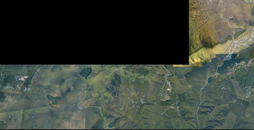
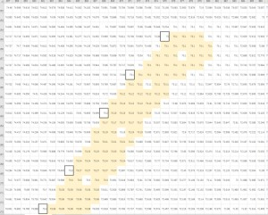
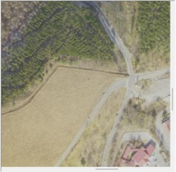
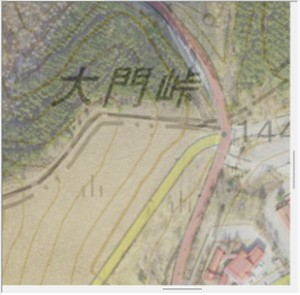
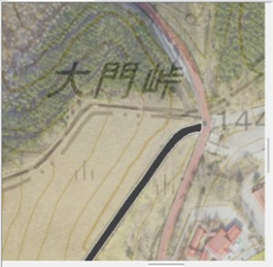
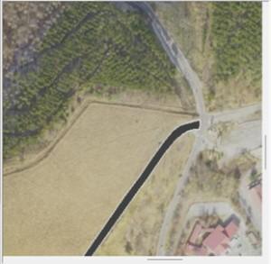
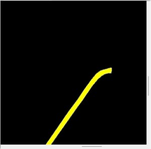
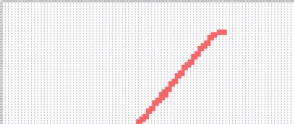
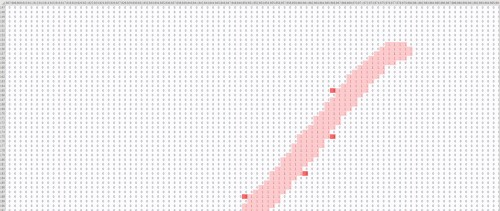
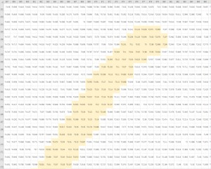

# Three.js Cannon.es 調査資料 - 地図データの加工

## この記事のスナップショット

写真（テクスチャ）の結合



整地した標高データ



## 概要

- ビーナスライン／それなりの区間を走ろうと思ったら地図をつなげるしかない
  という結論のもと、
  ダウンロードしたデータを結合して、大きな 1 つのデータを作成します。
  - 一枚絵の利点として起動時に読み込むだけで扱いが簡単な一方、
    使用メモリが多いという欠点があります。
- データ加工の主な指針として、
  国土地理院様からダウンロードした 3D データ（メッシュとなる標高データとテクスチャの画像）
  を隣接させて 1つの大きなデータにします。
- テクスチャ画像
  - テクスチャ画像には淡色地図（地名、道路、等高線などが書き込まれた地図）と
    写真（航空写真／衛星写真）の 2種類があります。
  - 淡色地図だけでも十分楽しめるのですが、写真を使うとより臨場感が増します。
    最近はもっぱら写真を使うのですが、はっきりと道路が写っているわけではないので
    淡色地図の道路情報をもとに、写真に道路の白線を引き直して使います。
  - 画像を結合する際、隣接する画像の重なり具合を確認しながら、
    ピクセル単位で調整してつなげます。
- 標高データ
  - 標高データは精度が 1/8、画像の 8 ピクセル分に対して標高 1 エッジ分（隣接する 2点間）に相当します。
  - 標高データをそのまま使うと凹凸の起伏が思ったよりも激しく走りづらいため、道路部分を整地します（なだらかになるよう高さを調整します）。
  - 整地するといっても、道路部分に該当する情報は単色地図の見た目しかないため、画像にレイヤーを重ねて、道路の端の白線を上書きして、道路に該当するパス（領域）を作成します。
  - 道路に該当する領域が抜け出せたら、標高データと重ねるべく 1/8 サイズにして、画像処理の太らせ処理で微調整しつつ、01の「道路データ」を作成します。
  - 道路データと標高データを重ねて、道路部分の標高をなだらかにします。
    キリの良い値の地点を標本地点として、
    隣接する標本地点の間がなめらかに変化するように勾配を付けます。
- 最後にテクスチャ写真と修正した標高データから凹凸地面を作成し、改めて車で試走、整地具合を確認したら完成です。

## やったこと

データ加工の手順

- 国土地理院のサイトから 3D データをダウンロード
  - ダウンロードする対象は、標高データdem.cvs、テクスチャ（淡色地図と写真）の2種の）texture.png
  - 地図を連結させるために、緯度・経度を等幅にずらして取得
    - 倍率17では緯度を .004ずつ、経度を .005 ずつ、
      倍率18では緯度を .008ずつ、経度を .010 ずつずらして取得。
    - ずらし幅は経験的に決めたもので、重ねる際の目印を見つけやすいようある程度幅を持たせつつ、でもできるだけ重ならないようにしたもの。でも連続させる枚数や緯度によって微調整が必要になる。特に緯度方向（縦方向）のズレは顕著なので連結時の微調整は必須。

- 写真修正・道路の明確化
  - 写真と単色地図から「地図と道路（灰色）を重ねたもの（photo.png）」と「道路画像（road.png）」を作成します。
  - 画像編集ソフト（筆者はPictBear利用）で写真と淡色地図を開いてレイヤーを重ねる
    道路の両サイドをなぞり、コースの領域を作ります。
    - 写真のオリジナルに...

      

    - 淡色地図を重ね合わせ

      

    - 道路レイヤーに白線を引いて領域を色付け...

      

    - 写真と道路レイヤーだけを重ねて（淡色地図のレイヤーを消す）、写真（photo.png）に

      

    - 一方で、道路レイヤーの色付けを変更して道路画像（road.png）に

      

- データ変換
  - ダウンロードした標高データ（dem.cvs）の一列データを行列データに並び替えます。
  - 上記の道路画像（road.png）を 1/8 サイズにして道路部分（画素が黄色になっているピクセル）を抜き出して 0/1 道路データに。画像処理の太らせ処理を使って微調整して、やや太くなった道路の 0/1 データを road.cvs として出力します。
  - 太らせ処理は、1/8サイズ化および直行メッシュに対する補正の効果があります。
    - 1/8サイズにするときに端数を切り捨てるため、プラス側の道路が削られたように細くなります。この補足なった分を太らせ処理で補います。
    - 凹凸データは直行メッシュで構成されるため、斜め方向の道路の場合に余分に道路として処理しないと、車で走った時にガタガタします。

    - 当初は車で試走しながら道路データを修正していたのですが、最近は太らせ処理で自動化してます。

      - 太らせ処理前の道路のイメージ

        

      - 太らせ処理後の道路のイメージ

        

- データの連結
  - 緯度経度をずらして取得したデータを隣同士に並べて結合（一枚絵に）します。
    - 取得した地点（緯度）によって重ね合わせ時のズレ幅が異なるようなので取得地点ごとにpixel単位で調整します。
    - 最終的に png から jpg にしてサイズの節約を図ります。品質60の画像でもノイズがいい感じの模様になってくれます。

      

  - 標高データの結合は、画像2048x2048[pixel]に対し標高データ257x257[cell]と精度が 1/8 になっているので多少の誤差は無視する前提です。
  - 標高データがメッシュデータなので高さを示すのに点ではなく線で表されるので +1することに注意します。

- 道路の整地
  - excel 上で標高データ（dem.csv）と道路データ（road.csv）を重ね合わせつつ、
    道路部分の高さを整地します。
    - road.csv の 0/1 フラグを用いて、med.csv のload上のセル書式を変更（強調）します
      - dem.csv を開く -> シート名（dem）
      - road.csv を開く -> シート名（road）
      - dem.csv を開いたシート（dem）上で、

      ```text
      新規ルールを作成
      「数式を使用して、ルールを決定」
      条件：
      =indirect("road!"&cell("address",a1))=1         << セルを A1 で表現している場合はこちら
      =indirect("road!"&cell("address",RC), false)=1  << セルを RC で表現している場合はこちら
      書式：
      セルを塗りつぶす（色は適当）
      ```

      

  - 整地のテクニック
    - 道路上の数値的な区切りを標本地点としてマーキング
    - 標本地点の間を高低差がが滑らかに変化するように、値を書き換えていく。
    - 斜め方向の増減は注意
      - メッシュの形状上、斜め方向の増減はアラが目立ちやすい（凸凹しやすい）
      - 斜め方向よりも、縦方向もしくは横方向で勾配を付けた方がメッシュ的に滑らかに
    - 整地には広域な視野も必要（狭所で均すより、広域で均す必要あり）
    - コーナーでバンクを付ける（外側を高く、内側を低く）のは避けたほうが吉。失敗しやすい。

      

- cannon用整形
  - テクスチャ、標高データの縦横の長さが同じになるように、長辺に合わせて拡大、正方形にします。
  - 縦横に差があると短い軸の範囲でしか物理エンジンが動作しない仕様で、
    長辺に合わせて正方形になるよう拡張します。

- 凹凸地面で試走（最終確認）
  - テクスチャ（写真）と標高データの凹凸地面を走ってみて、最終確認します。
  - 最近は excel 使って標高データの隣接（縦方向同士、もしくは横方向同士）の差分を可視化して、
    急に差分が大きくなっているところを確認して修正してます。
    （試走も悪くないけど流石に何度も走っていると飽きます）

## 雑感／こぼれ話

- 太らせ処理せずに道路を整地していたころ、道路整地後にテクスチャと合わせてみるとやたら凸凹します。  
  道路の検出部分を余分に整地していたのに。
  道路（cvs）と淡色地図で凹凸地面を走ってみると、
  道路部分にずれがあり、全然整地できていないことに気が付きました。
  原因は1/8縮小時の影響とメッシュ構造に起因するものでした。
  以降、道路画像（road.png）と道路データ（road.csv）の凹凸地面を試走して確認することにしたけれど、それでも何度も同じような操作を繰り返すことになるので、画像処理技術の太らせ処理で自動化することにしました。

- 結合で一枚絵を作る際の微調整を知らなかったころ、
  淡色地図上の道路と整地した標高データがどうしてもズレてました。  
  結果、地図の重なり具合が違うことから、結合時のギャップの処理がおかしことが判明。
  緯度によって細かく調整する必要がありました。
  メルカトル図法の地図なので緯度によって長さが変わるのは知っていたけど、存外影響するものらしいです。

- 写真を使わずに淡色地図で満足していたころ、試しに写真にしたときの臨場感といったら。  
  淡色地図では雪原を走っているようで、それはそれで楽しかったけど。  
  しかし、写真テクスチャはそのまま使うと道路がわかりません。
  風景にまぎれたり、木陰や山影で暗く見えなかったりします。
  仕方なく淡色地図を元に道路をおこしてレイヤーを重ねることにしました。
  結果、道路画像を作ることにもなるので無駄ではなかったけれども。

- 国土地理院の淡色地図と写真上の道路を見比べると明らかにズレまくている地域があります。  
  倍率の大きな淡色地図だと随所にみつかり、やたら幅広でズレた位置に線が引かれています。
  淡色地図上の道路が使えないから、写真見ながら道路をおこす羽目になりました。
  やたら道路の幅が広くて変だなぁとは思ってたけど。しかし整地する前に気づきたかった。

- 何度もやり直していると気が滅入ります。  
  ちょっと気持ち立て直すために「熱海ゴースト」の整地をやってみました。  
  試走していると、市街地が平坦すぎて草原を走っているみたいな感じになりました。
  建物をマーキングして、適当に高さを付けてみたら、今度は渓谷の谷底を走ってる気分になります。
  まぁ航空写真のテクスチャ使って無理やり建物を表現しようとしたらそうなるよねってオチでした。
  - (2024/11/06追記)  
    国土交通省のG空間情報センターに3D都市モデル(Project PLATEAU)があり、そこに熱海市もあり。
    これを使えば街中を走る風にできるみたい。やり方は要調査ですが。

- 地図の倍率に関して
  - 一枚絵なら倍率18ぐらいが限界な印象です。コースが狭ければ19倍でもいけるんですが。
  - 倍率19
    - メッシュが細かい
    - good: 道路に正確に表現（ヘアピンカーブでも安心）
    - bad : 整地が大変（修正対象が広い）
    - bad : 広域が対応できない、分割も必要
  - 倍率18
    - good: 淡色地図が真っ白に（書き込みが少なく利用しやすい反面、情報が少なすぎて分かりにくいことも）
    - good: やや幅広なヘアピンカーブならギリ利用可能
  - 倍率17
    - メッシュが大きい
    - good: 広域を網羅できる
    - good: 整地がやや楽
    - good: 淡色地図で幹線道路が色分け
    - bad : 地図が粗くて、隣とつながりやすい（ヘアピンカーブで干渉しまくり）
    - bad : 傾斜が粗くなりがち（凸凹が急に変化）

- かかる時間は、ビーナスラインのセクション 1 （倍率17）で約 4日くらい。
  意外と時間がかかってる。
  - 3D データのダウンロードと道路の線引き（ 1日）
  - 道路幅の修正（ 1~2日）
  - 道路の整地（ 1日）
- 倍率が 1つ上がると、長さは 2倍、面積は 4倍になり、手間が指数的に増える。

------------------------------------------------------------

前の記事：[車をショベルカー(アーム２節とバケット)に](022.md)

次の記事：[ビーナスライン走ってみた](024.md)

目次：[目次](000.md)

この記事には次の関連記事があります。

- [テクスチャ(画像)を貼る](006.md)
- [凹凸地面 にテクスチャを貼る(2)／国土地理院の3Dデータ対応](011.md)
- [地図データの加工](023.md)
- [ビーナスライン走ってみた](024.md)

--