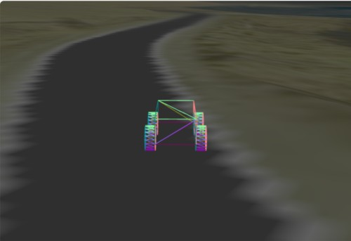

# Three.js Cannon.es 調査資料 - ビーナスライン走ってみた

## この記事のスナップショット

・[ビーナスラインーセクション1：大門峠～霧ヶ峰](024/024_venusS1.html)  
・[ビーナスラインーセクション2：霧ヶ峰～和田峠](024/024_venusS2.html)  
・[ビーナスラインーセクション3：和田峠～落合大橋](024/024_venusS3.html)  
・[ビーナスラインーセクション4：落合大橋～美ヶ原～](024/024_venusS4.html)  
・[熱海ゴースト](024/024_mfg5.html)

セクション1 ：大門峠から少し進んでふりかえり（右上に白樺湖）

セクション4　：美ヶ原を超えてからの下り（ダウンヒル）

[ソース](024/)

動かし方

- ソース一式を WEB サーバ上に配置してください
- 車の操作法
  - カーソル上 .. アクセル
  - カーソル下 .. バック
  - カーソル左、カーソル右 .. ハンドル
  - 'b' .. ブレーキ
  - 'c' .. カメラ視点の変更
  - 'r' .. 姿勢を戻す
  - マウス操作 .. カメラ位置の変更
  - '1' .. 車変更：FR低出力（デフォルト）
  - '2' .. 車変更：FR高出力
  - '3' .. 車変更：FF低出力
  - '4' .. 車変更：FF高出力
  - '5' .. 車変更：4WD低出力
  - '6' .. 車変更：4WD高出力

## 概要

対象はビーナスラインの一部。
一部でもコースが長いので4分割します。

- セクション1：大門峠～霧ヶ峰（倍率17）
- セクション2：霧ヶ峰～和田峠（倍率17）
- セクション3：和田峠～落合大橋（倍率17）
- セクション4：落合大橋～美ヶ原～（倍率18）

倍率は地図の拡大率を指します。
倍率17ではヘアピンカーブを整地すると隣接する道路の凹凸が干渉してしまいます。
ヘアピンの多いセクション4ではギリギリ道路が離れる倍率18で作成しています。

あと、車モデルをクラス化して FR（ボディがワイヤーフレーム）, FF（ボディが赤色）, 4WD（ボディが白） に派生、
また低出力の車（扱いやすさを重視）と高出力の車（スピード・パワフルさを重視）を用意してます。
詳細は次の記事にて説明します。

## やったこと

### コースについて

前回の記事の「地図データ加工」で道路を整地します。

セクション4については淡色地図の道路と写真の道路がかなりズレていたので、
道路を引き直すことをしました。

最終的に標高データの整地とテクスチャの写真とが一致していると思いますが、
坂の勾配、アップダウンについては「実際の道路とは違う」と言われるかもしれません。
数値だけを見て想像で、かつ適当に整地しているのでご容赦を。

熱海ゴーストはモチベ回復のための息抜きです。
整地が楽しくてもさすがに何度もやりなおすと流石につらいのですよ。

### 公開にあたり

ソースを github に格納するにあたり、容量の制限（500MB以下）の事情により以下の操作を行ってます。

- 画像を png から jpg に
- 標高データを テキスト（csv 形式）からバイナリに（詳細は別記事で）

## 雑感

- 楽しー
  - 高低差があって景色が最高！
  - セクション1, 2は風景を楽しむ余裕があります。
    セクション3, 4はわき見していると谷底に落ちます。いや、割りと本気で。
  - 淡色地図では雪景色の中を走ってる感じでしたが、写真にしたことで臨場感がましましで正解でした。
  - 標高の倍率を上げるとアップダウンや渓谷の感じが出てよいですが、整地の粗が目立って残念なことになるので５倍に抑えてます。実際にはこんなに高低差がないのかもしれませんが、ここは私の好みで決めてます。

- 地図について
  - 背景／そらが真っ黒なので、ナイトランっぽくなってます。
    快晴のテクスチャを貼るなりすればよいのですけどね。
  - 道幅がせまい！と感じる方は地図を大きく（024_setting_*.js の lengthX を大きく）するとよいです
  - 地図データがデカーい。そのせいで処理がおもーい。
    - JavaScript側(024_setting_*.js)のフレームレート(timeStep)を 1/60[/sec]を1/45とか 1/30にするとよいかも。
    - ブラウザのフルサイズ表示をやめて小さなウィンドウで表示するのもよさげです。
  - 整地が若干甘く、少々雑な気がします。とくにヘアピンカーブで。
    でも地図の倍率が小さいとどうしても雑になりがち。
  - 標高データは面なので、トンネルや立体交差は表現できないし、
    市街地のビル群の表現も無理。ちょっと残念。
  - やっぱり連続して走りたいよね。
    - Heightfield の都合で正方形のデータでしか受け付けないので、
      ロングコースはどうしてもデータサイズが大きくなりがち。
    - マップを分割して表現できるようになれば、
      倍率の大きなマップで、かつビーナスラインの全コースも視野に入りそう。

- 車について
  - 車のグラフィックが雑なのはご愛敬。front view では関係ないので（笑
  - 1速オートマのゴーカート仕様なのでスタート時の加速がもたつく感じです。
    一方で最高速のリミットがなくどこまでも加速する感じでちょっと怖い（コントロールできない）。
  - 前進中にハンドルを切りながらバックにいれるとドリフトする不思議仕様。
  - ABS（アンチロック・ブレーキシステム）なんて付いてません。
    急ブレーキし続けるとスピンするのでポンピングブレーキは必須。

- 総括
  - まぁいい感じに仕上がったのではないでしょうか？（自画自賛ｗ）
  - ゲーム感覚で走っていると小さな凹凸でジャンプしてスピンしたり、
    ライン際の凸凹でぶつかったり、
    まれに整地し忘れてたり（汗）なので
    クオリティーに関してはレースゲームと比べるまでもないです。
    もともとレースゲームに適したメッシュではないので、あくまでドライブ感覚を楽しむ程度で。
  - 間違っても公道で暴走行為をしないでください。

次は車のカスタマイズ、「javascript でのクラス・派生」について

------------------------------------------------------------

前の記事：[地図データの加工](023.md)

次の記事：[javascript でのクラス・派生](025.md)

目次：[目次](000.md)

この記事には次の関連記事があります。

- [テクスチャ(画像)を貼る](006.md)
- [凹凸地面 にテクスチャを貼る(2)／国土地理院の3Dデータ対応](011.md)
- [地図データの加工](023.md)
- [ビーナスライン走ってみた](024.md)

--