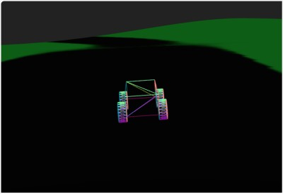

# Three.js Cannon.es 調査資料 - マップ分割（２）凹凸地面

## この記事のスナップショット

[凹凸マップの分割(分割データ自動生成版)](027/027a.html)

[凹凸マップの分割(分割ファイル読み込み版)](027/027b.html)

走行中スナップショット


[ソース](027/)

動かし方

- ソース一式を WEB サーバ上に配置してください
- 車の操作法
  - カーソル上 .. アクセル
  - カーソル下 .. バック
  - カーソル左、カーソル右 .. ハンドル
  - 'b' .. ブレーキ
  - 'c' .. カメラ視点の変更
  - 'r' .. 姿勢を戻す
  - マウス操作 .. カメラ位置の変更
  - '1' .. 車変更：FR低出力
  - '2' .. 車変更：FR高出力
  - '3' .. 車変更：FF低出力
  - '4' .. 車変更：FF高出力
  - '5' .. 車変更：4WD低出力
  - '6' .. 車変更：4WD高出力

## 概要

どうにか大きなサイズの地図上を走らせたい！という一念で、
マップの分割表示にチャレンジします。

最終目標は、国土地理院の3Dデータを分割して表示することになります。

今回はその第二弾として「凹凸地面」にチャレンジです。

- 凹凸形状を正弦波で自動生成した場合
- 凹凸形状を予めcsvファイルとして作成しておき、ファイルの読み込み

の二種類を比べます。

## やったこと

平面地図を 10x10 のブロックに分割して、
常に表示するブロックは 5x5 とします。

中心のブロックに自車を配置して、中心のブロックからはみ出たら、
（中心のブロックに収まるよう）自車を１ブロック分反対方向に瞬間移動させます。

なお、端は周期的境界として、反対側のブロックを用います。

（ここまでは前回と同じ）

一方で
表示している 5x5 ブロック（ **テクスチャと凹凸形状** ）は進行方向に車が進んだように１ブロックずらします。
対象が、前回のテクスチャのみから、テクスチャと凹凸形状に変更になります。

こちらでも地図データ（テクスチャおよび凹凸形状）をキャッシュ化してメモリコピーしたかったのですが、
ハマってしまい、泣く泣く全データをロードし直すことをしています。

凹凸形状をブロックごとに自動作成している関数 createDem() で構築する版と、
事前に作成した凹凸形状をcsv 化しておいて loadDemCVS() で読み込む版でパフォーマンスの違いを確認します。

```js
function createDem(demw, demh, iniW, iniH, sinPeriodW, sinPeriodH, ampHigh, ampHighAdj) {
  var matrix = [];
  var vzmax = ampHigh + ampHighAdj;
  {
    var ih = iniH;
    for(let iz = 0; iz <= demh; ++iz){
      var tmprow = [];
      var iw = iniW;
      for(let ix = 0; ix <= demw; ++ix){
        var height = Math.cos((iw / sinPeriodW) * Math.PI * 2) * Math.cos((ih / sinPeriodH) * Math.PI * 2) * ampHigh + ampHighAdj;
        tmprow.push(height);
        ++iw;
      }
      matrix.push(tmprow);
      ++ih;
    }
  }
  // matrix のZ軸を入れ替え
  ...
}
```

loadDemCVS() は国土地理院の3Dデータ描画に含まれる JavaScript の CSV 読み込みルーチンと
ほぼ同じなので紹介は割愛します。

## 実行

3D形状（凹凸地面）になっても、凹凸を自動生成している版は、わずかにひっかかっている感じはしますが、そん色なく動いているように思います。

一方で csv ファイルで読み込む版は、よりタイムラグが感じるようになりましたが、我慢できないほどではない感じでしょうか。

------------------------------------------------------------

前の記事：[マップ分割（１）平面](025.md)

次の記事：[マップ分割（３）３Ｄデータ](028.md)


目次：[目次](000.md)

この記事には次の関連記事があります。

- [マップ分割（１）平面](026.md)
- [マップ分割（２）凹凸地面](027.md)
- [マップ分割（３）３Ｄデータ](028.md)

--