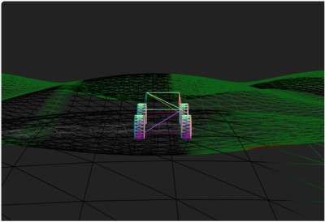

# Three.js Cannon.es 調査資料 - 標高データ（テキスト）のバイナリ化

## この記事のスナップショット

- [float32化](029/029_1.html)
- [int16化(1/1000精度)](029/029_2.html)
- [int16化(1/100精度)](029/029_3.html)

走行中スナップショット


[ソース](029/)

動かし方

- ソース一式を WEB サーバ上に配置してください
- 車の操作法
  - カーソル上 .. アクセル
  - カーソル下 .. バック
  - カーソル左、カーソル右 .. ハンドル
  - 'b' .. ブレーキ
  - 'c' .. カメラ視点の変更
  - 'r' .. 姿勢を戻す
  - マウス操作 .. カメラ位置の変更

## 概要

githubの容量制限により テキストデータ（csv）のままでは格納できない！
ということでデータをバイナリ化してデータ量を削減しました。

## やったこと

### データ形式

テキストデータで記載された標高データ（浮動小数値）をデータの精度はそのままにバイナリ化（float32の４バイト）しました。
もともとテキスト／CSV形式で、16~17桁（18バイト）で表現されていたものが４バイトになるので 1/4 サイズになるわけです。
（テキストのまま、小数点以下４桁目以降を削ってもよい気がしますがまぁそこはｗ）

```csv
4.938441702975689,4.830524903129439,4.511490985586231,...
4.755282581475767,4.651368247881781,4.344166802114168,...
4.455032620941839,4.357679469365098,4.069874814511029,...
```

さらに uint16の２バイトでの表現でもチャレンジしました。
標高データにマイクロメートル単位の精度は要らないよねという発想で大胆に精度をカットます。

具体的には、最小値を別途記録しておき、最小値との差分を 1000倍して小数点以下を切り捨てて uint16 にします。
つまり、1/1000 の精度で [0, 65.535] の範囲の凹凸としてデータ化します。
unit16では float32の半分のデータサイズになります。
凹凸の範囲がなだらかなら十分におさまるだろうという目論見です。

さらに同じ uint16で、1/100の精度で [0, 655.35] の範囲のフォーマットも確認しました。
こちらは精度を犠牲にして、より広い範囲をカバーすることを目的としたものです。

ちなみにバイナリ化は python で行ってます。

```py:test_create_dem.py
        # 全データ（一枚絵）出力 バイナリ
        fmtPack = "<f"
        fpath = f"test_demTotal.bin.f32"
        with open(fpath, "wb") as fobj:
            binBody = b""
            for line in demTotal:
                for v in line:
                    binBody += struct.pack(fmtPack, v)
            fobj.write(binBody)
```

### JavaScriptでのバイナリデータ読み込み

今までテキストファイルの読み込みに XMLHttpRequest()を使って、同期処理で読み込んでました。

```js:旧来のテキストを読み込むコード
        var xhr = new XMLHttpRequest();1
        xhr.addEventListener('load', function(evt) {
            vSceneMesh = (evt.target.response || evt.target.responseText).replace(/\n/g, ",").split(",");
            ...
        }, false);
        xhr.open('GET', Dem, false);  // 三番目にfalseで, 同期処理に
        xhr.send(null);
```

これをバイナリに適用して使うべくarraybuffer を指定して、同期処理で使いたかったのですがエラーになります。

```js:失敗
    var xhr = new XMLHttpRequest();
    xhr.responseType = 'arraybuffer';
    xhr.addEventListener('load', function(evt) {
        let ressponse = evt.target.response;
        let view = new Float32Array(ressponse);
        ...
    }, false);
    // xhr.open('GET', Dem, false);  // 三番目にfalseが指定できない！エラーに!!
    xhr.open('GET', Dem);
    xhr.send(null);
```

仕方ないので fetch と await を使って、同期処理させます。

```js:バイナリを読み込む版
async function loadDemBINcore3(Dem, demw, demh, ampHigh) {
  const res = await fetch(Dem);
  const arrayBuffer = await res.arrayBuffer();
  let view = new Float32Array(arrayBuffer);
  ...
}
```

## 実行

精度的に誤差のない float32版では違和感がないのは当然として、
精度を落とした int16版でもそん色ない感じでした。

ただ、これを実際のビーナスラインS1のデータに適応させたところ、
標高の範囲的に uint16 の 1/100精度もしくは float32しか適用できませんでした。
uint16の版で走ってみると車が前後にヘッドバンキングする現象がみられ、ちょっと残念な結果に。

ということで以前の記事で紹介しているコースはすべて float32 でバイナリ化してます。


あと今回は一枚絵ということで関係ないのですが、
async/awaitを使うために window.onload に async を付けること（非同期処理）になったことで、
マップ分割時の地図データ更新でハマるのですが、これは次の記事で。

------------------------------------------------------------

前の記事：[マップ分割（３）３Ｄデータ](028.md)

次の記事：[非同期処理時の地図データ更新](030.md)


目次：[目次](000.md)

この記事には次の関連記事があります。

- [標高データ（テキスト）のバイナリ化](029.md)
- [非同期処理時の地図データ更新](030.md)

--