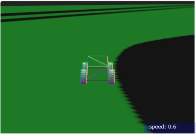
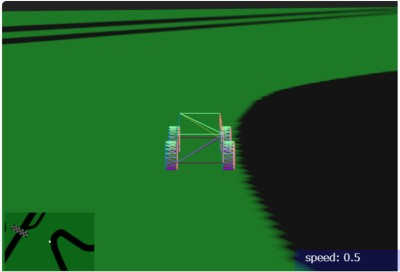
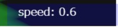
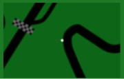

# Three.js Cannon.es 調査資料 - スピードメーターとコース地図の表示

## この記事のスナップショット

・[スピードウィンドウあり](031/031a.html)  
・[コース地図とスピードのウィンドウあり](031/031b.html)  

スピードウィンドウあり版  


コース地図とスピードのウィンドウあり版  


[ソース](031/)

- ソース一式を WEB サーバ上に配置してください
- 車の操作法
  - カーソル上 .. アクセル
  - カーソル下 .. バック
  - カーソル左、カーソル右 .. ハンドル
  - 'b' .. ブレーキ
  - 'c' .. カメラ視点の変更
  - 'r' .. 姿勢を戻す
  - マウス操作 .. カメラ位置の変更
  - '1' .. 車変更：FR低出力（デフォルト）
  - '2' .. 車変更：FR高出力
  - '3' .. 車変更：FF低出力
  - '4' .. 車変更：FF高出力
  - '5' .. 車変更：4WD低出力
  - '6' .. 車変更：4WD高出力

## 概要

次の記事の布石（エンジンの挙動を確認）として、スピードメーター（デジタル）を表示します。

さらにウィンドウ表示関連として、コース地図（トップビュー：上空から見下ろした視点）を表示します。

## やったこと

物理モデル RaycastVehicle には属性に currentVehicleSpeedKmHour があるので、
これを走行画面に重ねて表示します。

html 側に スピードメーター表示用の canvas を用意します。

```html:031a.html
<body>
...
<canvas id="speedCanvas" style="position:fixed; bottom:25px; right:20px; width:200px; height:40px; z-index: 100; background-color:rgba(0,0,255, 0.2);"></canvas>
</body>
```

javascript 側で 上記のHTML要素を取り出し、2Dコンテキストとして、文字列を表示させます。

```js:031a.js
function setSpeed(speed) {
    const canvas = document.getElementById('speedCanvas');
    const ctxspd = canvas.getContext('2d');
    canvas.width = 200;
    canvas.height = 40;
    ctxspd.font = '20px bold sans-serif';
    ctxspd.textBaseline = 'alphabetic';
    ctxspd.textAlign = 'start';
    ctxspd.fillStyle = 'white';
    ctxspd.fillText("speed: "+speed, 20, 22);
};
```

スピードメータの表示例  



さて、スピードメーターのウィンドウを重ねられるなら、
同様にコース地図（トップビュー：上空から見下ろした視点）も重ねられるよね！
ということでやってみました。

トップビューについては
「Three.js Cannon.es 調査資料 - オフライン化（ライブラリのローカル配置）」
で記事にしてますが、さらに引き（より上空から）の視点とします。

html 側に コース地図用の canvas を用意します。

```html:031a.html
<body>
...
<canvas id="mapCanvas" style="position:fixed; bottom:25px; left:5px; width:25%; height:25%; z-index: 101; background-color:rgba(0,255,0, 0.2);"></canvas>
</body>
```

javascript 側では コース地図用の カメラ、シーン、レンダラーを用意します。

```js:031b.js
function setupWorld2() {
  var camera2;
  var scene2;
  var renderer2;
  {
    const width = window.innerWidth/4 - 24;
    const height = window.innerHeight/4 - 24;

    // Camera
    camera2 = new THREE.PerspectiveCamera(24, width / height, 5, 2000)

    camera2.position.set(0, 20, 30)
    camera2.lookAt(0, 0, 0)

    // Scene
    scene2 = new THREE.Scene()

    // Renderer
    const canvasElement = document.querySelector("#mapCanvas");
    renderer2 = new THREE.WebGLRenderer({ canvas: canvasElement, antialias: true })
    renderer2.setSize(width, height);
    renderer2.shadowMap.enabled = true
    renderer2.shadowMap.type = THREE.PCFSoftShadowMap

    // Lights
    const ambientLight = new THREE.AmbientLight(0xffffff, 0.2)
    scene2.add(ambientLight)

    const directionalLight = new THREE.DirectionalLight(0xffffff, 0.15)
    directionalLight.position.set(-30, 10000, 30)
    directionalLight.target.position.set(0, 0, 0)
    scene2.add(directionalLight)
  }

  return {camera2, scene2, renderer2};
}
```

コース地図用のシーンに、車代わりのマーカーと地図を追加します。

```js:031b.js
  // scene2 用の車代わりのマーカー
  const viVehicleMarkerGeo = new THREE.SphereGeometry(3);
  const viVehicleMarkerMtr = new THREE.MeshBasicMaterial({color:0xffffff});
  const viVehicleMarkerMesh = new THREE.Mesh(viVehicleMarkerGeo, viVehicleMarkerMtr);
  scene2.add(viVehicleMarkerMesh);

  const viGround2Geo2 = new THREE.BoxGeometry(grndw*2, 1, grndh*2);
  const texture2 = new THREE.TextureLoader().load('./pic/test_course.png'); 
  const viGround2Mtr2 = new THREE.MeshBasicMaterial({map: texture2, transparent: true, opacity: 0.4});
  const viGround2Mesh2 = new THREE.Mesh(viGround2Geo2, viGround2Mtr2);
  scene2.add(viGround2Mesh2);
```

あとは、メイン画面の描画更新の後に続けて、コース地図用の更新を追加するだけです。

```js:031b.js
  function animate() {
    const timeStep = 1 / 60;
    world.step(timeStep)
    ...
    // メイン画面側のレンダラー
    renderer.render(scene, camera);

    {
      // 左下のスピードメーター欄　更新
      var speed = vehicle.getSpeed();
      speed = parseInt(speed*10)/10.0;
      setSpeed(speed);
    }
    {
      viVehicleMarkerMesh.position.copy(vposi);

      // 左上　マップ欄　更新
      camera2.position.set(vposi.x, vposi.y + 400, vposi.z);
      camera2.lookAt(new THREE.Vector3(vposi.x, vposi.y, vposi.z));
      var veuler = new CANNON.Vec3(0, 0, 0);
      vquat.toEuler(veuler);
      var viecleRotY = veuler.y + Math.PI / 2;  // X軸負の方向を向いて作成したので、上を向くよう90度ずらす
      camera2.rotation.z = viecleRotY;
      renderer2.render(scene2, camera2);
    }
```

コース地図の表示例  



## 感想

これを応用すれば以下のようなことも...

 - バックミラーで後方の視点を表示
 - 両サイドにななめ前方の視点のシーンを配置して、疑似的に広角でワイドな画面

ちょっと夢が広がるとも思ったけど、バックミラーの小さなウィンドウにはコスパが悪いし、
広角にしたところで運転時には無駄だなぁと思い至った次第。

リプレイ機能をつけて、見せ方の一つに広角やマルチアングルとかはありかな？

------------------------------------------------------------

前の記事：[非同期処理時の地図データ更新](030.md)

次の記事：[ギア（MT）の導入／トルク曲線（エンジン性能曲線）にそった挙動](032.md)


目次：[目次](000.md)

この記事には関連記事がありません。

--