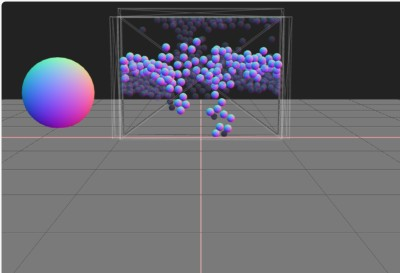

# Three.js Cannon.es - サンドピクチャーもどきを作ってみた（１）

## この記事のスナップショット

サンドピクチャーの試作品  
- [](034/034.html) 

サンドピクチャーの試作品  


[ソース](034/)

動かし方

- ソース一式を WEB サーバ上に配置してください

## 概要

サンドピクチャーっぽいシミュレーションを物理エンジン（cannon）で再現できないかなぁと
考えていて、その試作品を作ってみました。

「自由落下する球」と「上昇する球」を配置しただけです。

## やったこと

example のコンテナのサンプル
[](https://pmndrs.github.io/cannon-es/examples/container)
をみて、これだ！とひらめきました。

球を小さくすれば砂っぽくなるんじゃないか？

上昇する気泡のようなものがあればそれっぽくなるんじゃないか？

というわけでサンプルをもとに試作します。

### コンテナ（ケース）

ケースには６面の板(box)を配置して密閉空間を作成します。
奥行方法は薄っぺらでよかったのですが２～３粒子分の厚みを持たせてみました。

あと板はやや厚みを持たせておきます。これは粒子同士が勢いよくぶつかったときに外に飛び出さないように。

```js:コンテナ（ケース）部分
  // コンテナ（容器
  // コンテナ内の (x,y,z)=(横幅、高さ、奥行)
  const cntnrSizeX = 20; const cntnrSizeY = 15; const cntnrSizeZ = 2.5;
  // 平板の厚み
  const cntnrThick = 1;

  // X軸 正方向の板
  const moCntnrPltXp2Body = new CANNON.Body({
    mass: 0,
    shape: new CANNON.Box(new CANNON.Vec3(cntnrThick_, cntnrSizeY_, cntnrSizeZ_)),
    position: new CANNON.Vec3(cntnrSizeX_+cntnrThick_, cntnrSizeY_, 0),
    material: moCntnrMtr,
  });
  world.addBody(moCntnrPltXp2Body);
  const viCntnrPltXp2Geo = new THREE.BoxGeometry(cntnrThick, cntnrSizeY, cntnrSizeZ);
  const viCntnrPltXp2Mtr = new THREE.MeshBasicMaterial({transparent: true, opacity: 0.1, wireframe: cntnrWireframe});
  const viCntnrPltXp2Mesh = new THREE.Mesh(viCntnrPltXp2Geo, viCntnrPltXp2Mtr);
  scene.add(viCntnrPltXp2Mesh);
  viCntnrPltXp2Mesh.position.copy(moCntnrPltXp2Body.position);
  viCntnrPltXp2Mesh.quaternion.copy(moCntnrPltXp2Body.quaternion);

  ...
```

### 砂

自由落下させる砂もどきの球は、ケース内上部に配置します。
コンテナのサンプルコードを流用しているので、初期位置をランダムで少量ずらしています。

```js:砂部分
  const moSandMtr = new CANNON.Material({name: 'sand', restitution: 0});
  const sndMass = 0.1;
  const sndSizeR = 0.5;
  const sndSizeR2 = sndSizeR*2;
  const sndFillRngYmin = cntnrSizeY*0.6;
  const sndFillRngYmax = cntnrSizeY*0.8;
  var moSandBodyList = [];
  var viSandMeshList = [];
  // 砂 - 充填
  const rndRange = 0.1;
  for (var y = sndFillRngYmin; y < sndFillRngYmax; y+= sndSizeR2) {
    for (var x = -cntnrSizeX_+sndSizeR; x <= cntnrSizeX_-sndSizeR; x+= sndSizeR2) {
      for (var z = -cntnrSizeZ_+sndSizeR; z <= cntnrSizeZ_-sndSizeR; z+= sndSizeR2) {
        var x2 = x + (Math.random() - 0.5) * rndRange;
        var z2 = z + (Math.random() - 0.5) * rndRange;
        const moSandBody = new CANNON.Body({
          mass: sndMass,
          shape: new CANNON.Sphere(sndSizeR),
          position: new CANNON.Vec3(x2, y, z2),
          material: moSandMtr
        });
        world.addBody(moSandBody);
        const viSandGeo = new THREE.SphereGeometry(sndSizeR);
        const viSandMtr = new THREE.MeshNormalMaterial();
        const viSandMesh = new THREE.Mesh(viSandGeo, viSandMtr);
        scene.add(viSandMesh);
        moSandBodyList.push(moSandBody);
        viSandMeshList.push(viSandMesh);
      }
    }
  }
```

### 気泡

上昇させる気泡もどきの球は、ケース内下部に配置します。
こちらも砂と同様に初期位置をランダムで少量ずらしています。

また上昇させるために applyForce() で力を加えておきます。

```js:気泡部分（作成時）
  // 気泡
  const moAirMtr = new CANNON.Material({name: 'air', restitution: 0});
  const airMass = 0.01;
  const airSizeR = 0.4;
  const airSizeR2 = airSizeR*2;
  const airFillRngYmin = cntnrSizeY*0.1;
  const airFillRngYmax = airFillRngYmin + airSizeR2*3;
  const airAppF = new CANNON.Vec3(0, 0.5, 0);
  var moAirBodyList = [];
  var viAirMeshList = [];
  // 気泡 - 充填
  const rndRange2 = 0.1;
  for (var y = airFillRngYmin; y < airFillRngYmax; y+= airSizeR2) {
    for (var x = -cntnrSizeX_+airSizeR; x <= cntnrSizeX_-airSizeR; x+= airSizeR2) {
      for (var z = -cntnrSizeZ_+airSizeR; z <= cntnrSizeZ_-airSizeR; z+= airSizeR2) {
        var x2 = x + (Math.random() - 0.5) * rndRange2;
        var z2 = z + (Math.random() - 0.5) * rndRange2;
        const moAirBody = new CANNON.Body({
          mass: airMass,
          shape: new CANNON.Sphere(airSizeR),
          position: new CANNON.Vec3(x2, y, z2),
          material: moAirMtr
        });
        moAirBody.applyForce(airAppF);
        world.addBody(moAirBody);
        const viAirGeo = new THREE.SphereGeometry(airSizeR);
        const viAirMtr = new THREE.MeshNormalMaterial({transparent: true, opacity: 0.2});
        const viAirMesh = new THREE.Mesh(viAirGeo, viAirMtr);
        scene.add(viAirMesh);
        moAirBodyList.push(moAirBody);
        viAirMeshList.push(viAirMesh);
      }
    }
  }
```

applyForce() を一度きりでは、その後落下します。
なのでアニメーション更新時にも力を加えておきます。

```js:気泡部分（アニメーション時）
  function animate() {
    world.step(timeStep)
    ...

    // 気泡（移動＋力）
    for (var i = 0; i < moAirBodyList.length; ++i) {
      viAirMeshList[i].position.copy(moAirBodyList[i].position);
      viAirMeshList[i].quaternion.copy(moAirBodyList[i].quaternion);
      moAirBodyList[i].applyForce(airAppF);  // 上昇しつづけるよう力を加える
    }

    ...
  }
```

## 感想

「サンドピクチャーなんてどうやって作るの？」な感じだったのですが、
試作品を作ったことで実現性が見えてきました。

次の記事でより「っぽく」します。

------------------------------------------------------------

前の記事：[複数キー押下時のイベントリスナー](033.md)

次の記事：[サンドピクチャーもどきを作ってみた（２）](035.md)


目次：[目次](000.md)

この記事には次の関連記事があります。

- [サンドピクチャーもどきを作ってみた（１）](034.md)
- [サンドピクチャーもどきを作ってみた（２）](035.md)

--