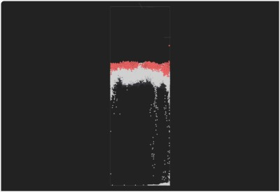

# Three.js Cannon.es - サンドピクチャーもどきを作ってみた（２）

## この記事のスナップショット

サンドピクチャーっぽいもの  
- [](035/035.html) 

サンドピクチャーっぽいもの



[ソース](035/)

動かし方

- ソース一式を WEB サーバ上に配置してください
- パネルの操作法
  - カーソル上、下、スペース .. パネルを180度回転
  - カーソル右 .. パネルを右に10度回転（時計回り）
  - カーソル左 .. ハンドを左に10度回転（反時計回り）

## 概要

サンドピクチャーっぽいシミュレーションを物理エンジン（cannon）で再現できないかなぁと
考えていて、サンドピクチャーもどきを作ってみました。

前回、試作品を作成して手ごたえを感じたので、より「ぽく」していきます。

  - 性質・形状のちがう砂、気泡を用意
  - ケースは薄く、砂、気泡は小さく
  - 砂、気泡を多くする（全体で約3600個）
  - 砂、気泡の動きを緩慢に
  - ケースの回転機能

なぜ「もどき」なのか...それは

- 動きが遅い（重い）
- しま模様の造形にならない
  - 砂の数が少ないことが問題（今でも重いのに桁違いに増やすのは無理）
  - 砂時計の砂が落ちるような状況になりにくい（原因が砂／気泡の数なのか、形状なのか、摩擦なのかよくわからない）
- うごきがおかしい
  - 砂が全部落ちてから、パネルをひっくりかえすと、砂の落ちる速度が気泡より速い
  - 最初に配置した状態でパラメータを合わせすぎている（初期状態以外では上手く動作しない）
- 「流体の動き」はシミュレートして **いない** ので、渦巻くような動きをせずに、自由落下な動きに

## やったこと

試作からよりサンドピクチャーっぽくするために、以下の処理を行ってます。

### 性質・形状のちがう砂、気泡を用意

落下する砂には性質のちがうものを、
上昇する気泡には形状のちがうものを用意しました。

種別      | 形状           | 大きさ           | 摩擦
----------|----------------|------------------|-------
砂（Ａ）  | 球             | やや小さめ       | 滑りやすく落ちにくい
砂（Ｂ）  | 球             | やや大きめ       | 滑りやすく落ちやすい
気泡（Ａ）| 球             | (基準)           | 昇りやすい
気泡（Ｂ）| 直方体（棒状） | 気泡３個分の長さ | 昇りにくい

気泡（Ｂ）の摩擦係数は気泡（Ａ）と同じですが、
形状ゆえにケースとぶつかったときに動きにくくなります。

気泡が１種類（球）だけの場合では「砂時計のように砂が落ちる」状況が再現できなかったのですが、
棒状の形状を追加することで、砂時計に似たような状況が作り出せました。

角材を円柱状にすべきかは悩むところですが、角材であることが動きにくい状況を作り出して、
いい感じに砂が落ちてくれているものと思ってます。

当初、角材がケースの幅に合わせていたために、なぜか動かない状況が発生していました。
想像してみれば簡単なことで、
角材が長軸方向で回転することでケースにひっかかっていたことに気づくまでしばらくかかりました。
なので今はちょっと細めに作成しています。

### ケースは薄く、砂、気泡は小さく

ソースコード上では次のとおり。

```js
  // コンテナ（ケース
  // コンテナ内の (x,y,z)=(横幅、高さ、奥行)
  const cntnrSizeX = 4; const cntnrSizeY = 12; const cntnrSizeZ = 0.11;

  // 砂(A)
  const sandASizeR = 0.03;  // 半径
  const moSandAShape = new CANNON.Sphere(sandASizeR);

  // 砂(B)
  const sandBSizeR = 0.045;
  const moSandBShape = new CANNON.Sphere(sandBSizeR);

  // 気泡(a, b)
  const airSizeR = 0.04;
  // 気泡（a:球）
  const moAirAShape = new CANNON.Sphere(airSizeR);
  // 気泡（b:棒／角材）
  const moAirBShape = new CANNON.Box(new CANNON.Vec3(airSizeR*3, airSizeR/2, airSizeR/2));
```

### 砂、気泡を多くする（全体で約3600個）

初期配置でケース内の空間を埋めるように、グリッド上に配置しています。

このときの個数は次のとおりです。

種別      | 個数
----------|-------
砂（Ａ）  | 3186
砂（Ｂ）  | 308
気泡（Ａ）| 211
気泡（Ｂ）| 62

この個数は砂・気泡のサイズ（初期配置するグリッド間隔）に依存させてます。

### 砂、気泡の動きを緩慢に

液体の中を動いているように見せるために linearDamping を大きくします。
ただ、砂（Ａ）と砂（Ｂ）には落ち方に差をつけたく、
Ａが遅く落ちるように、Ｂがより速く落ちるようにしておきます。

```js
        // 砂(A)
        moSandBody.linearDamping = 0.8;  // def 0.01
```

```js
        // 砂(B)
        moSandBBody.linearDamping = 0.2;  // def 0.01
```

気泡の場合は、空気中の動きより重くする程度で適当に。

```js
        // 気泡
        moAirBody.linearDamping = 0.1;  // def 0.01
```

この措置がないときは砂が素早く落ちるだけでなく、横方向にも動き広がりやすくなり、
自由落下している感じが強くなります。

### ケースの回転機能

ケースをひっくり返す機能は欲しいなぁということで用意しました。

キーバインドでカーソルキー／スペースキーに応じて回転させる関数を呼び出し、

```js
  document.addEventListener('keydown', (event) => {
    switch (event.key) {
      case 'ArrowUp':
      case 'ArrowDoen':
      case ' ':
        var rotDegree = 180;
        rotAllObject(rotDegree);
        break;
      case 'ArrowLeft':
        var rotDegree = 10;
        rotAllObject(rotDegree);
        break;
      case 'ArrowRight':
        var rotDegree = -10;
        rotAllObject(rotDegree);
        break;
    }
  })
```

ケースの中心を原点位置に配置しているので、
回転操作のクォータニオンを砂／気泡の座標にかけ合わせるだけで移動できるようにしてます。

```js
  function rotAllObject(rotDegree) {
    // 砂、気泡（A)は球形なの位置だけを回転
    // 気泡（B)は直方体なので、位置だけでなく、姿勢（向き）も回転させる
    
    // Z軸で回転
    const vrot = rotDegree / 180 * Math.PI;
    // 原点を通る回転軸（Z軸）で回転させるクォータニオン
    const axisZ = new CANNON.Vec3(0, 0, 1);
    const qrot = new CANNON.Quaternion();
    qrot.setFromAxisAngle(axisZ, vrot);

    // コンテナ（ケース）
    moCntnrBody.quaternion.copy(moCntnrBody.quaternion.mult(qrot));
    viCntnrMesh.quaternion.copy(moCntnrBody.quaternion);
    // sand(a)
    for (var i = 0; i < moSandABodyList.length; ++i) {
      moSandABodyList[i].position.copy(qrot.vmult(moSandABodyList[i].position));
      viSandAMeshList[i].position.copy(moSandABodyList[i].position);
    }
    // sand(b)
    for (var i = 0; i < moSandBBodyList.length; ++i) {
      moSandBBodyList[i].position.copy(qrot.vmult(moSandBBodyList[i].position));
      viSandBMeshList[i].position.copy(moSandBBodyList[i].position);
    }
    // air(a)
    for (var i = 0; i < moAirABodyList.length; ++i) {
      moAirABodyList[i].position.copy(qrot.vmult(moAirABodyList[i].position));
      viAirAMeshList[i].position.copy(moAirABodyList[i].position);
    }
    // air(b)
    for (var i = 0; i < moAirBBodyList.length; ++i) {
      moAirBBodyList[i].position.copy(qrot.vmult(moAirBBodyList[i].position));
      moAirBBodyList[i].quaternion.copy(qrot.mult(moAirBBodyList[i].quaternion));
      viAirBMeshList[i].position.copy(moAirBBodyList[i].position);
      viAirBMeshList[i].quaternion.copy(moAirBBodyList[i].quaternion);
    }
  }
```

## 感想

砂の数が少ないためか、「サンドピクチャー」のような綺麗な「しま模様」を再現することができませんでした。
けれど、砂時計っぽい動きは再現できたといっていいのかな？

個数の調整は難しく、多すぎると処理が重くなり動作が遅く、場合によってはフリーズしたり、メモリ不足になりました。
そうでなくても砂が増えることで、気泡とのバランスが崩れ、
早く落ちすぎたり、逆に砂が気泡に持ち上げられてしまったり。
個数をいじると、質量をいじったり、摩擦係数をいじったりと沼にハマります。

なんとか見れる範囲のものに落ち着いたところで、ケースの回転機能を入れ、
試したところで愕然というか力尽きました。
砂が落ち切ったところでケースを回転すると、今度は砂の落ちる速さと気泡の昇る速さのバランスが悪く、砂と気泡の均衡がとれずに崩れるだけに。
初期配置でのパラメータ調整に力を入れすぎて全体のバランスに欠けていたようです。

babylon.js の流体のデモ動画をみて期待していただけにちょっと残念な結果になりました。
babylon.js でやったらもっとスムーズに動く、、のかな？
というか 2D でいんじゃないかと思わなくもないです。

しかし、シミュレーションですら四苦八苦したのに、
これを実際に作り上げたアーティストはすばらしいですね。

------------------------------------------------------------

前の記事：[サンドピクチャーもどきを作ってみた（１）](034.md)

次の記事：[スロープトイ：コース編](036.md)


目次：[目次](000.md)

この記事には次の関連記事があります。

- [サンドピクチャーもどきを作ってみた（１）](034.md)
- [サンドピクチャーもどきを作ってみた（２）](035.md)

--