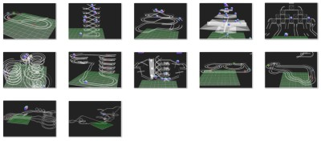
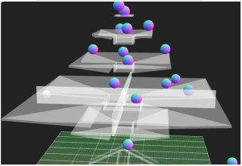

# Three.js Cannon.es - スロープトイ：コース編

## この記事のスナップショット

スロープトイ



[ソース](036/)

動かし方

- ソース一式を WEB サーバ上に配置してください
- 操作法
  - 'c' .. カメラ視点の変更
    - 俯瞰（ふかん）：遠方から
    - ボール目線
    - ボールの周りを自動で周回
    - ボールの周りを自動で周回＋上下にアップダウン
    - 俯瞰（すべりまくり）
  - 'r' .. カメラ視点のリセット(俯瞰表示のリセット用)
  - 'n' .. 対象のボールを変更
  - 'd' .. 対象のボールのリセット（ソース位置に再ポップ）

## 概要

物理エンジンのサンプルでみんなが一度はつくるであろう「物体の落下」。
これに着目してスロープトイなるものにチャレンジしました。

スロープトイは子供（幼児）用の知育玩具で、
ボール・車・コマなどをスロープの上から転がして転がる様子や音を楽しむおもちゃです。

## やったこと

スロープトイの部品を作成し、それらの部品を使ったコース（サンプル）を作成しました。
今回の記事では、コース（サンプル）の紹介をしたいと思います。
特徴的な部品の解説は次回の記事で。

- スロープトイ部品
  1. ソース（玉を自動で排出）
  2. リサイクルボックス（玉をソース位置にワープさせる）
  3. 水平な直線、曲線、斜め方向のレール
  4. 傾斜のある直線、曲線のレール
  5. 漏斗（ろうと）
  6. ループ（垂直、水平、うず巻き）
  7. 合流（卜型）
  8. 十字・クロス
  9. 分岐（静的、動的：転倒ます型雨量計ぽいもの）
  10. 風車（動力あり・動力なし）
  11. エレベータ
  12. 加速器・減速器

- コース例（サンプル）
  1. 運動場のトラック
  2. クネクネバーン
  3. ピラミッドの外周ダウンヒル
  4. 漏斗のツリー
  5. フォークのピラミッド
  6. うず潮
  7. ループ橋
  8. エレベータと風車
  9. レースコース（１車線）
  10. レースコース（２車線）
  11. レースコース（３車線）
  12. ジェットコースター

## 簡単な説明

- 移動体は球のみです。
- コースは 2本のレールを敷いたものです。
- コースの部品は 10x10x10 のサイズを基準としたサイズで作っています。
  またＹ軸（縦軸）で９０度回転するようにしているので
  座標値(x,y,z)と方向(東西南北)を指定するだけで配置できます。
- 部品は、一般（座標値と方向を指定）と特殊（座標値と専用のパラメータを指定）になります。
  - 一般部品は「レール」、「ループ」、「漏斗」などです。
    一般部品の配置はベクトル書式で定義した変数を Slopetoy.init() で作成します。

    ```js:レール配置例
    //                部品ID   ,   x,  y,  z, 方向
    var dataInfo = [["rail_st",   0, 10, 20, 0],
                    ["rail_st",  10, 10, 20, 0],
                    ["rail_st",  20, 10, 20, 0],
                    ["rail_st", -10, 10, 20, 1],
                    ["rail_st", -10, 10, 30, 1],
                   ];
    ST.init(world, scene, dataInfo);
    ```

  - 特殊部品は「ソース」、「エレベータ」、「加速器」などです。
    特殊部品の配置は専用の関数を呼び出します。

    ```js:加速器、エレベータ、ソースの配置例
    // 加速器
    var acc  = new ST.Accelerator_01(   -25, 18,  -5,    1, 0, 0,  30);
    // エレベータ
    var ele  = new ST.Elevator_01(   0,  0,  0,  90, 1);
    // ソース（ボールをランダムに排出する部品）
    var src1  = new ST.Source_00(scene, world, 0, 120, 10, 20, 0.004, 0);
    var srclist = [src1];
    ```

- 摩擦はデフォルト値だとすぐに止まってしまうのでかなり小さくしています。
  ボールは転がらずに滑るようにうごきますがそこはご愛敬。
- カーブやループは微小の直方体で構成しています。多少ガタガタしてます。
  なので反発係数を小さくしてできるだけスムーズに動くように配慮しています。

## コース例

### 運動場のトラック

学校にあるやつです。


[ソース](036/036_1.html) 

### クネクネバーン

単純に斜めに落ちていくだけのものです。
模してみたら、デパートのエスカレータっぽくなりましたｗ


[ソース](036/036_2.html) 

### ピラミッドの外周ダウンヒル

カーブと傾斜を使ったサンプルになります。


[ソース](036/036_3.html) 

### 漏斗のツリー

漏斗をつかって、ツリーをイメージしてみました。
漏斗自体に傾斜があまりついていないのと外枠がないのでこぼれまくりです。



[ソース](036/036_4.html) 

### フォークのピラミッド

フォーク（２分岐）をピラミッド状に並べたらアミダくじっぽくなりました。


[ソース](036/)


### うず潮

ループ（水平）やうず巻を使って、うず潮っぽく。


[ソース](036/)

### ループ橋

ループ橋ってなぜかワクワクするよね。  
ループの上りの加速器の調整が難しく、ボールが吹っ飛んでしまったり、逆に団子状態で詰まったり。


[ソース](036/)

### エレベータと風車

風車（動力あり）を組み合わせることで、エレベータと似たことが出来そうだと思ったのがきっかけです。  
風車で持ち上げるところにボールが集まりすぎるとボールを噛んで止まってしまうので、
入口付近の調整用に水平の風車を置いています。


[ソース](036/)

### レースコース（１車線）

RaycastVehicleで世話になったレースコースを模してみました。


[ソース](036/)

### レースコース（２車線）

複数レーンで競っている感じを出したくて２車線に。
臨場感がちょっと今ひとつ。


[ソース](036/)

### レースコース（３車線）

ミニ四駆っぽくするなら３レーン、４レーンあたりまえだよね。
ということで３レーン、ロングコースを作ってみました。
もう一回り径の大きなカーブが欲しくなりますが、
誤魔化しつつレイアウトしてます。


[ソース](036/)

### ジェットコースター

ジェットコースターを意識してコースづくりしていたはずが、後半山登りに。
落下の勢いでループ（縦）が回れるかと期待したのですが、思ったよりスピードが乗らない／加速しないとダメですね。
そして上りではコースアウトが頻出。ドカンと加速するより細々と加速したほうが安定しそうです。


[ソース](036/)


## 全体総括

物理的には実現不可能なコースを作れるのがいいですね。

（加速器）のお陰でコースの幅が広がり、
坂道を上るという悪ノリしたコースも作れました。うん、満足。

次回は部品について技術的なお話をしたいとおもいます。


------------------------------------------------------------

前の記事：[サンドピクチャーもどきを作ってみた（２）](035.md)

次の記事：[スロープトイ：パーツ編](037.md)


目次：[目次](000.md)

この記事には次の関連記事があります。

- [スロープトイ：コース編](036.md)
- [スロープトイ：パーツ編](037.md)

--