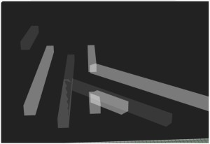

# Three.js Cannon.es - スロープトイ：部品編

## この記事のスナップショット

スロープトイ：部品


[ソース](037/)

動かし方

- ソース一式を WEB サーバ上に配置してください
- 操作法
  - 'c' .. カメラ視点の変更
    - 俯瞰（ふかん）：遠方から
    - ボール目線
    - ボールの周りを自動で周回
    - ボールの周りを自動で周回＋上下にアップダウン
    - 俯瞰（すべりまくり）
  - 'r' .. カメラ視点のリセット(俯瞰表示のリセット用)
  - 'n' .. 対象のボールを変更
  - 'd' .. 対象のボールのリセット（ソース位置に再ポップ）

## 概要(前回のおさらい)

物理エンジンのサンプルでみんなが一度はつくるであろう「物体の落下」。
これに着目してスロープトイなるものにチャレンジしました。

スロープトイは子供（幼児）用の知育玩具で、
ボール・車・コマなどをスロープの上から転がして転がる様子や音を楽しむおもちゃです。

## やったこと

スロープトイの部品を作成し、それらの部品を使ったコース（サンプル）を作成しました。
前回の記事では、コース（サンプル）の紹介をしました。
今回は特徴的な部品の解説は行います。

- カメラ目線
- カーブ
- レール（合流：卜型）
- フォーク（垂直：シーソー）：（転倒ます型雨量計ぽいもの）
- 風車
- 加速器
- エレベータ

### カメラ視点


コースを構成する部品ではないのですが、この場を借りて解説します。

- キーボードの「c」で変更できるカメラ視点にはいくつかの工夫を施しています。
- 「ボール目線」の視点は、対象とするボールの位置と速度ベクトルを使ってます。
  そのままだと曲線を通過する際にガタガタするので移動平均を使って滑らかになるよう試みてます。
  ただこの方法は完璧ではなく完全に滑らかにはほど遠いです。
  試しに遠方に視点を固定して曲線を走らせるとガタつきが消えたように見えます。
  なので移動平均を取るときは、カメラ位置と視点それぞれで平均をとっています。
  視点を滑らかに変化させる方法があれば良いのですが...
- 「ボールの周りを自動で周回」する視点には、OrbitControls の autoRotate を利用しています。
- 「ボールの周りを自動で周回＋上下にアップダウン」する視点には、OrbitControls の autoRotate を利用しつつ、
  camera のポジション(上下のY座標)に正弦波の変化を与えてます。
  autoRotate だけだと同じ公転軌道なので多少変化をつけてみました。

### カーブ


カーブを表現するために、微小の直方体をサインカーブ（正弦波の曲線）に合わせて配置します。
分割数を細かく、曲線の要素を細かくしていけば滑らかになるだろうとの目論見です。
一応、転落防止用にガードレールをつけてます。

### レール（合流：卜型）



合流するレールは、その結合する部分にどうしても隙間ができてしまい、
ボールが落ちてしまいます。  
当初は下に一枚板を置いてみたのですが位置調整がシビアで、
浅すぎると侵入口でぶつかり、
深いと交差点でハマってしまいました。  
次に考えた案がレールの中心のやや低い位置にガードレールを配置する今のケースです。
低速で侵入すると止まってしまうことがありますが、ある程度の速度があれば想定どおりに動いてくれます。

### フォーク（垂直：シーソー）：（転倒ます型雨量計ぽいもの）


最初は中央に棒を配置しただけの静的なものを作ってみたのですがボールの動きがいまいちでした。


シーソーの動きを模倣した動的に動くもの（転倒ます型雨量計ぽいもの）が興味深く模倣してみました。  
シーソー部分は２枚の板を凸型に接合してグループ化。
土台（mass=0で固定）とシーソーを少し距離を開けてヒンジ（３か所）で繋いでます。
デフォルトのままだとシーソーがヤジロベーのように動くので
やや重さをつけて（mass=5）、oangularDamping を高めに（=0.99）して回転しにくくしてます。
重心が上にあればどちらかにパタンと倒れてくれるはずなのですが、どうにもそのような動きではなく、、謎です。

### 風車


風車というか「十字のしきり」というか...  
板を２枚交差させて風車もどきをつくりました。
羽にボールが当たるとクルクル回る想定です。

回転軸は細長い直方体として、ヒンジの設定で軸と羽の衝突を検知しないようにしておきます（collideConnected: false）

```js:ヒンジの固定
  // 風車の動きの制約（ヒンジで繋ぐ：３か所で固定。１か所だけでは壊れる
  const hingeConst = new CANNON.HingeConstraint(moCntnrBody, moBase2Body, {
    axisA: new CANNON.Vec3(0, 1, 0),
    axisB: new CANNON.Vec3(0, 1, 0),
    pivotA: new CANNON.Vec3(0, 0, 0),
    pivotB: new CANNON.Vec3(0, 0, 0),
    collideConnected: false,  // 軸と風車がすり抜けるように
  });
  world.addConstraint(hingeConst);
```

ちなみに自動的に回る風車の場合、ヒンジのモーターを有効にします。  
羽の重量が軽すぎるとボールがぶつかったときに押し負けるので、
質量(mass)を大きくしておくと押し出すことができます。  
しかし物理的にボールが挟まって固定されてしまうと動きが止まってしまうことがあります。
つまり風車を「ゆっくり」「軽く」動かすことはできても、「ゆっくり」「力強く」動かすことはできないようです。

```js
  // 動力を付与
  var vspeed = 0.2
  hingeConst.enableMotor();
  hingeConst.setMotorSpeed(vspeed);
```

あと、描画更新のテクニックとして、自動的に描画するようイベントリスナを追加します。
これはボールやフォーク（シーソー）などにも適用してます。

```js
  // 描画を自動で更新させるために postStepにイベント追加
  world.addEventListener('postStep', () => {
    viCntnrMesh.position.copy(moCntnrBody.position);
    viCntnrMesh.quaternion.copy(moCntnrBody.quaternion);
  })
```

### 加速器


ボールを勢いよく押し出すための部品です。  
仕組みとしては非常に簡単で、衝突検知の物体（なんでもよいがここでは粒子）を配置して、
その物体に衝突時のイベントリスナを設定します。
衝突イベントではボールに対し指定された方向へ力を加えるだけです。  
加速器は任意の位置に、任意の方向へ、複数配置できるようクラス化しておきます。

```js
export class Accelerator_00 {
  // 加速器
    ...

    // 衝突イベントを紐づけ
    moAcc2Body.addEventListener("collide", this.hitevent);
    // イベントリスナ―内から参照できるよう this を持たせておく
    moAcc2Body.acc_=this;
  }

  // 衝突時のイベント用の関数
  hitevent (e) {
    var moAcc  = e.contact.bi;
    var moBall = e.contact.bj;
    if (moBall.mass == 0) {
      [moAcc, moBall] = [moBall, moAcc];
    }
    moBall.applyImpulse(moAcc.acc_.dir_);
  }
}
```

物理空間上では粒子（点）ですが、描画上は四角すいにして、そのベクトル方向を向くようにしています。

```js
    // 方角に対して力のかかる向きのベクトルを用意
    if (rot == 0) {
      this.dir_ = new CANNON.Vec3(this.implus_, 0, 0);
    } else if (rot == 1) {
      this.dir_ = new CANNON.Vec3(0, 0, this.implus_);
    ...
    }
    ...

    // 力の方向を単位ベクトル化
    var udir = this.dir_.unit();
    // 四角すいが上向きなので、その向きのベクトルを用意
    var vidir = new CANNON.Vec3(0, 1, 0);
    // ２ベクトル間のクォータニオンを取って姿勢の向きとする
    var vquat = new CANNON.Quaternion().setFromVectors(vidir, udir);
```

### エレベータ


板を上方にスライドさせてボールを押し上げるものも作ってみたので紹介します。
仕組みはシンプルに、「内部の移動するプレート」と「エレベータの外枠」を用意します。

```js
    // 内部の移動するプレート
    this.moPlateList_ = [];
    this.viPlateList_ = [];
    for (var pyy = pyymin; pyy <= pyymax; pyy += pyystep) {
      const moObj2Body = new CANNON.Body
        ({mass: 0,
          shape: new CANNON.Box(new CANNON.Vec3(sx_, sy_, sz_)),
          position: new CANNON.Vec3(pxx+adjx, pyy, pzz+adjz),
          quaternion: qplate
         });
      world.addBody(moObj2Body);
      const viObj2Geo = new THREE.BoxGeometry(sx, sy, sz);
      const viObj2Mtr = new THREE.MeshBasicMaterial({color: 0xa0a0a0, transparent: true, opacity: 0.2});
      const viObj2Mesh = new THREE.Mesh(viObj2Geo, viObj2Mtr);
      viObj2Mesh.position.copy(moObj2Body.position);
      viObj2Mesh.quaternion.copy(moObj2Body.quaternion);
      scene.add(viObj2Mesh);
      this.moPlateList_.push(moObj2Body);
      this.viPlateList_.push(viObj2Mesh);
    }
```

「内部の移動するプレート」を動かすために関数を用意して、
関数が呼ばれるたびに少しだけ上昇するようにしておきます。

```js
  act() {
    for (var ii = 0; ii < this.moPlateList_.length; ++ii) {
      var p = this.moPlateList_[ii].position;
      p.y = (p.y + this.vspeed_);
      if (p.y >= this.pymax_) {
        p.y = this.pymin_;
      }
      this.moPlateList_[ii].position.copy(new CANNON.Vec3(p.x, p.y, p.z));
      this.viPlateList_[ii].position.copy(this.moPlateList_[ii].position);
      this.viPlateList_[ii].quaternion.copy(this.moPlateList_[ii].quaternion);
    }
  }
```

あとは、描画更新（animete）時に act() を呼び出すようにします。

```js
    // エレベータを作成して actuatorlist に追加しておく
    var ele  = new ST.Elevator_01(  -20, 20, -30,  50, 3);
    actuatorlist.push(ele);
    ...
  }

  // シーン描画
  function animate() {
    ...
    if (actuatorlist.length > 0) {
      for (var ii = 0; ii < actuatorlist.length; ++ii) {
          actuatorlist[ii].act();
      }
    }
    ...
  }
```

## まとめ

誰かにこのモジュール（Slopetoy.js）を使ってほしい・利用してほしいって
訳でもないので説明はこれくらいで。
他にも部品のアイデアはあるのですが、
コスパがよくない（費やした時間に対して地味っぽい）雰囲気が
漂ってきたのでここらが潮時かなと。

今どきはアプリでも似たようなモノ（ピタゴラン、ツクレールなど）があり、
UIもしっかり作りこんであるのがすごいですね。一時期ハマってましたが、
課金するくらいなら、自分で作ってみたくて、、、
かなり地味な仕上がりになってしまいましたけどｗ

------------------------------------------------------------

前の記事：[スロープトイ：コース編](036.md)

次の記事：[なんちゃってドローン操作：コース編](039.md)


目次：[目次](000.md)

この記事には次の関連記事があります。

- [スロープトイ：コース編](036.md)
- [スロープトイ：パーツ編](037.md)

--