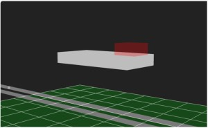
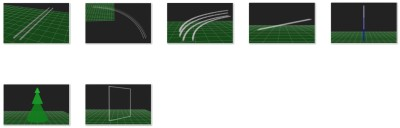
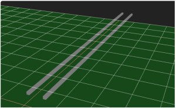
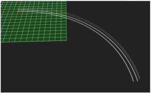
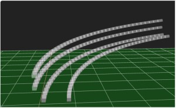
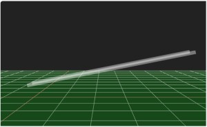
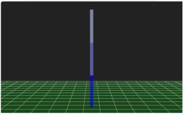
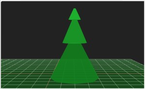
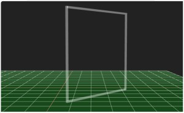

# Three.js Cannon.es - なんちゃってドローン操作：機能説明編

## この記事のスナップショット

ドローンもどき



追加パーツ




ソース

https://github.com/fnamuoo/webgl/blob/main/040


動かし方

- ソース一式を WEB サーバ上に配置してください
- 操作法
  - {カーソルキー}／右スティック  .. ドローン操作(*)
  - 'w','s','a','d'／左スティック .. ドローン操作(*)
  - 'c'／ .. カメラ視点の変更
    - 俯瞰（ふかん）：遠方から
    - ドローン：バードビュー（後方・上空から正面を向いて）
    - ドローン：ドライバーズビュー（中心から正面を向いて）
    - ドローン：周りを公転
  - 'r' .. ドローンの姿勢リセット
  - 'k' .. キー／ゲームパッドの感度変更（３段階）
  - '1' .. モード１に変更
  - '2' .. モード２に変更
  - 'q' .. キーボードからゲームパッドへフォーカス変更

*) 「ドローン操作」はモード１とモード２で挙動が変わります。
  - ドローン（モード１）左スティック：前後移動・左右旋回　右スティック：上昇下降・左右移動
  - ドローン（モード２）左スティック：上昇下降・左右旋回　右スティック：前後移動・左右移動


## 概要（前回とおなじ）

ゲームパッドのスティックを生かした何かをつくりたくて、
ドローン操作のシミュレータを作成しました。

といっても、実際にドローンは持ってないし、ドローンシミュレータを触ったこともないので、
「なんちゃってドローン」です。

## やったこと

前回の記事でコースを紹介したので、
今回は機能について解説します。

### ドローン

  - 形状は手抜き
    - なんか、板でごめんなさい。
    - 姿勢を確認するために小さい四角を乗せただけでごめんなさい。

      

  - 動きは想像で勝手にモデリング
    - 基本的な動きは applyForce() で力を加えてドローンを動かしてます。
    - 何もしないときはその場に留まるよう、「重力を打ち消す上方の力」を加えてます。
      その上で、上昇／下降するときには更にその方向に力を加えます。
      つまり「重力を打ち消す上方の力」＋「上昇／下降する力」を加えて、上下させます。

  - 視線は常に一定方向
    - 移動（上下、左右、回転）に際して、ドローンが傾くということはありません。
      だってそこまで考えるのが大変そうだったから。

  - 操作を簡単にするための措置
    - 摩擦係数を高くしてます。粘性の高い空気中／水中を動く感じで、すぐに止まるようにしてます。

      ```js
          moDrone = new CANNON.Body({
            mass: 1,
            position: new CANNON.Vec3(0, 0, 0),
            material: moDroneMtr,
            linearDamping : 0.5, //def 0.01 直進しにくくしておく／慣性で滑りにくくする
            angularDamping: 0.5, //def 0.01 回転しにくくしておく／慣性で回転しにくくする
          });
      ```

    - 移動量が合ってない／アンバランスな気もしますが、下手に手を入れるとやぶへびになりかねないので、
      移動量／感度を３段階に変更する機能を入れてます。

      ```js:パラメータ
      // key/gamepad の感度パラメータ
      // 0: 感度低 , 1:中, 2:高
      let iKeySens = 1;
      let keySens = [{FRWD:1, BACK:1, YAW:0.005, UP:0.5, DOWN:0.5, SLD:0.5, },
                    {FRWD:2, BACK:1, YAW:0.01 , UP:1  , DOWN:1  , SLD:1, },
                    {FRWD:4, BACK:1, YAW:0.02 , UP:2  , DOWN:2  , SLD:2,},
                    ];

      let iGPSens = 1;
      let gpSens = [{FRWD:1, BACK:1, YAW:0.005, UP:0.5, DOWN:0.5, SLD:0.5, },
                    {FRWD:2, BACK:1, YAW:0.01 , UP:1  , DOWN:1  , SLD:1,},
                    {FRWD:4, BACK:1, YAW:0.02 , UP:2  , DOWN:2  , SLD:2,},
                  ];
        ```

        ```js:変更関数
      function changeSensitive() {
        iKeySens = (iKeySens+1) % keySens.length;
        iGPSens = (iGPSens+1) % gpSens.length;
        console.log("changeSensitive", iKeySens, iGPSens);
      }
      ```

      ```js:適用部分（抜粋）
        if (gamepad.para2_.frbk > 0) {  // 前進/後進（前進）
            moDrone.applyForce(ddirF.scale(gamepad.para2_.frbk * gpSens[iGPSens].FRWD));
            //                 -----       --------------------  --------------------
            //                 進行方向    スティックの傾き      感度パラメータの倍率（前進）
        } else if (gamepad.para2_.frbk < 0) {  // 前進/後進（後進）
            moDrone.applyForce(ddirF.scale(gamepad.para2_.frbk * gpSens[iGPSens].BACK));
        }
      ```

### ゲームパッド

- GamepadクラスとGamepadDroneクラス
  - ゲームパッドのイベントを取得するGamepadクラスと、
    ドローン操作用に拡張したクラスGamepadDroneを用意しました。
  - Gamepadクラスはボタンの押下やスティックの移動量を取得、保持するクラスです。
  - GamepadDroneクラスはモードに応じて、前後左右の移動パラメータに対応付けるクラスです。

    ```pic
      +---------+
      | Gamepad |
      +---------+
        △
      　｜
      +--------------+
      | GamepadDrone |
      +--------------+
    ```

- モード１／モード２
  - モード１／モード２の切り替えはスティックの変化量をどの移動に紐づけるかの違いだけです。

    ```js
      droneParaFuncNone() {
        //console.log("GamepadDrone::droneParaFuncNone()");
      };
      droneParaFuncMode1() {
        //console.log("GamepadDrone::droneParaFuncMode1()");
        // ドローン（モード１）左：前後移動・左右旋回　右スティック：上昇下降・左右移動
        this.para2_.frbk  = this.para_.stcLV;
        this.para2_.yaw   = -this.para_.stcLH;
        this.para2_.updn  = this.para_.stcRV;
        this.para2_.slide = -this.para_.stcRH;
      };
      droneParaFuncMode2() {
        //console.log("GamepadDrone::droneParaFuncMode2()");
        // ドローン（モード２）左：上昇下降・左右旋回　右スティック：前後移動・左右移動
        this.para2_.updn  = this.para_.stcLV;
        this.para2_.yaw   = -this.para_.stcLH;
        this.para2_.frbk  = this.para_.stcRV;
        this.para2_.slide = -this.para_.stcRH;
      };
    ```
  - それぞれの関数を用意して、モード切り替え時に呼び出す関数を置き換えておきます。

    ```js
      setMode(imode) {
        this.droneMode_ = imode;
        if (imode == 1) {
          this.droneParaFunc_ = this.droneParaFuncMode1;
        } else if (imode == 2) {
          this.droneParaFunc_ = this.droneParaFuncMode2;
        } else {
          this.droneParaFunc_ = this.droneParaFuncNone;
        }
      }
    ```

  - 更新時（update()時）にはその紐づけられた関数を呼び出すだけになります。

    ```js
      update() {
        super.update();
        this.droneParaFunc_();
      }
    ```

- キーボード入力との両立
  - スタートしてゲームパッドを使用していて、途中でキーボードで入力すると以降、キーボード入力を優先します。
  - キーボードからゲームパッドに戻すには 'q'ボタンを押します。
  - どちらでも有効なように作ればよかったのですが、
    イベント処理が面倒そうだったので、どちらか一方（ゲームパッドかキーボードか）に絞ってます。
  - キーボードでもゲームパッド同様に操作できるようにしてます。

### スロープトイ拡張

以前の「スロープトイ」では、こぢんまりしたパーツばかりで
スケールアップすると部品数が増えることになります。
なのでスケールの大きなパーツを用意しました。
さらにドローンコース用に新造した部品もあります。

- 直線(100)
  - 抜群の安定感。

    

- ９０度カーブ（半径を200, 300)
  - スケールアップの一環でつくったものの、高速移動時が不安定で今一つ。

    

- ９０度カーブ＋上下に移動
  - 実装を見直し、ガタガタを修正したものの、スムーズに駆け上るには無理っぽい。

    

- 傾斜（直線）を各種角度で
  - 上下方向の演出用に
  - 滝登りのようなコース作りに一役

    

- ポール
  - 障害物
  - 高さに応じて色分けしたのが良い感じに

    

- ツリー
  - 障害物
  - ポールの代わりに使ったりと考えていたけど、木の場合すそが広がっているので、使いどころを選ぶものに。

    

- 四角の枠
  - 障害物
  - 本来はドーナツ型にしたかったけど、衝突判定がなぜが無効だったので四角で作り直し
  - 「この大きさなら余裕すぎて使わないかも」と思っていたものが一番重宝
  - 任意の角度に回転できるようにも調整

    

## まとめ

見た目はアレですけど、ドローンぽいモノが仕上がりました。

というか「本物」に触って勉強しておくべきなんでしょうけど、
知らないがゆえに好き勝手に作ってしまい、これはこれで良しとします。

余談ですが、ちょっとコースづくりにハマりそうになりました。

まぁ楽しんだもの勝ちということでｗ

