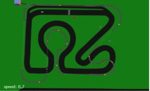
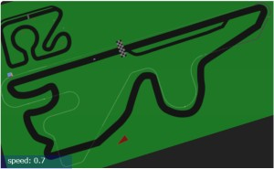
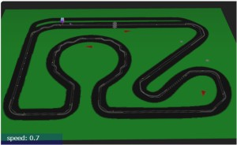
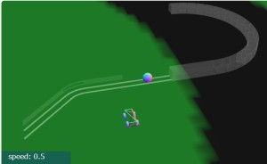
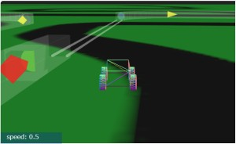

# Three.js Cannon.es - 車とスロープトイのコラボ

## この記事のスナップショット

車とスロープトイのコラボ

コース

[ソース](042/)

動かし方

- ソース一式を WEB サーバ上に配置してください
- 操作法
  - {カーソルキー左右}／左スティック／十字キー（左右）  .. 車操作（ハンドル）
  - {カーソルキー上}／右スティック上／Aボタン           .. 車操作（アクセル）
  - 'b'／右スティック下／Bボタン                        .. 車操作（ブレーキ）
  - {カーソルキー下}／／Yボタン                         .. 車操作（バック）
  - 'n'(ON/OFFの切り替え)／Yボタン(押したときだけ有効)  .. 車操作（サイドブレーキ）
  - 'c'／RBボタン／LBボタン .. カメラ視点の変更
    - 俯瞰（ふかん）：遠方から
    - ドローン：バードビュー（後方・上空から正面を向いて）
    - ドローン：ドライバーズビュー（中心から正面を向いて）
    - ドローン：周りを公転
  - 'r' .. 姿勢リセット
  - 'q' .. キーボードからゲームパッドへフォーカス変更

## 概要

前回の、「なんちゃってドローン」と「スロープトイ」の組み合わせを行いましたが、
今回は「車」と「スロープトイ」の組み合わせです。

レール軌道ではボールを加速しすぎると簡単に脱線します。
ガードレールを設けても限界があります。
そこで、四方を壁で囲った筒状の軌道を用意します。
しかし、もうここまでくると「スロープトイ」というより「レールトイ」かも（汗

## やったこと

### スロープトイ拡張

車のスケールに合わせて、ボールを小さく、レールも小さくしてます。
さらにレール軌道とは別に、四方を壁で囲った筒状の軌道（直線やカーブ）を新規に作成しました。

今回の回収ではレールトイで使う部品を主に修正しており、
アクロバティックな部品（ループ等）には手を付けてません。未修整のままです。
自分でも Slopetoy3.js を使ってみる奇特ながいらっしゃいましたらその点ご承知おきください。

なんだかんだと１万行超えてしまって読み込みが重くなってます。
使ってない関数は消してしまえばよいのですが、なんかすみません。

### コースレイアウト

レール軌道と組み合わせると路面電車の軌道っぽく見えます。
軌道上を走るのは電車ではなくボールですけど。

できるだけ並走や交差するように軌道をレイアウトしてます。

ただレール軌道だけではカーブでかなり減速しないとボールが曲がれないので、
筒状の軌道と組み合わせることで、安定したコーナリングを実現させてます。

コース１とコース２で並走／交差するレイアウトが面白く仕上がったので、
コース３では路面電車のように道路中央にレール軌道を配置する感じにしてみました。

## まとめ・雑感

当初、何気なくレースコース上にレール軌道を配置していたら、

- 路面電車の軌道っぽい
- COMカー代わりになるかも

と気が付いて、より意図的にコースとレール軌道を絡めるようレイアウトしました。

当初はレール軌道だけだったのですが、コーナーで かなり 減速しないと曲がれないことに気が付き愕然。
この減速・加速が思った以上にタイムロスになり、車と並走するとぶっちぎりに遅れることに。

レール軌道の配置だけでなんとかしようと、コーナーの内側に脱輪防止用のレールを配置したものの、
今度は内部でぶつかりまくって減速したり、上部から飛び出てしまうようになりました。
ごちゃごちゃしてきたので、割り切って新しい軌道、「筒状の軌道」を用意することにしました。
結果、時間はかかったものの、減速無しなくてもカーブを曲がれて、
ボールが壁にぶつかって大きく減速することもなく、
コーナー出口でもボールがばたつかない／安定して出てくるようになり大成功です。

今度は逆にボールに追いつけない感じに仕上がってます。
ビギナー用に「加速器の設置が少ない版」を用意しても良かったかも。
ゲームっぽく、タイム差／ランクによって加速を調整すれば面白くなりそう。
ボールが遅れていたら加速を大きくし、逆にボールがリードしてたら加速を弱めるような。
そうすれば飽きずに長く遊べそう。

------------------------------------------------------------

前の記事：[なんちゃってドローン操作：機能説明編](040.md)

次の記事：[歯車をつくってみた](043.md)

目次：[目次](000.md)

この記事には次の関連記事があります。

- [スロープトイ：コース編](036.md)
- [スロープトイ：パーツ編](037.md)
- [車とスロープトイのコラボ](042.md)

--