# Three.js Cannon.es - 歯車をつくってみた

## この記事のスナップショット

歯車いろいろ

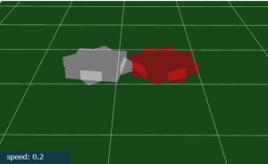
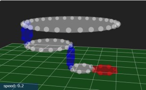
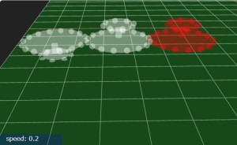
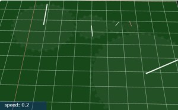

歯車の応用

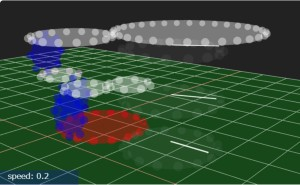
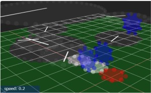
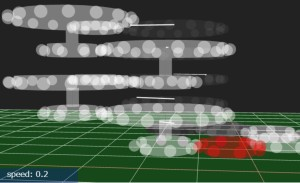
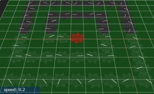

[ソース](043/)

動かし方

- ソース一式を WEB サーバ上に配置してください
- 操作法
  - {カーソルキー上}    .. 歯車を巡回転に増加
  - {カーソルキー下}    .. 歯車を逆回転に増加
  - {カーソルキー右} or {左}  .. 停止させる／回転を０（ゼロ）にする

## 概要

歯車／ギアをつくって、応用／組み合わせも作成してみました。
が、某教育番組の教材的な感じに（汗

## やったこと

いろいろな歯車をつくってみました。

- 歯車（四角を２つ重ね合わせ）
- 歯車（円柱に球を配置）
  - 水平な歯車（大中小）
  - 垂直な歯車
  - ２枚組の歯
  - 歯車に針をつけたもの

また、歯車を使った例として下のようなものも作ってみました。

- 同じ直径の盤を動かす例
- 異なる直径の盤を動かす例
- 同じ直径の盤を、ギア比×４段で変化させて動かす例
- 回転の伝わり方を見る例

### いろいろな歯車

手始めに、歯車のようなかみ合わせで動くのか確認してみたく簡単な歯車、正方形を２つ重ねたものを作りました。かみ合わせがぎこちないですが一応歯車っぽく動いてくれました。

もう少し歯車っぽくするために、歯の部分を球で作り直しました。
これがいい感じでかみ合うようなので、縦向きやサイズ違いも作成しました。

下記は２枚組の歯車で、大きさの異なる２つの歯車を組み合わせてます。ギア比の違いを出すものになります。

下記は盤面を薄く（透過に）して針を置いたものです。時計の針／メーターの針をイメージしてます。

これらを使った例を下記で紹介します。

### 同じ直径の盤を動かす例

最終的に同じ直径の盤を動かすのですが、
途中に大小の異なる歯車をはさんだ場合です。
動力源となる歯車は赤く、垂直な歯車は青色に色付けしてます。

最終的に同じ大きさの歯車（透明な歯車）を回しているのですが、
途中の歯車の大きさによらず、回転速度は変わらないことが確認できます。

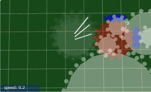

### 異なる直径の盤を動かす例

直径の異なる盤を、１つの動力から力を伝えて動かす場合です。
動力源となる歯車は赤く、垂直な歯車は青色に色付けしてます。

動力源から同じ大きさの歯車で回転を伝えていき（ここまでは同じ回転）、
最後に大きさの異なる歯車（透明な歯車）に伝えています。
ここで回転速度が変わることが確認できます。

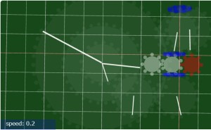

### 同じ直径の盤を、ギア比×４段で変化させて動かす例

ギア比の違う歯車を組み合わせて回転速度が変わる例になります。
動力源となる歯車は赤く色付けしてます。

２枚組の大きさの違う歯車を、複数組み合わせて、上部の歯車ほど早く回るようにしています

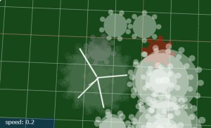

### 回転の伝わり方を見る例

歯車どうしの配置ですきまがあることに着目して、
中心の赤い歯車を停止したり動かしたりすることで、
力の伝わり方を見ることができます。

匠の技のように「すきまのない完璧な歯車」がつくれたなら、
遅延なく一斉に動き出すのかなと思いますが、
そこまでのクオリティは無理。

## 既知の不具合

座標軸をまたがって配置した歯車がかみ合いません。
＋もしくは－によせて、一方の領域だけに配置すると動きます。
軸をまたがって配置するように歯車どうしをずらすと、
境界を境として途端に動かなくなります。

たとえば、下記の画像では黄色い歯車だけが回っていません。
この状態からもう少し左に寄せて、すべての歯車を x ＜ 0 の範囲に配置すると、この黄色い歯車も嚙み合って動き出します。

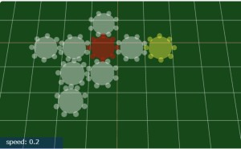

本当にわけがわかりません。

## まとめ・雑感

歯車の機構を基本形状だけで再現してみました。
さすがに複雑なやつは無理です。
というか、すでにやりつくされた感があって、
参考資料とかのサイトがよく作りこまれていて脱帽です。

歯車の例では、摩擦やかみ合わせがどうなのか心配でしたが、
思ったよりも上手く動いてくれました。

最後に変な不具合はありましたが、おおむね成功と思います。

次の記事で、歯車であれこれ（格子状に配置、歯車に重さを付与）やってみます。

## 参考資料

https://nlab.itmedia.co.jp/nl/articles/2106/19/news043.html

https://javalab.org/ja/gear_ja/

https://pengingames.syn-photo.biz/archives/8299

------------------------------------------------------------

前の記事：[車とスロープトイのコラボ](042.md)

次の記事：[自作の歯車であれこれ] (044.md)

目次：[目次](000.md)

この記事には次の関連記事があります。

- [歯車をつくってみた](043.md)
- [自作の歯車であれこれ] (044.md)

--