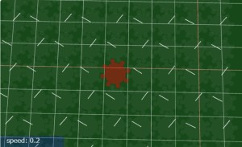
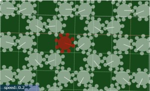
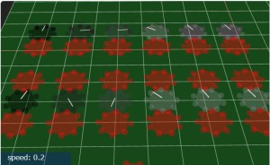

# Three.js Cannon.es - 自作の歯車であれこれ

## この記事のスナップショット

歯車であれこれ

[ソース](043/)

(前回と同じです)

動かし方

- ソース一式を WEB サーバ上に配置してください
- 操作法
  - {カーソルキー上}    .. 歯車を巡回転に増加
  - {カーソルキー下}    .. 歯車を逆回転に増加
  - {カーソルキー右} or {左}  .. 停止させる／回転を０（ゼロ）にする

## 概要

前回の記事では、
歯車／ギアをつくって、応用／組み合わせを紹介しました。

今回は歯車を使って、格子状に配置してうまく動くか、歯車に重さを付与しても動くかを確認してみました。

## やったこと

- 格子状（正方格子、六方格子）に配置
- 歯車に重さをつけてみる

### 格子状（正方格子、六方格子）に配置

前回の記事でらせん状に配置して、歯車の動きを見てみましたが、ここでは正方格子状に配置しました。

一見すると、すべての歯車が連動してキチンとうごいています。

この歯車を使って六方格子上に配置すると嚙み合わせがわるくて、固まってしまいました。
そこで歯（球）の大きさを微調整して、六方格子状で動くようにしたものがこちらになります。

改めてこちらの歯車を使って正方格子状に配置すると、今度も動かなくなりました。
つまり、正方格子用の歯車、六方格子用の歯車を用意しないと動かなかったということになります。
素人考えですが、おそらく歯の形（球）が影響していて、片方の格子でしか使えなかったのかなと予想してます。うまく形状を作れば正方格子でも六方格子でも、かみ合って動いてくれそうだけど、そこまで手間をかけたくないし...

余談ですが、どちらの配置でも回転スピードを上げていくと、ある段階で空回りしてうまく回らなくなります。スピードの上げ方が問題（急激すぎる）な気がしますが、一方で、早くなりすぎることで衝突判定をすり抜けてしまっているのではないかとも思われます。

### 重さの違う歯車

今までの歯車は重さを 0.01 としていました。
ここでは歯車の重さを変えたものを回してみます。

動力の歯車は赤色で、重さを変えられる歯車を白 → グレー → 黒と、重くなるほど黒くしています。
図の左からから 1000（黒）, 100, 10（グレー）, 1, 0.1, 0.01（白）としています。
上段は動力の歯車を１つだけ、下段は動力を２つ上下から挟んで回しています。

結果、重さが 1 まで（右側）は、動力の歯車と連動して遅延なく回ってくれました。
一方で重い歯車ほど回りにくく、止まりにくいことも確認できました。

上段（動力１個）と下段（動力２個）でも違いがあり、下段の方がよく力が伝わることが確認できました。

こちらでも回転スピードを上げていくと、とくに重い歯車で、歯同士がすり抜けて空回りする現象が見られます。

ちなみに、重い歯車でも時間をかければ軽い歯車と同じ回転になるだろうとは思いますが、思いのほか時間がかかるようで、途中で観測を断念しました。（摩擦係数を大きくすれば、もっと早く同期するかも）

## まとめ・雑感

簡単なシミュレーションではありますが、ブラウザでお手軽に確認できるのは良いですね。

惜しむらくは、歯車の魅力を出し切れなかった、伝えきれなかった点でしょうか。
色々できそうな感はあるのですが、思いつかない...

------------------------------------------------------------

前の記事：[歯車をつくってみた](043.md)

次の記事：[迷路作成モジュール（１）「通路と壁が同じサイズ」と「薄い壁」](046.md)

目次：[目次](000.md)

この記事には次の関連記事があります。

- [歯車をつくってみた](043.md)
- [自作の歯車であれこれ](044.md)

--