# Three.js Cannon.es - 3D迷路の例（オーソドックスな迷路とキャットウォーク）

## この記事のスナップショット

迷路あれこれ

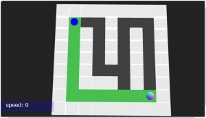
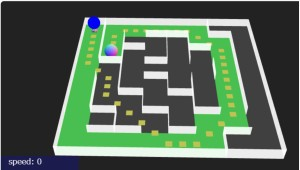
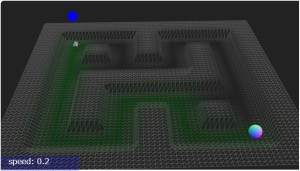
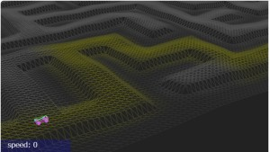

[ソース](048/)

動かし方

- ソース一式を WEB サーバ上に配置してください
- 操作法
  - {カーソルキー左右}／左スティック／十字キー（左右）  .. 車操作（ハンドル）
  - {カーソルキー上}／右スティック上／Aボタン           .. 車操作（アクセル）
  - 'b'／右スティック下／Bボタン                        .. 車操作（ブレーキ）
  - {カーソルキー下}／／Yボタン                         .. 車操作（バック）
  - 'n'(ON/OFFの切り替え)／Yボタン(押したときだけ有効)  .. 車操作（サイドブレーキ）
  - 'c'／RBボタン／LBボタン .. カメラ視点の変更
    - 俯瞰（ふかん）：遠方から
    - ドローン：バードビュー（後方・上空から正面を向いて）
    - ドローン：ドライバーズビュー（中心から正面を向いて）
    - ドローン：周りを公転
  - 'r'／RTボタン／LTボタン .. 姿勢リセット
  - RTボタン and LTボタン .. マップリセット
  - '1','2','3','4','5','6'／Startボタン／Backボタン .. マップ切り替え
  - 'q' .. キーボードからゲームパッドへフォーカス変更

## 概要

迷路作成モジュールを使った例、Threejs による３Ｄ化として、
オーソドックスな迷路とキャットウォーク（高所にある狭い通路）
を作成しました。

なお、移動体として車(RaycastVehicle)を使います。
また、この手の迷路をヒントなしにゴールまでたどり着くのは苦手なので、最短経路を表示させてます。

## やったこと

下記タイプの迷路を用意しました。

- オーソドックスな迷路「通路と壁が同じサイズの迷路」
- オーソドックスな迷路「薄い壁の迷路」＋最短経路
- オーソドックスな迷路「薄い壁の迷路」＋最短経路（十字と斜め）
- オーソドックスな迷路「通路と壁が同じサイズの迷路」(HighField利用）
- キャットウォーク「通路と壁が同じサイズの迷路」(HighField利用）
- マイクロマウスの迷路：「薄い壁の迷路」＋最短経路（十字と斜め）

ゴールにある球に接触すると、迷路を更新＋少し大きくなります。

### オーソドックスな迷路「通路と壁が同じサイズの迷路」

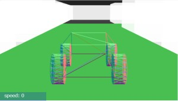

迷路データには Maze1 を使います。

迷路の3D表示として、
迷路の通路には低い直方体、壁には高い直方体で表現します。
また、最短経路の表現として通路の色を変更しています。

### オーソドックスな迷路「薄い壁の迷路」

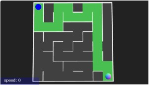
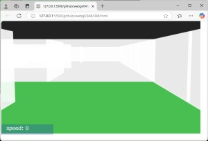

迷路データには Maze2 を使います。

迷路の3D表示として、
通路には低い直方体、壁には縦に薄い直方体で表現します。
また、最短経路の表現として通路の色を変更しています。

### オーソドックスな迷路「薄い壁の迷路」＋最短経路（十字と斜め）

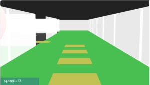

迷路データには Maze2 と Maze3 を使います。

迷路の3D表示として、
通路には低い直方体、壁には縦に薄い直方体で表現します。
また、**最短経路には二種類(Maze2での最短経路とMaze3での斜めアリの経路）**
を表示しています。

最短経路（幅優先）は緑の床で、斜め考慮の経路は小さな四角（橙）をマーキングしています。

スタート・ゴールの位置は最長になるように再配置します。

### オーソドックスな迷路「通路と壁が同じサイズの迷路」(HighField利用）

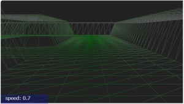

迷路データには Maze1 を使います。

HighField は二次元の高さデータだけで地形を表現します。
迷路の１セル分を HighField の座標 7x7 で表現します。

壁、通路、最短経路の色分けとして、ImageDataで画像生成したものをテクスチャとして貼り付けます。
壁は白、通路は黒、最短経路は緑といた具合です。

### キャットウォーク「通路と壁が同じサイズの迷路」(HighField利用）

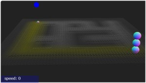
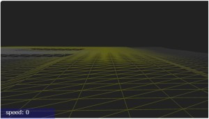

迷路データには Maze1 を使います。

壁と通路の高さを反転させ、通路が峰に、壁が谷になるようにしたものです。
高低差がキツイと戻れない（登れない）のでそこそこの高さに抑えています。

また、峰が同じ高さだと単調なので、パーリンノイズで高低差をつけてます。

ちなみに、ゴールするたびにサイズが大きくなるだけでなく、峰が高くなっていきます。

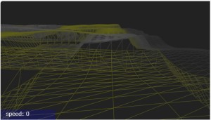

### マイクロマウスの迷路：「薄い壁の迷路」＋最短経路（十字と斜め）

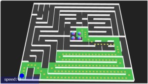
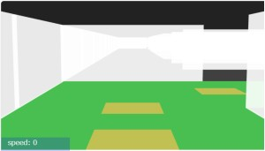

迷路データには Maze2 と Maze3 を使います。

3D表示は「薄い壁の迷路」の迷路になります。
マップデータはマイクロマウスのデータ（固定データ）になります。

ロボットになった気分で迷路を攻略できます。

## まとめ・雑感

迷路作成モジュールで作った迷路データの利用例を紹介しました。

移動体として車のコードが移植しやすかったので再利用しましたが、色々と問題点も見えてきました。
まず「移動しにくい」です。
クイックに移動、方向転換できないとちょっとフラストレーションがたまります。

カメラ視点も曲者で「後背ビュー」のときに手前の壁と重なって見づらくなって、少し調整しました。

マイクロマウスはちょっと面白かったです。
このサイズ(64x64)だ最短経路のガイド無しにゴールにたどり着くのは無理と実感。

ちなみに競技の動画拝見しましたが「動きが速い！」。
いや、いいんです。こちらはマニュアル操作を楽しむものなので

キャットウォークも楽しいです。
ビーナスライン(024.md)
の整地のときにも感じていたのですが、
このような高台／高所を走るのってちょっと楽しいんですよね。
ただコース上、直線と直角カーブになってしまうのが残念です。

------------------------------------------------------------

前の記事：[迷路作成モジュール（２）斜め移動を考慮」](047.md)

次の記事：[3D迷路用移動体の挙動の試作](049.md)

目次：[目次](000.md)

この記事には次の関連記事があります。

- [迷路作成モジュール（１）「通路と壁が同じサイズ」と「薄い壁」](046.md)
- [迷路作成モジュール（２）斜め移動を考慮](047.md)
- [迷路作成モジュール（３）立体迷路](050.md)

- [3D迷路の例（オーソドックスな迷路とキャットウォーク）](048.md)
- [3D迷路の例（２）バランスゲーム](052.md)
- [立体迷路の例](051.md)

- [3D迷路用移動体の挙動の試作](049.md)

--