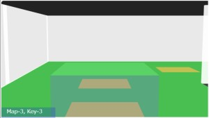
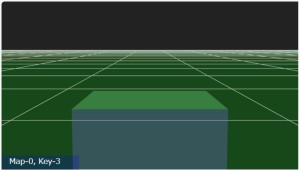

# Three.js Cannon.es - 3D迷路用移動体の挙動の試作

## この記事のスナップショット

[ソース](049/)

動かし方

- ソース一式を WEB サーバ上に配置してください
- 操作法
  - {カーソルキー左右}        .. オブジェクト操作（方向転換）
  - {カーソルキー上}          .. オブジェクト操作（前進）
  - {カーソルキー下}          .. オブジェクト操作（バック）
  - 'b'                       .. オブジェクト操作（ジャンプ）
  - 'r'                       .. 姿勢リセット (壁衝突時対策)
  - 'g'                       .. 姿勢停止 (壁衝突時対策)
  - 'c'                       .. カメラ視点の変更
    - 俯瞰（ふかん）：遠方から
    - バードビュー（後方・上空から正面を向いて）
    - ドライバーズビュー（中心から正面を向いて）
    - 周りを公転
  - '1','2','3','4','5','6','9' .. マップ切り替え
  - '0'                         .. 周回リセット
  - 'z','x'                     .. キーイベント／挙動の切り替え

今回、ゲームパッドは未対応です。

## 概要

迷路用のオブジェクト（直方体）とその挙動／動かし方（６種）について検討しました。

車の挙動では迷路内を移動しにくいので、車に代わるものを模索しました。

## やったこと

迷路内の移動体として直方体を用意し、その動かし方について６種類の方法を検討しました。

基本的な動きは「前後に移動」と「左右の旋回（方向転換）」です。

id| イベント種類                 |操作性| 概説
-|------------------------------|:----:|----
1|座標移動：自由位置（補正無）  |×    |自由に移動可能。薄い壁はすり抜け可。衝突時の操作が難。
2|座標移動：自由位置（補正あり）|〇    |自由に移動可能。薄い壁はすり抜け可。衝突時の操作が難。
3|座標移動：Grid位置（補正あり）|◎    |通路の中央のみを移動。９０度回転。移動時の壁の衝突判定あり。初心者向け。
4|力で移動：自由位置（補正無）  |×    |自由に移動可能。壁はすり抜け不可。衝突時の操作が難。
5|力で移動：自由位置（補正あり）|△    |自由に移動可能。壁はすり抜け不可。衝突時の操作が難。
6|力で移動：Grid位置（補正あり）|△    |動きに難あり。薄い壁迷路では斜め移動も可。補正の動きがウザいかも。

コースには前回の「３D迷路例」のものを流用しています。

map| 説明
---|-------------------------------
1  | 通路と壁が同じサイズの迷路
2  | 薄い壁の迷路
3  | 薄い壁の迷路（＋斜め経路の表示）
4  | 通路と壁が同じサイズの迷路（HighField利用）
5  | キャットウォーク（HighFieldの凹凸を反転）
6  | マイクロマウスの迷路
9  | 平面

## オブジェクト（直方体）について

移動体は手抜きで、直方体（緑の半透明）を使ってます。

小さくしすぎると「通路・壁が同じ大きさの迷路」の場合でも、
壁にぶつかると反射せずに壁の中に入り込んで、そのまま下に抜ける／落ちることがあったので
ほどほどの大きさにしています。

また、移動体と床の摩擦係数が 0 にしてます。
座標値／力で動かすときに摩擦があると「つんのめった」動きになるので。
代わりにオブジェクトの「linearDamping」で減速をかけてます。

## 移動／イベント操作について

次のテーマごとに挙動について説明したいと思います。

- 「座標で移動」と「力で移動」
- 「自由位置」・「位置補正」と「Grid位置」

### 「座標で移動」と「力で移動」

「座標で移動」は、進行方向に対し微小移動量だけ座標を変化、それを１回～数回繰り返して、キー押下1回分の移動とします。
ゲームでは一般的な動かし方ですが、物理エンジン（摩擦や衝突）を無視した、強制的な動き／キビキビした動きになります。
移動先を決めて動くためか、薄い壁の場合にすり抜けてしまいます。
別の物理エンジンなら衝突判定してくれるかも？！ということで一旦ここは保留です。

「力で移動」は、物理エンジンに壁の衝突を判定させたくて考えた移動法です。
移動方向に対して力を加えて移動させる方法で、ヌルっとした動きになります。
しかし、こちらでは逆に狙った位置に移動させることが難しくなってます。

正確な操作性を求めるなら「座標で移動」ですが、
物理エンジンを使った動きを楽しみたいなら「力で移動」でしょうか？

項目         | 「座標で移動」               | 「力で移動」
-------------|------------------------------|---------------------
動き         | 〇：キビキビ動く             | △：ヌルっと動く
位置         | 〇：狙った位置に             | ×：指定が困難
壁との衝突   | ×：すり抜けあり（要壁判定） | 〇：キチンと判定
物理エンジン | ×：無視                     | 〇：反映

### 「自由位置」・「位置補正」と「Grid位置」

- 「自由位置」  
  「自由位置」は自由な動き／ラインどりを可能する動きができます。
  固定された道の上を動くだけではつまらない、もっと自由に動きたいからという理由からですが、
  狭い迷路内では難易度が極端にあがりました。
  なので、位置補正の機能を導入してます。

- 「位置補正」  
  「位置補正」は部屋のスミ／壁際にいるときやちょっとずれた方向を向いているときに、通路の中央位置に戻し直交／斜め方向に向くように補正する機能です。
  常に補正が入るとウザいので、キー入力のないとき（少し遅延してから）補正を実施します。

  位置を微調整しにくい「力で移動」ではとくに有効なのですが、
  力加減と補正のタイミングがアンバランスなのか、元の位置に引き戻されてしまい中途半端な移動になることもしばしばです。

- 「Grid位置」  
  「Grid位置」は自由な位置取りをあきらめて、移動可能な場所を通路中央に限定したものです。
  「３」と「６」が該当します。

  「３」は座標値で位置決めするので正確に座標を決定でき、さらに迷路データとの連携もやりやすく、
  移動前に進行方向の壁の判定を行っています。

  「６」は力を加えての移動なので、位置どりが難しく迷路データとの連携はあきらめてます。
  「位置補正」をやや頻繁に行うことでGrid位置に合わせこもうと試みました。
  この結果、移動と補正がかみ合わず、
  前進のキーを押したのにちょっとしか進まず、逆に元の位置に引き戻されることもあります。
  この辺の調整は上手くいっていません。

## まとめ・雑感

迷路を走破するだけなら、正確に操作できる「３」が一番でした。

迷路のようなコースを自由にラインどりして走って楽しみたいとなると、
「２」や「５」といった挙動もアリかな。

「１」や「４」はアシストがなくて操作難度が高く、
「６」はアシストがやや過剰で使いずらくなってます。（これでも調整は試みたのですが）
でも、マイクロマウスのコースで斜め移動が出来たときは気持ちよかったです。

それにしても「３」のグリッド位置の移動が鉄板で操作性が抜群です。少々物足りなさは否めないですが。
半マス・斜めアリも途中まで作りこんではいたものの、途中から混乱・スパゲッティ状態になって十字方向・９０度回転（今のもの）に落ち着いてしまいましたが、いずれ再チャレンジしたいですね。

あと全般的に、壁にぶつかると挙動が不審（回転したり、あらぬ方向に飛ばされたり）で、
ちょっと困りものです。挙動リセットの"G"キーや"R"キーから手が離せないです。
形状が四角だからかな？
この辺うまくコントロール（壁をこすりながらとか、壁の反射を使って移動とか）できれば
良ゲーになりそうな予感。

ちなみにキャットウォークのコースは峰の凹凸／傾斜でオブジェクトが滑ります。
ちょいちょ"G"キーで滑り止めしないと進めないコースになってます。
やっぱりこのコースは車で走るのが楽しいと思う。

------------------------------------------------------------

前の記事：[3D迷路の例（オーソドックスな迷路とキャットウォーク）](048.md)

次の記事：[迷路作成モジュール（３）立体迷路](050.md)

目次：[目次](000.md)

この記事には次の関連記事があります。

- [迷路作成モジュール（１）「通路と壁が同じサイズ」と「薄い壁」](046.md)
- [迷路作成モジュール（２）斜め移動を考慮](047.md)
- [3D迷路の例（オーソドックスな迷路とキャットウォーク）](048.md)
- [3D迷路用移動体の挙動の試作](049.md)
- [迷路作成モジュール（３）立体迷路](050.md)
- [立体迷路の例](051.md)

--