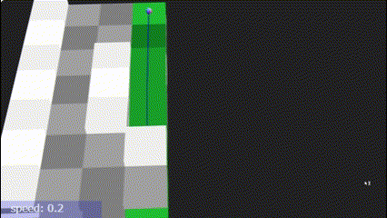
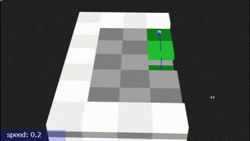

# JavaScript で迷路／迷路作成モジュール（３）立体迷路

## この記事のスナップショット




[ソース](050/)

動かし方

- ソース一式を WEB サーバ上に配置して、コンソール表示(Ctrl-Shift-I)

## 概要

「通路と壁が同じサイズの迷路」を三次元(x,y,z)に迷路を拡張したモジュールMaze4を作成しました。

機能的には最低限の経路探索（幅優先）のみになります。

迷路モジュールの比較

機能                                              | Maze1 | Maze2 | Maze3 | Maze4
--------------------------------------------------|:-----:|:-----:|:-----:|:------:
次元                                              |  2D   |  2D   |  2D   | 3D
迷路作成（棒倒し）                                |  O    |  O    |  O    | -
迷路作成（棒倒し・複数経路）                      |  O    |  O    |  O    | -
迷路作成（穴掘り）                                |  O    |  O    |  O    | O
迷路作成（穴掘り・複数経路）                      |  O    |  O    |  O    | O
迷路作成（壁伸ばし）                              |  O    |  O    |  O    | -
迷路作成（壁伸ばし・複数経路）                    |  O    |  O    |  O    | -
迷路作成（穴掘り改・直線多）                      |  O    |  O    |  O    | -
迷路作成（穴掘り改・斜め多）                      |  O    |  O    |  O    | -
経路探索（幅優先・４方向）                        |  O    |  O    |  O    | O
経路探索（深さ優先・４方向）                      |  O    |  O    |  -    | -
経路探索（A*・４方向）                            |  O    |  O    |  -    | -
経路探索（直線／方向転換の重み付き・８方向）      |  -    |  O    |  O    | -
複数経路探索（幅優先・４方向）                    |  O    |  O    |  O    | -
複数経路探索（A*・４方向）                        |  O    |  -    |  -    | -
複数経路探索（直線／方向転換の重み付き・８方向）  |  -    |  O    |  O    | -
最長経路（始点終点再配置）                        |  O    |  O    |  -    | O
行き止まり探査                                    |  O    |  O    |  O    | O
迷路・経路のテキスト表示                          |  O    |  O    |  O    | O
テキストデータからの迷路生成                      |  O    |  O    |  -    | O

## やったこと

- 迷路作成（穴掘り）
- 迷路作成（穴掘り／斜抗）
- 経路探索（幅優先）
- 迷路・経路のテキスト入出力

### 迷路作成（穴掘り）

迷路作成のアルゴリズムには「穴掘り法」を使います。

二次元(x,y)から三次元(x,y,z)への拡張は簡単で、
穴掘りの方向が４方向（東／西／南／北）から６方向（東／西／南／北／上方／下方）になるだけです。

```js:三次元の穴掘り
      // 穴掘り法 （垂直抗）
      this.init(-1);  // 全部を壁に
      let hist = [];
      // 開始位置を決める
      let ix = Math.floor(Math.random()*((this.nx_1)/2-1))*2+1;
      let iy = Math.floor(Math.random()*((this.ny_1)/2-1))*2+1;
      let iz = Math.floor(Math.random()*((this.nz_1)/2-1))*2+1;
      this.data_[ix][iy][iz] = 0; // 通路
      hist.push([ix,iy,iz]);
      let iilist = [0,0,0,1,1,1,2,3,3,3,4,4,4,5]; // 水平移動の確率を3倍に
      while (hist.length > 0) {
        let p = hist.pop();
        shuffle(iilist);
        for (let ii of iilist) {
          let idirsh2 = IDIR[ii];
          let p1 = [p[0]+idirsh2[0]  , p[1]+idirsh2[1]  , p[2]+idirsh2[2]];
          let p2 = [p[0]+idirsh2[0]*2, p[1]+idirsh2[1]*2, p[2]+idirsh2[2]*2];
          if ((0 < p2[0]) && (p2[0] < this.nx_) &&
              (0 < p2[1]) && (p2[1] < this.ny_) &&
              (0 < p2[2]) && (p2[2] < this.nz_) &&
              (this.data_[p2[0]][p2[1]][p2[2]] == -1)) {
            this.data_[p1[0]][p1[1]][p1[2]] = 0; // 通路
            this.data_[p2[0]][p2[1]][p2[2]] = 0; // 通路
            hist.push(p);
            hist.push(p2);
            break;
          }
        }
      }
```

データとしてはこれでも良いのですが、移動体が（車の場合）に垂直方向の移動がちょっと問題になります。

そこで垂直な穴／通路（たて抗）ではなく、斜めの穴／傾斜のある通路を考えます。

### 迷路作成（穴掘り／斜抗）

斜めの穴（斜抗）の考え方は難しくありません。

二次元で穴掘りの場合、現在地(*1)から進行先(*2)に穴を掘りたい場合、
進行先(*2)が壁かどうかを判断して掘り進めます。

```fig:二次元で穴掘り対象のチェックするマス（x-z断面図
    //   +----+----+----+
    //   |(*1)| -- |(*2)|
    //   +----+----+----+
```

三次元の穴掘りで、左下(*1)から右上(*2)の斜め上に掘り進める場合、
進行先も含めた８マス(\*2と\*x)がすべて壁かどうかを判断して掘り進めます。
もし、一か所でも通路になっていれば、斜め上に掘り進められないこととします。

```fig:三次元で斜抗の穴掘り対象のチェックするマス（x-z断面図
    //   +----+----+----+
    //   |(*x)|(*x)|(*2)|
    //   +----+----+----+
    //   |(*x)|(*x)|(*x)|
    //   +----+----+----+
    //   |(*1)|(*x)|(*x)|
    //   +----+----+----+
```

このときの壁(wall)・通路(//)は次のようになります。

```fig:三次元で斜抗の模式図（x-z断面図
    //   +----+----+----+
    //   |wall|    |    |
    //   +----+----+----+
    //   |    |  //|wall|
    //   +----+----+----+
    //   |    |//  |wall|
    //   +----+----+----+
```


より緩やかな斜面にしたい場合は次のようにより幅広くマスを確認します。

```fig:三次元で斜抗（より緩やか）の穴掘り対象のチェックするマス（x-z断面図
    //   +----+----+----+----+----+
    //   |(*x)|(*x)|(*x)|(*x)|(*2)|
    //   +----+----+----+----+----+
    //   |(*x)|(*x)|(*x)|(*x)|(*x)|
    //   +----+----+----+----+----+
    //   |(*1)|(*x)|(*x)|(*x)|(*x)|
    //   +----+----+----+----+----+
```

このときの壁(wall)・通路(_-`)は次のようになります。

```fig:三次元で斜抗（より緩やか）の模式図（x-z断面図
    //   +----+----+----+----+----+
    //   |wall|    |    |    |    |
    //   +----+----+----+----+----+
    //   |    |    |  __|--``|wall|
    //   +----+----+----+----+----+
    //   |    |__--|``  |wall|wall|
    //   +----+----+----+----+----+
```

二次元の穴掘り法では壁／通路の情報を持った行列データがあれば十分でしたが、
三次元の斜抗を考える場合は追加で、穴掘り禁止の行列データを持たせます。

斜抗にかかる部分（斜抗で確認するマス）を穴掘り禁止エリアに設定して、
既存の斜抗に間違った方向から繋がらないようにしています。

```js:三次元の穴掘り（斜抗を考慮）
    this.init(-1);  // 全部を壁に
    // 禁止エリア
    let distBan = Array.from(new Array(this.nx_), () => {
        return Array.from(new Array(this.ny_), () => new Array(this.nz_).fill(false));
    });
    let hist = [];
    // 開始位置を決める
    let ix = Math.floor(Math.random()*((this.nx_)/2-1))*2+1;
    let iy = Math.floor(Math.random()*((this.ny_)/2-1))*2+1;
    let iz = Math.floor(Math.random()*((this.nz_)/2-1))*2+1;
    this.pStart_ = [ix,iy,iz]; // [1,1,1]が通路になる保証がないので、始点をスタートにしておく
    this.pGoalList_ = [[ix,iy,iz]];
    let lenS2G = 0;
    this.data_[ix][iy][iz] = 0; // 通路
    hist.push([ix,iy,iz]);
    // let iilist = [...Array(6)].map((_, i) => i); // [0,5]の数列を持つ配列 (各方向が等確率)
    let iilist = [0,0,0,1,1,1,2,2,2,3,3,3,4,5,6,7,8,9,10,11]; // 水平移動の確率を3倍に
    while (hist.length > 0) {
      let p = hist.pop();
      shuffle(iilist);
      for (let ii of iilist) {
        let idirsh2 = this.IC2IDIR[ii];
        let p1 = [p[0]+idirsh2[0]  , p[1]+idirsh2[1]  , p[2]+idirsh2[2]];
        let p2 = [p[0]+idirsh2[0]*2, p[1]+idirsh2[1]*2, p[2]+idirsh2[2]*2];
        if ((0 < p2[0]) && (p2[0] < this.nx_) &&  // 範囲内である
            (0 < p2[1]) && (p2[1] < this.ny_) &&
            (0 < p2[2]) && (p2[2] < this.nz_) &&
            (this.data_[p2[0]][p2[1]][p2[2]] == -1) &&  // 移動先が壁
            (distBan[p2[0]][p2[1]][p2[2]] == false) &&   // 禁止エリアに抵触していない
            (distBan[p1[0]][p1[1]][p1[2]] == false)) {
          // 更に、禁止エリアが通路になっていないかを確認
          let banxyzlist = this.IC2IDIRBAN[ii];
          let bcheck = false;
          if (banxyzlist.length > 0) {
            for (let bxyz of banxyzlist) {
              let p3 = [p[0]+bxyz[0], p[1]+bxyz[1], p[2]+bxyz[2]];
              if (this.data_[p3[0]][p3[1]][p3[2]] != -1) {
                bcheck = true; // 禁止エリアが通路／斜抗
                break;
              }
            }
          }
          if (bcheck) {
            continue; // 確認した箇所（禁止エリア）がすでに通路なのでスキップ
          }
          // 問題ないので該当エリアの data_ を通路／斜抗に
          if (banxyzlist.length == 0) {
            // よこ抗の場合
            this.data_[p1[0]][p1[1]][p1[2]] = 0; // 通路
            this.data_[p2[0]][p2[1]][p2[2]] = 0; // 通路
          } else {
            // 斜抗の場合
            this.data_[p2[0]][p2[1]][p2[2]] = 0; // 通路(移動先の踊り場)
            let geoidlist = this.IC2IDIRGEO[ii];
            for (let jj = 0; jj < banxyzlist.length; ++jj) {
              let bxyz = banxyzlist[jj];
              let geoid = geoidlist[jj];
              let p3 = [p[0]+bxyz[0], p[1]+bxyz[1], p[2]+bxyz[2]];
              this.data_[p3[0]][p3[1]][p3[2]] = geoid;
              distBan[p3[0]][p3[1]][p3[2]] = true;
            }
          }
          hist.push(p);
          hist.push(p2);
          {
            // スタート地点から遠い点をゴール地点に
            let lenS2G_ = Math.abs(p2[0]-this.pStart_[0]) + Math.abs(p2[1]-this.pStart_[1]) + Math.abs(p2[2]-this.pStart_[2]);
            if (lenS2G < lenS2G_) {
              lenS2G = lenS2G_;
              this.pGoalList_ = [p2];
            }
          }
          break;
        }
      }
    }
```

斜抗ありの穴掘りだと、領域のカドが通路にならない／壁のままの場合があり、
スタートとゴール地点を決め打ちで固定させることができません。
スタートとゴールの初期位置は、穴掘りの開始位置をスタート地点にして、
スタートからもっとも離れた穴掘り地点をゴール地点にしています。
ただしこの方法は直線距離で最も離れた点なので、実際の経路の距離とは違います。
なので、ゲームのときはスタートとゴールを遠方に再配置します。

### 経路探索（幅優先）

経路探索の方法も基本は二次元の場合と同じです。
Maze4では斜めの通路（斜抗）があるため「坂／斜め部分」の下部分も壁と同様に扱うことにします。

```js:三次元（斜抗含む）の幅優先探索
    // 通路以外、ブロックに相当するIDのリスト
    const blockIDs = [-1,
                      1010, 1110, 1210, 1310,   // 北向き上方の坂の下部のID
                      2010, 2110, 2210, 2310,   // 西向き上方の坂の下部のID
                      2020, 2120, 2220, 2320,   // 南向き上方の坂の下部のID
                      2031, 2131, 2231, 2331];  // 東向き上方の坂の下部のID
    while (candi.length > 0) {
      let p = candi.shift(); // 配列の先頭を取得
      // ゴールに到達
      if (this.isGoal(p)) {
        distS2E = distS[p[0]][p[1]][p[2]];
        pGoal = [p[0], p[1], p[2]];
        break;
      }
      // 上下左右を探索
      for (let idir = 0; idir < 6; ++idir) {
        let q = [p[0]+IDIR[idir][0], p[1]+IDIR[idir][1], p[2]+IDIR[idir][2]];
        // テーブルの範囲内かつ道かつ未探索の場合
        if ((0 <= q[0] && q[0] < this.nx_) &&  // 有効領域の判定（壁で覆われていれば不要）
            (0 <= q[1] && q[1] < this.ny_) &&
            (0 <= q[2] && q[2] < this.nz_) &&
            !blockIDs.includes(this.data_[q[0]][q[1]][q[2]]) &&  // 通路
            !visited[q[0]][q[1]][q[2]]) {  // 未訪問
          candi.push(q);  // 次の候補を末尾に（幅優先）
          visited[q[0]][q[1]][q[2]]  = true; // 訪問済みに
          distS[q[0]][q[1]][q[2]] = distS[p[0]][p[1]][p[2]] + 1; // qの距離を p+1に
        }
      }
    }
```

### 迷路・経路のテキスト入出力

三次元のデータをテキストで扱うにはやや面倒ではありますが、
基本的に層ごとに扱います。

例えば、たて抗の場合ではこのような感じ。

```js
      let sdata00 = [
          20,
          ['########',  // 1層目（最下層
           '########',
           '########',
           '########',
           '########',
           '########',
           '########',
          ],
          ['########',  // 2層目
           '##      ',
           '##      ',
           '##      ',
           '##      ',
           '##    SS',
           '########',
          ],
          ['########',  // 3層目（２層の天井、４層の床に相当する層
           '########',
           '########',
           '######  ',
           '########',
           '########',
           '########',
          ],
          ['########',  // 4層目
           '##    GG',
           '##      ',
           '##      ',
           '##      ',
           '##      ',
           '########',
          ],
          ['########',  // 5層目（最上層
           '########',
           '########',
           '########',
           '########',
           '########',
           '########',
          ],];
```



一方で、斜抗の場合ではこのような感じ。

```js
    let sdata20 = [
        40,
        ['########',  // 1層目（最下層
         '########',
         '########',
         '########',
         '########',
         '########',
         '########',
        ],
        ['##      ',  // 2層目
         '##      ',
         '##    ##',
         '##  ##N1',
         '##  ##N0',  // N0,..,N3は北向きの斜坑
         '##      ',
         '##    SS',
        ],
        ['########',  // 3層目（２層の天井、４層の床に相当する層
         '########',
         '######N3',
         '######N2',
         '######  ',
         '######  ',
         '########',
        ],
        ['##    GG',  // 4層目
         '##      ',
         '##  ##  ',
         '##  ##  ',
         '##  ##  ',
         '##    ##',
         '##      ',
        ],
        ['########',  // 2層目
         '########',
         '########',
         '########',
         '########',
         '########',
         '########',
        ],];
```


わかりやすさのために、ちょっとフライングして 3D(threejs)描画も示してます。
ただし、最上層は故意に表示していません。

## まとめ・雑感

二次元データをではなく、
立体として(x,y,z)で入り組んだ迷路を作成するモジュールMaze4を用意しました。

作成方法のアルゴリズムについて、立体迷路の作成方法を解説しているサイトが見つからないので「穴掘り法」を拡張しました。三次元に「棒倒し」や「壁伸ばし」は適用できないし、他のアルゴリズムを丹念に調べる時間も惜しかったので「穴掘り法」一本のみです。

モジュール／機能の充実よりも 3D描画(ThreeJSでの表示)および試走を急ぎたくて、
最低限の機能に抑えています。余力ができたら拡充していきたいかな？

次の記事で、立体迷路の例を示します。

------------------------------------------------------------

前の記事：[3D迷路用移動体の挙動の試作](049.md)

次の記事：[立体迷路の例](051.md)


目次：[目次](000.md)

この記事には次の関連記事があります。

- [迷路作成モジュール（１）「通路と壁が同じサイズ」と「薄い壁」](046.md)
- [迷路作成モジュール（２）斜め移動を考慮](047.md)
- [3D迷路の例（オーソドックスな迷路とキャットウォーク）](048.md)
- [3D迷路用移動体の挙動の試作](049.md)
- [迷路作成モジュール（３）立体迷路](050.md)
- [立体迷路の例](051.md)

--