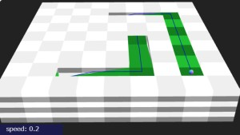
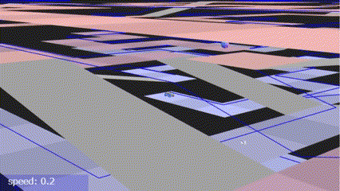
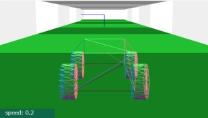
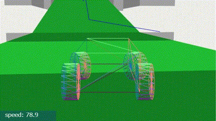
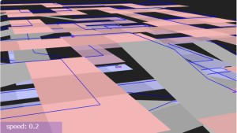
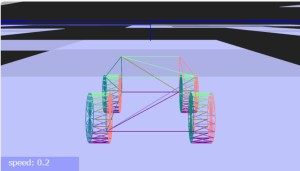

# Three.js Cannon.es - 立体迷路の例

## この記事のスナップショット

[ソース](051/)

動かし方

- ソース一式を WEB サーバ上に配置してください
- 操作法
  - {カーソルキー左右}／左スティック／十字キー（左右）  .. 車操作（ハンドル）
  - {カーソルキー上}／右スティック上／Aボタン           .. 車操作（アクセル）
  - 'b'／右スティック下／Bボタン                        .. 車操作（ブレーキ）
  - {カーソルキー下}／／Yボタン                         .. 車操作（バック）
  - 'n'(ON/OFFの切り替え)／Yボタン(押したときだけ有効)  .. 車操作（サイドブレーキ）
  - 'c'／RBボタン／LBボタン .. カメラ視点の変更
    - 俯瞰（ふかん）：遠方から
    - ドローン：バードビュー（後方・上空から正面を向いて）
    - ドローン：ドライバーズビュー（中心から正面を向いて）
    - ドローン：周りを公転
  - 'r'／RTボタン .. 姿勢リセット
  - LTボタン      .. マップリセット
  - '1','2','3','4','5','6','7','8'／Startボタン／Backボタン .. マップ切り替え
  - 'q' .. キーボードからゲームパッドへフォーカス変更

## 概要

立体迷路モジュールMaze4を使った例を２つ示します。

コードは
 [3D迷路の例（オーソドックスな迷路とキャットウォーク）](048.md)
に追加する形にしています。

- オーソドックスな迷路「通路と壁が同じサイズの迷路」
- オーソドックスな迷路「薄い壁の迷路」＋最短経路
- オーソドックスな迷路「薄い壁の迷路」＋最短経路（十字と斜め）
- オーソドックスな迷路「通路と壁が同じサイズの迷路」(HighField利用）
- キャットウォーク「通路と壁が同じサイズの迷路」(HighField利用）
- マイクロマウスの迷路：「薄い壁の迷路」＋最短経路（十字と斜め）
- 立体迷路「通路・壁が同じサイズの迷路」（緩やかな斜坑）      <<<< New!!
- 立体迷路「通路・壁が同じサイズの迷路」（経路のみ：壁なし）  <<<< New!!

## やったこと

- 立体迷路「通路・壁が同じサイズの迷路」（緩やかな斜坑）
- 立体迷路「通路・壁が同じサイズの迷路」（経路のみ：壁なし）

### 立体迷路「通路・壁が同じサイズの迷路」（緩やかな斜坑）

移動体は車なので、たて坑の迷路は論外です。
（穴から下に落ちても、上の層に登る手段がない）
斜坑の迷路（緩やかではない方）ではやや勾配がきつく坂道発進が難しい角度です。
高さを抑えれば坂道も緩くなりますが、全体的に縦につぶれた感じになるので見送りました。

ということで、「緩やかな斜坑の迷路」を使うのですが、マス内で旋回できるよう横幅はやや広く、
天井から圧迫感を感じないようでも出来るだけ低い高さにしています。

配色は少々難航し、奇数階層（床／天井）は濃淡のグレー（灰色）に、
偶数階層（壁）は濃淡の白色にしてます。

最短経路の表現には、経路上の床／斜坑を濃淡の緑にしました。
これだけではアップダウンと９０度カーブが組み合わさった時にわかりずらいので、
空中に浮いた直線（青）も経路として表示させてます。
（スマートな方法が他に思いつかなかったための苦肉の策）

迷路データでは四方（立体だから６面）を囲むように壁があるのですが、
一番上の層の天井の壁はとっぱらいました。
解放感があって息抜きになります。

ちなみに私の環境だと、迷路が小さいうちは軽快に動くのですが 17x9x17 のサイズあたりから急激に重くなりました。
まぁこの辺から部品数が１万近くになるので仕方ないのかも？

下記は、ゴール直前～スタートのシーンです。

### 立体迷路「通路・壁が同じサイズの迷路」（経路のみ：壁なし）

「壁をとっぱらえば立体感がでるかな？」という思いつきで作ったものです。

基本構造は上記の「立体迷路「通路・壁が同じサイズの迷路」（緩やかな斜坑）」と同じで、
違うところは最短経路以外のブロックを消して、経路上の床ブロックを薄くしてます。
あと階層ごとに色分けして、高さの違いがわかるようにしました。

下記は、いろんな角度からコースを眺めた場合です。

## まとめ・雑感

今回のコース、「キャットウォーク」のコースと比べても負けず劣らずの楽しい仕上がりで満足です。
ただ惜しむらくは、坂と平地のつなぎが角ばっている点でしょうか。
滑らかに補間できればもっと走りやすいコースになりそうだけど、ちょっと保留／勉強ですね。

------------------------------------------------------------

前の記事：[迷路作成モジュール（３）立体迷路](050.md)

次の記事：[3D迷路の例（２）バランスゲーム](052.md)

目次：[目次](000.md)

この記事には次の関連記事があります。

- [迷路作成モジュール（１）「通路と壁が同じサイズ」と「薄い壁」](046.md)
- [迷路作成モジュール（２）斜め移動を考慮](047.md)
- [迷路作成モジュール（３）立体迷路](050.md)

- [3D迷路の例（オーソドックスな迷路とキャットウォーク）](048.md)
- [3D迷路の例（２）バランスゲーム](052.md)

- [立体迷路の例](051.md)

--