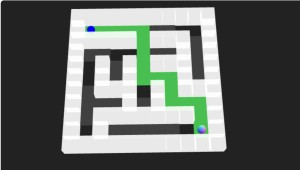
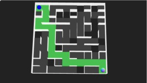

# Three.js Cannon.es - 3D迷路の例（２）バランスゲーム

## この記事のスナップショット




[ソース](052/)

動かし方

- ソース一式を WEB サーバ上に配置してください
- 操作法
  - {カーソルキー上下左右}  .. ボードを傾ける
  - '1','2','3','4','5' .. マップ切り替え
  - '0' .. クリア周回をリセット
  - マウスホイール .. ズームイン／ズームアウト
  - ~~マウスの左ボタンをドラッグ .. 視点を変更~~(推奨せず)

## 概要

2Dの迷路モジュールMaze1, Maze2, Maze3を使った例としてバランスゲーム（？）を示します。
ボード（迷路）を傾けて、ボールをゴール（左下）まで転がすやつです。

マップとして 1~5種類、下記の通りです。
- 「通路と壁が同じサイズの迷路」（棒倒し法で作成）
- 「通路と壁が同じサイズの迷路」（穴掘り法で作成）
- 「薄い壁の迷路」（棒倒し法で作成）
- 「薄い壁の迷路」（穴掘り法で作成）
- 「薄い壁の迷路」（穴掘り法で作成）＋斜め経路も表示

周回ごとに、迷路が大きくなるとともに、落とし穴が増えていきます。

## やったこと

- 迷路（ボード）の作り方
- ゴールの設置
- 落とし穴
- カメラ位置

### 迷路（ボード）の作り方

迷路（ボード）を全体的に傾けることになるので、床や壁を１つのオブジェクトにする必要があります。
なので追加先の CANNON.Body および THREE.GROUP を作ってそこに床や壁を追加します。

```js
//追加先（コンテナ）
const moCntnrBody = new CANNON.Body({
    mass: 0,
    position: new CANNON.Vec3(0, 0, 0),
    material: moMazeMtr,
});
const viCntnrMesh = new THREE.Group();
```

```js
//追加の例：壁の追加
moCntnrBody.addShape(new CANNON.Box(new CANNON.Vec3(sx_, sy_, sz_)),
                      new CANNON.Vec3(px+adjx, py+adjy, pz+adjz));
const viWall2Geo = new THREE.BoxGeometry(sx, sy, sz);
const viWall2Mtr = new THREE.MeshBasicMaterial({transparent: true, opacity: 0.9});
const viWall2Mesh = new THREE.Mesh(viWall2Geo, viWall2Mtr);
viWall2Mesh.position.copy(new CANNON.Vec3(px+adjx, py+adjy, pz+adjz));
viCntnrMesh.add(viWall2Mesh);
```

キー入力で傾けるときはコンテナのクォートを傾けます。
ちなみに傾ける角度は小さめにしています。
というのも迷路が大きくなっていくと少し傾けただけでもボードの端っこではけっこうな移動距離になって床がボールをすり抜けることがありました。なので気持ちゆっくりと動くくらいにしています。

関連して、ボードの上面にフタをしてボールが飛び出ないようにしてます。
傾きを切り替えたくて傾けると、ボードを揺らすように動いてしまうのか、ボールが跳ねることがあったので。

```js
//キー入力による傾け方
let vquat = moCntnrBody.quaternion;
const radStep = 0.002;
if (keyEvnt.left) {
    var quat = new CANNON.Quaternion().setFromAxisAngle(new CANNON.Vec3(0, 0, 1), radStep);
    vquat = vquat.mult(quat);
    moCntnrBody.quaternion.copy(vquat);
} else if (keyEvnt.right) {
    var quat = new CANNON.Quaternion().setFromAxisAngle(new CANNON.Vec3(0, 0, 1), -radStep);
    vquat = vquat.mult(quat);
    moCntnrBody.quaternion.copy(vquat);
}
```

### ゴールの設置

ゴールで当たり判定を行いたく、でもボード上に配置したく、結果、LockConstraintで固定させています。
本来なら動かない想定なのですが、ボードを傾けたときにユラユラと動きます。
ボードが動くことで力がかかったような状態になっているのかな？まぁ支障はないので現状でも良しとします。

```js
// 制約でゴールをボードに固定させる
const moObj1Const = new CANNON.LockConstraint(moCntnrBody, moBallBody);
moCntnrBody.pivotA = new CANNON.Vec3(px, py, pz);
moBallBody.pivotB = new CANNON.Vec3(0, 0, 0);
world.addConstraint(moObj1Const);
```

### 落とし穴

アクセントをつけたくて落とし穴を作ることにしました。といっても床を作らないだけです。
落とし穴の場所は最短経路以外の場所を確率で選択しています。

単純な穴なのでハードルが高いです。
穴を囲うように小さな段差をつければ多少ましな気も。

### カメラ位置

カメラ位置はボードの中心から上空に位置したところから見下ろすように配置してます。
マウス操作（左ボタンのドラッグ操作）でボードを傾けて眺めることができますが、
水平位置が分からなくなるので触らないことをお勧めします。
マウスホイールのズームイン／ズームアウトは問題ないです。

## まとめ・雑感

迷路ゲームを考えていたときに当初から考えていたものですが、
実際にモノをつくってプレイしてみるとむずかしいし、集中力を要するしで、
疲れるゲームになってしまいました。
上手くまとめられませんでしたが、せっかくなので公開しておきます。
知育玩具とかでよく見かけるので簡単なレベルかとおもっていたのに。

落とし穴がなくても、思ったようにボールが動かずにちょっとイライラします。
スムーズに動くように摩擦を小さくしたり、重力係数を大きくしたりしましたが、やっぱりボードの傾け方が問題かも。
ボードの中心で傾けているがために傾ける角度に制約ができてます。
ボールを中心にして、ボードを傾けられたら、急激に傾けることもできるのかな？

この手のゲームはキーボードよりもタブレット端末でやれたら面白そうだけど、
ちょうど今検索したらヒントになりそうなものが出てきたよ。うん、またの機会に。

[JS：端末の傾きに応じてボールを動かす](https://dianxnao.com/javascript%e7%ab%af%e6%9c%ab%e3%81%ae%e5%82%be%e3%81%8d%e3%81%ab%e5%bf%9c%e3%81%98%e3%81%a6%e3%83%9c%e3%83%bc%e3%83%ab%e3%82%92%e5%8b%95%e3%81%8b%e3%81%99/)

まぁこの段階でいろいろと問題が浮き彫りになってよかったのかな？！と思うことにします。
これはこのくらいにしときましょ。

------------------------------------------------------------

前の記事：[立体迷路の例](051.md)

次の記事：[車で吹っ飛ばし／ラッセル車](053.md)


目次：[目次](000.md)

この記事には次の関連記事があります。

- [3D迷路の例（オーソドックスな迷路とキャットウォーク）](048.md)
- [3D迷路の例（２）バランスゲーム](052.md)

--