# Three.js Cannon.es - 車で吹っ飛ばし／ラッセル車

## この記事のスナップショット


[ソース](053/)

動かし方

- ソース一式を WEB サーバ上に配置してください
- 操作法
  - {カーソルキー左右}／左スティック／十字キー（左右）  .. 車操作（ハンドル）
  - {カーソルキー上}／右スティック上／Aボタン           .. 車操作（アクセル）
  - 'b'／右スティック下／Bボタン                        .. 車操作（ブレーキ）
  - {カーソルキー下}／／Yボタン                         .. 車操作（バック）
  - 'n'(ON/OFFの切り替え)／Yボタン(押したときだけ有効)  .. 車操作（サイドブレーキ）
  - 'c'／RBボタン／LBボタン .. カメラ視点の変更
    - 俯瞰（ふかん）：遠方から
    - バードビュー（後方・上空から正面を向いて）
    - ドライバーズビュー（中心から正面を向いて）
    - 周りを公転
  - 'r'／RTボタン .. 姿勢リセット
  - LTボタン      .. マップリセット
  - '1','2','3','4','5','6'／Startボタン／Backボタン .. 装備の切り替え
  - 'z','x' .. マップ切り替え
  - 'q' .. キーボードからゲームパッドへフォーカス変更
  - 'Enter'／LTボタン .. 場外判定（すべて場外時に次のステージに）

## 概要

ストレス解消なるようなものを作りたくて、
吹っ飛ばすものを作りました。

イメージは雪かきするラッセル車です。
車につけたブレードやハンマー、ドリルなどで吹っ飛ばします。

ステージには地面の画像を隠すように、直方体／球を配置してます。


車の装備 | 説明
--------|--------
ブレード（平ら）  | 横長の固定板
ブレード（斜め）  | 横長の固定板をやや斜め
ささら（円筒）    | 円筒が回転しながら吹っ飛ばし（弱）
ハンマー×４       | スピードに比例して上方に吹っ飛ばす
ドリル           | スピードに比例して前方に吹っ飛ばす
トライデント      | スピードに比例して３方に吹っ飛ばす

悪ノリして、ナインボール（ビリヤード）、ボーリング、ドミノ倒しぽく配置したものもあります。

ステージ | 説明
--------|--------
stage1  | 立方体（小粒）、やたら滑る床
stage2  | ひし餅（極薄）、やたら滑る床
stage3  | ひし餅、滑らない床
stage4  | ひし餅、やたら滑る床
stage5  | 立方体、デフォ摩擦の床
stage6  | 球（激重）、デフォの床
stage7  | ひし餅（重）、やたら滑る床
stage8  | 立方体（重）、デフォ摩擦の床
stage9  | 球（激重）、沼の床
stage10 | ナインボール（ビリヤード）
stage11 | ボーリング
stage12 | ドミノ倒し

地面の画像はランダムで選択しています。
ちなみにフリー画像からもってきてます。

## やったこと

- 車の装備
  - ブレード（平ら／斜め）
  - ささら（円筒）
  - ハンマー×４
  - ドリル
  - トライデント
  - 既知の不具合

- ステージ
  - 構成

- 場外判定

### 車の装備

- ブレード（平ら／斜め）

ブレード（平ら）

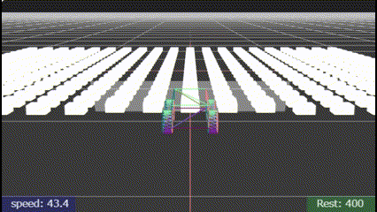

ブレード（斜め）

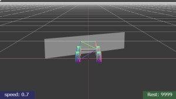
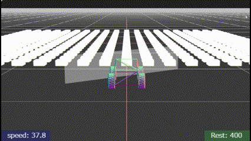

車の前方にブレードを配置しただけです。動きません。
気持ち大きめのサイズにして、地面にふれるギリギリまで下げてます。
極薄のオブジェクトでも引っかかるように調整してますが、車の傾き（加速中）によっては拾えないときがあります。

- ささら（円筒）


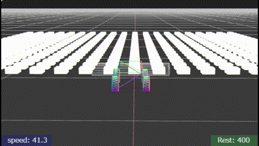

車の前方に回転する円筒を配置しています。
ササラ電車をイメージしてます。
小さいモノ／軽いものを吹っ飛ばせるように用意しました。
重いものには向いていません。

- ハンマー×４


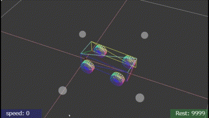

上から見たときの様子


グラディ〇ス（コ〇ミ）のオプションのローリングをイメージしていたのですが、作ってみたらハンマー投げのようになってしまいました。
ハンマーに触れたら上方（真上）に吹っ飛ばすようなイベント／アクションを組み込んでます。
ハンマーは質量ありのボールで、モノにぶつかると公転軌道がズレたり遅れたりします。
小さいものには適していませんが、そこそこの大きさ・重さのモノなら、気持ちよくポンポン吹っ飛ばしてくれます。

- ドリル

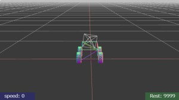

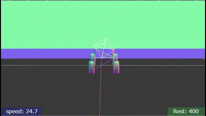

悪ノリして魔改造してみました。
ドリルっぽく、三角すいを回転させてます。
ここに触れたら前方に吹っ飛ばすようなイベント／アクションを組み込んでます。
レールガンぽくて、お気に入り。
派手に散らかしてくれますが、まとめて吹っ飛ばすことはできません。
また激重なものには適してません。

- トライデント

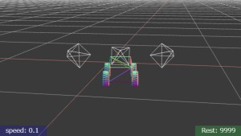

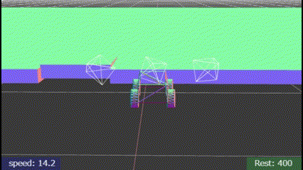

魔改造のその２です。
ドリルを三つに増やしました。増やしただけでは芸がないので、中央のドリルは威力を強め（速度の二乗に応じた力で吹っ飛ばす）にしてます。
車の前方のみが重くなっておりバランスが悪くなってますが、威力は折り紙付きです。
対黒オブジェ（重い）用といってもよいくらいの吹っ飛ばしをみせてくれます。

- 既知の不具合

装備切り替え時、ハンマーやドリルに切り替えるときに車のバランスを崩したり、回転の向きが逆向き／バラバラになったります。再度装備（番号を再度押下）するか、一度外して(0を押したあと)再度装備すると正常に表示されることがあります（されないときもあります）。

### ステージ

立方体（小粒）、やたら滑る床


ひし餅（極薄）、やたら滑る床
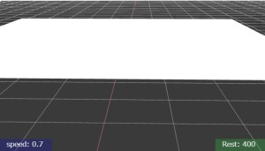

ひし餅、滑らない床
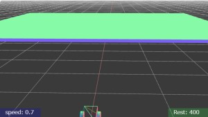

球（激重）、デフォの床
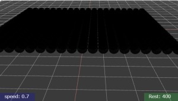

球（激重）、沼の床
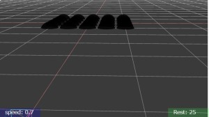

ビリヤード
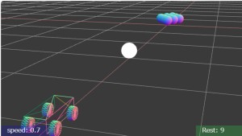

ボーリング


ドミノ倒し
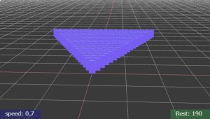


ステージ構成として雪のようなオブジェクトを置きたかったのですが、
小さなものを大量に配置すると処理が重くなるので、
自分のマシン環境でそこそこ遅くならない程度で抑えています。

単純に掃除するだけだと単調なので、地面に画像を張ることにしました。
お気に入りの画像するとモチベーションが上がります。
（上記のスナップショットでは見やすさのため、画像を貼り付けてません）
なお、画像に関しては公開時にはいろいろと問題があるので同梱の画像はフリー素材にしてます。

お邪魔オブジェには小さく軽いもの（白）から中くらい、重いもの（黒）を用意してみました。
あと配置を工夫してビリヤードやボーリング、ドミノ倒しといったものも用意してみました。

### 場外判定

お邪魔オブジェクトがすべて範囲外になったら自動でステージクリアとしたかったのですが、、
適当なタイミングで場外判定操作（Enterキー押下）をしてください。

右下のフレームでカウントダウンしてますが、実際の数値とズレているので目安程度に。

一応「領域外に物体が出たことを感知するイベント」を使ってカウントダウンしてますが、
過剰に反応したり反応しなかったりです。物体が再度領域内に入った場合も考慮してます。
（いい所まではいってると思うのだけれど）

```js
// 領域外に物体が出たことを感知するイベントのコード
function eventEndContactBoundary(e) {
  let moBlck = e.bodyA;
  let moBrdr = e.bodyB;
  if ((moBlck !== undefined) && (moBrdr !== undefined)) {
    if (moBlck.isBlock_ === undefined) {
        [moBlck, moBrdr] = [moBrdr, moBlck];
    }
    let posi = moBlck.position;
    if (posi.x < borderRng[0] || borderRng[2] < posi.x ||
        posi.z < borderRng[1] || borderRng[3] < posi.z) { // 領域外にいる
      if (moBlck.isIN_) {  // 領域内のフラグが立っていた
        moBlck.isIN_ = false;
        nBlock -= 1; // 残りを減らす
      }
      setLabelB("Rest: "+nBlock)
      if (nBlock == 0) {
        console.log("\n .. stageClear()");
        // stageClear();
      }
    }
  }
}
world.addEventListener('endContact', eventEndContactBoundary);

// 領域内に物体が侵入した際のイベントのコード
moBorder2Body.addEventListener('collide', (e) => {
  let moBlck = e.contact.bi;
  let moBrdr = e.contact.bj;
  if ((moBlck !== undefined) && (moBrdr !== undefined)) {
    if (moBlck.isBlock_ === undefined) {
      [moBlck, moBrdr] = [moBrdr, moBlck];
    }
    if ((moBrdr.isBorder_ != undefined) && (moBlck.isBlock_ != undefined)) {
      let posi = moBlck.position;
      if (posi.x >= borderRng[0] && borderRng[2] >= posi.x &&
          posi.z >= borderRng[1] && borderRng[3] >= posi.z) { // 領域内にある
        if (moBlck.isIN_ == false) {  // 領域外のフラグだった
          moBlck.isIN_ == true;
          ++nBlock;  // 残りを増やす
          // console.log("incr: nBlock=",nBlock);
        }
      }
    }
  }
})
```

結局、マニュアル操作（Enterキー押下時に）で領域判定の関数を呼び出すことにしました。

作成したオブジェクトにお邪魔ブロックであるフラグ(isBlock_)および領域内フラグ(isIN_)を追加。

```js
// お邪魔オブジェクトを作るところ
function createBox(sx, sy, sz, px, py, pz, adjx, adjy, adjz, mass, momtr, vimtr) {
    const sx_ = sx/2, sy_ = sy/2, sz_ = sz/2;
    const moBlock2Body = new CANNON.Body
    ({mass: mass,
      shape: new CANNON.Box(new CANNON.Vec3(sx_, sy_, sz_)),
      position: new CANNON.Vec3(px+adjx, py+adjy, pz+adjz),
      material: momtr,
      });
    moBlock2Body.isBlock_ = true;  // 自身がお邪魔ブロックであることを示すフラグ
    moBlock2Body.isIN_ = true;  // 領域内にいることを示すフラグ
    world.addBody(moBlock2Body);
    ...
}
```

作成したオブジェクトを id ごとに（ここでは id2movi に連想配列として）保持します。

```js
// 作成したオブジェを保持
let [moBlock2Body, viBlock2Mesh] = createBox(sx, sy, sz, ...);
moBlock2Body.idx = idx;
id2movi[idx] = [moBlock2Body, viBlock2Mesh]; // 連想配列に登録
++idx;
```

一方で、場外判定に使う境界(borderRng)はオブジェクト配置後に設定します。

```js
// 場外判定の境界（MinMax）
borderRng = [-ssx_, -ssz_, ssx_, ssz_];
```

あとは場外判定の関数で、すべてのオブジェクトの位置を確認して、すべて場外ならステージクリアとします。

```js
// 場外判定の関数
function judgeBorder() {
  console.log("judgeBorder");
  let nBlock_ = 0;
  for (const id in id2movi) {
    const [moBlock2Body, viBlock2Mesh] = id2movi[id];
    let posi = moBlock2Body.position;
    if (posi.x < borderRng[0] || borderRng[2] < posi.x ||
        posi.z < borderRng[1] || borderRng[3] < posi.z) {
      // 場外に出た
      moBlock2Body.isIN_ = false;
      viBlock2Mesh.material.wireframe = true; // ワイヤーフレーム表示に
    } else {
      // 場内に残っている
      ++nBlock_;
      moBlock2Body.isIN_ = true;
      viBlock2Mesh.material.wireframe = false;
    }
  }
  console.log("judgeBorder nBlock=",nBlock_);
  nBlock = nBlock_;
  setLabelB("Rest: "+nBlock)
  if (nBlock == 0) {
    // すべて場外だった
    console.log("\n .. stageClear()");
    stageClear();
  }
}
```

場外に出たものはワイヤーフレーム表示に切り替えているので、場内に残っているものが見つけやすくなっていると思います。

Enterキーを押したタイミングですべて場外なら次のステージに切り替わりますが、Enterキーを押さずにそのまま「お掃除」を続けることもできます。
また場内に残っていても「z」「x」キーを押せばステージが強制的に切り替わります。

## まとめ・雑感

前回の記事（迷路のバランスゲーム）がストレスなゲームだったので、
爽快にストレス発散できそうなものとして作ってみました。

ラッセル車のように爽快に吹き飛ばす感じにしたかったのですがどうでしょうか？
もっと多量に配置しても処理落ちしなければなぁ。

今回、近距離な装備（？）ばかりだったのでちょっと遠距離／飛び道具なものも考えてみたいし、
ステージも凝ってみたいかなぁ？！

------------------------------------------------------------

前の記事：[3D迷路の例（２）バランスゲーム](052.md)

次の記事：..


目次：[目次](000.md)

この記事には関連記事がありません。

--