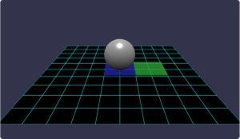
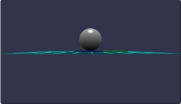

# Babylon.js で物理演算 - 板と落下する玉

## この記事のスナップショット



[ソース](057/)

## 概要

Babylon の物理演算の手始めに皆さんが最初に作る落ちモノを作り、
それぞれの物理エンジンで確認してみました。

## やったこと

- createSceneのjsをそのまま実行できるhtml
- 地面に平たい板、上空に球を配置して、落下を確認
- 物理エンジン oimo, cannon, ammo, havok でそれぞれ挙動を見る

### createSceneのjsをそのまま実行できるhtml

PlayGround のJavaScriptのコードをそのまま .js にファイルにしてCDN環境で実行できるhtmlと
同じ js ファイルを使ってローカルで動かせる html(疑似的にPlayGroundの環境を再現)も用意しました。

CDN環境用の html（ソースの ～_cdn.html）は読み込む jsファイルのパスを書き換えるだけでOKです。
余計な物理エンジンも呼び出してますが気になるならコメントアウトしてください。
動作には問題ないです。

ローカルで動かす html （ソースの ～_local.html）は、（cannon, oimo）、ammo、havok で異なります（3種類に）。

CDN環境のhtmlの情報源は PlayGround でダウンロードしたコードだったかな？
それをローカル環境用にカスタマイズしてます。


### 地面に平たい板、上空に球を配置して、落下を確認

地面、板、球の位置関係は次のような感じです。


```js
// 形状のところを抜粋（物理係数のところは省略

    // 地面を設定する
    const ground = BABYLON.MeshBuilder.CreateGround("ground",
        { width: 10, height: 10 }, scene);
    ground.material = new BABYLON.GridMaterial("groundMaterial", scene);
    ground.material.majorUnitFrequency = 1;
    ground.material.minorUnitVisibility  = 0;

    const sphere = BABYLON.MeshBuilder.CreateSphere("sphere",
        { diameter: 2, segments: 32 }, scene);
    // ボールの表示位置を設定する
    sphere.position.y = 10;

    var box = BABYLON.MeshBuilder.CreateBox("box", {width:2, height:0.1, depth:2});
    box.position.set(0, 1.5, 0);
    var blueMat = new BABYLON.StandardMaterial("blue", scene);
    blueMat.diffuseColor = new BABYLON.Color3(0.2, 0.2, 0.9);
    blueMat.alpha = 0.8;
    box.material = blueMat;

    var box2 = BABYLON.MeshBuilder.CreateBox("box", {width:2, height:0.1, depth:2});
    box2.position.set(2, 1.5, 0);
    var box2Mat = new BABYLON.StandardMaterial("green", scene);
    box2Mat.diffuseColor = new BABYLON.Color3(0.2, 0.9, 0.2);
    box2Mat.alpha = 0.8;
    box2.material = box2Mat;
```

### 物理エンジン oimo, cannon, ammo, havok でそれぞれ挙動を見る

物理エンジンv1(oimo, cannon, ammo)とv2(havok)では記述の仕方が異なります。

```js
// 物理エンジンの定義  oimo vs havok
    const physicsPlugin = new BABYLON.OimoJSPlugin();
    // ------------------------------------------------------------
    const physicsPlugin = new BABYLON.HavokPlugin();

```

```js
// 地面に摩擦係数、反射係数を設定  oimo vs havok
    ground.physicsImpostor = new BABYLON.PhysicsImpostor(
        ground, BABYLON.PhysicsImpostor.BoxImpostor, { mass: 0, friction: 0.4, restitution: 0.6 }, scene);
    // ------------------------------------------------------------
    var groundAggregate = new BABYLON.PhysicsAggregate(
        ground, BABYLON.PhysicsShapeType.BOX, { mass: 0, restitution:0.75}, scene);

```

パラメータ値がずれてますが、合わせこみ（同じ挙動になるように調整したわけ）ではないです。
参照した記述例をそのまま引用しただけなので値は気にしないでください。


それで、実際に動かした感じがこちら。
（リンクを貼りまくると重くなるので cannon, ammo についてはソースの js を PlayGroundにコピペして確認してください）

oimo で「板と落下する玉」

https://playground.babylonjs.com/#H84GVE

havok で「板と落下する玉」

https://playground.babylonjs.com/#I58AXP


皆さんは気づいたでしょうか？
oimo, cannon では、床に密着しているはずの "板が宙に浮いている" ことに。

oimo の場合


havok の場合


その後、`形状を立方体にしたら` 正しく床に接地していることを確認してます。

最初にこれを目にした時のがっかり感といったら。

cannon を今まで使ってきてこんなことは無かったので、
単純に babylon 側の組み込み方にバグがあるのだと思います。
何も知らない人がこれを見て oimo, cannon はダメなライブラリと思いそうなことが
とても残念でほかならないです。

とりあえず見なかったことに。

## まとめ・雑感

がっかりへにょんな一幕はありましたが、とりあえず物理エンジンは havok で。

ちなみに ammo と havok では挙動が多少ちがうようです。
板と球がぶつかったときに板がすり抜けたり、球が転がる方向が毎回違ったり、板の動き方が違ったり。

------------------------------------------------------------

前の記事：[TypeScript で迷路モジュール](056.md)

次の記事：[Babylon.js で物理演算(havok)の基礎調査：静止した形状を回転させる](058.md)


目次：[目次](000.md)

この記事には関連記事がありません。

--