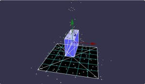
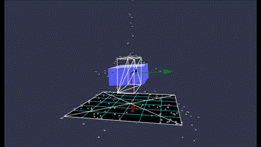
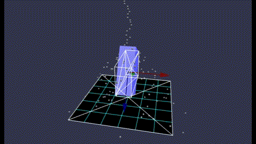
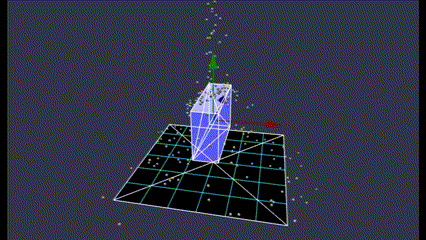
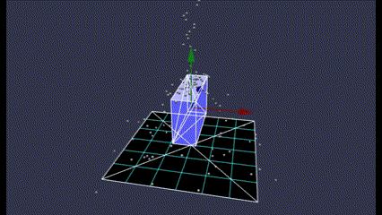
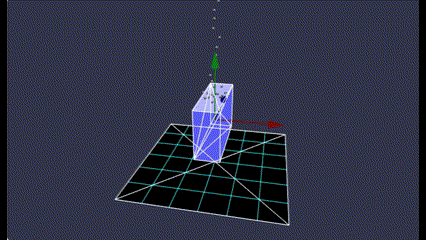
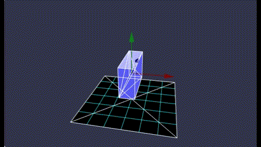
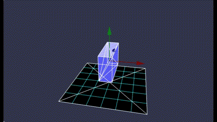

# Babylon.js で物理演算(havok)の基礎調査：静止した形状を回転させる

## この記事のスナップショット



https://playground.babylonjs.com/#BLL7WD

[ソース](058/)

ローカルで動かす場合、 ./js 以下のライブラリは 057/js を利用してください。

キー操作

- w,s := ワールド系のx軸で回転
- a,d := ワールド系のz軸で回転
- i,k := 物体のローカル座標系の x軸で回転
- j,l := 物体のローカル座標系の z軸で回転

## 概要

本件は babylonjs の物理エンジン havok で
「静的な物体(mass=0)を自在な位置・姿勢で配置する」
ことを目的とした基礎調査の報告になります。

物理系の確認として、対象の物体の上から小さな玉を落としています。

一方で、キー操作で対象を回転させることも行いました。


## やったこと

- 必要な設定(PhysicsMotionTypeとPrestepType)
- 回転のさせ方（世界系とローカル系の回転）
- キー操作
- 上部から玉を落とす（無限ループ
- デバッグ表示
  - 物理メッシュを表示する
  - ローカル軸の表示

### 必要な設定(PhysicsMotionTypeとPrestepType)

デフォルトの状態で物体を配置しただけでは、描画は書き変わっても、物理形状はそのままです。

こちらは縦長の物体を右に（Ｚ軸で）９０度回転させたときの様子です。
描画（青の直方体）は横に傾いたのに、物理形状（白のワイヤーフレーム）は動かず、
またそれを証明するように上から落ちてくる玉は白のワイヤーフレームにぶつかってます。



これは、`PhysicsAggregate`のメンバのbody(PhysicsBodyクラス)の
`PhysicsMotionType` と `PhysicsPrestepType` がデフォルトのままな為です。

[PhysicsMotionType](https://doc.babylonjs.com/typedoc/classes/BABYLON.PhysicsBody)から抜粋(機械翻訳)

- PhysicsMotionType.STATIC
  - 静的ボディは移動せず、力や衝突の影響を受けません。レベルの境界や地形に適しています。
- PhysicsMotionType.ANIMATED
  - 動的ボディのように動作しますが、他のボディの影響を受けませんが、他のボディを押しのけます。
- PhysicsMotionType.DYNAMIC
  - 動的ボディは完全にシミュレートされます。移動したり、他のオブジェクトと衝突したりできます。

[PhysicsPrestepType](https://doc.babylonjs.com/features/featuresDeepDive/physics/prestep)から抜粋(機械翻訳)

- TELEPORT
  - テレポート モードでは、ボディは接触している形状と制限された相互作用を持ちます。
  - テレポート モードは、たとえばギズモを使用してオブジェクトを配置する場合に適しています。
- ACTION
  - アクション モードでは、ボディはワールド内で効果的に移動して、接触している形状と相互作用します。
  - ゲーム中はアクション モードです。

設定は以下のように行います。

```js
const trgMesh = BABYLON.MeshBuilder.CreateBox("target", { width: 1, height: 2, depth: 3 }, scene);
var trgAgg = new BABYLON.PhysicsAggregate(trgMesh, BABYLON.PhysicsShapeType.BOX, { mass: 0.0, restitution:0.05}, scene);

// trgAgg.body.setMotionType(BABYLON.PhysicsMotionType.STATIC); // default
trgAgg.body.setMotionType(BABYLON.PhysicsMotionType.ANIMATED);
// trgAgg.body.setMotionType(BABYLON.PhysicsMotionType.DYNAMIC);

// trgAgg.body.setPrestepType(BABYLON.PhysicsPrestepType.DISABLED); // default
trgAgg.body.setPrestepType(BABYLON.PhysicsPrestepType.TELEPORT);
// trgAgg.body.setPrestepType(BABYLON.PhysicsPrestepType.ACTION);
```

各パラメータの指定と動作は次のとおりでした。

PhysicsMotionType | PhysicsPrestepType | 動作
------------------|--------------------|---------------------------------
 STATIC(undef)    | DISABLED(undef)    | ×物理は静止、描画が回転 (12.gif)
 ..               | TELEPORT           | 〇同期して回転           (13.gif)
 ..               | ACTION             | ×物理は静止、描画が回転
 ANIMATED         | DISABLED(undef)    | ×完全に静止
 ..               | TELEPORT           | 〇同期して回転
 ..               | ACTION             | ◎同期して回転(玉をはじく) (14.gif)
 DYNAMIC          | DISABLED(undef)    | ▽回転しないが、微動
 ..               | TELEPORT           | △回転する。静止時に微動  (15.gif)
 ..               | ACTION             | ◎同期して回転(玉をはじく)


- ×物理は静止、描画が回転 (12.gif)
  - 描画と物理形状が同期していない組み合わせで、誤解しやすい状況です

  

- 〇同期して回転 (13.gif)
  - 描画と物理形状が同期・連動して動きます
  - 回転時に玉をはじかない（周りに影響を与えずに自転）

  

- ◎同期して回転(玉をはじく) (14.gif)
  - 描画と物理形状が同期・連動して動きます
  - 回転時に玉をはじきます
  - 読者が想定しやすい／期待している動作かも

  

- △回転する。静止時に微動  (15.gif)
  - 描画と物理形状が同期・連動して動きます
  - 微動とは「玉がぶつかった」影響で直方体が少し動きます。gifは10倍で再生した様子

  


一番最初（「×物理は静止、描画が回転」）は論外としても、
他は使い方次第かと思います。
回転時に玉をはじかない／影響を及ぼさない（`ANIMATED`/`TELEPORT`）は「姿勢の調整／リセット」に、
微動な動作をする（`DYNAMIC`/`TELEPORT`）は「なんとなく動く演出」に、使えそうです。

### 対象の物体（ターゲット）をキー操作で回転

キー操作は
[Babylon.jsで指定したオブジェクトをキーボード操作で移動させてみよう＠Tak](https://www.crossroad-tech.com/entry/babylonjs-translate-keyinput)
さまを参考にさせていただきました。
（コードを一部再掲）

```js
var map ={}; //object for multiple key presses
scene.actionManager = new BABYLON.ActionManager(scene);
scene.actionManager.registerAction(new BABYLON.ExecuteCodeAction(BABYLON.ActionManager.OnKeyDownTrigger, function (evt) {								
    map[evt.sourceEvent.key] = evt.sourceEvent.type == "keydown"; 
}));
scene.actionManager.registerAction(new BABYLON.ExecuteCodeAction(BABYLON.ActionManager.OnKeyUpTrigger, function (evt) {								
    map[evt.sourceEvent.key] = evt.sourceEvent.type == "keydown";
}));
var distance = 0.01;
scene.registerAfterRender(function() {	
    if (map["w"]) {
        ...
    }
}
```

ちなみにキーレスポンスの良くない（タメが発生する入力）コードもあるようです。

```js
// キーレスポンスの良くない（タメが発生する入力）コード
scene.onKeyboardObservable.add((kbInfo) => {
    switch (kbInfo.type) {
    case BABYLON.KeyboardEventTypes.KEYDOWN:
        switch (kbInfo.event.key) {
        case "w":
            ...
        }
        break;
    }
});
```

### 回転のさせ方（世界系とローカル系の回転）

物体を回転させるには `rotation` でもよいのですが、クォータニオンを使いたいので `rotationQuaternion` で回転させます。

```js
let quat = trgMesh.rotationQuaternion;
let quat2 = BABYLON.Quaternion.FromEulerAngles(0, 0, 0.1);
trgMesh.rotationQuaternion = quat2.multiply(quat);
```

余談ですが、`physicsBody` 経由でも同じ動作になるようです。

```js
let quat = trgMesh.physicsBody.transformNode.rotationQuaternion;
let quat2 = BABYLON.Quaternion.FromEulerAngles(0, 0, 0.1);
trgMesh.physicsBody.transformNode.rotationQuaternion = quat2.multiply(quat);
```

回転のさせかたが難しいなぁと思っている方にちょっとだけ説明。
「物体の姿勢を表すクォータニオン」に、「ある軸で回転させたクォータニオン」を作用させると、
「ある軸で回転させた物体」になります。
クォータニオンの面白い性質とて、かけ合わせるときの左と右を入れ替えると全く違う結果になります。
コード上では次のようになります。

```js
// 「ワールド／絶対座標系で回転」＝ 「微小回転のクォータニオン」＊「物体のクォータニオン」
trgMesh.rotationQuaternion = quat2.multiply(quat);

// 「ローカルな座標系で回転」　　＝ 「物体のクォータニオン」　　＊「微小回転のクォータニオン」
trgMesh.rotationQuaternion = quat.multiply(quat2);
```

- 「ワールド／絶対座標系で回転」
  - 描画シーンの座標系で回転させる場合を呼称してます
  - 物体の姿勢に対して、ワールドの座標軸で回転させます
  - キー操作(w,sキー: x軸回転、a,dキー：z軸回転)で確認できます
  - 回転軸は、（わかりにくいですが）水平左右（ｘ軸）と水平前後（ｚ軸）にしています

  

- 「ローカルな座標系で回転」
  - 物体が持っているローカルな座標系での回転させる場合を呼称してます
  - 物体から生えた矢印（赤、緑、青）が示す向きがローカルな座標系です
  - キー操作(i,kキー: x軸回転、j,lキー：z軸回転)で確認できます
  - 回転軸は、物体から生えた矢印（赤および青）にしています

  

### 上部から玉を落とす（無限ループ

[石化装置＠cx20](https://scrapbox.io/babylonjs/%E7%9F%B3%E5%8C%96%E8%A3%85%E7%BD%AE)
さまのコードを参考にさせていただきました。

最初に一度遠方(x+100)に落としてます。
石清水？のようにチョロチョロと落としたく、
最初から直上に配置するとドバっと落ちてくるので、試行錯誤の結果、一度遠方に落とすことにしました。結果、落ちてくるまで少し時間がかかってます。

```js
// 永遠にボールを落とす
let balls = [];
let nBall = 300;
for (let i = 0; i < nBall; ++i) {
    const ball = BABYLON.MeshBuilder.CreateSphere("ball", { diameter: 0.1 }, scene);
    ball.position.y = 2+i*0.5;
    ball.position.x = BABYLON.Scalar.RandomRange(-0.2, 0.2)+100;
    ball.position.z = BABYLON.Scalar.RandomRange(-0.2, 0.2);
    ball.physicsAggregate = new BABYLON.PhysicsAggregate(ball, BABYLON.PhysicsShapeType.SPHERE, { mass: 0.01, restitution:0.1}, scene);
    balls.push(ball);
}
scene.onBeforeRenderObservable.add(() => {
    balls.forEach((ball) => {
        if (ball.position.y < -5) {
            const phbody = ball.physicsBody;
            phbody.disablePreStep = true;
            phbody.transformNode.position.set(BABYLON.Scalar.RandomRange(-0.2, 0.2),
                                              10,
                                              BABYLON.Scalar.RandomRange(-0.2, 0.2));
            phbody.setLinearVelocity(new BABYLON.Vector3(0,0,0));
            phbody.setAngularVelocity(new BABYLON.Vector3(0,0,0));
            phbody.disablePreStep = false;
        }
    })
})
```

### デバッグ表示：物理メッシュを表示する

回転対象の物体として直方体（青）を表示していますが、
それに対応する物理形状をワイヤーフレーム（白）で表示しています。

ワイヤーフレームを表示するには、次のコードを埋め込むと良いみたいです。

```js
var viewer = new BABYLON.PhysicsViewer();
scene.meshes.forEach((mesh) => {
    if (mesh.physicsBody) {
        viewer.showBody(mesh.physicsBody);
    }
});

// もしくは
physicsViewer = new BABYLON.Debug.PhysicsViewer();
for (const mesh of scene.rootNodes) {
    if (mesh.physicsBody) {
        const debugMesh = physicsViewer.showBody(mesh.physicsBody);
    }
}
```

今回はどちらのコードでも結果は同じです。
もの形状の作り方によって／形状を合成（コンテナでまとめた場合）は後述のみ表示されることがあるみたいです。


### デバッグ表示：ローカル軸の表示

直方体の中心から生えている矢印は、直方体のローカルな座標系の軸の向きを示しています。
それぞれ赤がX軸、緑がY軸、青がZ軸になっています。

ローカル軸を表示するには次のコードを追加します。

```js
// ターゲットにローカル軸の表示を追加 (赤:x軸, 緑:y軸, 青:z軸)
const localAxes = new BABYLON.AxesViewer(scene, 2);
localAxes.xAxis.parent = trgMesh;
localAxes.yAxis.parent = trgMesh;
localAxes.zAxis.parent = trgMesh;
```

## まとめ・雑感

デフォルトの挙動にかなり惑わされました。
また原因がわかるまで紆余曲折、公式の[フォーラム（英語）](https://forum.babylonjs.com/)でそれっぽい議論を目にしてたどり着けました。
正直、Babylon.js勉強会のDiscordに質問を投げる一歩手前でした（汗。

havokの例が少なくて苦労してますが、ユーザさん少ないのかなぁ？公開している人が少ないだけ？

とりあえず、[tips集](https://scrapbox.io/babylonjs/)の皆さんと同じくらい頑張りたいなと思う今日この頃です。

------------------------------------------------------------

前の記事：[Babylon.js で物理演算 - 板と落下する玉](057.md)

次の記事：..


目次：[目次](000.md)

この記事には関連記事がありません。

--