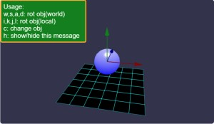
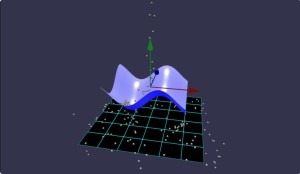
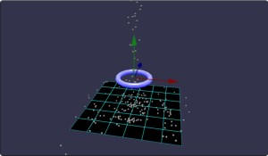
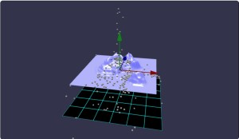
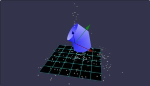
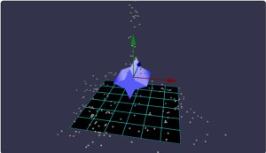
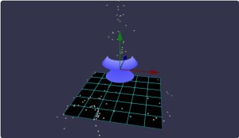

# Babylon.js で物理演算(havok)の基礎調査：いろいろな形状の衝突判定

## この記事のスナップショット




https://playground.babylonjs.com/#PVGV3X

[ソース](059/)

ローカルで動かす場合、 ./js 以下のライブラリは 057/js を利用してください。

キー操作

- w,s := ワールド系のx軸で回転
- a,d := ワールド系のz軸で回転
- i,k := 物体のローカル座標系の x軸で回転
- j,l := 物体のローカル座標系の z軸で回転
- c := 形状を変化

## 概要

babylonjs の物理エンジン havok 上でいろいろな形状の生成し、
衝突判定として小さな玉を落下させてぶつけて確認します。

形状には以下のモノを用意しました。

- 球
- 立方体（直方体）
- トーラス（ドーナツ、トーラス結び目）
- 高さマップ（HeightMap）
- 曲面（Ribbon）（パラボラ、正弦波曲面）
- チューブ
- 押し出し成型（ExtrudeShape）（星）
- 旋盤（CreateLathe）（壺）
- 複合体（PhysicsShapeContainer）
  - cx20さまの[ゴゴゴ](https://scrapbox.io/babylonjs/%E3%82%B4%E3%82%B4%E3%82%B4)を拝借。m(_ _)m

## やったこと

- いろいろな形状の作成
- 物理形状
- 使い方（操作方法）を表示

### いろいろな形状の作成

それぞれの形状は[公式ドキュメント](https://doc.babylonjs.com/features/featuresDeepDive/mesh/creation/set/)から引用しました。
チューブや押し出し成型、旋盤はパラメータをいじってます。
以下、特徴的なものをスナップショット。

- トーラス（ドーナツ）
  - 
- 高さマップ
  - 
- 曲面（Ribbon）（正弦波曲面）
  - 
- チューブ
  - 
- 押し出し成型（ExtrudeShape）（星）
  - 
- 旋盤（CreateLathe）（壺）
  - 

### 物理形状

複雑な形状（トーラス以降）では、
物理メッシュを作成する BABYLON.PhysicsAggregate の第二引数である
PhysicsShapeType に BABYLON.PhysicsShapeType.MESH を指定しています。

```js
// トーラス（ドーナツ
trgMesh = BABYLON.MeshBuilder.CreateTorus("target", { diameter: 2, thickness: 0.3 }, scene);
trgAgg = new BABYLON.PhysicsAggregate(trgMesh, BABYLON.PhysicsShapeType.MESH, { mass: 0.0, restitution:0.05}, scene);
```

[公式](https://doc.babylonjs.com/features/featuresDeepDive/physics/shapes/)にもあるとおり、
MESHにしていると正確な衝突判定を行える一方計算負荷が高くなります。

一方で、凸包(CONVEX_HULL)や四角(BOX)などを指定することもでき、
衝突判定の計算が簡易に／高速になる一方、凹な部分を判定できない・ドーナツの内部を通過できずにぶつかるといったことが確認できました。

気になる方は PlayGround で 下記コード部分のコメントを切り替えてください。

```js
// 旋盤：壺
// https://playground.babylonjs.com/#PQ0GIE
const myShape = [
    new BABYLON.Vector3(0, -1, 0),
    new BABYLON.Vector3(1, -0.5, 0),
    new BABYLON.Vector3(0.5, 0, 0),
    new BABYLON.Vector3(1.2, 0.5, 0),
    new BABYLON.Vector3(0.8, 1, 0)
];
trgMesh = BABYLON.MeshBuilder.CreateLathe("lathe", {shape: myShape});
trgAgg = new BABYLON.PhysicsAggregate(trgMesh, BABYLON.PhysicsShapeType.MESH, { mass: 0.0, restitution:0.05}, scene);
// trgAgg = new BABYLON.PhysicsAggregate(trgMesh, BABYLON.PhysicsShapeType.CONVEX_HULL, { mass: 0.0, restitution:0.05}, scene);
// trgAgg = new BABYLON.PhysicsAggregate(trgMesh, BABYLON.PhysicsShapeType.BOX, { mass: 0.0, restitution:0.05}, scene);
```

チューブ内部で衝突判定ができるのなら、
threejs のデモで見た「トーラス結び目」の表面を移動するやつ
[webgl_geometry_extrude_splines](https://threejs.org/examples/#webgl_geometry_extrude_splines)で「animetionViewにチェック」
の、内部を走ってみる版が作れそう。まだアイデア段階だけど。

### 使い方（操作方法）を表示

画面左上に表示させている「使い方」ですが、BABYLON.GUI を使います。


```js
// 左上に使い方（操作方法）を表示
let advancedTexture = BABYLON.GUI.AdvancedDynamicTexture.CreateFullscreenUI("UI");
// フレーム
let guiLabelRect = new BABYLON.GUI.Rectangle();
guiLabelRect.adaptWidthToChildren = true;
guiLabelRect.height = "160px";
guiLabelRect.cornerRadius = 5;
guiLabelRect.color = "Orange";
guiLabelRect.thickness = 4;
guiLabelRect.background = "green";
advancedTexture.addControl(guiLabelRect);    
// 表示内容
let text1 = new BABYLON.GUI.TextBlock();
text1.text = "Usage:\nw,s,a,d: rot obj(world)\ni,k,j,l: rot obj(local)\nc: change obj\nh: show/hide this message";
text1.color = "white";
text1.width = "320px";
text1.fontSize = 24;
text1.textWrapping = BABYLON.GUI.TextWrapping.WordWrap;
text1.textHorizontalAlignment = BABYLON.GUI.TextBlock.HORIZONTAL_ALIGNMENT_LEFT;
text1.paddingLeft = 12;
guiLabelRect.addControl(text1);
// 画面左上に配置
guiLabelRect.horizontalAlignment = BABYLON.GUI.Control.HORIZONTAL_ALIGNMENT_LEFT;
guiLabelRect.verticalAlignment = BABYLON.GUI.Control.VERTICAL_ALIGNMENT_TOP;
```

表示のON/OFFは「h」キーが押されたときの挙動に細工します。

```js
//   キー操作(h)で「使い方（操作方法）」のon/offを切り替え
if (map["h"]) {
    if (guiLabelRect.isVisible) {
        guiLabelRect.isVisible = false;
    } else {
        guiLabelRect.isVisible = true;
    }
}
```

## まとめ・雑感

前回の回転に続いて、
今回はいろいろな形状をつくって衝突判定を見てみました。

凹形状ってどうやるんだろうと思ってましたが、
ribbon の「パラボラ」や押し出し成型の「星」、旋盤の「壺」のように意外と簡単に作れるみたいでうれしいです。
さすがbabylonjs。

------------------------------------------------------------

前の記事：[Babylon.js で物理演算(havok)の基礎調査：静止した形状を回転させる](058.md)

次の記事：..


目次：[目次](000.md)

この記事には次の関連記事があります。

- [Babylon.js で物理演算(havok)の基礎調査：静止した形状を回転させる](058.md)
- [Babylon.js で物理演算(havok)の基礎調査：いろいろな形状の衝突判定](059.md)

--