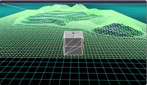
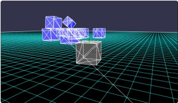
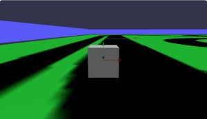
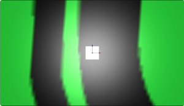
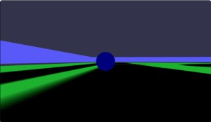

# Babylon.js で物理演算(havok)の基礎調査：自作の移動体

## この記事のスナップショット


060a_movePosi
https://playground.babylonjs.com/full.html#9N3AUD

060d_moveForce2
https://playground.babylonjs.com/full.html#XC49YF

（コードを見たい人はURLから `full.html` を消したURLを指定してください）


[ソース](060/)

  - 060a_movePosi .. 座標で移動
  - 060b_movePosi2 .. 座標で移動（カプセル＋傾き
  - 060c_moveForce .. 力で移動（カプセル＋傾き
  - 060d_moveForce2 .. 力で移動（レースのテクスチャ＋カメラ視点

ローカルで動かす場合、 ./js 以下のライブラリは 057/js を利用してください。

キー操作

- カーソル上下、(w,s) := 前後の移動
- カーソル左右、(a,d) := 回転
- (space) := ジャンプ
- r := 姿勢を正す

## 概要

babylonjs の物理エンジン havok 環境上の移動体には
キャラクターコントローラー(PhysicsCharacterController)という素晴らしいモジュールがあります。

しかし、キャラクターコントローラーの良さを認識するために今回は移動体を自作してみます。


シーン／ステージには、高さマップによる「山」や曲面による「尾根とトンネル」、衝突・移動可能な「立体」を配置してます。

- 高さマップによる「山」
  - 
- 曲面による「尾根とトンネル」
  - 
- 衝突・移動可能な「立体」
  - 


まとめ

移動方法   | 利点        | 欠点
-----------|-------------|--------
座標で移動 |操作が直観的 | 壁・モノをすり抜ける<br>ぶつかると変な方向に移動し続ける
力で移動   |正しく衝突   | 操作しづらい<br>回転モーメントが発生


## やったこと

- 座標で移動版
- 力で移動版
- 力で移動版（改）

### 座標で移動版

関連するソースは 060a_movePosi, 060b_movePosi2 です。

基本的な動作として、前に動かすときは現在地に、姿勢の前方向のベクトルを加えます。
姿勢によっては床をすり抜けることがあるので、下方向への移動（vMove.y） は 0 としてます。

```js
scene.onBeforeRenderObservable.add(() => {
    if (keyAction.forward) {
        // 姿勢から前方へのベクトル(vdir)および移動量(vMove)をもとめる
        let vdir = new BABYLON.Vector3(0 ,0, 1);
        let quat = myMesh.rotationQuaternion;
        vdir = vdir.applyRotationQuaternion(quat);
        let vMove = vdir.scale(0.15);
        vMove.y = 0; // 地面にめり込まない／沈まないように
        // 現在位置に移動量(vMove)を加えて移動させる
        myMesh.physicsBody.disablePreStep = true;
        myMesh.position.addInPlace(vMove);
        myMesh.physicsBody.disablePreStep = false;
```

左右には、自身の姿勢（クォータニオン）にY軸回転のクォータニオンをかけ合わせて向きを変えてます。

```js
if (keyAction.right) {
    // Y軸での微小回転なクォータニオンquat2を自身の姿勢(quat)にかけ合わせ、向きを変える
    let quat = myMesh.rotationQuaternion;
    let quat2 = BABYLON.Quaternion.FromEulerAngles(0, 0.02, 0);
    myMesh.physicsBody.disablePreStep = true;
    myMesh.rotationQuaternion = quat2.multiply(quat);
    myMesh.physicsBody.disablePreStep = false;
```

ジャンプは単純にＹ軸上に力を加えます。

```js
if (keyAction.jump) {
    myAgg.body.applyForce(new BABYLON.Vector3(0, 20, 0), myMesh.absolutePosition);
}
```

いろいろ操作しているとどうしても姿勢が斜めになることがあるので、
姿勢をリセットする操作、向いている方向（ヨー）はそのままに、上が直上を向くようにしました。

```js
if (keyAction.reset) {
    // 姿勢を正す
    /// クォータニオンからオイラー角を取得、方向（ヨー:z軸回転）だけを使い他は0として姿勢をリセットする
    keyAction.reset = 0;
    myAgg.body.applyForce(new BABYLON.Vector3(0, 80, 0), myMesh.absolutePosition);
    myMesh.physicsBody.disablePreStep = true;
    let eular = myMesh.rotationQuaternion.toEulerAngles()
    let quat = BABYLON.Quaternion.RotationYawPitchRoll(eular.y, 0, 0);
    myMesh.rotationQuaternion = quat;
    myMesh.physicsBody.setAngularVelocity(new BABYLON.Vector3(0, 0, 0)); // 回転を止める
    myMesh.physicsBody.disablePreStep = false;
}
```

衝突判定はしていません。
浅い角度でぶつかれば反応しますが、
深い角度でぶつかると（壁やモノを）すり抜けます。

「直立不動な移動」が物足りなく、立方体からカプセルに変更し、移動や回転時に斜めに傾けるようにしたら、
傾きが止まらず泥沼にハマりました。（ソースは 060b_movePosi2.js)

### 力で移動版

関連するソースは 060c_moveForce です。

前後の移動は applyForce で力を加えて移動させます。

```js
scene.onBeforeRenderObservable.add(() => {
    if (keyAction.forward) {
        let vdir = new BABYLON.Vector3(0 ,0, 1);
        let quat = myMesh.rotationQuaternion;
        vdir = vdir.applyRotationQuaternion(quat);
        let vForce = vdir.scale(2);
        myAgg.body.applyForce(vForce, myMesh.absolutePosition);
```

力で動かす都合上、床に摩擦があると引っかかってしまうのですが、デフォルトのままの摩擦で問題なさげなので手を付けてません。
形状が四角だから姿勢が戻っているんでしょう。球とかカプセルだと静止・直立できずに転がりまくり。

姿勢が戻っているといっても床との小さな摩擦の話で、ぶつかって大きく姿勢が乱れることはあるので
「座標の移動」と同様に姿勢を正す処理は入れてます。

操作しているとちょっと面白い現象にあいます。
直進時に横を向いて加速したり、加速しながら方向転換しようとすると曲がりにくさ、逆向きの回転がかかっていることに気づきます。

この現象がちょっと面白かったので、もうちょっと深掘りします。

### 力で移動版（改）

関連するソースは 060d_moveForce2 です。

ゲームっぽくしてみるべく、
床にテクスチャ（レース場のコース）を貼り付け、場外に落ちないようにガードを配置しました。

```js
// 地面を設定する
const groundMesh = BABYLON.MeshBuilder.CreateGround("ground", { width: 200, height: 150 }, scene);
// テクスチャを張り付ける
var matgnd = new BABYLON.StandardMaterial("mat1", scene);
// // for local
// matgnd.diffuseTexture = new BABYLON.Texture("textures/BoxySVG_test1_3_400x300.png", scene);
// for PlayGround
matgnd.diffuseTexture = new BABYLON.Texture("https://raw.githubusercontent.com/fnamuoo/webgl/main/042/pic/BoxySVG_test1_3_400x300.png", scene);
groundMesh.material = matgnd;

// 落下防止用に壁をつくる
{
    let geolist = [[0, 3, 75, 200, 5, 1],
                    [0, 3, -75, 200, 5, 1],
                    [100, 3, 0, 1, 5, 150],
                    [-100, 3, 0, 1, 5, 150],
                  ];
    for (let [px,py,pz,sx,sy,sz] of geolist) {
        const trgMesh = BABYLON.MeshBuilder.CreateBox("wall", { width: sx, height: sy, depth: sz }, scene);
        let mat = new BABYLON.StandardMaterial("mat", scene);
        mat.emissiveColor = BABYLON.Color3.Blue();
        trgMesh.material = mat;
        var trgAgg = new BABYLON.PhysicsAggregate(trgMesh, BABYLON.PhysicsShapeType.BOX, { mass: 0, restitution:0.05}, scene);
        trgMesh.physicsBody.disablePreStep = true;
        trgMesh.position = new BABYLON.Vector3(px, py, pz);
        trgMesh.physicsBody.disablePreStep = false;
    }
}
```

キー入力はレスポンスの良い版（前の回転の記事でのキー入力処理）にしてます。

あと、試験的に複数のカメラ視点（バードビュー、トップビュー、フロントビュー）を入れてみました。
FollowCamera だとパラメータをいじるだけで実現できるのが良いですね。
「c」で切り替えられます。カメラ変更はこれ（060d_moveForce2）だけの特別仕様です。

- バードビュー
  - 
- トップビュー
  - 
- フロントビュー
  - 正面にデバッグ表示のZ軸（青）が見えてるのがちょっと..
  - 

```js
icamera = (icamera+1) % 3;
if (icamera == 0) {
    // 後ろから追っかける（バードビュー
    camera.radius = 10;
    camera.heightOffset = 2;
    camera.cameraAcceleration = 0.05;
    camera.maxCameraSpeed = 30;
} else if (icamera == 1) {
    // 上空（トップビュー
    camera.radius = 0.1;
    camera.heightOffset = 20;
    camera.cameraAcceleration = 0.9;
    camera.maxCameraSpeed = 30;
} else if (icamera == 2) {
    // 正面（フロントビュー／ドライバーズビュー
    camera.radius = 0.1;
    camera.heightOffset = 0;
    camera.cameraAcceleration = 0.9;
    camera.maxCameraSpeed = 30;
}
```

## まとめ・雑感

「座標で移動」「力で移動」どちらも一長一短で、移動体として使うにはなんだかなぁでした。
次回、キャラクターコントローラー(PhysicsCharacterController)を使う方法を紹介します。

しかし、回転モーメント（と呼称しているものの）はなんなんでしょうね？
もしかして、変化球を再現できたり、リム転がし（車輪転がし）やコマ／ベーゴマといったことができるのかな？


------------------------------------------------------------

前の記事：[Babylon.js で物理演算(havok)の基礎調査：いろいろな形状の衝突判定](059.md)

次の記事：..


目次：[目次](000.md)

この記事には次の関連記事があります。

- [Babylon.js で物理演算(havok)の基礎調査：静止した形状を回転させる](058.md)
- [Babylon.js で物理演算(havok)の基礎調査：いろいろな形状の衝突判定](059.md)

--