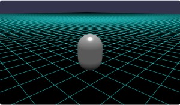
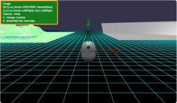

# Babylon.js で物理演算(havok)の基礎調査：キャラクターコントローラーの例

## この記事のスナップショット




061c_charctrlEdit2
https://playground.babylonjs.com/full.html#EFCYQC

（コードを見たい人はURLから `full.html` を消したURLを指定してください）

[ソース](061/)

  - 061a_charctrlOrg .. オリジナルからメッシュを排除
  - 061b_charctrlEdit .. カメラ、動きを変更（X/Z軸移動に）
  - 061c_charctrlEdit2 .. 方向転換＋メッシュを配置

ローカルで動かす場合、 ./js 以下のライブラリは 057/js を利用してください。

キー操作

- カーソル上下、(w,s) := 前後の移動
- カーソル左右、(a,d) := 回転
- (space) := ジャンプ
- r := 姿勢を正す

## 概要

babylonjs の物理エンジン havok 環境上の移動体には
キャラクターコントローラー(PhysicsCharacterController)という素晴らしいモジュールがあります。

が、サンプルコードがわかりずらく、使い方がよくわかりませんでした。
そこで公式のサンプルコードをシンプルにして、書き直してみました。

ブラックボックスとしてそのまま利用している部分が多いですが、
そこそこ所望した制御ができたので公開します。


前回の記事（「座標で移動」「力で移動」）との比較のため、同じシーン／ステージを用意します。


## やったこと

- 第１段階：サンプルコードから地形シーンの読み込みをカット
- 第２段階：移動・カメラワークをシンプル化
- 第３段階：移動処理の変更ほか


### 第１段階：サンプルコードから地形シーンの読み込みをカット


地形シーンの読み込み部分をカットしてシンプルな地面に置き換えます。
キー操作・移動はそのままです。


動かしてみると左右で円弧を描くように円運動することがわかります。
コードを読むとカメラワークに連動した動きのようです。


### 第２段階：移動・カメラワークをシンプル化

移動とカメラワークを切り離したく、移動はシンプルにX軸、Z軸に沿って動くようにしました。
カメラは FollowCamera に置き換え、またカメラに関する処理コードを無効・コメントアウトします。

上下左右に動かす平面的なゲームならこれで良い、むしろこれが良いのかな？


### 第３段階：移動処理の変更ほか


移動に手を加えて、「前後に移動」と「その場で左右に回転・向きを変える」にします。

といっても、前後の移動には手を付けず、回転させる場合に、キャラクターコントローラー用の指定につかっているクォータニオンcharacterOrientationの向きを変更します。

```js
scene.onAfterPhysicsObservable.add((_) => {
    ...

    // キー操作に応じた左右の向き：姿勢を変更する
    if (keyAction.right) {
        displayCapsule.rotate(new BABYLON.Vector3(0, 1, 0), 0.02);
        let quat2 = BABYLON.Quaternion.FromEulerAngles(0, 0.02, 0);
        characterOrientation = quat2.multiply(characterOrientation);
    } else if (keyAction.left) {
        displayCapsule.rotate(new BABYLON.Vector3(0, 1, 0), -0.02);
        let quat2 = BABYLON.Quaternion.FromEulerAngles(0, -0.02, 0);
        characterOrientation = quat2.multiply(characterOrientation);
    }
```

ジャンプ時、空中での移動のパラメータをいじって、ジャンプ時により高くより速く動けるようにします。

```js
var inAirSpeed = 20.0;
var jumpHeight = 5;
```

あと、前の記事でも紹介した`視点（バードビュー／トップビュー／フロントビュー）の追加`および
`使い方の表示`の機能も追加しました。

## まとめ・雑感

キャラクターコントローラーの使いやすさは段違いでした。
操作性がよいのに、キチンとモノにぶつかっても処理する（すり抜けない）し、開発チームは良い仕事をしますね。

移動処理の部分（関数getDesiredVelocity）が読み解けてないですが、
ここをいじればドローンや飛行機にも適用できそう。
でもやっぱりメインターゲットは人物キャラクターなのかな？

------------------------------------------------------------

前の記事：[Babylon.js で物理演算(havok)の基礎調査：自作の移動体](060.md)

次の記事：[Babylon.js で物理演算(havok)：コマ](062.md)


目次：[目次](000.md)

この記事には次の関連記事があります。

- [Babylon.js で物理演算(havok)の基礎調査：自作の移動体](060.md)
- [Babylon.js で物理演算(havok)の基礎調査：キャラクターコントローラーの例](061.md)
- [Babylon.js で物理演算(havok)：トーラス結び目の中を走る](064.md)

--