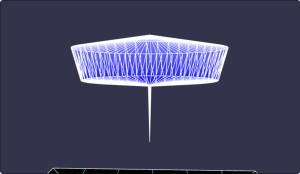
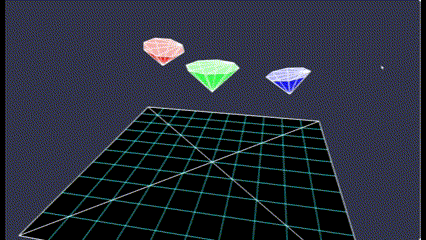
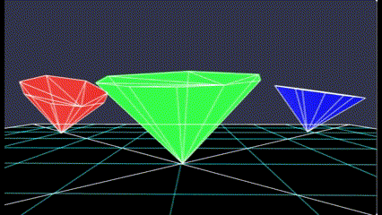
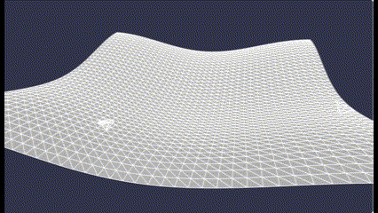
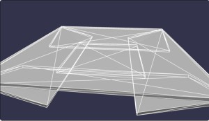

# Babylon.js で物理演算(havok)：コマ

## この記事のスナップショット


062a_koma
https://playground.babylonjs.com/full.html#WUK0AW

062c_koma
https://playground.babylonjs.com/full.html#1LBMRK

（コードを見たい人はURLから `full.html` を消したURLを指定してください）

[ソース](062/)

  - 062a_koma .. ジャイロ効果の確認
  - 062b_koma .. 歳差運動の確認
  - 062c_koma .. ベイブレー○

ローカルで動かす場合、 ./js 以下のライブラリは 057/js を利用してください。

キー操作

- (space) := コマの回転を増加／リセット

## 概要

以前の記事
[Babylon.js で物理演算(havok)の基礎調査：自作の移動体](060.md)
で「力で移動」のケースで回転モーメント？ぽい挙動を感じることがあったので
回転体（コマ）の挙動を深掘りします。

結果、ジャイロ効果および歳差運動が確認できました。

https://ja.wikipedia.org/wiki/%E3%82%B8%E3%83%A3%E3%82%A4%E3%83%AD%E5%8A%B9%E6%9E%9C

https://ja.wikipedia.org/wiki/%E6%AD%B3%E5%B7%AE


## やったこと

- コマをつくる
- ジャイロ効果を確認する
- 歳差運動を確認する
- ベイブレー○

### コマをつくる


シンプルに、簡単に作るなら、円筒形(cylinder)を使えばよさそうです。

```js
// 円筒形でコマをつくる
trgMesh = BABYLON.MeshBuilder.CreateCylinder("target",
                                             { height: 1, // def 2
                                               diameter: 2,
                                               tessellation: 8, // def 24
                                               diameterBottom: 0.0, // def 1
                                               }, scene);
trgAgg = new BABYLON.PhysicsAggregate(trgMesh, BABYLON.PhysicsShapeType.CONVEX_HULL, { mass: 100, friction: 0.6, restitution:0.05}, scene);
```

このとき、物理形状（PhysicsShapeType）は CONVEX_HULL が一番よいみたいです。
まず PhysicsShapeType.CYLINDER だと傾きません。
PhysicsShapeType.MESH でも良さげに思えますが、他のコマとぶつかるときにコマが１サイズ大きくなったような感じで、離れたところでぶつかります。
どうやら高速回転させているとPhysicsShapeType.BOXと同じような衝突判定になるっぽいです。
CONVEX_HULLだと、MESH よりもより形状にフィットした感じで衝突判定するっぽいです。それでもまだ若干離れてぶつかっている感じはありますが気のせいかな？

ちなみに旋盤(Lathe)でコマも作ってみましたが、上記と同様 MESH より CONVEX_HULL が衝突判定には良いみたいです。



```js
// 旋盤でコマをつくる
const myShape = [
    new BABYLON.Vector3(0   , 0  , 0),
    new BABYLON.Vector3(0.02, 0.8, 0),
    new BABYLON.Vector3(0.9 , 0.9, 0),
    new BABYLON.Vector3(1   , 1.3, 0),
    new BABYLON.Vector3(0   , 1.5, 0)
];
trgMesh = BABYLON.MeshBuilder.CreateLathe("target", {shape: myShape});
trgAgg = new BABYLON.PhysicsAggregate(trgMesh, BABYLON.PhysicsShapeType.CONVEX_HULL, { mass: 100, friction: 0.6, restitution:0.05}, scene);
```

### ジャイロ効果を確認する



単純に、初期状態で回転させた状態（赤：左、緑：中央）と、回転させない・停止した状態（青：右）のコマを用意して挙動をみるだけです。

回転のないコマはそのまま床にパタンと倒れますが、
回転しているコマはなかなか倒れません。

緑のコマは垂直にしてますが、赤のコマはやや傾けてます。
高速回転が続いている（適度にスペースキーを押す）と、回転がキープされ、コマの姿勢がそのまま保たれていることが確認できると思います。


### 歳差運動を確認する



回転がおちてくると、コマの首振り運動がみれます。

実際のコマのように円弧を描くような動きは確認しずらいですが、
重力を強めにして、コマを常に回転させるようにすると円弧を描くようになりました。

062b_koma
https://playground.babylonjs.com/full.html#034TUS

```js
// 強めの重力をかける
const gravityVector = new BABYLON.Vector3(0, -30, 0);
```

```js
    scene.registerAfterRender(function() {
            // コマに、常に回転力を加える
            for (let trgMesh of komaMesh) {
                let quat = trgMesh.rotationQuaternion;
                let vdir = new BABYLON.Vector3(0 ,90, 0);
                vdir = vdir.applyRotationQuaternion(quat);
                trgMesh.physicsBody.applyAngularImpulse(vdir);
            }
    ...
```

### ベイブレー○

ここまでくると、コマ同士をぶつけてみたくなります。

まっ平らな地面だとコマが逃げてしまうので、盆地のようなステージを作りたく、
ribbon で凹な面を作ってみたのですがコマが跳ねまくり。
PhysicsShapeType.MESHを指定しているせいっぽいのですが、凹形状なので他を指定するわけにもいかず。



仕方ないので四角の板を組み合わせて角皿っぽい形状を作って回避しました。



ゲーム性もなく、見るだけのものになってしまったので、キー操作「スペース」でリセットするように、
すべてのコマが場外になってもリセットするようにしました。
場外判定は、簡易な判定として「すべてのコマがある高さより下がったら」とします。

```js
// コマがすべて落ちていたらリセット
{
    let bDropAll = true;
    for (let trgMesh of komaMesh) {
        if (trgMesh.position.y >= -10) {
            bDropAll = false;
            break;
        }
    }
    if (bDropAll) {
        resetPosiKoma();
    }
}
```

見ていると自滅（自分から場外）するケースが多い。
ヘリの傾斜をもっと傾けると良いかもしれないけど、
１つ残った場合にひとりでに場外になってくれるのでこのままで。


## まとめ・雑感

物理エンジン cannon ではジャイロ効果が確認できなかったこともあり「havokやりおる」。

ribbon でステージを作りたかったけど、なにか回避策はあったのかな？

歳差運動の再現には苦労させられました。回転がとまるキワで様子をみることができるのですが、床が滑りまくりで首振りっぽくならないし。
あと直進ばっかりで曲がらないなぁと、重力を強くしたら今度は回転がすぐに止まるし。

ぶつかったときにエフェクト（火花）とか入れられたら COOL になりそうだけどそれはまたの機会に。

------------------------------------------------------------

前の記事：[Babylon.js で物理演算(havok)の基礎調査：キャラクターコントローラーの例](061.md)

次の記事：[Babylon.js で物理演算(havok)：ボーリング／カーリング](063.md)


目次：[目次](000.md)

この記事には関連記事がありません。

--