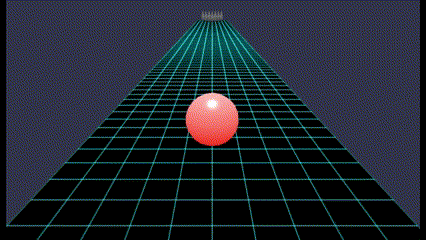
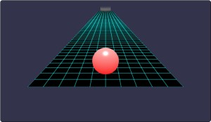
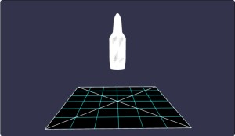
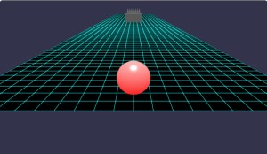
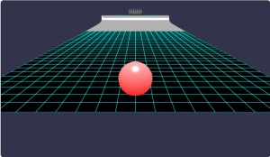
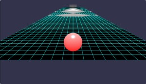
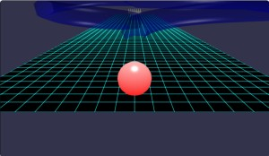
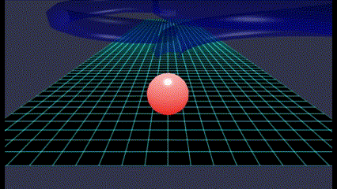

# Babylon.js で物理演算(havok)：ボーリング／カーリング

## この記事のスナップショット

(4倍速)  


063a_bowling  
https://playground.babylonjs.com/full.html#EN2WJF

063b_caring  
https://playground.babylonjs.com/full.html#S5V1HQ

（コードを見たい人はURLから `full.html` を消したURLを指定してください）

[ソース](063/)

  - 063a_bowling .. ボーリング
  - 063b_caring .. カーリング

ローカルで動かす場合、 ./js 以下のライブラリは 057/js を利用してください。


## 概要

「物体を力で移動させて何かできないか？」とカーリングっぽいものを作ったらなんかボーリングのパチモン（にせもの）っぽくなったので、
潔くボーリングっぽいものを作り直しました。

ボールはカーソルキー（もしくはw,s,a,d）で回転／操作できます。

ピンが倒れた判定は「テーブルから落ちたら」としています。
ピンをすべて落とすとステージクリアとして次のステージに自動的に移ります。
時間差でピンが落ちたときは故意にステージからボールを落としてください。

ボーリングのゲームではないので、ルールに則った得点（スコア）をつけることはしてません。
代わりに障害物のあるステージを用意しました。

結局出来上がったものはボーリングっぽいものでした。orz。

## やったこと

- ストーンをコントロールする（失敗）
- ボールをコントロールする
- ステージを作る


### ストーンをコントロールする（失敗）

カーリングぽくストーンを回転させることで右に、左に曲げることができるかなとストーンの中心軸で回転させてみたら全然曲がらない（大汗。
仕方ないので、力をかけて移動させる一方で、回転で動かすことがあきらめきれず、ボールを回転させてうごかすボーリングも平行して作成。
むしろ、ボーリングの方に注力することにしました。

### ボールをコントロールする

キー操作で、ボールに回転の力（applyAngularImpulse）を加えることで前後左右に動かすことにします。

```js
if (map["w"] || map["ArrowUp"]) {
    let vdir = new BABYLON.Vector3(vforce ,0, 0);
    myMesh.physicsBody.applyAngularImpulse(vdir);
} else if (map["s"] || map["ArrowDown"]) {
    let vdir = new BABYLON.Vector3(-vforce ,0, 0);
    myMesh.physicsBody.applyAngularImpulse(vdir);
}

if (map["a"] || map["ArrowLeft"]) {
    let vdir = new BABYLON.Vector3(0 ,0, vforce);
    myMesh.physicsBody.applyAngularImpulse(vdir);
} else if (map["d"] || map["ArrowRight"]) {
    let vdir = new BABYLON.Vector3(0 ,0, -vforce);
    myMesh.physicsBody.applyAngularImpulse(vdir);
}
```

### ステージを作る

まずはオーソドックスなステージ。



ピンは旋盤(lathe)で、適当に座標をいれて作成したらライフル弾ぽい感に。似せる気がないのかとお叱りを受けそうでごめんなさい。

```js
const myShape = [
    new BABYLON.Vector3(0   , 0   , 0),
    new BABYLON.Vector3(0.4 , 0   , 0),
    new BABYLON.Vector3(0.45, 0.45, 0),
    new BABYLON.Vector3(0.45, 1.7 , 0),
    new BABYLON.Vector3(0.25, 2.0 , 0),
    new BABYLON.Vector3(0.20, 2.6 , 0),
    new BABYLON.Vector3(0.15, 2.8 , 0),
    new BABYLON.Vector3(0.10, 2.9 , 0),
    new BABYLON.Vector3(0.05, 2.98, 0),
    new BABYLON.Vector3(0   , 3.  , 0)
];
trgMesh = BABYLON.MeshBuilder.CreateLathe("target", {shape: myShape});
trgAgg = new BABYLON.PhysicsAggregate(trgMesh, BABYLON.PhysicsShapeType.CONVEX_HULL, { mass: 1, friction: 0.1, restitution:0.05}, scene);
```




次に直進では攻略できない／迂回する必要のあるステージ。



凸凹してたら面白かなと思ったら、意外と難しいステージ




凹凸は ribbon で表現してます。

```js
// ジャンプのあるステージ
let groundMesh = BABYLON.MeshBuilder.CreateGround("ground", { width: 20, height: 100 }, scene);
groundMesh.material = new BABYLON.GridMaterial("groundMaterial", scene);
groundMesh.material.majorUnitFrequency = 1;
groundMesh.material.minorUnitVisibility  = 0;
let groundAggregate = new BABYLON.PhysicsAggregate(groundMesh, BABYLON.PhysicsShapeType.BOX, { mass: 0, friction: 0.6, restitution:0.001}, scene);
let rootPath = [];
let nminX = -20, nmaxX = 21, gridsize = 0.5, rad = 0.2;
let nminZ = -40, nmaxZ = 41;
for (let iz = nminZ; iz < nmaxZ; ++iz) {
    let z = iz*gridsize;
    let path = []
    for (let ix = nminX; ix < nmaxX; ++ix) {
        let x = ix*gridsize;
        path.push(new BABYLON.Vector3(x, 2/(1+Math.abs(iz)), z));
    }
    rootPath.push(path);
}
let groundMesh1 = BABYLON.MeshBuilder.CreateRibbon("ribbon", {pathArray: rootPath, sideOrientation: BABYLON.Mesh.DOUBLESIDE});
let groundAggregate1 = new BABYLON.PhysicsAggregate(groundMesh1, BABYLON.PhysicsShapeType.MESH, { mass: 0, restitution:0.05}, scene);
groundMeshList.push(groundMesh);
groundMeshList.push(groundMesh1);
groundAggregateList.push(groundAggregate);
groundAggregateList.push(groundAggregate1);
```


伝声管／土管をイメージして、何かできないかなと作ってみたステージ。



チューブって、中央の座標値を点群で渡せば自動で作成してくれるのがありがたいですね。
高速道路のインターチェンジ、８の字っぽく目指してたらこんな感じに落ち着きました。

```js
let adjy = 1.2, x = 0, y = 0, z = 0;
let myPath = [];
let rstep = Math.PI/36; // 5degree / 18:90[deg]
let r45 = Math.PI/4, r90 = Math.PI/2, irad;
for (let i = 0; i < 54; ++i) {
    irad = i * rstep;
    x = 10*(1-Math.cos(irad)); y = i*0.1 + adjy; z = -30 + 10*Math.sin(irad);
    myPath.push(new BABYLON.Vector3(x, y, z));
}
for (let i = 54; i < 72; ++i) {
    irad = i * rstep;
    x = 10*(1-Math.cos(irad)); y = 5.4 + adjy; z = -30 + 10*Math.sin(irad);
    myPath.push(new BABYLON.Vector3(x, y, z));
}
for (let i = 0; i < 18; ++i) {
    irad = i * rstep;
    x = 10*(Math.cos(irad)-1); y = 5.4 + adjy; z = -12 + 10*Math.sin(irad);
    myPath.push(new BABYLON.Vector3(x, y, z));
}
for (let i = 18; i < 72; ++i) {
    irad = i * rstep;
    x = 10*(Math.cos(irad)-1); y = 7.2 -i*0.1 + adjy; z = -12 + 10*Math.sin(irad);
    myPath.push(new BABYLON.Vector3(x, y, z));
}
let groundMesh1 = BABYLON.MeshBuilder.CreateTube("tube", {path: myPath, radius: 2, sideOrientation: BABYLON.Mesh.DOUBLESIDE, tessellation: 6}, scene);
let groundAggregate1 = new BABYLON.PhysicsAggregate(groundMesh1, BABYLON.PhysicsShapeType.MESH, { mass: 0.0, restitution:0.05}, scene);
```

実際にボールを転がしてみるとまぁまぁ面白いできになったかと。
でもわざわざチューブ内を通らなくても抜け道が、、、。

(10倍速)  



## まとめ・雑感

カーリングが全然うまくいかず悔しかったのでボーリングのステージをそのままにストーンだけを持ってきたものが 063b_caring な訳ですが、
これはこれで面白いのか？よくわからんけどとりあえず公開しておきます。

素直にボーリングをキチンと作りこんでピンの処理やスコア計上ができるようにしたほうが需要がありそうですが、うーん、めどい。

個人的には「回転させて転がす／曲げる」ってところに面白さを見出したいところ。
ジャンプもありかな。

あと、tube って長い距離を曲げるとねじれてくるんですね。ねじれなくていいのに。

------------------------------------------------------------

前の記事：[Babylon.js で物理演算(havok)：コマ](062.md)

次の記事：[Babylon.js で物理演算(havok)：トーラス結び目の中を走る](064.md)


目次：[目次](000.md)

この記事には関連記事がありません。


--