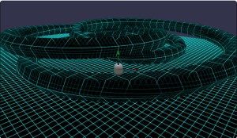
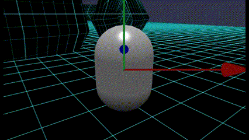
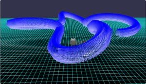
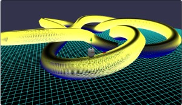
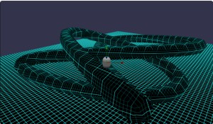
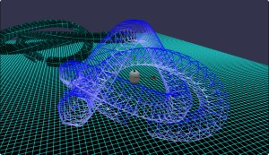
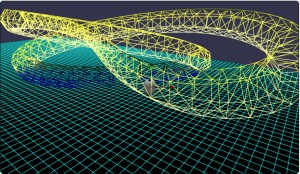

# Babylon.js で物理演算(havok)：トーラス結び目の中を走る

## この記事のスナップショット



（10倍速）  


064  
https://playground.babylonjs.com/full.html#64K3H6

（コードを見たい人はURLから `full.html` を消したURLを指定してください）

[ソース](064/)

ローカルで動かす場合、 ./js 以下のライブラリは 057/js を利用してください。


## 概要

threejs のデモ
[webgl_geometry_extrude_splines](https://threejs.org/examples/#webgl_geometry_extrude_splines)「animetionViewにチェック」
を見たときから、この中を走ってみたいと思ってました。

チューブ（tube）で線分のみ指定すればトンネル形状が作れるらしいので、「トーラス結び目」（torus knot）のトンネルを作りました。
さらに、trefoil knot のトンネルも作成しました。

移動体にはキャラクターコントローラー（PhysicsCharacterController）を使います。
このキャラクターコントローラーで「トーラス結び目」のトンネル内を移動します。

## やったこと

- トーラス結び目
- trefoil knot
- ステージレイアウト

### トーラス結び目

[トーラス結び目／座標による直接的な定義](https://ja.wikipedia.org/w/index.php?title=%E3%83%88%E3%83%BC%E3%83%A9%E3%82%B9%E7%B5%90%E3%81%B3%E7%9B%AE&section=6#%E5%BA%A7%E6%A8%99%E3%81%AB%E3%82%88%E3%82%8B%E7%9B%B4%E6%8E%A5%E7%9A%84%E3%81%AA%E5%AE%9A%E7%BE%A9)
にある円柱座標系の表現をそのまま実装します。

  - 円柱座標系（式のみ引用）

    ```math
    \begin{align}
          r &= 1 + 1/2*\cos(2*PI*p*t) \\
    \theta &= 2*PI*q*t           \\
          z &= 1/2*\sin(2*PI*p*t)     \\
      \text{where [ 0 <= t <= 1 ]}
    \end{align}
    ```

```js
let nt = p*q*tdiv, t, radp, radq, r, theta, x, y, z, x2, y2, z2;
let c2PIp = 2*Math.PI*p, c2PIq = 2*Math.PI*q;
for (let it = 0; it < nt; ++it) {
    t = it/nt;
    radp = c2PIp*t;
    radq = c2PIq*t;
    r = (1 + 0.5*Math.cos(radp))*rArc;
    theta = radq;
    z = 0.5*Math.sin(radp);
    x2 = r*Math.cos(theta);
    y2 = z*zrate + adjy;
    z2 = r*Math.sin(theta);
    myPath.push(new BABYLON.Vector3(x2, y2, z2));
}
```

出入口を作るために高さ（Y座標）が最小の位置をもとめ、その位置で配列を分割し、入れ替え＋再結合します。
末尾から一定個数を取り除いて出入口とします。

```pic
配列１：|_____|最小|___________|  .. 最小位置を探して
↓
配列２：|__A__||_______B_______|  .. 該当部分で前後（A,B）に分けて
↓
配列３：|_______B_______||__A__| .. 入れ替え＋再結合
↓
配列４：|________________||削除| .. 末尾を削除
```

```js
// y座標最小値のところを出入口にする。そのため最小の位置を取得
let ymin = 9999, itmin = 0;
for (let it = 0; it < nt; ++it) {
    ...
    myPath.push(new BABYLON.Vector3(x2, y2, z2));
    if (ymin > y2) {
        ymin = y2;
        itmin = it;
    }
}
if (itmin > 0) {
    // 一度 itmin 位置で分割して 分割した位置が先頭になるよう入れ替えて結合
    let myPathA = myPath.slice(0, itmin);
    let myPathB = myPath.slice(itmin);
    myPath = myPathB.concat(myPathA);
}
let ncut = Math.ceil(nt*pcutpct); // 抜き取るデータ数
myPath = myPath.slice(0, nt-ncut);
```

### trefoil knot

trefoil knotを調べてみると微妙な違いがあるので、まとめて関数化して実装しました。

- [noeuddetrefle](https://www.mathcurve.com/courbes3d.gb/noeuds/noeuddetrefle.shtml)
  - デカルト表現（式のみ引用）  

    ```math
    \begin{align}
    x &= \cos(t) + 2*\cos(2*t)  \\
    y &= \sin(t) - 2*\sin(2*t)  \\
    z &= 2*\sin(3*t) \\
     \text{where [ 0 <= t <= 2*PI ]} 
    \end{align}
    ```

  - 他の表現方法（式のみ引用）

    ```math
    \begin{align}
    x &= \sin(2*t)         \\
    y &= \sin(t)*\cos(2*t)  \\
    z &= \cos(3*t)         \\
    \end{align}
    ```

- [Trefoil_knot](https://en.wikipedia.org/wiki/Trefoil_knot)
  - デカルト表現（式のみ引用）  

    ```math
    \begin{align}
    x &= \sin(t) + 2*\sin(2*t) \\
    y &= \cos(t) - 2*\cos(2*t) \\
    z &= \sin(3*t)
    \end{align}
    ```

```js
function f1(rad) {
    let cos_t = Math.cos(rad);
    let cos_2t = Math.cos(2*rad);
    let sin_t = Math.sin(rad);
    let sin_2t = Math.sin(2*rad);
    let sin_3t = Math.sin(3*rad);
    return [cos_t+2*cos_2t, sin_t-2*sin_2t, 2*sin_3t];
}
function f2(rad) {
    let sin_t = Math.sin(rad);
    let sin_2t = Math.sin(2*rad);
    let cos_2t = Math.cos(2*rad);
    let cos_3t = Math.cos(3*rad);
    return [sin_2t, sin_t*cos_2t, cos_3t];
}
function f3(rad) {
    let sin_t = Math.sin(rad);
    let sin_2t = Math.sin(2*rad);
    let sin_3t = Math.sin(3*rad);
    let cos_t = Math.cos(rad);
    let cos_2t = Math.cos(2*rad);
    return [sin_t+2*sin_2t, cos_t-2*cos_2t, -sin_3t];
}
let fccb = f1;  // 関数ポインタ（ここで切り替え
for (let irad = 0; irad < ndiv; ++irad) {
    rad = irad * radstep;
    [x,y,z] = fccb(rad);
    x2 = x*zoom;
    y2 = y*yrate + adjy;
    z2 = z*zoom;
    myPath.push(new BABYLON.Vector3(x2, y2, z2));
}
```

### ステージレイアウト

下準備ができたので、上記を使って配置します。

左手には「トーラス結び目」を、右手には「trefoil knot」を配置します。
違いが一目でわかるよう、材質（色）を変更してます。

```js
// 左手
createTube({type:'torusKnot', p:2, q:3, x:-40, y:2.1, z:60}, mat, scene);
createTube({type:'torusKnot', p:4, q:1, x:-50, y:2.1, z:-10}, mat2, scene);
createTube({type:'torusKnot', p:5, q:2, x:-40, y:2.1, z:-80}, mat3, scene);
// 右手
createTube({type:'trefoilKnot', x:30, y:2.1, z:50}, mat, scene);
createTube({type:'trefoilKnot', x:40, y:4.5, z:-10, yrate:8, func:'f2'}, mat2, scene);
createTube({type:'trefoilKnot', x:30, y:2.5, z:-70, yrate:2, rotx:0, func:'f3'}, mat3, scene);
```

- 画面左手
  - トーラス結び目(2,3)：左手奥
    - 
  - トーラス結び目(4,1)：左手
    - 
  - トーラス結び目(5,2)：左手手前
    - 

- 画面右手
  - trefoilKnot(1)：右手奥
    - 
  - trefoilKnot(2)：右手
    - 
  - trefoilKnot(3)：右手手前
    - 


トーラス結び目(2,3)の走行例（10倍速）  


## まとめ・雑感

念願かなった。ここまで長かった。もう一周、試走してくるかな。

tubeの機能のお陰で、簡単に？「トーラス結び目」のトンネルを作ることができました。ありがたや。

今回、ひも理論の調べる過程でいろいろな形状を知ることができました。
中にはそのまま立体コースとして使えそうなものも。楽しみが増えました。

------------------------------------------------------------

前の記事：[Babylon.js で物理演算(havok)：ボーリング／カーリング](063.md)

次の記事：[Babylon.js で物理演算(havok)：コーラム模様でローラーコースター](065.md)


目次：[目次](000.md)

この記事には次の関連記事があります。

- [Babylon.js で物理演算(havok)の基礎調査：キャラクターコントローラーの例](061.md)
- [Babylon.js で物理演算(havok)：トーラス結び目の中を走る](064.md)
- [Babylon.js で物理演算(havok)：コーラム模様でローラーコースター](065.md)

--