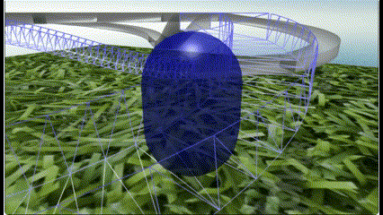
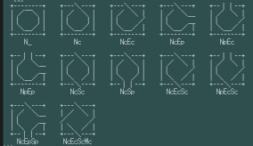
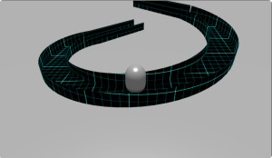
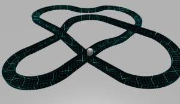
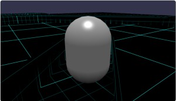
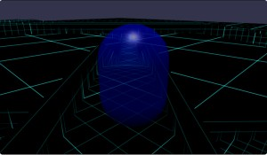
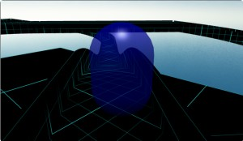
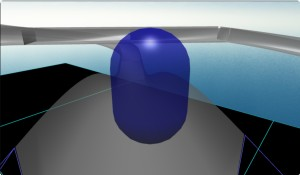
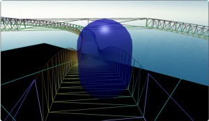

# Babylon.js で物理演算(havok)：コーラム模様でローラーコースター

## この記事のスナップショット

（２倍速）  


（白色のコース）  
https://playground.babylonjs.com/full.html#8ZZ8P0

（ワイヤーフレームのコース）  
https://playground.babylonjs.com/full.html#8ZZ8P0#1

（コードを見たい人はURLから `full.html` を消したURLを指定してください）

[ソース](065/)

ローカルで動かす場合、 ./js 以下のライブラリは 057/js を利用してください。


## 概要

「トーラス結び目」の調査の際に目にした
コーラム模様のイラスト
https://katlas.org/wiki/File:StevedoresKnot-1-6a-C.jpg
に感銘を受けました。
まんまですが、ブロック状のパーツを作成し、
組み合わせてコースを作れるようにしました。

コースの形状は凹型を押し出し成型(ExtrudeShape)で作成します。

移動体には「キャラクターコントローラー」を用いてます。
移動は手動（カーソルキーもしくは wsad）でお願いします。

コーラム（kolam）とはインドの伝統的な文様です。

参考）[ひも理論のサイト（英語）](https://katlas.org/wiki/)


## やったこと

- レールのブロック
- ブロックのレイアウト
- キャラクターコントローラーの位置リセット
- material変更／skybox

### レールのブロック

複雑な形状は避けたいので、下記ルールとします。

- メッシュ／経路は、凹型および押し出し成型(ExtrudeShape)で作成する。つまり経路の座標値を引数に渡して自動生成させる。
- 高さは２層（１階と２階）
- 形状は直線と円弧のみに限定
- 高さの変更（「１階から２階」および「２階から１階」）は比例もしくは正弦波（(1-cos)/2）で変化させる

レールのブロックは下記、１２種類を作成します。



例えば２番目のブロックの場合、３つのパーツ（メッシュ）に分けて座標列を作成します。
２番目の点列（曲線）は進行方向を曲げながら上(Y軸＋方向)に登っていきます。
実際にメッシュを作成すると徐々にひねられた形になります。
このひねりを戻すように MeshBuilder.ExtrudeShape の実行時にオプション rotation を指定します。
高さが変わらないときはひねりが入らない様子。またブロックサイズや高さを変更するとひねりの角度も変わる様子。

```js
// +---＼---+
// : ／  ＼ :
// :│     │:    Nc
// : ＼＿／ :
// +--------+
// 上(1F)から反時計回りで上(2F)に
let pathRotList = [];
{
    let myPath = [];
    x = 0; y = tubeY1F; z = block12; myPath.push(new BABYLON.Vector3(x, y, z));
    x = -block14; y = tubeY1F; z = block14; myPath.push(new BABYLON.Vector3(x, y, z));
    pathRotList.push([myPath, 0]);
}
{
    let myPath = [];
    ni = 54; // 270度
    let ystep = tubeH12/ni;
    for (let i = 0; i <= ni; ++i) { // 270度
        irad = i*R5 + R135;
        x = r*Math.cos(irad); y = tubeY1F+ystep*i; z = r*Math.sin(irad);
        myPath.push(new BABYLON.Vector3(x, y, z));
    }
    rotation = -R22 / ni;  // 全体で22.5度のひねりが加わるので逆の回転を施す
    pathRotList.push([myPath, rotation]);
}
{
    let myPath = [];
    x = block14; y = tubeY2F; z = block14; myPath.push(new BABYLON.Vector3(x, y, z));
    x = 0; y = tubeY2F; z = block12; myPath.push(new BABYLON.Vector3(x, y, z));
    pathRotList.push([myPath, 0]);
}
```

「コースのブロックNc」  



メッシュはブロックごとに分けて作成します。
１つのブロックでも複数のメッシュ（上記ブロックだと３つ）で作成するので並べて配置したときに若干のすきまが発生しますが、
実際に走ってみると気にならないので、このままで良しとします。

ちなみに、ひねりの対応で rotation をメッシュごとに適用してますが（今のところ）一定値でしか適用できない様子です。
つまり１つのメッシュ内で局所的にON/OFFを切り替えたり、数値を変更させることはできないので、一本の長い点列にして「部分的にひねる」ということは出来ないっぽいです。
なので上下をキープしたまま上下左右に向きを変えたいときは、ひねりが加わるメッシュ部分を切り分けてその部分に逆のひねり(rotation)を加えるしか回避できなさそう。

さて、このようにして用意したブロックを並べて配置させることがコンセプトなので、位置(x,y,z)とY軸回転で指定できるようにします。

```js
function createKolam(geo, mat, scene) {
    ...
    trgMesh = BABYLON.MeshBuilder.ExtrudeShape("extrude", options, scene);
    trgMesh.physicsBody.disablePreStep = true;
    trgMesh.position = new BABYLON.Vector3(geo.x, geo.y, geo.z);
    if (('rot' in geo) && (geo.rot != 0)) {
        trgMesh.rotate(new BABYLON.Vector3(0, 1, 0), geo.rot, BABYLON.Space.WORLD);
    }
    trgMesh.physicsBody.disablePreStep = false;
```


### ブロックのレイアウト

レイアウトは、ブロックを作成する関数(createKolam)に`ブロックの種別`、`座標`と`向き(Y軸回転)`を指定するだけです。

```js
// https://katlas.org/wiki/3_1
// https://katlas.org/wiki/File:Hart-knot-C.jpg
//   +--------+--------+
//   | ／￣＼＿_／￣＼ |
//   |│     ＿_     │|     NpEc         NcEp
//   | ＼  ／ : ＼  ／ |
//   +---＼---+-- ＼---+
//   | ／  ＼ : ／  ＼ |
//   |│     ／      │|     NcEc
//   | ＼＿／ : ＼＿／ |
//   +--------+--------+
createKolam({type:'NpEc', x:0 , y:0, z:20, rot:R90} , mat, scene);
createKolam({type:'NcEp', x:20, y:0, z:20, rot:R180}, mat, scene);
createKolam({type:'NcEc', x:0 , y:0, z:0 , rot:R0}  , mat, scene);
createKolam({type:'NcEc', x:20, y:0, z:0 , rot:-R90}, mat, scene);
```

「コースレイアウト」  


実際のコードではコースレイアウトを切り替えられるよう、作成したメッシュと物理情報(PhysicsAggregate)を変数に持たせる小細工をしてます。

コースは全部で７つあります。キー(n)で切り替えられるので楽しんでみてください。

### material変更／skybox

何度か試走していると、「自機に隠れてコースが見にくい」ことにちょっと不満。
自機に透過のmaterialを設定しました。

```js
let matMy = createMat('std_trans'); // 自機
let displayCapsule = BABYLON.MeshBuilder.CreateCapsule("CharacterDisplay", {height: myh, radius: myr}, scene);
displayCapsule.material = matMy;
```

「自機の透過前」  


「自機の透過後」  



一方でローラーコースターぽく高さのある、足場のない感じを出したく、
地面(ground)の領域を小さくして skyboxを設定しました。

```js
// const groundMesh = BABYLON.MeshBuilder.CreateGround("ground", { width: 200, height: 200 }, scene);
const groundMesh = BABYLON.MeshBuilder.CreateGround("ground", { width: 40, height: 40 }, scene);

// Skybox
var skybox = BABYLON.MeshBuilder.CreateBox("skyBox", {size:1000.0}, scene);
var skyboxMaterial = new BABYLON.StandardMaterial("skyBox", scene);
skyboxMaterial.backFaceCulling = false;
skyboxMaterial.reflectionTexture = new BABYLON.CubeTexture("textures/TropicalSunnyDay", scene);
skyboxMaterial.reflectionTexture.coordinatesMode = BABYLON.Texture.SKYBOX_MODE;
skyboxMaterial.diffuseColor = new BABYLON.Color3(0, 0, 0);
skyboxMaterial.specularColor = new BABYLON.Color3(0, 0, 0);
skybox.material = skyboxMaterial;
```

「地面を小さく、skyboxを設定後」  


そうなると、コースが浮いてしまう（背景にマッチしてない）ので、雲の道をイメージして白の材質(白のStandardMaterial)に変えてみました。
NormalMaterialのワイヤーフレームも悪くないです、植物の吊り橋っぽくて。下が丸見えなので「ヒュッ」としなくもない。

```js
// let mat = createMat('grid');     // コース .. 開発／デバッグ用
// let mat = createMat('nmr');      // コース ... 吊り橋
let mat = createMat('std_trans2');  // コース .. 雲っぽい感じ
let mat2 = createMat('std_wire');   // コース・スタート地点のみ
```

「白のStandardMaterial」  


「NormalMaterialのワイヤーフレーム」  


地面も気になるので、適当に草？のテクスチャを貼っておきました。浮島っぽくなったかな？

```js
groundMesh.material = new BABYLON.StandardMaterial("groundmat", scene);
groundMesh.material.diffuseTexture = new BABYLON.Texture("textures/grass.jpg", scene);
```

「地面のテクスチャ」  


### キャラクターコントローラーの位置リセット

コースレイアウトを切り替えたときに、キャラクターコントローラーの位置をリセット／開始位置に戻したく、ドキュメントに書いてある setPosition を指定するとそんな関数は無いと怒られます。
試行錯誤の末、PhysicsCharacterController._position を変更すれば位置を変更できることがわかりましたが一時的な可能性が高いです。babylonjs バージョンアップ時に変更されそう。

## まとめ・雑感

コースレイアウトがツギハギ状態なのですが、悪くない感じです。

babylonjs ってデフォルトで素材（アクセサリ）がそろっていて良いですね。
いつもは無骨な Grid 表示で済ませてしまうのですが、ちょっと張り切っていろいろテクスチャを張り付けてみました。
天空回廊っぽい雰囲気になって満足です。

カメラを「フロントビュー／ドライバーズビュー」にしたときにアップダウンでガタつきます。
カメラのパラメータ（radius, cameraAcceleration）をいじってみましたが、ほんの少し改善した程度でした。サスペンションが欲しい（ｗ

キャラクターコントローラーで下り坂の移動時に「空中の判定」になることがあるようで。
空中移動を地上時より速めに設定しておいたせいか、下り坂が加速したような動きになります。これはこれで良さげと思ってますが、気になる人は重力を強め／移動速度を抑え目にすると良いみたいです。

```js
// let characterGravity = new BABYLON.Vector3(0, -18, 0);
let characterGravity = new BABYLON.Vector3(0, -72, 0); // 重力を強める
```

オート機能（自走）があれば満点だったかも。
でも１週間ほどでここまで作れたので良しとします。

------------------------------------------------------------

前の記事：[Babylon.js で物理演算(havok)：トーラス結び目の中を走る](064.md)

次の記事：[Babylon.js で物理演算(havok)：自作移動体でクイックな動作／ドリフト走行＋ゴースト表示](066.md)

目次：[目次](000.md)

この記事には次の関連記事があります。

- [Babylon.js で物理演算(havok)の基礎調査：キャラクターコントローラーの例](061.md)
- [Babylon.js で物理演算(havok)：トーラス結び目の中を走る](064.md)
- [Babylon.js で物理演算(havok)：コーラム模様でローラーコースター](065.md)
- [Babylon.js で物理演算(havok)：滑り台と複数カメラ](069.md)
- [Babylon.js で物理演算(havok)：パイプ内をボードで滑る](070.md)

--