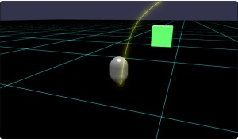
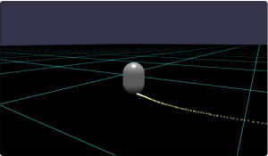
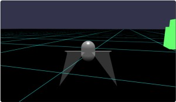
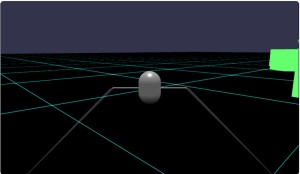
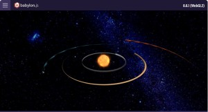
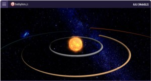
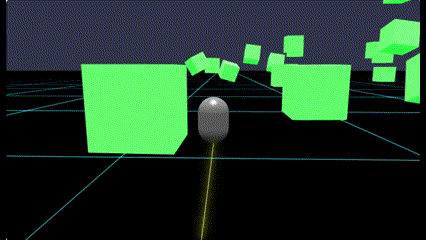
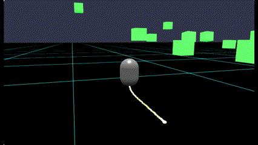
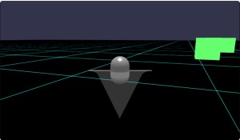
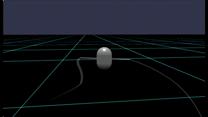

# Babylon.js の基礎調査：軌跡つくる（TrailMesh／ParticleSystem）

## この記事のスナップショット



金糸  
https://playground.babylonjs.com/full.html#FRCM97

雲をひく  
https://playground.babylonjs.com/full.html#FRCM97#1

（コードを見たい人はURLから `full.html` を消したURLを指定してください）

[ソース](067/)
- 067_trail1_goldLine  .. 金糸
- 067_trail2_particle  .. 粒子で追跡
- 067_trail3_swallow   .. 燕尾服
- 067_trail4_drawLine  .. 雲をひく

ローカルで動かす場合、 ./js 以下のライブラリは 057/js を利用してください。


## 概要

TrailMesh と ParticleSystem で軌跡を作ってみました。
TrailMesh は線分や面で表現する一方、ParticleSystem は粒で表現する方法ととらえて良さげです。

TrailMesh の軌跡  


ParticleSystem の軌跡  


燕尾服  


雲を引く  


## やったこと

- TrailMesh とは何者なのか
- TrailMesh で軌跡をつくる（金糸）
- ParticleSystem で軌跡をつくる
- TrailMesh でマント／燕尾服
- TrailMesh で「雲をひく」

### TrailMesh とは何者なのか

TrailMesh の正体は tube っぽいです。

公式のAPI[trailMesh](https://doc.babylonjs.com/features/featuresDeepDive/mesh/trailMesh/)
を確認すると tube のAPIと似ていることが見て取れます。

また実際に軌跡をつくるところを見ていると、四角の断面を押し出し成型しているっぽく見えます。
実際の動作もサイズやテクスチャを変更すると確認しやすくなります。

cx20様の作品で恐縮ですが、
[太陽系のシミュレーション](https://playground.babylonjs.com/#TC4XNY#6)
で
L118 の TrailMesh のオプション、サイズ指定を大きく(0.2)すると、軌跡がメッシュ（惑星）の回転に関係していることがわかります。

```js
// 変更前
trailMeshes[i] = new BABYLON.TrailMesh(planet.name + "_trail", planetMeshes[i], scene, 0.02, 500, true);
// 変更後
trailMeshes[i] = new BABYLON.TrailMesh(planet.name + "_trail", planetMeshes[i], scene, 0.2, 500, true);
```

サイズを大きくした様子  


L121 の宣言をコメントアウトすると（惑星とおなじ）テクスチャを外すことができます。

```js
// 変更前
trailMeshes[i].renderingGroupId = 3;    // same renderingGroupId as sun
// 変更後
// trailMeshes[i].renderingGroupId = 3;    // same renderingGroupId as sun
```

L131 をコメントアウトすると惑星の自転が止まるので、軌道の模様が１週ごとに変化することが確認できます。
テクスチャを外していれば、影の具合で軌跡に濃淡が出来ていたことがわかります。

```js
// 変更前
planetMeshes[i].rotation.y = -angle * planet.rotation_speed;
// 変更後
// planetMeshes[i].rotation.y = -angle * planet.rotation_speed;
```

テクスチャをはずし、自転を止めて、公転のみ  


影を消す（照明をあてる）ことで均一な色の軌跡を出す（レーザー照射のエフェクトの）ように工夫されているのが
CrossRoad様の
[Babylon.jsのTrail Meshを使ってきれいな軌跡を描く方法](https://www.crossroad-tech.com/entry/trailmesh-babylonjs)
です。

さて、TrailMeshのオプションsectionsのデフォルト値が４なので四角の形状で軌跡が作られてますが、
３なら三角、２にすれば線分になります。「他の形状に変更」や「回転」ができないようなのでかなり制限されます。
sections=2の例は後ほど（マント、燕尾服、雲を引くで）紹介します。

### TrailMesh で軌跡をつくる（金糸）

キャラクターコントローラーの移動跡を TrailMesh で軌跡として表現します。

TrailMesh では関連づけたメッシュの中心位置に軌跡を作ります。
キャラクターコントローラーに関連付けると中心位置から軌跡が作られてしまいます。
キャラクターコントローラーの底から軌跡を作りたいので、表示用のメッシュ(myFoot)を用意します。

```js
// trail 用のメッシュ、カプセルの底位置
let h_ = 0.9;
let myFoot = BABYLON.MeshBuilder.CreateSphere("foot", { diameter: 0.1, segments: 8 }, scene);
myFoot.position.copyFrom(displayCapsule.position);
myFoot.position.y -= h_;
myFoot.parent = displayCapsule;  // 相対位置でそのまま結合する
```

追跡を紐っぽくしたいので、サイズを小さく（diameter=0.01）して、長さを長め（length=150）にします

```js
// 蛍光発光用の設定
const gl = new BABYLON.GlowLayer("glow", scene);
gl.intensity = 1.8;

// カプセルの底に追跡をつける 金糸
var trailMeshSphere = new BABYLON.TrailMesh("trail", myFoot, scene, 0.01, 150, true);
trailMeshSphere.material = new BABYLON.StandardMaterial('sourceMat', scene);
trailMeshSphere.material.emissiveColor = new BABYLON.Color3(1, 1, 0);
gl.addIncludedOnlyMesh(trailMeshSphere);
```

軌跡を蛍光表示（発光）させたいので GlowLayer を使い、
追跡用のメッシュのみ発光させたいので addIncludedOnlyMeshで該当メッシュを追加します。

この追加をしておかないとすべての Standard および PBR の Material がすべて発光してしまいます。
公式の[Making Meshes Glow](https://doc.babylonjs.com/features/featuresDeepDive/mesh/glowLayer)より。

綺麗な線分がひけて、金糸っぽくて個人的にお気に入りです。

TrailMeshの軌跡（２倍速）  


### ParticleSystem で軌跡をつくる

粒子でも軌跡を表現することができます。

```js
// カプセルの底に軌跡用の粒子／バブルを発生させる
let particleSystem = new BABYLON.ParticleSystem("particles", 4000);
particleSystem.particleTexture = new BABYLON.Texture("textures/flare3.png");
particleSystem.emitter = displayCapsule; // emitBox で「底」の座標を指定できるので myFoot不要
particleSystem.minEmitBox = new BABYLON.Vector3(-0.02, -0.8, -0.02);
particleSystem.maxEmitBox = new BABYLON.Vector3( 0.02, -0.8, 0.02);
particleSystem.minScaleX = 0.10;
particleSystem.maxScaleX = 0.12;
particleSystem.minScaleY = 0.10;
particleSystem.maxScaleY = 0.12;
particleSystem.color1 = new BABYLON.Color4(1.0, 1.0, 0.0, 1.0);
particleSystem.color2 = new BABYLON.Color4(1.0, 1.0, 1.0, 1.0);
particleSystem.colorDead = new BABYLON.Color4(0.0, 0.0, 0.0, 0.0);
particleSystem.emitRate = 1000;
particleSystem.direction1 = new BABYLON.Vector3(-0.1, 0, -0.1);
particleSystem.direction2 = new BABYLON.Vector3(0.1, 0, 0.1);
particleSystem.updateSpeed = 0.002;
particleSystem.minLifeTime = 0.3;
particleSystem.maxLifeTime = 0.4;
particleSystem.start();
```

こちらは放出位置を相対位置で指定できるので放出力のメッシュは不要になります。

Sceleでサイズを小さくできますが、途切れないように emitRateを高く、updateSpeedを小さく調整しても限界がある(LifeTimeが効かなくなる)みたいです。
ある程度の大きさ、線分が切れる感じは許容するしかないみたいです。

色のグラデーションには黄色と白を割り当ててます。

またデフォルトで粒子が浮きあがるので direction で水平方向にのみわずかに動くよう制限してます。

粒子で軌跡を作る場合は、どうしてもつぶつぶ感が残ります。

粒子で軌跡（２倍速）  



### TrailMesh でマント／燕尾服

TrailMeshでsections:2にすると断面が線分形状になります。

サイズをちょっと大きく（diameter:2）してみたら、..「マント」っぽくなりました。
最初に見たときはどこぞのロボットの「滑空翼かっ！」と思ったのは内緒。

```js
var trailMeshWing = new BABYLON.TrailMesh("trail", displayCapsule, scene, {diameter:2, length:100, sections:2});
trailMeshWing.material = new BABYLON.StandardMaterial('sourceMat', scene);
trailMeshWing.material.emissiveColor = new BABYLON.Color3(1, 1, 1);
trailMeshWing.material.alpha = 0.2;
```

マント  



翼っぽい棒をキャラクターコントローラーに付けて、TrailMeshを２つにしたら翼っぽくなるかなと思ったら..

```js
trail 用のメッシュ、カプセルの左右のウイング
let wingL = 1;
let myWingR = BABYLON.MeshBuilder.CreateBox("wingR", { width: 2, height:0.01, depth:0.2 }, scene);
myWingR.position.copyFrom(displayCapsule.position);
myWingR.position.x += wingL;
myWingR.parent = displayCapsule;
let myWingL = BABYLON.MeshBuilder.CreateBox("wingL", { width: 2, height:0.01, depth:0.2 }, scene);
myWingL.position.copyFrom(displayCapsule.position);
myWingL.position.x -= wingL;
myWingL.parent = displayCapsule;

// カプセルの羽／棒に追跡をつける
var trailMeshWingR = new BABYLON.TrailMesh("trail", myWingR, scene, {diameter:1, length:100, sections:2});
trailMeshWingR.material = new BABYLON.StandardMaterial('sourceMat', scene);
trailMeshWingR.material.emissiveColor = new BABYLON.Color3(1, 1, 1);
trailMeshWingR.material.alpha = 0.2;
var trailMeshWingL = new BABYLON.TrailMesh("trail", myWingL, scene, {diameter:1, length:100, sections:2});
trailMeshWingL.material = new BABYLON.StandardMaterial('sourceMat', scene);
trailMeshWingL.material.emissiveColor = new BABYLON.Color3(1, 1, 1);
trailMeshWingL.material.alpha = 0.2;
```

なんだろ、長いと垂れ幕、短いと燕尾服／振袖っぽいｗ

燕尾服  


### TrailMesh で「雲を引く」

某赤い豚さんの作品『雲をひいた！』を作ります。飛行機ゲームとかで翼の端から軌跡を出すやつです。
羽の端にメッシュを作成して、TrailMeshに関連付けます。

```js
// 羽の端、tail 用のメッシュ
let wingEndL = 2;
let myWingEndR = BABYLON.MeshBuilder.CreateBox("wingEndR", { width: 0.01, height:0.01, depth:0.01 }, scene);
myWingEndR.position.copyFrom(displayCapsule.position);
myWingEndR.position.x += wingEndL;
myWingEndR.parent = displayCapsule;
let myWingEndL = BABYLON.MeshBuilder.CreateBox("wingEndL", { width: 0.01, height:0.01, depth:0.01 }, scene);
myWingEndL.position.copyFrom(displayCapsule.position);
myWingEndL.position.x -= wingEndL;
myWingEndL.parent = displayCapsule;

// カプセルに羽／棒をつけてその先っぽに追跡をつける
var trailMeshWingR = new BABYLON.TrailMesh("trail", myWingEndR, scene, {diameter:0.1, length:100, sections:2});
trailMeshWingR.material = new BABYLON.StandardMaterial('sourceMat', scene);
trailMeshWingR.material.emissiveColor = new BABYLON.Color3(1, 1, 1);
trailMeshWingR.material.alpha = 0.2;
var trailMeshWingL = new BABYLON.TrailMesh("trail", myWingEndL, scene, {diameter:0.1, length:100, sections:2});
trailMeshWingL.material = new BABYLON.StandardMaterial('sourceMat', scene);
trailMeshWingL.material.emissiveColor = new BABYLON.Color3(1, 1, 1);
trailMeshWingL.material.alpha = 0.2;
```

うーん、常時表示しているので新体操のリボンっぽい。
表示を限定すれば（急加速、急旋回のみとかで）かっこよくなるのかな？

雲をひく  


## まとめ・雑感

軌跡のエフェクトとしてTrailMeshを深掘りしてみました。といっても今更感は否めないですが。
エフェクトとしてなかなか興味深いのですが、形状や姿勢が限定されるので使いどころが難しいと感じた次第。
自分が知らないだけで、「剣を振ったときの残像」や「車のテールランプの残像」を表現できたりするのかなぁ。
であればかなり胸熱なんですけど。
とりあえず優先度下げて、引き続き調査かな。

今回粒子についても少し触れましたが、次回ちょい深掘りします。

------------------------------------------------------------

前の記事：[Babylon.js で物理演算(havok)：自作移動体でクイックな動作／ドリフト走行＋ゴースト表示](066.md)

次の記事：[Babylon.js の基礎調査：ParticleSystemを使ってみる](068.md)


目次：[目次](000.md)

この記事には次の関連記事があります。

- [Babylon.js の基礎調査：軌跡つくる（TrailMesh／ParticleSystem）](067.md)
- [Babylon.js の基礎調査：ParticleSystemを使ってみる](068.md)

--