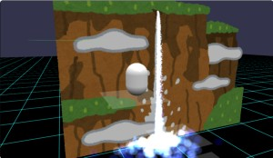
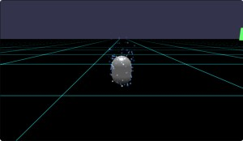
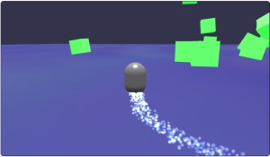
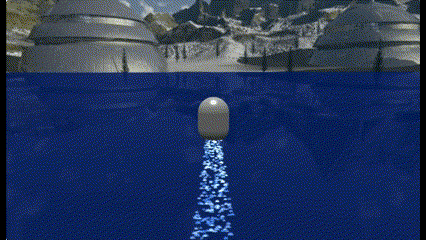
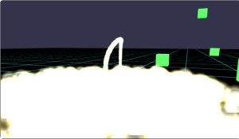
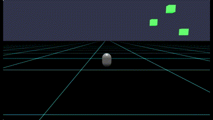
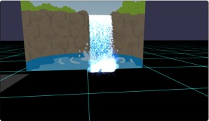
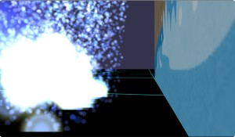
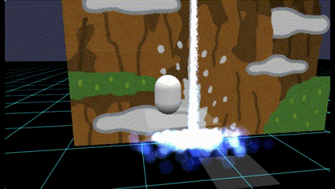

# Babylon.js の基礎調査：ParticleSystemを使ってみる

## この記事のスナップショット



船の軌跡＋water material  
https://playground.babylonjs.com/full.html#M5IZ89

ロケット発射時の煙  
https://playground.babylonjs.com/full.html#M5IZ89#1

滝（１）  
https://playground.babylonjs.com/full.html#M5IZ89#2

滝（２）  
https://playground.babylonjs.com/full.html#M5IZ89#3

（コードを見たい人はURLから `full.html` を消したURLを指定してください）

[ソース](068/)

- 068a_bubble  .. 潜水艦のバブル
- 068b_ship  .. 船の軌跡
- 068c_ship2  .. 船の軌跡＋water material
- 068d_launch  .. ロケット発射時の煙
- 068e_waterfall1 .. 滝（１）
- 068f_waterfall2 .. 滝（２）

ローカルで動かす場合、 ./js 以下のライブラリは 057/js を利用してください。

## 概要

勉強がてら気になっていた粒子の表現にチャレンジしました。

## やったこと

- 潜水艦のバブル
- 船の軌跡
- 船の軌跡＋water material
- ロケット発射時の煙
- 滝（１）
- 滝（２）

### 潜水艦のバブル

水中の潜水艦の全体から静かに気泡をだすイメージで。
いや、うん、潜水艦でこんなに泡立てたらダメな気がする。敵に発見される意味で。

色は水中ということで青みの色を採用し、
メッシュにあわせてカプセル形状で放出します。
泡が上昇するように上向きの gravity をかけてます。

```js
// カプセルから気泡を静かに出す..
let particleSystem = new BABYLON.ParticleSystem("particles", 2000, scene);
particleSystem.particleTexture = new BABYLON.Texture("textures/flare.png", scene);
particleSystem.emitter = displayCapsule;
particleSystem.color1 = new BABYLON.Color4(0.7, 0.8, 1.0, 1.0);
particleSystem.color2 = new BABYLON.Color4(0.2, 0.5, 1.0, 1.0);
particleSystem.colorDead = new BABYLON.Color4(0, 0, 0.2, 0.0);
particleSystem.minSize = 0.1;
particleSystem.maxSize = 0.2;
particleSystem.minLifeTime = 0.3;
particleSystem.maxLifeTime = 1.5;
particleSystem.emitRate = 300;
particleSystem.createCylinderEmitter(r, h, r, 0);
particleSystem.minEmitPower = 0.1;
particleSystem.maxEmitPower = 0.3;
particleSystem.updateSpeed = 0.005;
particleSystem.gravity = new BABYLON.Vector3(0, 2, 0);
particleSystem.start();
```

潜水艦のバブル  


### 船の軌跡

船の移動したあとの軌跡を particle で表現してみました。

放出位置はキャラクターコントローラーの下部を相対位置で指定します。
また粒子は水平方向のみに移動するよう direction を指定しつつ、
長い軌跡を出したいので LifeTime をちょっと長めにしてます。

```js
// 船の軌跡っぽく
let particleSystem = new BABYLON.ParticleSystem("particles", 5000, scene);
particleSystem.particleTexture = new BABYLON.Texture("textures/flare.png", scene);
particleSystem.emitter = displayCapsule;
particleSystem.minEmitBox = new BABYLON.Vector3(-0.3, -0.7, -0.3);
particleSystem.maxEmitBox = new BABYLON.Vector3( 0.3, -0.7,  0.3);
particleSystem.color1 = new BABYLON.Color4(0.7, 0.8, 1.0, 1.0);
particleSystem.color2 = new BABYLON.Color4(0.2, 0.5, 1.0, 1.0);
particleSystem.colorDead = new BABYLON.Color4(0, 0, 0.2, 0.0);
particleSystem.minSize = 0.1;
particleSystem.maxSize = 0.2;
particleSystem.minLifeTime = 1.3;
particleSystem.maxLifeTime = 1.5;
particleSystem.direction1 = new BABYLON.Vector3(-1, 0, -1);
particleSystem.direction2 = new BABYLON.Vector3(1, 0, 1);
particleSystem.emitRate = 1000;
particleSystem.minEmitPower = 0.1;
particleSystem.maxEmitPower = 0.3;
particleSystem.updateSpeed = 0.005;
particleSystem.start();
```

また、地面にテクスチャを貼るだけで水辺感が増しました。

```js
// 水面ぽいテクスチャで、水辺感をだす
const groundMesh = BABYLON.MeshBuilder.CreateGround("ground", { width: 500, height: 500 }, scene);
groundMesh.material = new BABYLON.StandardMaterial("groundmat", scene);
groundMesh.material.diffuseTexture = new BABYLON.Texture("textures/waterbump.png", scene);
```

船の軌跡  


### 船の軌跡＋water material

上述では床にテクスチャを貼るだけの「なんちゃって水面」でしが、
babylonjs には water material があるのでこちらを使ってみました。

公式の[サンプルコード](https://playground.babylonjs.com/#1SLLOJ#18)そのままコピペして WaterMaterial を作成します。

そのままだと落下するので別途地面(ground)を配置してます。

いざ動かしてみるとずっぽり沈み、ジャンプすると水面から飛び出ます。
水面の高さが問題だと気づいてwaveHeight,bumpHeightを低く変更。
まだ水面が浅いところと深いところがありますが、まぁ水面を走っている感じに調整できました。

```js
// skybox と組み合わせたウォーターマテリアル
// Skybox
var skybox = BABYLON.Mesh.CreateBox("skyBox", 5000.0, scene);
var skyboxMaterial = new BABYLON.StandardMaterial("skyBox", scene);
skyboxMaterial.backFaceCulling = false;
skyboxMaterial.reflectionTexture = new BABYLON.CubeTexture("textures/skybox3", scene);
skyboxMaterial.reflectionTexture.coordinatesMode = BABYLON.Texture.SKYBOX_MODE;
skyboxMaterial.diffuseColor = new BABYLON.Color3(0, 0, 0);
skyboxMaterial.specularColor = new BABYLON.Color3(0, 0, 0);
skyboxMaterial.disableLighting = true;
skybox.material = skyboxMaterial;
// Water
var waterMesh = BABYLON.MeshBuilder.CreateGround("ground", { width: 500, height: 500 }, scene);
var water = new BABYLON.WaterMaterial("water", scene, new BABYLON.Vector2(512, 512));
water.backFaceCulling = true;
water.bumpTexture = new BABYLON.Texture("textures/waterbump.png", scene);
water.windForce = -15;
water.waveHeight = 0.05; // 1.3;  // 波をかなり抑えればOKっぽい
water.bumpHeight = 0.01; // 0.15;
water.windDirection = new BABYLON.Vector2(1, 1);
water.waterColor = new BABYLON.Color3(0, 0.1, 0.4); // new BABYLON.Color3(0, 0.1, 0);
water.colorBlendFactor = 0.8;
water.addToRenderList(skybox);
waterMesh.material = water;
// 水面の下に配置する 地面
const groundMesh = BABYLON.MeshBuilder.CreateGround("ground", { width: 500, height: 500 }, scene);
groundMesh.material = new BABYLON.GridMaterial("groundMaterial", scene);
groundMesh.material.majorUnitFrequency = 10;
groundMesh.material.minorUnitVisibility  = 0;
// 地面に摩擦係数、反射係数を設定する
var groundAggregate = new BABYLON.PhysicsAggregate(groundMesh, BABYLON.PhysicsShapeType.BOX, { mass: 0, restitution:0.3}, scene);
```



ちなみに波の高さを変更せずに地面の高さを調整していたとき、
「水面の深いところと浅いところがある！」「下の地面が見えて、水面が満ち引きしている！」
と思ったのですが波の影響でメッシュが上下しているだけでした。on_

うーん、荒波（波が高いとき）に船を浮かべるにはどうしたらいんでしょうね？
メッシュの交差判定をして水面位置を求めるのかな？ちょっと保留で。

### ロケット発射時の煙

ロケット発射を模した演出をします。
タイミングよくスペースでジャンプすると、ロケット気分になれます。ちょっと楽しいです。

３秒後に発射台からの煙を模したpartcleを発生させますがその１秒後に停止させます。
本体からは3.5秒後に噴出の演出を開始します。

```js
// ロケットの発射時の煙っぽく
// 発射台の煙
let particleSystem = new BABYLON.ParticleSystem("particles", 2000, scene);
particleSystem.particleTexture = new BABYLON.Texture("textures/flare.png", scene);
particleSystem.emitter = new BABYLON.Vector3(3, 1, -8);
particleSystem.color1 = new BABYLON.Color4(0.8, 0.8, 0.8, 1.0);
particleSystem.color2 = new BABYLON.Color4(1.0, 1.0, 1.0, 1.0);
particleSystem.colorDead = new BABYLON.Color4(0, 0, 0, 0);
particleSystem.minLifeTime = 6.0;
particleSystem.maxLifeTime = 8.0;
particleSystem.emitRate = 500;
particleSystem.createCylinderEmitter(0.3, 1, 0.3, 0);
particleSystem.minEmitPower = 10;
particleSystem.maxEmitPower = 10;
particleSystem.updateSpeed = 0.005;
particleSystem.start(3000);
particleSystem.addSizeGradient(0, 3);
particleSystem.addSizeGradient(1, 6);
particleSystem.targetStopDuration = 1;
// 本体の煙
const particleSystem3 = new BABYLON.ParticleSystem("particles", 3000);
particleSystem3.particleTexture = new BABYLON.Texture("textures/flare3.png");
particleSystem3.emitter = displayCapsule;
particleSystem3.minEmitBox = new BABYLON.Vector3(-0.02, -0.7, -0.02);
particleSystem3.maxEmitBox = new BABYLON.Vector3( 0.02, -0.7, 0.02);
particleSystem3.minScaleX = 0.4;
particleSystem3.maxScaleX = 0.8;
particleSystem3.minScaleY = 0.4;
particleSystem3.maxScaleY = 0.8;
particleSystem3.color1 = new BABYLON.Color4(1.0, 1.0, 0.0, 1.0);
particleSystem3.color2 = new BABYLON.Color4(1.0, 1.0, 1.0, 1.0);
particleSystem3.colorDead = new BABYLON.Color4(0.0, 0.0, 0.0, 0.0);
particleSystem3.emitRate = 1000;
particleSystem3.minLifeTime = 2;
particleSystem3.maxLifeTime = 3;
particleSystem3.start(3500);
```



（２倍速）  


### 滝（１）

画像は[いらすとや](https://www.irasutoya.com/)さんから

画像は plane に張り付けて、絵に合わせて水を落とします。
このとき滝の裏側を通れるように、手前に飛ばすように水を落とします。

また滝つぼから上がる水煙を時間差で発生させます。

画像が暗かったので照明を追加したほか、
画面手前に足場を作り、高所から見れるようにしてます。
滝の全景を見たい方はこちら（足場）からどうぞ。

```js
// 滝（１）
let wpFall = BABYLON.MeshBuilder.CreatePlane("plane", {width:18, height:12, sideOrientation: BABYLON.Mesh.DOUBLESIDE}, scene);
wpFall.material = new BABYLON.StandardMaterial("groundmat", scene);
wpFall.material.diffuseTexture = new BABYLON.Texture("textures/bg_taki.jpg", scene);
wpFall.position = new BABYLON.Vector3(0, 6, 0);
// 滝メイン
let particleSystem = new BABYLON.ParticleSystem("particles", 20000, scene);
particleSystem.particleTexture = new BABYLON.Texture("textures/flare.png", scene);
particleSystem.emitter = new BABYLON.Vector3(2, 8.2, 0);
let fallw = 1.6;
particleSystem.minEmitBox = new BABYLON.Vector3(-fallw, 0,  0.0);
particleSystem.maxEmitBox = new BABYLON.Vector3( fallw, 0,  0.0);
particleSystem.color1 = new BABYLON.Color4(0.7, 0.8, 1.0, 1.0);
particleSystem.color2 = new BABYLON.Color4(0.2, 0.5, 1.0, 1.0);
particleSystem.colorDead = new BABYLON.Color4(0, 0, 0.2, 0.0);
particleSystem.minSize = 0.1;
particleSystem.maxSize = 0.2;
particleSystem.minLifeTime = 1.6;
particleSystem.maxLifeTime = 1.8;
particleSystem.emitRate = 10000;
particleSystem.minEmitPower = 0.1;
particleSystem.maxEmitPower = 0.3;
particleSystem.updateSpeed = 0.005;
particleSystem.direction1 = new BABYLON.Vector3(-0.1, 0, -10);
particleSystem.direction2 = new BABYLON.Vector3( 0.1, 0, -12);
particleSystem.gravity = new BABYLON.Vector3(0, -9, 0);
particleSystem.start();
// 滝つぼからの水煙
let particleSystem2 = new BABYLON.ParticleSystem("particles", 2000, scene);
particleSystem2.particleTexture = new BABYLON.Texture("textures/flare.png", scene);
particleSystem2.emitter = new BABYLON.Vector3(2, 0, -2);
let fallw2 = 1.6;
particleSystem2.minEmitBox = new BABYLON.Vector3(-fallw2, 0,  0.0);
particleSystem2.maxEmitBox = new BABYLON.Vector3( fallw2, 0,  0.0);
particleSystem2.color1 = new BABYLON.Color4(0.7, 0.8, 1.0, 1.0);
particleSystem2.color2 = new BABYLON.Color4(0.2, 0.5, 1.0, 1.0);
particleSystem2.colorDead = new BABYLON.Color4(0, 0, 0.2, 0.0);
particleSystem2.minLifeTime = 0.5;
particleSystem2.maxLifeTime = 1;
particleSystem2.emitRate = 100;
particleSystem2.minEmitPower = 0.8;
particleSystem2.maxEmitPower = 1;
particleSystem2.updateSpeed = 0.005;
particleSystem2.start(6000);
particleSystem2.addSizeGradient(0, 1);
particleSystem2.addSizeGradient(1, 2);
particleSystem2.direction1 = new BABYLON.Vector3(-2, 2, -2);
particleSystem2.direction2 = new BABYLON.Vector3( 2, 3, -3);
particleSystem2.gravity = new BABYLON.Vector3(0, 1, 0);
```

滝（１）  


滝の裏側（裏見の滝）はこんな感じ

滝（１）の裏側  


### 滝（２）

エンジェルフォールって滝つぼが無いんですって。作ってから気づいたよ。on_
落ち切る前に、霧散して拡散する感じになるよう調整。

- 上からは底に届く直前でライフタイムが切れる／消滅する感じに(LifeTime)
- 上からはライフタイムが切る直前にサイズを大きく(addSizeGradient)
- 下の粒子は少なめに抑える(emitRate)
- 下の粒子の方向を全方位に水平に広がる感じで(createCylinderEmitter)

```js
// 滝（２）
let wpFall2 = BABYLON.MeshBuilder.CreatePlane("plane", {width:40, height:36, sideOrientation: BABYLON.Mesh.DOUBLESIDE}, scene);
wpFall2.material = new BABYLON.StandardMaterial("groundmat", scene);
wpFall2.material.diffuseTexture = new BABYLON.Texture("textures/taki_Angel_Falls.png", scene);
wpFall2.position = new BABYLON.Vector3(0, 15, 0);
// 滝メイン
let particleSystem = new BABYLON.ParticleSystem("particles", 8000, scene);
particleSystem.particleTexture = new BABYLON.Texture("textures/flare.png", scene);
particleSystem.emitter = new BABYLON.Vector3(-3, 24, 0);
let fallw = 0.1;
particleSystem.minEmitBox = new BABYLON.Vector3(-fallw, 0,  0.0);
particleSystem.maxEmitBox = new BABYLON.Vector3( fallw, 0,  0.0);
particleSystem.color1 = new BABYLON.Color4(0.7, 0.8, 1.0, 1.0);
particleSystem.color2 = new BABYLON.Color4(0.2, 0.5, 1.0, 1.0);
particleSystem.colorDead = new BABYLON.Color4(0, 0, 0.2, 0.0);
particleSystem.minLifeTime = 2.3;
particleSystem.maxLifeTime = 2.4;
particleSystem.emitRate = 3000;
particleSystem.minEmitPower = 0.1;
particleSystem.maxEmitPower = 0.3;
particleSystem.updateSpeed = 0.005;
particleSystem.direction1 = new BABYLON.Vector3(-1, 0, -2);
particleSystem.direction2 = new BABYLON.Vector3( 1, 0, -4);
particleSystem.gravity = new BABYLON.Vector3(0, -9, 0);
particleSystem.start();
particleSystem.addSizeGradient(0  , 0.1);
particleSystem.addSizeGradient(0.8, 0.4);
particleSystem.addSizeGradient(1  , 1.5);
// 滝つぼは無いらしいから、霧になって広がる感じに
let particleSystem2 = new BABYLON.ParticleSystem("particles", 1000, scene);
particleSystem2.particleTexture = new BABYLON.Texture("textures/flare.png", scene);
particleSystem2.emitter = new BABYLON.Vector3(-3, 1, 0.5);
particleSystem2.color1 = new BABYLON.Color4(0.7, 0.8, 1.0, 1.0);
particleSystem2.color2 = new BABYLON.Color4(0.2, 0.5, 1.0, 1.0);
particleSystem2.colorDead = new BABYLON.Color4(0, 0, 0.2, 0.0);
particleSystem2.minLifeTime = 1.5;
particleSystem2.maxLifeTime = 3;
particleSystem2.emitRate = 200;
particleSystem2.addSizeGradient(0, 2);
particleSystem2.addSizeGradient(1, 3);
particleSystem2.createCylinderEmitter(1, 1, 0.3, 0);
particleSystem2.minEmitPower = 2;
particleSystem2.maxEmitPower = 4;
particleSystem2.updateSpeed = 0.005;
particleSystem2.start(7500);
```

滝（２）（２倍速）  


## まとめ・雑感

「船の軌跡」で、移動したあとに泡？が残るのは良いとして、波が立っていない。
「船首が水を切ると水面には波が立つ」ことを忘れてました。むむぅ、奥深い。
魚雷ならありかな。もうちょっと考えたいところ。

water material は使いどころが難しいですね。
でも「波」はちょっと魅力。高さ固定で船を浮かべてしまいたくなります。

「滝」はちょっと楽しかった。しかし見入っちゃいますね。マイナスイオンがでてるのかな？
滝つぼからの水煙のタイミングを頑張ってみました。読者さんの再生環境でタイミングあっていると良いけど、、、


------------------------------------------------------------

前の記事：[Babylon.js の基礎調査：軌跡つくる（TrailMesh／ParticleSystem）](067.md)

次の記事：..


目次：[目次](000.md)

この記事には次の関連記事があります。

- [Babylon.js の基礎調査：軌跡つくる（TrailMesh／ParticleSystem）](067.md)
- [Babylon.js の基礎調査：ParticleSystemを深掘り](068.md)
- [Babylon.js で物理演算(havok)：滑り台と複数カメラ](069.md)
- [Babylon.js で物理演算(havok)：パイプ内をボードで滑る](070.md)

--