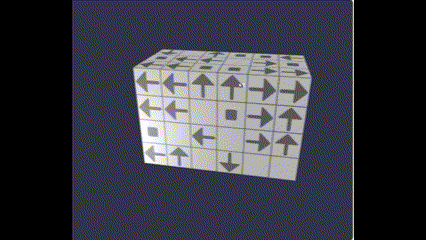
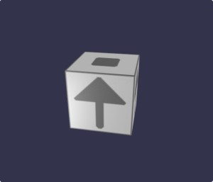
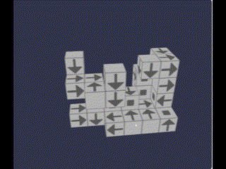
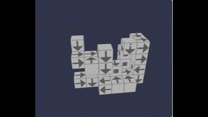
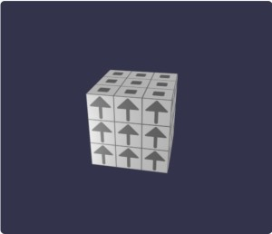

# Babylon.js ：立体パズル（タップアウェ○もどき）

## この記事のスナップショット


https://playground.babylonjs.com/full.html#2SESW0


（コードを見たい人はURLから `full.html` を消したURLを指定してください）

[ソース](071/)

ローカルで動かす場合、 ./js 以下のライブラリは 069/js を利用してください。
（ArcRotateCameraではマウスの右ドラッグ操作で平行移動ができるようになってます）

## 概要

最近、パズルゲームにハマってしまい時間泥棒されてしまうので、
中毒状態から脱却すべく、自作して煩悩を捨てようと試みました。

ここでのパズルとは立体パズルのタップアウェ○に似た別名のゲームですが、やることは同じで、積み上げられたブロックを矢印の方向に移動させてくずすというものです。

積み上げらた状態  


解いているところ（２倍速）  



## やったこと

タップアウェ○もどきをつくります。
いきなりゲームぽっく作り上げるのはしんどいので、
成果を実感できるようにスモールスタートで段階を踏んで作り上げることにします。

- ブロックを積み上げる
- クリックしたブロックを移動して消去／移動して戻す
- 解けるブロックを積み上げる

### ブロックを積み上げる

まずは一方向もしくはランダムな向きでブロックを積み上げられるようにします。

矢印付きのブロックは

[公式](https://doc.babylonjs.com/features/featuresDeepDive/mesh/creation/set/box/)にある
[Create a Box With Face Numbers](https://playground.babylonjs.com/#6XIT28#5)
のサンプルを参考に、矢印の向きの画像を自作して boxに張り付けることにします。

公式のコードをコピペしてます。

```js
const mat = new BABYLON.StandardMaterial("mat");
mat.diffuseTexture = new BABYLON.Texture("textures/arrow.jpg");
var columns = 6;
var rows = 1;
const faceUV = new Array(6);
for (let i = 0; i < 6; i++) {
    faceUV[i] = new BABYLON.Vector4(i / columns, 0, (i + 1) / columns, 1 / rows);
}
const mesh = BABYLON.MeshBuilder.CreateBox("box"+ibox, {faceUV: faceUV, wrap: true});
mesh.material = mat;
```

ブロック  


ブロックを積み上げるために、上記に関連して位置と回転を変更できるようにします。

```js
//個々のboxの位置と回転
mesh.position = new BABYLON.Vector3(x+adjx, y+adjy, z+adjz);
if (dir == 0) { // x+
    mesh.rotation = new BABYLON.Vector3(0, 0, -R90);
} else if (dir == 1) { //y+
    ;
} else if (dir == 2) { //z+
    mesh.rotation = new BABYLON.Vector3(R90, 0, 0);
}else if (dir == 3) { // x-
    mesh.rotation = new BABYLON.Vector3(0, 0, R90);
} else if (dir == 4) { //y-
    mesh.rotation = new BABYLON.Vector3(R180, 0, 0);
} else if (dir == 5) { //z-
    mesh.rotation = new BABYLON.Vector3(-R90, 0, 0);
}
```

上述で１つのブロックに関する処理部分ができました。

ブロックを積み上げるために、情報は３次元の配列(data)で管理し、１要素には６方向の向き／設定無し(-1)の状態を持たせます。

```js
// 2x2x1のブロック情報
nx = 2, ny = 2, nz = 1;
data = Array.from(new Array(nx), () => {
    return Array.from(new Array(ny), () => new Array(nz).fill(defval));
});
data[0][0][0] = 1; // 1:=Ｙ軸＋方向
data[1][0][0] = 1;
data[0][1][0] = 1;
data[1][1][0] = 1;
```

あとはこの情報（data）に応じてメッシュを作成します。

```js
// data に応じてメッシュを作成する
let adjx=-Math.floor(nx/2), adjy=-Math.floor(ny/2), adjz=-Math.floor(nz/2);
for (let iy = 0; iy < ny; ++iy) {
    for (let iz = 0; iz < nz; ++iz) {
        for (let ix = 0; ix < nx; ++ix) {
            if (data[ix][iy][iz] >= 0) {
                dir = data[ix][iy][iz];
                mesh = createArwbox({x:ix, y:iy, z:iz, dir:dir, adjx:adjx, adjy:adjy, adjz:adjz});
            }
        }
    }
}
```

2x2x1 のブロック  


### クリックしたブロックを移動して消去／移動して戻す

画面上をクリックしてメッシュを検出するには Scene.onPointerDown を用います。

```js
scene.onPointerDown = function castRay(){
    var ray = scene.createPickingRay(scene.pointerX, scene.pointerY, BABYLON.Matrix.Identity(), camera, false);
    var hit = scene.pickWithRay(ray);
    if (hit.pickedMesh != null) {
        console.log("debug:", hit.pickedMesh.name);
    }
}
```

クリックしたメッシュが取得できるようになったので、メッシュに紐づけておいたメタデータ（座標）からdataと照らし合わせて取り除くこと（パージ）が可能かどうか／進行方向に他のboxがないかを判断できます。

パージ可能なboxはアニメーション（外側へ移動）させて、消滅(dispose)させることにします。

アニメーションは Sscene.beginDirectAnimation で実施します。
ループさせない１回だけの動作なので５番目の引数は false にします。
アニメーション後にメッシュを削除させたいので、アニメーション後に実施する関数 funcDisposeを７番目の引数に渡します。

```js
//外側に移動させるアニメーション＋削除
// パージ可能 : 該当ブロックを進行方向に進め／アニメーションして消す
nframe = 10, nlen = 10, nn = (idir<3) ? nlen : -nlen;
let delMeshList = []; // 削除対象のメッシュ

// パージしたメッシュをdisposeする関数とそのための変数
const funcDispose = function () {
    while (delMeshList.length > 0) {
        let mesh = delMeshList.pop();
        mesh.dispose();
    }
}

if ((idir%3) == 0) {
    const pv = mesh.position.x;
    vSlide = new BABYLON.Animation("xSlide", "position.x", nframe, BABYLON.Animation.ANIMATIONTYPE_FLOAT, BABYLON.Animation.ANIMATIONLOOPMODE_CYCLE);
    keyFrames.push({ frame: 0, value: pv });
    keyFrames.push({ frame: nframe, value: pv+nn });
} else if ((idir%3) == 1) {
    const pv = mesh.position.y;
    vSlide = new BABYLON.Animation("ySlide", "position.y", nframe, BABYLON.Animation.ANIMATIONTYPE_FLOAT, BABYLON.Animation.ANIMATIONLOOPMODE_CYCLE);
    keyFrames.push({ frame: 0, value: pv });
    keyFrames.push({ frame: nframe, value: pv+nn });
} else if ((idir%3) == 2) {
    const pv = mesh.position.z;
    vSlide = new BABYLON.Animation("zSlide", "position.z", nframe, BABYLON.Animation.ANIMATIONTYPE_FLOAT, BABYLON.Animation.ANIMATIONLOOPMODE_CYCLE);
    keyFrames.push({ frame: 0, value: pv });
    keyFrames.push({ frame: nframe, value: pv+nn });
}
vSlide.setKeys(keyFrames);
scene.beginDirectAnimation(mesh, [vSlide], 0, nframe, false, 1, funcDispose);
delMeshList.push(mesh);

data[ix][iy][iz] = -1;
```

外側に移動させるアニメーション  



一方で、パージ不可能なブロックは「衝突する位置まで移動させて元の位置に戻す」アニメーションを行います。

移動させる長さ(nlen)を求めたあとは、これに基づいて往復させるアニメーションを作成するだけです。

蛇足になりますが、
こちらではメッシュの座標値(mesh.position.x)を使わずに理論値(ix+adjx)を使ってます。
通常はどちらも同じ値ですが、「パージ不可なブロックをアニメーション中にクリックすると元の位置に戻らない」不具合があったため、
より絶対的な「理論値」を使ってます。

```js
//往復させるアニメーション
let nframe1 = nlen, nframe2 = nlen*2;
nn = (idir<3) ? nlen : -nlen;

if ((idir%3) == 0) {
    const pv = ix+adjx;
    vSlide = new BABYLON.Animation("xSlide", "position.x", nframe2, BABYLON.Animation.ANIMATIONTYPE_FLOAT, BABYLON.Animation.ANIMATIONLOOPMODE_CYCLE);
    keyFrames.push({ frame: 0, value: pv });
    keyFrames.push({ frame: nframe1, value: pv+nn });
    keyFrames.push({ frame: nframe2, value: pv });
} else if ((idir%3) == 1) {
    const pv = iy+adjy;
    vSlide = new BABYLON.Animation("ySlide", "position.y", nframe2, BABYLON.Animation.ANIMATIONTYPE_FLOAT, BABYLON.Animation.ANIMATIONLOOPMODE_CYCLE);
    keyFrames.push({ frame: 0, value: pv });
    keyFrames.push({ frame: nframe1, value: pv+nn });
    keyFrames.push({ frame: nframe2, value: pv });
} else if ((idir%3) == 2) {
    const pv = iz+adjz;
    vSlide = new BABYLON.Animation("zSlide", "position.z", nframe2, BABYLON.Animation.ANIMATIONTYPE_FLOAT, BABYLON.Animation.ANIMATIONLOOPMODE_CYCLE);
    keyFrames.push({ frame: 0, value: pv });
    keyFrames.push({ frame: nframe1, value: pv+nn });
    keyFrames.push({ frame: nframe2, value: pv });
}
vSlide.setKeys(keyFrames);
scene.beginDirectAnimation(mesh, [vSlide], 0, nframe2, false, 1);
```

往復させるアニメーション  


### 解けるブロックを積み上げる

一方向のみだと単調すぎ、
かといってランダムにすると向かい合ったり循環したりと解けないことが多々発生します。

１方向（単調）のブロック  


ランダムな方向のブロック  


なので、解けることが可能でランダムな積み上げを行うアルゴリズムとして２つ考えてみました。

- アルゴリズム：ランダム
- アルゴリズム：穴掘り法

アルゴリズム：ランダム

外側から領域を眺め、６面の各方向から眺めて、眺める面のランダムな位置から「空き」のつづいた最奥の位置に「手前向き」のブロックを配置していきます。
ランダムに埋めていくので中に空洞ができる可能性がありますが許容します。
また、ランダムですべてを埋めるには終盤に時間がかかるので、後半はランダムではなく面の座標を全探査して埋めていきます。

プレイした感じ、ほとんどが一回で場外で、ごくまれに段階をふんで、順番にパージしないと解けないものがあったりしますがそれでも２段階～３段階がせいぜいといった感じで初級レベルです。


アルゴリズム：穴掘り法

「穴掘り法」と呼称してますが、アルゴリズムの動きが似ているので名前を拝借しました。
「順番にパージすれば解ける」ように、外側の任意の座標を開始位置としてブロックの向きとは逆方向に進んで次のブロックを配置していきます。
方向を変えるときはブロックの向きの延長上に他のブロックが無いこと（パージできること）を確認しておきます。

途中の座標から「枝分かれ」して経路を作ることはせずに一本道にしてます。
「枝分かれ」させればより複雑にできますが、バグ修正で気力がつきました。

プレイした感じ、序盤は１発場外で、中盤から終盤に向けて順番にパージしないと解けなくなっており、それでも一本道なのではなく、中級レベルといった感じでしょうか。

## ステージ構成

ステージは下記アルゴリズムを繰り返して、かつクリアごとにx,y,zのサイズを大きくしています。

- ランダム
- ランダム（＋少し大きいサイズ）
- 穴掘り法

## まとめ・雑感

遊び始めると２～３時間をついやしてしまう、なかなかやめられなヘビージャンキーだったのですが、お陰でだいぶ煩悩退散できて、以前ほど執着しなくなったように思います。
正直、アプリのゲームと比べるとクォリティは低い（特に演出のエフェクトが雑）ですが、コアな部分は再現できたかな。

アルゴリズム１のランダムな積み上げまでは約１日でできたのですが、２番目のアルゴリズムのバグ修正に時間を取られれくじけそうになりました。

アルゴリズムについては「枝分かれ」のほかにもアイデア（一旦ランダムで積み上げて解けない・ループしているところをいじるとか）があったのですがしばし休息です。

------------------------------------------------------------

前の記事：[Babylon.js で物理演算(havok)：パイプ内をボードで滑る](070.md)

次の記事：[Babylon.js の基礎調査：perlinノイズを使ってみる](072.md)


目次：[目次](000.md)

この記事には関連記事がありません。

--