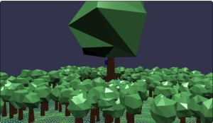
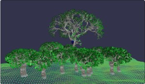
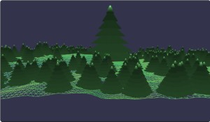
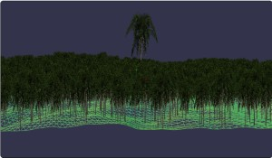
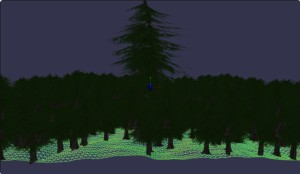
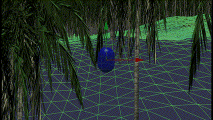

# Babylon.js の基礎調査：森をつくってみる

## この記事のスナップショット



SPS Tree Generatorで森  
https://playground.babylonjs.com/full.html#3TDLC4

他のサンプルのリンクは「概要」のまとめから。

（コードを見たい人はURLから `full.html` を消したURLを指定してください）

[ソース](073/)

- 073_forest1_SPStree .. 「SPS Tree Generator」で森
- 073_forest2_pine    .. 「Simple Pine Tree Generator」で森
- 073_forest3_polygon .. 「Quick Tree Generator」で森
- 073_forest4_sprite  .. 「Sprite Manager」で森
- 073_forest5_mesh    .. 「Mesh-Instances」で森
- 073_forest12_pine    .. 「Simple Pine Tree Generator」で森（激重）
- 073_forest13_polygon .. 「Quick Tree Generator」で森（激重）
- 073_forest14_sprite  .. 「Sprite Manager」で森（激重）
- 073_forest15_mesh    .. 「Mesh-Instances」で森（激重）

ローカルで動かす場合、./js 以下のライブラリは 069/js を利用してください。

## 概要

公式ドキュメントをみているといくつか「木」のサンプルがあるので、これらを使って森を作ってみました。

効率化・最適化は考えてないです。Solid Particle System を使えばもっと効率化できそうな気もしますが、
サンプルのオブジェクトを単純に増やすことに着目しました。

今回参考にした木のサンプルは以下のものです。

- [SPS Tree Generator](https://doc.babylonjs.com/communityExtensions/treeGenerators/spsTreeGenerator/)
  - [SPS Tree Generator Example](https://playground.babylonjs.com/#1LXNS9#4)
- [Simple Pine Tree Generator](https://doc.babylonjs.com/communityExtensions/treeGenerators/simplePineGenerator/)
  - [Simple Pine Tree Generator Example](https://playground.babylonjs.com/#LG3GS#106)
- [Quick Tree Generator](https://doc.babylonjs.com/communityExtensions/treeGenerators/quickTreeGenerator/)
  - [Quick Tree Generator Example](https://playground.babylonjs.com/#/#XG2DFK)
- [Sprite Manager](https://doc.babylonjs.com/features/featuresDeepDive/sprites/sprite_manager/)
  - [multiple trees](https://playground.babylonjs.com/#YCY2IL#2)
- [Mesh-Instances](https://doc.babylonjs.com/features/featuresDeepDive/mesh/copies/instances)
  - [Trees](https://playground.babylonjs.com/#YB006J#75)

まとめ

表示方法                   | 本数 | 寸評  | デモリンク
---------------------------|------|-------|----------
SPS Tree Generator         | 21   |激重   | [073_forest1_SPStree](https://playground.babylonjs.com/full.html#3TDLC4)
Simple Pine Tree Generator | 301  |軽     | [073_forest2_pine](https://playground.babylonjs.com/full.html#3TDLC4#1)
Quick Tree Generator       | 301  |軽     | [073_forest3_polygon](https://playground.babylonjs.com/full.html#3TDLC4#2)
Sprite Manager             | 3001 |超軽   | [073_forest4_sprite](https://playground.babylonjs.com/full.html#3TDLC4#3)
Mesh-Instances             | 301  |軽     | [073_forest5_mesh](https://playground.babylonjs.com/full.html#3TDLC4#4)

激重版はこちら

表示方法                   | 本数   | 寸評 | デモリンク
---------------------------|--------|------|----------
Simple Pine Tree Generator | 10001  |超激重  | [073_forest12_pine](https://playground.babylonjs.com/full.html#3TDLC4#5)
Quick Tree Generator       | 10001  |超激量  | [073_forest13_polygon](https://playground.babylonjs.com/full.html#3TDLC4#6)
Sprite Manager             | 100001 |激量    | [073_forest14_sprite](https://playground.babylonjs.com/full.html#3TDLC4#7)
Mesh-Instances             | 10001  |超激量  | [073_forest15_mesh](https://playground.babylonjs.com/full.html#3TDLC4#8)

## やったこと

共通のステージ（凹凸のある地形）に植樹します。
中央に大きなツリーを、その周辺に小さいツリーを配置します。
キャラクターコントローラーで作成した森の様子を確認できるようにしました。
なお、キャラクターコントローラーで遊覧飛行できるよう、ゆっくりと降下する機能を追加してます。

- 「SPS Tree Generator」で森
- 「Simple Pine Tree Generator」で森
- 「Quick Tree Generator」で森
- 「Sprite Manager」で森
- 「Mesh-Instances」で森
- キャラクターコントローラーでゆっくり降下する

### 「SPS Tree Generator」で森

こちらを使った例には既に
[桜の木](https://scrapbox.io/babylonjs/%E6%A1%9C%E3%81%AE%E6%9C%A8)
にありました。ここの例は１２本なので、こちらはちょっと増やして２１本にしてみましたが、かなり重いです。

```js
var coordSystem=function(b){...（略）
//leaf material
var green = new BABYLON.StandardMaterial("green", scene);
green.diffuseColor = new BABYLON.Color3(0,1,0);	

//trunk and branch material
var bark = new BABYLON.StandardMaterial("bark", scene);
bark.emissiveTexture = new BABYLON.Texture("https://upload.wikimedia.org/wikipedia/commons/thumb/d/da/Bark_texture_wood.jpg/800px-Bark_texture_wood.jpg", scene);
bark.diffuseTexture = new BABYLON.Texture("https://upload.wikimedia.org/wikipedia/commons/thumb/d/da/Bark_texture_wood.jpg/800px-Bark_texture_wood.jpg", scene);
bark.diffuseTexture.uScale = 2.0; //Repeat 5 times on the Vertical Axes
bark.diffuseTexture.vScale = 2.0; //Repeat 5 times on the Horizontal Axes		

//Tree parameters			
var trunk_height = 20;  // 木の幹の高さ。初期の幹の半径は 1 単位です。
var trunk_taper = 0.6;  // 枝の終了半径に対する開始半径の割合 (0 ～ 1)。
var trunk_slices = 5;   // 枝を形成するリボン メッシュに使用されるパス上の点の数。
var boughs = 2; // 1 or 2 : 木が枝分かれする回数。1 の場合、幹が枝に分岐し、2 の場合、これらの枝も枝に分岐します。
var forks = 4;          // 枝が分岐できる枝の数。5 以上だと生成が遅くなります。
var fork_angle = Math.PI/4;  // 枝分かれした枝が親枝となす角度 (枝の方向から測定)。
var fork_ratio = 2/(1+Math.sqrt(5)); //PHI the golden ratio // 枝の長さと親の長さの比率 (0 ～ 1)。
var branch_angle = Math.PI/3; // ミニ ツリーが親枝となす角度 (枝の方向から測定)。
var bow_freq = 2;       // 枝の弓形 (曲がり) の数。幹には、弓形が 1 つだけになるように設定されています。
var bow_height = 3.5;   // 枝の方向の線からの弓形の高さ。
var branches = 10;      // 木にランダムに追加されるミニ ツリーの数。
var leaves_on_branch = 5; // 枝の片側に追加する葉の数。
var leaf_wh_ratio = 0.5; // 葉の幅と高さの比率 (0 と 1 の間)。0 に近いほど葉が長く、1 に近いほど円形になります。    

var tree = createTree(trunk_height, trunk_taper, trunk_slices, bark, boughs, forks, fork_angle, fork_ratio, branches, branch_angle, bow_freq, bow_height, leaves_on_branch, leaf_wh_ratio, green, scene);
tree.position.y += yposi(0,0);

let x, y, z;

// 強引に小さくすると、胴まわりがやたらふとくなる...
trunk_height = 7;
bow_height = 0.7;
branches = 2;
let treeSub = createTree(trunk_height, trunk_taper, trunk_slices, bark, boughs, forks, fork_angle, fork_ratio, branches, branch_angle, bow_freq, bow_height, leaves_on_branch, leaf_wh_ratio, green, scene);
x = size_/2, z = size_/2;
treeSub.position = new BABYLON.Vector3(x,yposi(x,z),z);

let nMesh = 20, rng = size_/2, rngLimit = size_*0.3;
while (nMesh > 0) {
    x = BABYLON.Scalar.RandomRange(-rng, rng);
    z = BABYLON.Scalar.RandomRange(-rng, rng);
    if (Math.abs(x) < rngLimit && Math.abs(z) < rngLimit) {
        continue;
    }

    let treeSub = createTree(trunk_height, trunk_taper, trunk_slices, bark, boughs, forks, fork_angle, fork_ratio, branches, branch_angle, bow_freq, bow_height, leaves_on_branch, leaf_wh_ratio, green, scene);
    treeSub.position = new BABYLON.Vector3(x,yposi(x,z),z);
    --nMesh;
}
```

「桜の木」の例でもあるように１０本程度が限界かも。複数のSPSでツリーを構築しているせいか１本分の処理がそこそこ重いです。

あと、幹の長さをもう少し長くしたかったのですが、調整が難しく適当なところで切り上げました。

「SPS Tree Generator」で森  


「SPS Tree Generator」で森のデモ  
https://playground.babylonjs.com/full.html#3TDLC4

### 「Simple Pine Tree Generator」で森

チューブと円柱の組み合わせの簡易なツリーです。
こちらのサンプルコードをそのままつかって小さいサイズのツリーを作ろうとすると形状がバグるので一部修正しました。

```js
let leafMaterial = new BABYLON.StandardMaterial("leafMaterial", scene);
leafMaterial.diffuseColor = new BABYLON.Color3(0.5, 1, 0.5);

let woodMaterial = new BABYLON.StandardMaterial("_wood", scene);
woodMaterial.diffuseTexture = new BABYLON.WoodProceduralTexture("_wood_text", 512, scene);
woodMaterial.diffuseTexture.ampScale = 50;

var simplePineGenerator = function(canopies, height, trunkMaterial, leafMaterial) {
var curvePoints = function(l, t) {
        var path = [];
        var step = l / t;
        for (var i = 0; i < l; i += step ) {
    path.push(new BABYLON.Vector3(0, i, 0));
        path.push(new BABYLON.Vector3(0, i, 0));
        }
        return path;
};
var nbL = canopies + 1;
var nbS = height;
var curve = curvePoints(nbS, nbL);
var radiusFunction = function (i, distance) {
    var fact = height/30;
    if (i % 2 == 0) { fact *= .5; }
        var radius =  (nbL * 2 - i - 1) * fact;	
        return radius;
};
    var leaves = BABYLON.MeshBuilder.CreateTube("tube", {path: curve, radius: 0, tessellation:10, radiusFunction:radiusFunction, cap: 1}, scene);
    let diameter = height*0.2;
var trunk = BABYLON.MeshBuilder.CreateCylinder("trunk", {height: nbS/nbL, diameter: diameter, tessellation:12}, scene);
leaves.material = leafMaterial;
trunk.material = woodMaterial; 
var tree = new BABYLON.Mesh.CreateBox('',1,scene);
tree.isVisible = false;
leaves.parent = tree;
trunk.parent = tree; 
return tree; 
}

let x, y, z;
function yposi2(x,z) {
    return yposi(x,z) + 0.5;
}

var treeMain = simplePineGenerator(7, 30, woodMaterial, leafMaterial);
treeMain.position = new BABYLON.Vector3(0,yposi(0,0)+1,0);

let treeSubOrg = simplePineGenerator(7, 6, woodMaterial, leafMaterial);
x = size_, z = size_;
treeSubOrg.position = new BABYLON.Vector3(x,yposi2(x,z),z);

let nMesh = 300, rng = size_, rngLimit = size_*0.4;
while (nMesh > 0) {
    x = BABYLON.Scalar.RandomRange(-rng, rng);
    z = BABYLON.Scalar.RandomRange(-rng, rng);
    if (Math.abs(x) < rngLimit && Math.abs(z) < rngLimit) {
        continue;
    }
    let treeSub = treeSubOrg.clone();
    treeSub.position = new BABYLON.Vector3(x,yposi2(x,z),z);
    --nMesh;
}
```

こちらは３００本ほど植樹しましたがパフォーマンス的にはまだ余裕がありそうです。
ただ、ツリーの造形が「クリスマスツリー」を想定したものなのか、幹の部分が短く、樹幹（はっぱ）の部分が大きいため
森にしてしまうとちょっと変な感じです。

「Simple Pine Tree Generator」で森  


「Simple Pine Tree Generator」で森のデモ  
https://playground.babylonjs.com/full.html#3TDLC4#1

### 「Quick Tree Generator」で森

球と円柱の組み合わせの簡易なツリーです。
ポリゴン感が強いのでそのまま使うには適用先が限られそうですが、テクスチャを貼ってしまえばポリゴン感も薄れそう？

```js
const QuickTreeGenerator = function(sizeBranch, sizeTrunk, radius, trunkMaterial, leafMaterial) {
    ..略
}

let sTrunk = 20;
const tree = QuickTreeGenerator(45, sTrunk, 6, woodMaterial, leafMaterial);
tree.position.y = yposi(0,0)+sTrunk/2;

let x, y, z;
function yposi2(x,z) {
    return yposi(x,z) + 1.5;
}

let treeSub = QuickTreeGenerator(5, 3, 1, woodMaterial, leafMaterial);
x = size_, z = size_;
treeSub.position = new BABYLON.Vector3(x,yposi2(x,z),z);

let nMesh = 300, rng = size_, rngLimit = size_*0.4;
while (nMesh > 0) {
    x = BABYLON.Scalar.RandomRange(-rng, rng);
    z = BABYLON.Scalar.RandomRange(-rng, rng);
    if (Math.abs(x) < rngLimit && Math.abs(z) < rngLimit) {
        continue;
    }
    let sBranch = BABYLON.Scalar.RandomRange(5, 7);
    let sTrunk = BABYLON.Scalar.RandomRange(4, 8);
    let sRadius = BABYLON.Scalar.RandomRange(1, 2);
    let treeSub = QuickTreeGenerator(sBranch, sTrunk, sRadius, woodMaterial, leafMaterial);
    treeSub.disablePreStep = true;
    treeSub.position = new BABYLON.Vector3(x,yposi(x,z)+sTrunk/2,z);
    treeSub.disablePreStep = false;
    --nMesh;
} 
```

こちらも上記と同様３００本ほど植樹しましたがパフォーマンス的にはまだ余裕がありそうです。

「Quick Tree Generator」で森  


「Quick Tree Generator」で森のデモ  
https://playground.babylonjs.com/full.html#3TDLC4#2

### 「Sprite Manager」で森

スプライト、板にテクスチャ（画像）を貼ったものです。

```js
let nCapa = 3001;
const spriteManagerTrees = new BABYLON.SpriteManager("treesManager", "textures/palm.png", nCapa, {width: 512, height: 1024});

let tree = new BABYLON.Sprite("tree", spriteManagerTrees);
tree.width = 15;
tree.height = 30;
tree.position.y = yposi(0,0)+tree.height/2;

let nMesh = 3000, rng = size_, rngLimit = size_*0.2;
while (nMesh > 0) {
    x = BABYLON.Scalar.RandomRange(-rng, rng);
    z = BABYLON.Scalar.RandomRange(-rng, rng);
    if (Math.abs(x) < rngLimit && Math.abs(z) < rngLimit) {
        continue;
    }
    let tree = new BABYLON.Sprite("tree", spriteManagerTrees);
    tree.width = BABYLON.Scalar.RandomRange(3, 5);
    tree.height = tree.width*2;
    tree.position = new BABYLON.Vector3(x,yposi(x,z)+tree.height/2,z);
    --nMesh;
} 
```

他と比べ格段に軽いので、桁を増やして3000本植樹してみました。森というか密林ぽくなりました。

「Sprite Manager」で森  


「Sprite Manager」で森のデモ  
https://playground.babylonjs.com/full.html#3TDLC4#3


### 「Mesh-Instances」で森

assetにある tree を使います。

```js
BABYLON.ImportMeshAsync("https://www.babylonjs.com/assets/Tree/tree.babylon", scene).then(function (result) {
    var mesh = result.meshes[0];
    mesh.isVisible = false;
    {
        var newInstance = mesh.createInstance("i000");
        newInstance.position.y = yposi(0,0);
        let scale = 100;
        newInstance.scaling.addInPlace(new BABYLON.Vector3(scale, scale, scale));
    }
    let nMesh = 300, rng = size_, rngLimit = size_*0.5;
    while (nMesh > 0) {
        x = BABYLON.Scalar.RandomRange(-rng, rng);
        z = BABYLON.Scalar.RandomRange(-rng, rng);
        if (Math.abs(x) < rngLimit && Math.abs(z) < rngLimit) {
            continue;
        }
        let newInstance = mesh.createInstance("i" + nMesh);
        newInstance.position = new BABYLON.Vector3(x,yposi(x,z),z);
        newInstance.rotate(BABYLON.Axis.Y, Math.random() * Math.PI * 2, BABYLON.Space.WORLD);
        let scale = BABYLON.Scalar.RandomRange(15, 20);
        newInstance.scaling.addInPlace(new BABYLON.Vector3(scale, scale, scale));
        --nMesh;
    }
});
```

表示されるタイミングでツリーが描画される遅延機能があるようです。
クオリティ的にはSPSのツリーに似てますが、簡易なメッシュなツリーくらい軽いようで、
３００本ほど植樹してます。
ただカスタマイズできなのが難点かな。

「Mesh-Instances」で森  


「Mesh-Instances」で森のデモ  
https://playground.babylonjs.com/full.html#3TDLC4#4

### キャラクターコントローラーでゆっくり降下する

森の様子を確認したく、キャラクターコントローラーの改修して、「ゆっくり降下する」機能を追加します。

いままで上昇も降下も空中（IN_AIR）の動作でした。
ここから降下のみの状態を変更するために、上昇中（IN_AIR_UP）と下降中（IN_AIR）に分けます。
ジャンプ直後は上昇とし、ジャンプ中に下向きの速度ベクトルになったら下降中とします。
ジャンプ以外で地上から離れた場合、「下り坂でやや下降」や「地面の起伏でやや上昇」する場合には
上昇状態（IN_AIR_UP）を割り当てます。

```js
var getNextState = function(supportInfo) {
    if (state == "IN_AIR_UP") {
        if (characterController.getVelocity().y > 0) {
            return "IN_AIR_UP";  // 上向きに移動しているときは「上昇」
        }
        return "IN_AIR"; // 下向きの移動になったら「下降」に
    ...
    } else if (state == "ON_GROUND") {
        if (supportInfo.supportedState != BABYLON.CharacterSupportedState.SUPPORTED) {
            return "IN_AIR_UP";  // ジャンプ以外で以上から離れた場合（下り坂、起伏でジャンプ）
        }
        if (keyAction.jump) {
            return "START_JUMP";
        }
        return "ON_GROUND";
    } else if (state == "START_JUMP") {
        return "IN_AIR_UP";  // ジャンプ直後は「上昇」に
    }
}
```

上昇中の挙動は以前のIN_AIRと同じですが、下降はゆっくりにするために上昇のベクトルを加えます。
ここで注意なのは重力ベクトル（characterGravity）の絶対値を超えないように
逆向きのベクトル（characterHover）を与えることです。もし重力を超えた大きさだと上方に加速して飛び出てしまいます。

```js
let characterGravity = new BABYLON.Vector3(0, -18, 0);
let characterHover  = new BABYLON.Vector3(0, 17.99, 0);
...
var getDesiredVelocity = function(deltaTime, supportInfo, characterOrientation_, currentVelocity) {
    ...
    if (state == "IN_AIR_UP") {
        // ここは旧来の IN_AIR をそのままコピー
        let desiredVelocity = inputDirection.scale(inAirSpeed).applyRotationQuaternion(characterOrientation_);
        let outputVelocity = characterController.calculateMovement(deltaTime, forwardWorld, upWorld, currentVelocity, BABYLON.Vector3.ZeroReadOnly, desiredVelocity, upWorld);
        outputVelocity.addInPlace(upWorld.scale(-outputVelocity.dot(upWorld)));
        outputVelocity.addInPlace(upWorld.scale(currentVelocity.dot(upWorld)));
        outputVelocity.addInPlace(characterGravity.scale(deltaTime));
        return outputVelocity;
    } else if (state == "IN_AIR") {
        // ここは旧来の IN_AIR に「降下をゆっくり」を追加する
        let desiredVelocity = inputDirection.scale(inAirSpeed).applyRotationQuaternion(characterOrientation_);
        let outputVelocity = characterController.calculateMovement(deltaTime, forwardWorld, upWorld, currentVelocity, BABYLON.Vector3.ZeroReadOnly, desiredVelocity, upWorld);
        outputVelocity.addInPlace(upWorld.scale(-outputVelocity.dot(upWorld)));
        outputVelocity.addInPlace(upWorld.scale(currentVelocity.dot(upWorld)));
        outputVelocity.addInPlace(characterGravity.scale(deltaTime));
        outputVelocity.addInPlace(characterHover.scale(deltaTime)); // 降下をゆっくりにする上向きのベクトル
        return outputVelocity;
```

ゆっくり降下せずに急いで降りたいときは、上記characterHoverを(0,0,0)にしてしまえばよいです。

遊覧飛行（２倍速）  


## まとめ・雑感

メッシュは１つ１つcreateするよりもcloneした方が軽量な気がします。
そんな中、「SPS Tree Generator」を増やしていったときの激重ぐあいは想定外でした。結構複雑なことをしているのかな？
一方で同様なクオリティでも負荷が全然ちがう「Mesh-Instances」を考えると、
動的に作るよりも固定のメッシュが軽量ということですね。

「Simple Pine Tree Generator」はサイズ変更するとバグって戸惑いました。あと幹の長さを指定できたら使い勝手が上がったのかも。
その点「Quick Tree Generator」はサイズの調整がしやすかったです。ポリゴンっぽいけど。

スプライトの軽さは知識として知ってましたが、改めて体感・実感できました。

という記事を書いていたら、似たようなものを見つけました。on_  
[草原](https://scrapbox.io/babylonjs/%E8%8D%89%E5%8E%9F)
こちらが10,000メッシュだったので、こちらも10,000メッシュ（スプライトは100,000）を用意してみました。
詳しくは上記「概要」内にある「激重版」のリンクから。

あと、大量メッシュといったら Solid Particle System だと思うのですが、
試したところ「Simple Pine Tree Generator」をmodelに渡すと四角い立体になるし、
「Quick Tree Generator」だとエラーになるしで困りました。使い方に癖があるのかな？

------------------------------------------------------------

前の記事：[Babylon.js の基礎調査：perlinノイズを使ってみる](072.md)

次の記事：..


目次：[目次](000.md)

この記事には関連記事がありません。

--