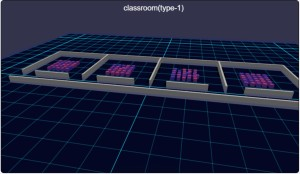
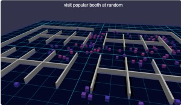
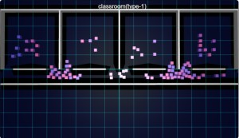
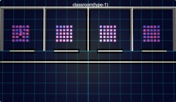
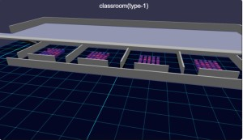
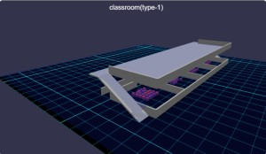
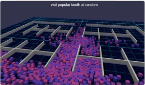
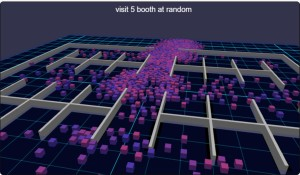

# Babylon.js の基礎調査：Crowd Navigation Systemで避難訓練シミュレーション

## この記事のスナップショット



074_cns1_school（学校）  
https://playground.babylonjs.com/full.html#M2FS5Y

（コードを見たい人はURLから `full.html` を消したURLを指定してください）

[ソース](074/)

- 074_cns1_school .. 学校
- 074_cns2_school .. 学校屋上付き
- 074_cns3_hall   .. 展示会場

ローカルで動かす場合、./js 以下のライブラリは 069/js を利用してください。

## 概要

[Crowd Navigation System(CNS)](https://doc.babylonjs.com/features/featuresDeepDive/crowdNavigation/)の機能の確認がてら、
避難訓練のシミュレーション、展示会場のブースをめぐるシミュレーションを作ってみました。

避難訓練の様子  


ブースをめぐる様子  



正直、
Babylon.js Tips集で既にサンプルがいくつか
（[Navigation Mesh](https://scrapbox.io/babylonjs/Navigation_Mesh)、
[技術書典17会場](https://scrapbox.io/babylonjs/%E6%8A%80%E8%A1%93%E6%9B%B8%E5%85%B817%E4%BC%9A%E5%A0%B4)）
があるので今更感しかないですが、ちょっと違った視点で見てみたいと思います。

## やったこと

- エージェントを定位置に移動させる
- エージェントを立体的なメッシュ上を移動させる
- 複数の目的地（ブース）を巡回させる

### エージェントを定位置に移動させる

シーンとして学校（壁のある教室）を考えてみます。
また定位置として、（ランダム／教室／移動教室／校庭に整列）の4種類の目的地を用意します。

公式のサンプル
[Crowd and navigation agents.](https://playground.babylonjs.com/#X5XCVT#240)
をベースに教室の壁にあたるものを設置します。

```js
// メッシュ情報
//学校・教室のメッシュ
let py=0.2,block=4,block_=block/2, sS=0.1,sH=py*2,sL=block,sL80=sL*0.55,sL20=sL*0.25;
let geoinfos = [[[-block*2,py,block_] ,[sS,sH,sL]],
                [[-block,py,block_]   ,[sS,sH,sL]],
                [[0,py,block_]        ,[sS,sH,sL]],
                [[block,py,block_]    ,[sS,sH,sL]],
                [[block*2,py,block_]  ,[sS,sH,sL]],
                [[-block*1.5,py,0]    ,[sL80,sH,sS]],
                [[-block_,py,0]       ,[sL80,sH,sS]],
                [[block_,py,0]        ,[sL80,sH,sS]],
                [[block*1.5,py,0]     ,[sL80,sH,sS]],
                [[-block*1.5,py,block],[sL,sH,sS]],
                [[-block_,py,block]   ,[sL,sH,sS]],
                [[block_,py,block]    ,[sL,sH,sS]],
                [[block*1.5,py,block] ,[sL,sH,sS]],
                [[-block*1.5,py,-sL20],[sL,sH,sS]],
                [[-block_,py,-sL20]   ,[sL,sH,sS]],
                [[block_,py,-sL20]    ,[sL,sH,sS]],
                [[block*1.5,py,-sL20] ,[sL,sH,sS]],
                ];
for (let [pp,ss] of geoinfos) {
    let box = BABYLON.MeshBuilder.CreateBox("cube", { width:ss[0], height:ss[1],depth:ss[2]}, scene);
    box.position = new BABYLON.Vector3(pp[0], pp[1], pp[2]);
    meshes.push(box);
}
```

また、スペースを押下したときに目的地を変更する関数を用意します。

```js
// 目的地の設定
// 目的地の変更：スペースを押すごとに iDest を変更して setDest を呼び出す
let setDest = function(iDest) {
    let agents = crowd.getAgents();
    if (iDest == 0) {
        // ランダムに分布
        for (i = 0; i < maxAgents; i++) {
            let randomPos = navigationPlugin.getRandomPointAround(new BABYLON.Vector3(20*Math.random()-10, 0.1, 5*Math.random()), 0.5);
            crowd.agentGoto(agents[i], navigationPlugin.getClosestPoint(randomPos));
        }
    } else if (iDest == 1) {
        // 教室の机をイメージ
        let ix, iz;
        let adjx_ = -4*1.5, adjz_ = -2, adjx, adjz, ibias;
        for (i = 0; i < maxAgents; i++) {
            ibias = Math.floor(i/25);
            iz = i%5;
            ix = Math.floor((i-ibias*25)/5);
            adjx = 4*(ibias-1.7), adjz = 1.0;
            let randomPos = new BABYLON.Vector3(ix*0.3+adjx, 0.1, iz*0.3+adjz);
            crowd.agentGoto(agents[i], navigationPlugin.getClosestPoint(randomPos));
        }
    } else if (iDest == 2) {
        // 移動教室
        let ix, iz;
        let adjx_ = -4*1.5, adjz_ = -2, adjx, adjz, ibias, j;
        for (i = 0; i < maxAgents; i++) {
            ibias = Math.floor(i/25);
            if (ibias == 0) {
                continue;
            } else if (ibias == 1) {
                // 校庭に
                iz = i%5;
                ix = Math.floor(i/5);
                let randomPos = navigationPlugin.getRandomPointAround(new BABYLON.Vector3(0.5*ix-5, 0.1, -0.5*iz-3), 0.1);
                crowd.agentGoto(agents[i], navigationPlugin.getClosestPoint(randomPos));
                continue;
            }
            j = (i + 20) % 50 + 50;
            ibias = Math.floor(j/25);
            iz = j%5;
            ix = Math.floor((j-ibias*25)/5);
            adjx = 4*(ibias-1.7), adjz = 1.0;
            let randomPos = new BABYLON.Vector3(ix*0.3+adjx, 0.1, iz*0.3+adjz);
            crowd.agentGoto(agents[i], navigationPlugin.getClosestPoint(randomPos));
        }
    } else if (iDest == 3) {
        // 校庭に整列するイメージ
        let ix, iz;
        for (i = 0; i < maxAgents; i++) {
            iz = i%5;
            ix = Math.floor(i/5);
            let randomPos = new BABYLON.Vector3(0.5*ix-5, 0.1, -0.5*iz-3);
            crowd.agentGoto(agents[i], navigationPlugin.getClosestPoint(randomPos));
        }
    }
}
```

座標を決定する際、getClosestPoint()をかけておくと最適な場所に補正してくれるみたいです。
ただ、getRandomPointAround()のほうは指定した座標値からかなり離れた場所になることが多く「整列させる」という意図では使わない方がよさげです。

エージェントを配置して動かしてみると、廊下にあたるメッシュの移動可動な領域がやたら狭く、（見た目には横に２、３人並べる感じなのに）一人分しか通れない状況でした。
どうやら createNavMesh()のパラメータ変数、walkableRadius （エージェントのボクセル単位での半径）が関係するようで、
この値を（1->0.5）にすることでスムーズに通れるようになりました。

walkableRadius=1のとき  


walkableRadius=0.5のとき  


074_cns1_school（学校）  
https://playground.babylonjs.com/full.html#M2FS5Y

### エージェントを立体的なメッシュ上を移動させる

平面的な構造だけでなく、立体的な構造も確認しておきます。

屋上のある学校のメッシュ  


屋上へのスロープ  



学校のメッシュに屋上を配置、スロープを設けます。

スロープを登れるようパラメータをいじると、教室の壁を乗り越えてしまうことがわかったので、改めて壁の高さも調整します。

目的地に「屋上」も増やしてみました。

074_cns2_school（学校屋上付き）  
https://playground.babylonjs.com/full.html#M2FS5Y#1

### 複数の目的地（ブース）を巡回させる

お買い物や配達のように複数の目的地がある場合を想定します。

シーンとして展示会場のブース／小部屋をめぐることを想定します。

展示会場の様子  


複数の目的地をめぐる方法として、エージェントに対応した目的地（座標値）のリストを持たせておいて、目的地に着いたら、次の目的地を設定します。

ブースでの滞在時間は 0 です。リアルに滞在時間とかブースのキャパ、待ち時間を考え出すと面倒なので一切割愛です。

```js
// 目的地に到着したときの処理
crowd.onReachTargetObservable.add((agentInfos) => {
    let agID = agentInfos.agentIndex;
    let dest = ag2dest[agID];
    if (dest.length > 0) {
        let p = dest.shift();
        ag2dest[agID] = dest;
        // 次の目的地を設定
        crowd.agentGoto(agID, navigationPlugin.getClosestPoint(new BABYLON.Vector3(p[0],p[1],p[2])));
    } else {
        // ゴールに到着
        // 下手にエージェントを消すと誤動作するので、ループさせる
        // スタート地点にテレポート
        let vST = new BABYLON.Vector3(pST[0], pST[1], pST[2], 0.5);
        crowd.agentTeleport(agID, navigationPlugin.getClosestPoint(vST));
        let dests = getDestBooth(iDest);
        let p = dests.shift();
        // 最初の目的地を設定
        crowd.agentGoto(agID, navigationPlugin.getClosestPoint(new BABYLON.Vector3(p[0],p[1],p[2])));
        // 残りの目的地は別途 ag2destに格納しておく
        ag2dest[agID] = dests;
    }
});
```

ソースにしれっと書いてますが、困ったことがいくつか発生してました。

１つ目、エージェントごとに個別の情報を持たせられません。
なので、別途エージェント用の変数（ag2dest）を用意して、そこに目的地の情報(座標値のリスト)をもたせます。

２つ目、エージェントを削除（removeAgent）すると、エージェントのIDの並びも変わる実装になっているようで、
外部に持たせている変数（ag2dest）との整合性がとれなくなります。
なので最終目的地（メッシュ上最奥の出口）に到達したら、ループさせて、目的地を再設定します。

目的地をめぐる挙動として、以下の３種類を設けています。
- すべてのブースを順番にめぐる
- ランダムに選んだ５つのブースをめぐる
- ランダムに選んだ５つのブースをめぐる（とくに人気のある５つのブースを優先的に）

上記、３番目は、５つのブースがランダムで選びやすいように、候補のリスト重複して追加してます。

```js
//  目的地（複数）の構築
const pST = [0, 0.1, -10], pGL = [0, 0.1, 10];
//  各ブースの座標
const pBooths = [
    [-6,0.1,-4],
    [-4,0.1,-4],
    [-2,0.1,-4],
    ... 
];
let getDestBooth = function (iDest) {
    let dests = [];
    if (iDest == 0) {
        // 目的地：全ブースを順番にめぐる
        dests = JSON.parse(JSON.stringify(pBooths));
    } else if (iDest == 1) {
        // 目的地：ランダムに５ブースをめぐる
        dests = JSON.parse(JSON.stringify(pBooths));
        dests = shuffle2(dests);
        dests = dests.slice(0, 5);
    } else if (iDest == 2) {
        // 目的地：ランダムに５ブースをめぐる(人気ブースを重点的に)
        let tlist = JSON.parse(JSON.stringify(pBooths2));
        tlist = shuffle2(tlist);
        while (dests.length < 5 && tlist.length > 0) {
            let p = tlist.pop();
            if (dests.includes(p)) {
                continue;
            }
            dests.push(p);
        }
    }
    dests.push(pGL); // goal を追加
    return dests;
}
```

エージェント数を 100 にしているので、ごちゃっとした感じのシミュレーションになってますが、
数人に減らすと動き方が見やすくなります。逆に1000にすると群衆事故を思わせる混雑具合になります。
そのまましばらく放置していると、ブースをまわりきれていない人が出口付近（画面奥）に押し出される現象がみてとれます。
人流シミュレーションっぽい？

```js
let maxAgents = 100;
```

maxAgents=100の場合  


maxAgents=1000の場合  


maxAgents=1000の場合（しばらく放置後）  



初期位置について補足しておくと、
全エージェントをスタート地点（画面手間）に配置するとかなりの密集／団子状態から始まるので、
できるだけ間隔をとるように外周にそってばらけて配置させ時間差ができるようにしました。
「時間でポップ」させたら見栄え良いですが、そこまで考えてこだわる必要もないかなと。
適当ですみません。


074_cns3_hall（展示会場）  
https://playground.babylonjs.com/full.html#M2FS5Y#2

## まとめ・雑感

今回 CNS の基本的な挙動を追いつつもサンプルを作ってみました。
見るだけのものですが、ついつい時間を忘れてエージェントの動きを追ってしまいます。

お題目の「避難訓練シミュレーション」ですが、「学校」の例のように単純に目的地だけを指定すると「なんでここを通るの？」的な動きがみてとれました。リアルでは避難経路が決まっているでしょうから、その経路の要所を通るように複数の目的地で誘導していけばよさそうです。


「学校屋上付き」で確認できたように複数の階のフロアもできるのはわかったけど、見せ方が難しいですね。あと複数の階層だとエレベーターやエスカレーターはつきものですが、扱いが難しく今回は見送り。どうしたものか。


「展示会場」では、もうちょっとリアルっぽさを再現できるとよりシミュレーションぽくできるのかな？密集状態をみると行列を作りたくなるのは日本的感覚なのかな？なんとか並ばせたくなるけど、やり方が思いつかないなぁ。

CNSでは「ステージ（メッシュ）を用意」、「エージェントを配置／目的地を設定」するだけのお手軽さで可視化できるのはありがたいですね。一方でブラックボックス、エージェントの経路の決め方など、カスタマイズできないところはディープな開発者には厳しいところでしょうか。というかそんなコアな使い方ではなく、「タワーディフェンス」ゲームの敵アルゴリズムにCNSを使うといった、ライトな使い方を望まている気がしないでもない。

------------------------------------------------------------

前の記事：[Babylon.js の基礎調査：森をつくってみる](073.md)

次の記事：..


目次：[目次](000.md)

この記事には関連記事がありません。

--