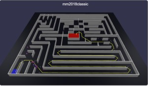
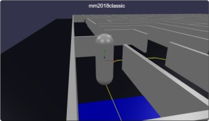

# Babylon.js ：Crowd Navigation Systemのエージェントとマイクロマウスの迷路で競争

## この記事のスナップショット



075_cns4_maze（エージェントの迷路踏破）  
https://playground.babylonjs.com/full.html#570R63#2
  - 「スペース」でスタート
  - 「Enter」で次の迷路

075_cns5_maze2（エージェントとキャラクターコントローラーで競争）  
https://playground.babylonjs.com/full.html#570R63#4
  - 操作方法は「h」で確認してください

（コードを見たい人はURLから `full.html` を消したURLを指定してください）

[ソース](075/)

- 075_cns4_maze .. エージェントの迷路踏破
- 075_cns5_maze2 .. エージェントの迷路踏破（複数経路）
- 075_cns6_maze3 .. エージェントと競争

ローカルで動かす場合、./js 以下のライブラリは 069/js を利用してください。

## 概要

[Crowd Navigation System(CNS)](https://doc.babylonjs.com/features/featuresDeepDive/crowdNavigation/)の応用例として、
以前作成した迷路モジュールを使い、マイクロマウスの迷路をCNSのエージェントで踏破させます。

また、エージェントと競争できるようキャラクターコントローラー版も用意しました。

エージェントの迷路踏破  


エージェントと競争  



## やったこと

- 外部jsを読み込ませる
- 迷路を作る
- エージェントに迷路を解かせる
- エージェントと競争する

### 外部jsを読み込ませる

以前に作成した迷路モジュールを外部ファイルのまま読み込ませたく試行錯誤した結果、下記で良さげです。
githubに配置した js を読み込ませる場合は cdn.jsdelivr.net 経由で使うとよいです。
詳しくは[Using External Assets In the Playground](https://doc.babylonjs.com/toolsAndResources/thePlayground/externalPGAssets)から。
この情報に関してcx20様をはじめとするdiscordの皆様にご尽力いただきました。この場を借りて御礼申し上げます。

```js
// for local
const SCRIPT_URL1 = "./Maze.js";
const SCRIPT_URL2 = "./MazeData.js";

// for PlayGround
// const SCRIPT_URL1 = "https://cdn.jsdelivr.net/gh/fnamuoo/webgl@main/075/Maze.js";
// const SCRIPT_URL2 = "https://cdn.jsdelivr.net/gh/fnamuoo/webgl@main/075/MazeData.js";

var createScene = async function () {
    let Maze = null;
    let MazeData = null;
    import(SCRIPT_URL1).then((obj) => { Maze = obj; console.log("obj=",obj);});
    import(SCRIPT_URL2).then((obj) => { MazeData = obj; console.log("obj=",obj);});
    await BABYLON.InitializeCSG2Async();
    ...

    maze = new Maze.Maze2();
```

なお、createScene を非同期処理させるために async で宣言して、import 後に `await BABYLON.InitializeCSG2Async()` を呼び出してます。

ちなみに 下記をまとめて Maze.jsにしました。でも今回使うのは Maze2, Maze3 だけです。

- Maze1（通路と壁が同じサイズの迷路）
- Maze2（薄い壁の迷路）
- Maze3（薄い壁の迷路で斜め移動を考慮した迷路）

MazeData.js の方は Maze1とMaze2の迷路サンプルをまとめてますが、使うのはMaze2のマイクロマウスの迷路データのみです。

### 迷路を作る

手順としては以下のとおりです。別の迷路に切り替えられるよう、作成したメッシュは削除用に保持しておきます。

- MazeData の迷路データを読み込み迷路インスタンス(maze)作成
- Maze3の迷路インスタンス(maze3)作成（最短経路用）
- スタート地点・ゴール地点のパネル配置
- 最短経路（ライン）の表示
- 迷路の壁の配置

```js
let meshes = [];
let key = mapnames[istage];
maze = new Maze.Maze2();
maze.create_from(MazeData.getMap2Data(key)); // 迷路データの読み込み

maze3 = new Maze.Maze3();
maze3.create_from_maze2(maze);

// スタート地点のパネル
{
    [iz, ix] = maze.pStart_;
    let mesh = BABYLON.MeshBuilder.CreatePlane("plnST", {width:wL, height:wL}, scene);
    mesh.position = new BABYLON.Vector3(ix*wL+adjx, 0.01, (nz-iz)*wL+adjz);
    mesh.rotation = new BABYLON.Vector3(Math.PI/2, 0, 0);
mesh.material = new BABYLON.StandardMaterial('mat', scene);
mesh.material.diffuseColor = BABYLON.Color3.Blue();
    stageInfo.push(mesh);
}
// ゴール地点のパネル
for (let [iz,ix] of maze.pGoalList_) {
    let mesh = BABYLON.MeshBuilder.CreatePlane("plnST", {width:wL, height:wL}, scene);
    mesh.position = new BABYLON.Vector3(ix*wL+adjx, 0.01, (nz-iz)*wL+adjz);
    mesh.rotation = new BABYLON.Vector3(Math.PI/2, 0, 0);
mesh.material = new BABYLON.StandardMaterial('mat', scene);
mesh.material.diffuseColor = BABYLON.Color3.Red();
    stageInfo.push(mesh);
}

// 最短経路  .. 移動距離だけを見た最短距離（点線で表示）
{
    maze.seekPath2(); // 最短経路をもとめる
    let plist = [];
    for (let idx of maze.path2_) {
        [iz,ix] = maze.idx2rc(idx);
        plist.push(new BABYLON.Vector3(ix*wL+adjx, 0.01, (nz-iz)*wL+adjz));
    }
    let line = BABYLON.MeshBuilder.CreateDashedLines("arc", {points: plist, dashSize:1, gapSize:1});
    line.color = BABYLON.Color3.Gray();
    stageInfo.push(line);
}
// 最短経路(2)  .. 直線の加速・斜め移動を考慮した最短距離（実線：黄色で表示）
if (1) {
    maze3.seekPath7();  // 最短経路(斜めあり)
    let plist = [];
    for (let idx of maze3.path7_) {
        [iz,ix] = maze3.idx2rc(idx);
        plist.push(new BABYLON.Vector3(ix*wL_+adjx2, 0.02, (nz2-iz)*wL_+adjz2));
    }
    let line = BABYLON.MeshBuilder.CreateLines("arc", {points: plist});
    line.color = BABYLON.Color3.Yellow();
    stageInfo.push(line);
}

{
    // 上側の境界
    iz = 0;
    z = nz*wL+adjz;
    for (let ix = 0; ix < nx; ++ix) {
        if (maze.isWallPosiDir([iz,ix],3)) { // 北向き
            x = ix*wL+adjx;
            let mesh = BABYLON.MeshBuilder.CreateBox("wallW", { width:wL, height:wH, depth:wS }, scene);
            mesh.position = new BABYLON.Vector3(x, y, z+wL_);
            meshes.push(mesh);
            stageInfo.push(mesh);
        }                
    }
}
{
    // 左側の境界
    ix = 0;
    x = adjx;
    for (let iz = 0; iz < nz; ++iz) {
        if (maze.isWallPosiDir([iz,ix],2)) { // 西向き
            z = (iz+1)*wL+adjz;
            let mesh = BABYLON.MeshBuilder.CreateBox("wallD", { width:wS, height:wH, depth:wL }, scene);
            mesh.position = new BABYLON.Vector3(x-wL_, y, z);
            meshes.push(mesh);
            stageInfo.push(mesh);
        }
    }
}
for (let iz = 0; iz < nz; ++iz) {
    z = (nz-iz)*wL+adjz;
    for (let ix = 0; ix < nx; ++ix) {
        x = ix*wL+adjx;
        if (maze.isWallPosiDir([iz,ix],0)) { // 東向き
            let mesh = BABYLON.MeshBuilder.CreateBox("wallD", { width:wS, height:wH, depth:wL }, scene);
            mesh.position = new BABYLON.Vector3(x+wL_, y, z);
            meshes.push(mesh);
            stageInfo.push(mesh);
        }
        if (maze.isWallPosiDir([iz,ix],1)) { // 南向き
            let mesh = BABYLON.MeshBuilder.CreateBox("wallW", { width:wL, height:wH, depth:wS }, scene);
            mesh.position = new BABYLON.Vector3(x, y, z-wL_);
            meshes.push(mesh);
            stageInfo.push(mesh);
        }                
    }
}
```

最短経路について補足です。
移動距離だけをみた経路を点線：白色で表示、
直線の台形加速・斜め移動を考慮した最短距離を実線：黄色で表示しています。

複数の経路（最短とはかぎらない）を表示する場合（表示まで１０秒ちかくかかることがあります）、こちらは３色（黄、赤、青）で示しています。


### エージェントに迷路を解かせる

開始位置にCNSのエージェントを配置してゴールを目標に設定するだけです。
エージェントが判断した経路を走行するため、上述で表示している経路を通るとは限りません。

```js
let setDest = function() {
    let agents = crowd.getAgents();
    let p;
    for (let agID of agents) {
        // 初期位置：スタート地点付近にテレポート
        [iz, ix] = maze.pStart_;
        p = new BABYLON.Vector3(ix*wL+adjx, wH_, (nz-iz)*wL+adjz);
        crowd.agentTeleport(agID, navigationPlugin.getClosestPoint(p));
        // 目標位置：ゴール地点に
        [iz, ix] = maze.pGoalList_[agID % maze.pGoalList_.length];
        p = new BABYLON.Vector3(ix*wL+adjx, wH_, (nz-iz)*wL+adjz);
        crowd.agentGoto(agID, navigationPlugin.getClosestPoint(p));
    }
}
```

またエージェントの加速度、速度にはバラつきをもたせています。

```js
...
agentParams.maxAcceleration = BABYLON.Scalar.RandomRange(15,25);
agentParams.maxSpeed = BABYLON.Scalar.RandomRange(4,7);
var agentIndex = crowd.addAgent(randomPos, agentParams, transform);
```

10個のエージェントで走らせてますが、迷路によっては違うルートを走るエージェントがでてきます。
（原因はよくわからないです）

075_cns4_maze（エージェントの迷路踏破）  
https://playground.babylonjs.com/full.html#570R63#2

075_cns5_maze2（エージェントの迷路踏破、複数経路）  
https://playground.babylonjs.com/full.html#570R63#3

どちらも「スペース」でスタート、「Enter」で次の迷路。

### エージェントと競争する

エージェントの踏破を見るだけでも楽しいですが、そこに混じって一緒に走れるよう
キャラクターコントローラー版も用意しました。

迷路にあわせてボディをスリムに、移動速度と旋回速度を上げてます。
ですがキーボード操作のみ／ゲームパッドに対応させてないので、操作がむずかしいです。

エージェントの移動速度も速すぎるので、もうちょっと遅くしてよいかも。

075_cns6_maze3（エージェントとキャラクターコントローラーで競争）  
https://playground.babylonjs.com/full.html#570R63#4
（操作方法は「h」で確認してください）

## まとめ・雑感

CNSの応用例として、迷路を踏破させてみました。

もののついでに一緒に競争できる版もつくりましたが、無理ゲーでした。
見てるだけならエージェントをもっと速くしてもよいかなとも感じましたが、
競争となると逆に手心を加えてもらって遅くしないと勝負になりませんでした。
コース自体のむずかしさもあって、迷路でタイムアタック勝負はムリぽ。

それにしてもエージェントの最短経路アルゴリズムってなんだろう。
「斜め経路あり」な感じはするけど、台形加速は無さげ？

------------------------------------------------------------

前の記事：[Babylon.js の基礎調査：Crowd Navigation Systemで避難訓練シミュレーション](074.md)

次の記事：..


目次：[目次](000.md)

この記事には関連記事がありません。

- [Babylon.js の基礎調査：Crowd Navigation Systemで避難訓練シミュレーション](074.md)
- [Babylon.js ：Crowd Navigation Systemのエージェントとマイクロマウスの迷路で競争](075.md)

--