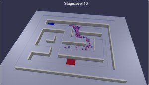
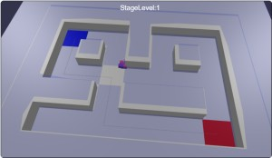
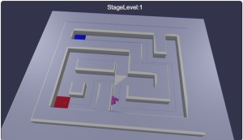

# Babylon.js ：Crowd Navigation Systemでタワーディフェンス（保留）

## この記事のスナップショット



077_towerDefence（敵側のうごき）  
https://playground.babylonjs.com/full.html#RT10NV

077_towerDefence（砲台もどきを配置）  
https://playground.babylonjs.com/full.html#RT10NV#2
- クリックで砲台を配置

（コードを見たい人はURLから `full.html` を消したURLを指定してください）

[ソース](077/)

- 077_towerDefence1 .. 敵側の動きのみ
- 077_towerDefence2x .. 砲台もどきを配置

ローカルで動かす場合、./js 以下のライブラリは 069/js を利用してください。

## 概要

[Crowd Navigation System(CNS)](https://doc.babylonjs.com/features/featuresDeepDive/crowdNavigation/)の応用例の第二弾として、
タワーディフェンスもどきを作ってみようとしましたが途中で上手くいかなくなって一時保留にしてます。
途中までの成果（敵側のうごき）がちょっと面白かったので公開することにしました。

ここでの「タワーディフェンス」は、迷路（壁と通路が同じ大きさ）を使います。
敵側はスタート地点から、こちらの拠点はゴール地点として、
CNSのエージェントをスタートからゴールに向かって移動させ、
こちらは壁の上に砲台をつくって防衛するというものです。

## やったこと

- 迷路の中を敵（エージェント）を動かす
- 時間で敵をポップ

- エージェントの滞留
- 砲台を設置する

### 迷路の中を敵（エージェント）を動かす

以前の記事
[Babylon.js ：Crowd Navigation Systemのエージェントとマイクロマウスの迷路で競争](075.md)
の応用になりますが、今回は迷路モジュールの Maze1クラス（壁と通路が同じ大きさ）を使います。

スタート地点とゴール地点にパネルを配置し、最短経路も表示しておきます。

エージェントの動きは簡単で、スタート地点とゴール地点を設定するだけです。

```js
// エージェントにスタート位置と目的地を設定
let setDest0 = function(agID) {
    // 初期位置：スタート地点付近にテレポート
    [iz, ix] = maze.pStart_;
    p = new BABYLON.Vector3(ix*wL+adjx, wH_, (nz-iz)*wL+adjz);
    crowd.agentTeleport(agID, navigationPlugin.getClosestPoint(p));
    // 目標位置：ゴール地点に
    [iz, ix] = maze.pGoalList_[agID % maze.pGoalList_.length];
    p = new BABYLON.Vector3(ix*wL+adjx, wH_, (nz-iz)*wL+adjz);
    crowd.agentGoto(agID, navigationPlugin.getClosestPoint(p));
}
```

077_towerDefence1（敵側の動きのみ）  
https://playground.babylonjs.com/full.html#RT10NV

### 時間で敵をポップ

ステージではかなりの数の敵をポップさせたいのですが、
最初にすべてを配置するとカオスなので、時間差をつけて徐々にポップするようにします。

敵の総数（maxAgents）に対して、初期状態で配置する敵の数（iniAgents）と実行中にポップさせる敵の数（restPop）にわけます。


```js
// 初期設定
navigationPlugin = new BABYLON.RecastJSPlugin();
navigationPlugin.createNavMesh(meshes, navmeshParameters);
// crowd
crowd = navigationPlugin.createCrowd(maxAgents, 0.1, scene);
// 初期状態でのエージェントの配置
for (let i = 0; i < iniAgents; ++i) {
        let adID = addAgent();
        resetAgent(adID);
}

//　レンダリング処理（毎回のターンの処理）
scene.onBeforeRenderObservable.add(() => {
    let agents = crowd.getAgents();
    if (agents.length < restPop) {  // 
            let agID = addAgent();
            resetAgent(agID);
    }
```

### エージェントの滞留

エージェントがゴールに到達したらマップをリセット（少し大きく）して繰り返していたら、
エージェントが滞留する（一か所にとどまる）うごきをみせました。

中央の通路で四角く抜ける現象  


エージェントの滞留  
https://playground.babylonjs.com/#RT10NV#1

可動域を示すメッシュ（デバッグ表示）を表示してみると、該当部分ですっぽり抜けていることがわかりました。

場所はおもに十字路（該当しない十字路も）の交差点で発生し、四角く抜けることもあれば三角に抜けることも
あることがわかりました。

中央の通路で三角に抜ける現象  


パラメータを調整したら正常になるのかと色々いじってみましたが上手くってません。
babylonのバグなのかなぁ？と思っていて後日パラメータをいじっていたら navmeshParameters.cs を小さくすることで解決。
よかったよかった。


### 砲台を設置する

自動的に迎撃する砲台を設置して、バンバン射出することを考えていたのですが、いきなりそれは難しいので、
まずは、砲台代わりの球を配置、射程代わりの大き目の球を表示して、この範囲に敵（エージェント）が入ったら即退治、
ということにします。できれば敵にＨＰの概念をいれたいけど
「エージェントごとに属性を持たせることができない」
と考えていたけど、エージェントのメッシュ形状の方に属性を勝手に追加すればなんとかなり？
まぁ今はとくに考えずに簡単な処理ですませます。

砲台の設置は「迷路の壁／ブロック」をクリックした場合に、その壁の上に設置することにします。

```js
// シーン上をマウスクリックしたときの動作
scene.onPointerObservable.add((pointerInfo) => {      		
    switch (pointerInfo.type) {
    case BABYLON.PointerEventTypes.POINTERDOWN:
        if(pointerInfo.pickInfo.hit) {
            if (pointerInfo.pickInfo.pickedMesh != null && pointerInfo.pickInfo.pickedMesh.name == "wall") {
                if (gamePoint >= 100) {
                    gamePoint -= 100;
                    let posi = pointerInfo.pickInfo.pickedMesh.position;
                    let [ix,iz] = xz2ixz(posi.x, posi.z);
                    let key = "" + ix + ","+iz;
                    let posi2 = new BABYLON.Vector3(posi.x, wH, posi.z);
                    let [viewMesh,rangeMesh] = createCannonMesh(posi2);
                    cannonInfoList_.push({key:key, ix:ix, iz:iz, mesh:viewMesh, range:rangeMesh, vit:stageLv*10});
                }
            }
        }
        break;
    }
});
```

最終的な自動砲台のアクションを考えると...

- 射撃範囲内に敵が入ったらそちらを向く
- 敵に向かって玉やビームを射出する
- 玉／ビームは（ライフタイムが尽きる／障害にぶつかる）までを移動させる
- 敵と玉／ビームがぶつかったら敵のＨＰを減らす

と、それなりに手順がかかるので、まずは、範囲内に敵が侵入したら「敵を消滅」ということにしておきます。

衝突判定はメッシュの交差判定[mesh_intersect](https://doc.babylonjs.com/features/featuresDeepDive/mesh/interactions/mesh_intersect/)を使いました。

砲台と敵の総当たりの組み合わせをチェックしていますが、数が少ないからか処理落ちを感じるほどではないです。

```js
scene.onBeforeRenderObservable.add(() => {
    ...
    // 砲台の範囲とCNSのエージェントの交差判定
    let cannonInfoList2 = [];
    for (let cinfo of cannonInfoList) {
        let rangeMesh = cinfo.range;
        for (let agID of agents) {
            let agentMesh  = agentCubeList[agID];
            if (rangeMesh.intersectsMesh(agentMesh, false)) {
                if (1) {
                    // 敵（agent）を倒した
                    ++gamePoint;
                    --needClearPoint;
                    --cinfo.vit;
                    if (agents.length < nAgents) {
                        --nAgents;
                    } else {
                        /// crowd.removeAgent(agID); // 下手に消すとメッシュが残る／消えない
                        setDest0_(agID);
                    }
                    break;
                }
            }
        }
        if (cinfo.vit == 0) {
            // 砲台のvitがなくなったので消す
            cinfo.mesh.dispose(); cinfo.mesh = null;
            cinfo.range.dispose(); cinfo.range = null;
        } else {
            cannonInfoList2.push(cinfo);
        }
    }
```

ステージを作り直したときに砲台の下が壁だったところが通路になることがあり、そうなると砲台が浮いた状態になります。
なので、そのときは砲台を削除することにします。
また一方でステージを大きくすると半分のブロックサイズ分ずれることがるので、そのときは正しく壁の上に再配置、座標値を修正します。


試運転していると、砲台の無敵感が強く一度配置してしまうとやることがないので、
弾薬／ライフの概念を取り入れて、配置後しばらくしたら消滅するようにしました。


しばらく動かしていると残像が残ることがあることに気づきました。
たぶん同じ砲台に関するデータを追加（クリック時）と削除のタイミングが問題っぽいです。

なので追加と交差判定のタイミングをいじってみましたが、結局、残像がのこることがあり、上手くいってない状態です。
このへん完璧に処理するには非同期処理を考える必要がでてくる気がしてきました。

砲台にライフの概念をいれずに、下手に削除しない方がよかったかも。


## まとめ・雑感

いい感じに進められていただけに、途中から迷路に迷い込んがかも。

ゲームバランスを考えてアレコレ考え始めたのが袋小路のはじまりだったかな？

短期間でゲームを作るにはもうちょっと知見（何ができて何ができないか、～をしたいときのコーディングパターン）を集めないと
時間が足らない。

かといって、時間をかけてもいいものができる保証もないし、
ダラダラ続けてもモチベも下がってくるしで一旦ここで切り上げるのがよいかと思ってます。

また次の機会に？

------------------------------------------------------------

前の記事：[Babylon.js の基礎調査：外部jsの読み込み方法](076.md)

次の記事：..


目次：[目次](000.md)

この記事には次の関連記事があります。

- [Babylon.js の基礎調査：Crowd Navigation Systemで避難訓練シミュレーション](074.md)
- [Babylon.js ：Crowd Navigation Systemのエージェントとマイクロマウスの迷路で競争](075.md)
- [Babylon.js ：Crowd Navigation Systemでタワーディフェンス（保留）](077.md)

--