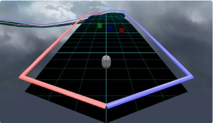
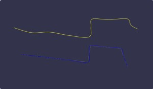
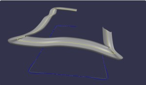
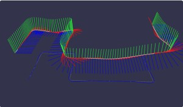
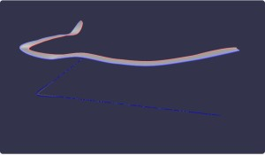
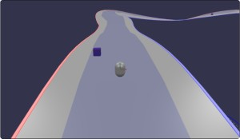
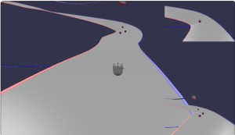
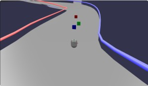

# Babylon.js ：凹凸のある道路をキャラクターコントローラーでCNSと競争する

## この記事のスナップショット



078_road6（ブラッシュアップ・最終形）  
https://playground.babylonjs.com/full.html#M6JLSF#6

（コードを見たい人はURLから `full.html` を消したURLを指定してください）

[ソース](078/)

- 078_road1 .. 道をつくる
- 078_road2 .. キャラクターコントローラーで走る
- 078_road3 .. CNSエージェントと競争する
- 078_road4 .. ゴール判定とワイプ表示
- 078_road5 .. ガードレール設置
- 078_road6 .. ブラッシュアップ・最終形

ローカルで動かす場合、./js 以下のライブラリは 069/js を利用してください。

## 概要

凹凸のある道路を作成して、その上をキャラクターコントローラーで走れるようにした一方で
[Crowd Navigation System(CNS)](https://doc.babylonjs.com/features/featuresDeepDive/crowdNavigation/)のエージェントも並走させて競争できるようにしました。

凹凸のある道路を作成するには、迷路の経路情報（点座標）にperlinノイズで起伏（凹凸）を作りました。
このままだと角ばっているので補間して滑らかにした線分を作成、そこから道幅のある道路を作成しました。
CreateTube をつかうとトンネルになって解放感がないし、ExtrudeShape を使うとねじれてしまうので、
自前で道路の両端の座標列を算出し CreateRibbon で作成しました。

[Babylon.js の基礎調査：perlinノイズを使ってみる](072.md)の最後で、凹凸地形に道路を通しましたが、
こちらはその続編になります。

## やったこと

- 道路の線分データ（座標列）を作成する
- 座標列から道路を作成する
- CNSエージェントとの並走
- ゴール判定
- ワイプ表示
- ガードレール設置

### 道路の線分データ（座標列）を作成する

まず道路のもととなる経路には、
以前作成した「壁と通路が同じ大きさの迷路」（Maze1）を用います。

- 穴掘り法で迷路を作成
- スタート地点とゴール地点が最長になるように再配置
- 最短経路をもとめる

を迷路モジュール（Maze1）で行います。
迷路に関しては[迷路作成モジュール（１）「通路と壁が同じサイズ」と「薄い壁」](046.md)を参照。

もとめた最短経路は２次元なので、ここにperlinノイズで高さを付けます。
perlinノイズについては[Babylon.js の基礎調査：perlinノイズを使ってみる](072.md)を参照。

このままでは角ばっているのでスプライン（CreateCatmullRomSpline）で補間します。
[Drawing Curves](https://doc.babylonjs.com/features/featuresDeepDive/mesh/drawCurves)

道路の線分データの表示  



### 座標列から道路を作成する

簡易に道路を作るなら、
[Tube](https://doc.babylonjs.com/features/featuresDeepDive/mesh/creation/param/tube/)
や
[Extruding Shapes](https://doc.babylonjs.com/features/featuresDeepDive/mesh/creation/param/extrude_shape/)
が考えられます。

Tubeは円形もしくは多角形にできますがトンネルになってしまいます。
また、両方とも高さの変化のある状態で左右に曲がると、メッシュ形状に「ひねり」が入ります。

道路が傾いている様子  


少し傾く程度に収まらず、結構な角度に傾くので
[Babylon.js で物理演算(havok)：コーラム模様でローラーコースター](065.md)
のようにメッシュをぶつ切りにして角度を調整する必要があります。

[Path3D](https://doc.babylonjs.com/features/featuresDeepDive/mesh/path3D/)なら
なんとかなるのかなと関数を確認してみましたが該当するものは無い様子。

Path3Dで経路の軸方向を確認  


公式のワークショップの[track](https://doc.babylonjs.com/guidedLearning/workshop/Track/)で紹介されている
createTrack関数を使えば似たようなことができそうですが、
これはある程度手動でパスや傾きを入力する必要があるようで、
今回のように全自動で道路を自動作成するケースには不向きなのでパスしました。

さて、ならばどうするか？ですがここは自前で計算します。

連続する２点からベクトルを求め、それを右方向に９０度回転、左方向に９０度回転（Y軸で回転）させて、
同じ高さでありながら進行方向右側にずれた点と左側にずれた点を求めます。これらの点を道路の両脇の点とします。

このままでも十分ですが、更にもう一工夫。連続する３点でベクトルを２つ作ると、そのベクトルの外積（Y成分の正負）を求めることで
左右どちら、どれくらいの角度で曲がるのかわかります。これを利用してコーナーの内側の高さを低く、外側を高くすることで
バンク（傾斜）のついた道路になります。

道路の両端の座標列が求められたので ribbon で平面／道路を作成します。

078_road1（道をつくる）  


https://playground.babylonjs.com/#M6JLSF#1

道路ができれば走ってみたくなるもの。
キャラクターコントローラーを配置して走れるようにしました。

078_road2（キャラクターコントローラーで走る）  
https://playground.babylonjs.com/full.html#M6JLSF#7

大抵の坂は登れると思いますが、登りと急カーブが重なると道路の内側が壁のようになって登れないことがあるかもしれません。
そのときはジャンプ（スペースキー）で登るか、大回りして外側から登ってください。
perlinノイズの係数が大きすぎるのが問題なのですが、道路のアップダウンのダイナミックスさを出したくて、
「攻めた」感じのパラメータ調整をしてます。


### CNSエージェントとの並走

自機としてキャラクターコントローラーで走れるようにする一方で、ライバルとして
CNSエージェントを並走させます。

この辺は
[Crowd Navigation Systemのエージェントとマイクロマウスの迷路で競争](075.md)
でも説明済みなので詳細は割愛します。

CNSを使う際のポイントとしては以下あたりでしょうか。

- メッシュが凸凹しているので登坂できるよう（walkableHeight,walkableClimb）を調整
- スタート／ゴールに経路の座標列（先頭／末尾）を使う
- エージェントのスピード（maxAcceleration,maxSpeed）を調整

078_road3（CNSエージェントと競争する）  



https://playground.babylonjs.com/full.html#M6JLSF#3

特にスピードの調整にはかなり気を使いました。
一応、スピード重視・低加速や加速重視・中最大速度など、ギリギリ勝てるかどうかあたりを狙ってます。

コースの特性上、登坂や９０度カーブが多いので最短経路を走ればギリ勝てると思いますが、
どうしても負けるという方はダッシュ（shiftキーでON、キーオフで解除）を使ってみてください。

### ゴール判定

ゴール判定用に球のメッシュ（ゆっくり回転）を配置しました。
衝突判定には
[Mesh Intersections](https://doc.babylonjs.com/features/featuresDeepDive/mesh/interactions/mesh_intersect/)
を使いました。

[Babylon.js で物理演算(havok)：自作移動体でクイックな動作／ドリフト走行＋ゴースト表示](066.md)
のときには physicsPlugin.onTriggerCollisionObservable で衝突判定しましたが、
今回はメッシュだけで判定します。

判定はゴール判定用メッシュ対（キャラクターコントローラー、CNSエージェントｘ３）なので判定自体は非常に簡単です。
ただ、変なタイミング（１週目はＯＫでも２週目の開始直後）でゴール判定になることあったので、
ゲーム開始から遅延をかけて、設定値をリセット、ゴール判定を開始するようにしてます。

```js
// ゴール判定
if (iCheckGoal > 0) {
    // 誤動作するので、時間差で「ゴール順位情報」をリセットする
    --iCheckGoal;
    if (iCheckGoal == 0) {
        goalRank = 0;
        goalFlag = {0:0, 1:0, 2:0, 3:0, };
    }
} else {
    if (meshGoal.intersectsMesh(displayCapsule, false) && goalFlag[0]==0) {
        goalFlag[0] = ++goalRank;
        if (goalFlag[0] == 1) {
            console.log("you WIN!! (^-^)// ", goalRank);
        } else {
            console.log("you LOOSE (>_<) ", goalRank);
        }
        if (goalRank >= 2) {
            nextStage();
        }
    }
    if (meshGoal.intersectsMesh(agentCubeList[0], false) && goalFlag[1]==0) {
        goalFlag[1] = ++goalRank;
        console.log("agent[0] goal", goalRank);
        if (goalRank >= 4) { nextStage(); }
    }
    if (meshGoal.intersectsMesh(agentCubeList[1], false) && goalFlag[2]==0) {
        goalFlag[2] = ++goalRank;
        console.log("agent[1] goal", goalRank);
        if (goalRank >= 4) { nextStage(); }
    }
    if (meshGoal.intersectsMesh(agentCubeList[2], false) && goalFlag[3]==0) {
        goalFlag[3] = ++goalRank;
        console.log("agent[2] goal", goalRank);
        if (goalRank >= 4) { nextStage(); }
    }
}
```

### ワイプ表示

せっかくなのでCNSエージェントの追跡映像をワイプ（小窓）で表示させる機能も付けます。
ワイプ表示は
[Babylon.js で物理演算(havok)：コーラム模様でローラーコースター](065.md)
でも実施してますが、
今回は、カメラワークを複雑に切り替えることはせずに、シンプルにワイプ表示のオン／オフだけとします。

ワイプは２カメラ分、右上と左下に表示させることにしました。



今回も前回と同様にメッシュの向きによらず後から追っかけるようFreeCameraを使い、座標値は自前で計算します。

```js
// エージェント追跡用カメラ
let camera2type = 0; // ワイプ表示 (0: 無し、1: caemra2A, camera2B
let camera2A = new BABYLON.FreeCamera("Camera2A", new BABYLON.Vector3(2, 5, -10), scene);
camera2A.setTarget(BABYLON.Vector3.Zero());
camera2A.inputs.clear(); // カーソルキーでカメラ操作させないようにする
let camera2B = new BABYLON.FreeCamera("Camera2B", new BABYLON.Vector3(2, 5, -10), scene);
camera2B.setTarget(BABYLON.Vector3.Zero());
camera2B.inputs.clear(); // カーソルキーでカメラ操作させないようにする

scene.activeCameras.push(camera);
camera.viewport = new BABYLON.Viewport(0, 0, 1.0, 1.0);
camera2A.viewport = new BABYLON.Viewport(0.7, 0.7, 0.3, 0.3);
camera2B.viewport = new BABYLON.Viewport(0.7, 0.0, 0.3, 0.3);

...
    // エージェントの先頭と末尾にカメラを追跡させる
    camera2A.lockedTarget = agentCubeList[0];
    camera2B.lockedTarget = agentCubeList[2];

scene.onBeforeRenderObservable.add((scene) => {
    ...
    // カメラ２用の更新
    if (camera2type >= 1) {
        let agntMesh = agentCubeList[0].parent; // addAgent時のtransformを取り出す
        let vdir1 = camera2A.position.subtract(agntMesh.position).normalize().scale(5);
        vdir1.y = 2;
        camera2A.position = agntMesh.position.add(vdir1);
        //
        agntMesh = agentCubeList[2].parent;
        let vdir2 = camera2B.position.subtract(agntMesh.position).normalize().scale(5);
        vdir2.y = 1.2;
        camera2B.position = agntMesh.position.add(vdir2);
    }
});
```

ワイプ表示のオン／オフは（Vキー）で行います。
オン／オフ（表示の有無）は scene.activeCameras に入れたり、出したりするだけです。

```js
// キー操作の様子
scene.onKeyboardObservable.add((kbInfo) => {
    switch (kbInfo.type) {
    case BABYLON.KeyboardEventTypes.KEYDOWN:
        ...
        } else if (kbInfo.event.key == 'v') {
                // メイン(camera)とサブ(camera2,camera2B)の複数カメラワーク
                camera2type = (camera2type+1) % 2;
                if (camera2type == 0) {
                    // メインのみ
                    while (scene.activeCameras.length > 0) {
                        scene.activeCameras.pop();
                    }
                    scene.activeCameras.push(camera);

                } else if (camera2type == 1) {
                    // メイン（全画面）＋サブ（ワイプ）
                    scene.activeCameras.push(camera2A);
                    scene.activeCameras.push(camera2B);
                }

```

078_road4（ゴール判定とワイプ表示）  
https://playground.babylonjs.com/full.html#M6JLSF#4

### ガードレール設置

コーナー内側を狙いすぎて落下すること度々。
普通に走ってもちょっと怖いのでガードレールを設置することにしました。

道路の両端の座標列があるので、それをそのまま使ってtubeで作り、Y軸方向にちょいずらして完成です。

ちなみにゴールした先で落っこちないよう、両端の座標列の末尾２つを平均して、
それぞれの点列の末尾に追加してます。

ガードレールがあっても落ちてしまう方は（Rキー）でスタート地点に戻ってください。

078_road5（ガードレール設置）  



https://playground.babylonjs.com/full.html#M6JLSF#5

### ブラッシュアップ

キャラクターコントローラーが開始時に横や後ろを向いていると面倒なので、常に進行方向を向くように調整します。

ここまでくると見栄えをよくしたいので skybox（背景）を設定しました。

また、道路のテクスチャとして
textures/floor.pngを張り付けてみたり、
[Road Procedural Texture](https://doc.babylonjs.com/toolsAndResources/assetLibraries/proceduralTexturesLibrary/road/)
を使ってみたいしましたが、どちらも進行方向に間延びしたような表示になりイマイチな印象だったので、
結局 GridMaterial にしました。
ワイヤーフレームが良いかもですがこの辺はお好みで魔改造してください。

あと使い方（usage）の表示も追加しておきます。

078_road6（ブラッシュアップ・最終形）  


https://playground.babylonjs.com/full.html#M6JLSF#6

## まとめ・雑感

思ったよりサクサクつくれて楽しかった。

いきなりゲームが開始してしまいますがそこはご愛敬。
カウントダウンとか何かのキーで開始してもよかったのかな。

ちなみに青にかろうじて追い越せるくらいなので操作をミスらなければ３位は確実。
赤と緑は最高速が速いですが加速が遅い＆コーナーでぶつかり気味なので、コーナリングで差を縮め、下りで差をキープしましょう。


------------------------------------------------------------

前の記事：[Babylon.js ：Crowd Navigation Systemでタワーディフェンス（保留）](077.md)

次の記事：..


目次：[目次](000.md)

この記事には関連記事がありません。

- [Babylon.js で物理演算(havok)：トーラス結び目の中を走る](064.md)
- [Babylon.js ：凹凸のある道路をキャラクターコントローラーでCNSと競争する](078.md)

--